# Ch 31 遗留系统迁移：SQL Server → Redshift（10TB）

!!! info "面包屑"
    [本书主页](./index.md) › [Part V 平台演进](./30-工程师日常工作流与变更场景.md) › Ch 31

!!! abstract "项目第 2 年 · 扩展与迁移期——10TB 迁移攻坚战"

---

## :material-school: 本章你将学到
- 10TB/千表大规模离线迁移的挑战与架构
- 数据库恢复与 schema 自动转换的设计（含 DDL before/after）
- 迁移性能基线（24h 窗口四阶段时间分配、并发连接、压缩比、断点续传、三方对账）
- 流式导出 + 分片压缩 + 对象存储中转 + 批量加载的管线设计
- 任务状态持久化、断点续传与并发资源治理（含分片状态 schema）
- 回滚方案（单表/多表/全量三级）与存储过程→ETL 转换案例

---

平台运行到第二年时，一个绕不开的挑战浮出水面：Aurora 中国区有一个运行了多年的 SQL Server 数仓，约 **10TB、千张表**，承载着历史分析数据。新平台建好了，但这个遗留数仓不能直接废弃——里面有历史报表、有下游依赖、有合规审计需要的归档数据。必须把它迁移到 Redshift，而且不能停业务。

这是整个项目里工程难度最大的一块。10TB 不是"导出再导入"那么简单——它涉及 schema 转换（SQL Server 语法 ≠ Redshift 语法）、海量数据传输（不能压垮源库）、断点续传（10TB 不可能一次跑完）、并发控制（同时迁多张表但不能把源库搞挂）。

我在企业征信项目里做过类似的事——把一批 MySQL 业务库的数据迁到数据仓库。但那次只有几百 GB，而且允许停机窗口。Aurora 这次是 10TB 级、不允许停业务、且 schema 差异更大。这是一个需要"既大胆又精细"的工程。

---

## 31.1 迁移挑战：10TB/千表的大规模离线迁移

Aurora 中国区有一个运行了多年的 SQL Server 数仓，约 **10TB、千张表**。平台建成后，需要把这个遗留数仓迁移到 Redshift。

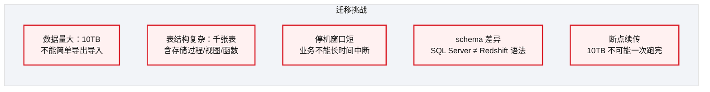
<p class="caption" markdown="span">**图 31-1** 迁移挑战：10TB/千表的大规模离线迁移</p>

### 为什么不用 AWS DMS

!!! warning "Trade-off"
    AWS DMS（Database Migration Service）是托管的数据库迁移工具。但当时评估后选择了自研管线，原因：
    1. DMS 对 SQL Server→Redshift 的 schema 转换不完全（存储过程/函数不支持）
    2. DMS 的 CDC 模式需要源库开启事务日志，遗留 SQL Server 权限受限
    3. 10TB 全量迁移需要精细的分片控制和断点续传，DMS 的批量控制不够灵活

    如果今天重新评估，DMS 的全量+CDC 能力已大幅增强，对于标准迁移场景值得优先考虑。自研管线适合"非标准、需精细控制"的场景。

---

## 31.2 数据库恢复与 schema 自动转换

### 数据库恢复子系统

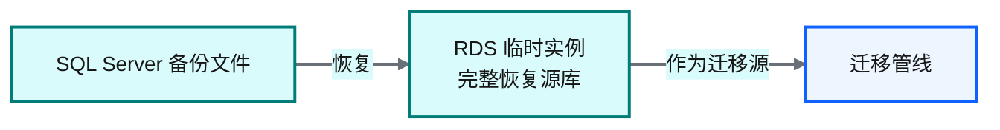
<p class="caption" markdown="span">**图 31-2** 数据库恢复子系统</p>

为什么不直接连生产 SQL Server 迁移？因为生产库压力不能加大。先恢复到 RDS 临时实例，在副本上做迁移。

### Schema 自动转换

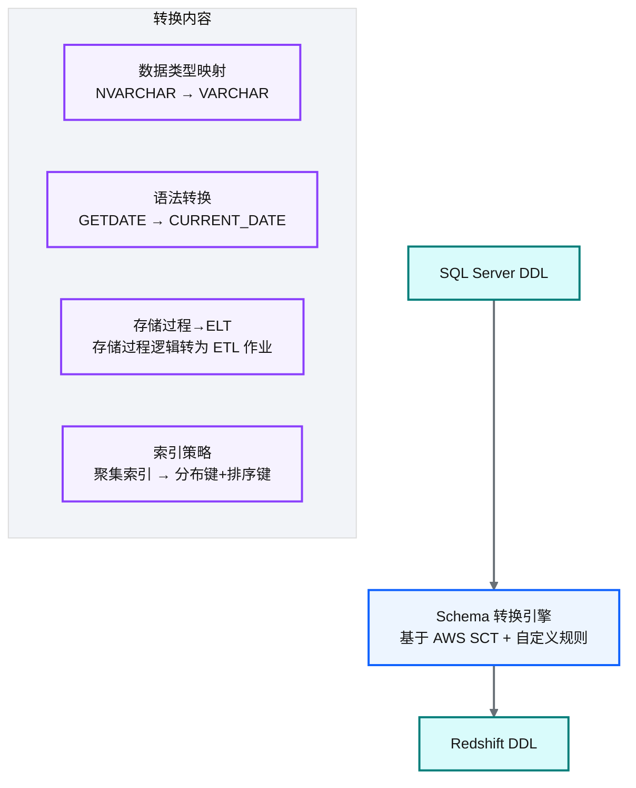
<p class="caption" markdown="span">**图 31-3** Schema 自动转换</p>

| 转换维度 | SQL Server | Redshift |
|---|---|---|
| 数据类型 | NVARCHAR/NTEXT | VARCHAR（Redshift 无 N 前缀） |
| 函数 | GETDATE()/ISNULL() | CURRENT_DATE/COALESCE() |
| 索引 | 聚集/非聚集索引 | 分布键 + 排序键 |
| 存储过程 | T-SQL 存储过程 | 转为 ETL 作业（:simple-python: Python/SQL） |
| 视图 | 视图 | 视图（语法适配） |
<p class="caption" markdown="span">**表 31-1** Schema 自动转换</p>


!!! tip "引申"
    schema 转换不只是语法替换——更重要的是"架构范式转换"。SQL Server 是行式 OLTP 数据库，索引策略以 B-Tree 为主；Redshift 是列式 OLAP 数据库，索引策略变为"分布键（数据如何分布到节点）+ 排序键（数据如何排序存储）"。好的迁移不是"把 SQL Server 的表照搬到 Redshift"，而是"重新设计适合列式 MPP 的表结构"。

把转换表里的维度落到具体 DDL，就是 SQL Server 的 OLTP 表结构改写为 Redshift 的列式 MPP 表结构——聚集索引变分布键+排序键，N 前缀类型去掉，函数替换：

```sql
-- 示意：SQL Server → Redshift DDL before/after
-- 【before】SQL Server（行式 OLTP，聚集索引）
CREATE TABLE fact_prescription (
    prescription_id NVARCHAR(64) NOT NULL,
    hospital_id     NVARCHAR(32),
    product_id      NVARCHAR(32),
    qty             INT,
    created_at      DATETIME DEFAULT GETDATE(),
    CONSTRAINT pk_fact PRIMARY KEY (prescription_id)
);
CREATE CLUSTERED INDEX idx_hospital ON fact_prescription(hospital_id);  -- 聚集索引

-- 【after】Redshift（列式 MPP，分布键+排序键）
CREATE TABLE fact_prescription (
    prescription_id VARCHAR(64) NOT NULL,        -- NVARCHAR→VARCHAR（Redshift 无 N 前缀）
    hospital_id     VARCHAR(32) ENCODE az64,     -- 列式压缩编码
    product_id      VARCHAR(32) ENCODE az64,
    qty             INT ENCODE az64,
    created_at      TIMESTAMP DEFAULT CURRENT_TIMESTAMP  -- GETDATE()→CURRENT_TIMESTAMP
)
DISTKEY(hospital_id)                             -- 核心意图：聚集索引→分布键，按 join 键分布减少广播
SORTKEY(created_at);                             -- 核心意图：按查询常用过滤列排序，加速范围扫描
```

### 迁移性能基线

!!! note ""
    以下迁移性能数据为**基于行业合理推演的量级**，10TB/4000+ 表规模的典型表现，非 Aurora 真实迁移数据。

10TB 全量迁移在一个 24 小时窗口内完成一轮，四阶段的时间分配大致如下：

| 阶段 | 时间占比 | 说明 |
|---|---|---|
| **① 流式导出** | ~40% | 16-32 并发 JDBC 连接从 RDS 副本分片读取，大表独占连接、小表共享连接池 |
| **② 分片压缩+上传** | ~20% | LZOP 压缩比约 3:1（10TB 源 → ~3.3TB S3 中转），压缩与上传重叠 |
| **③ S3 中转** | ~10% | S3 暂存，MANIFEST 记录分片清单供 COPY 校验 |
| **④ Redshift COPY** | ~30% | 并行从 S3 加载，利用 MPP 多节点 |
<p class="caption" markdown="span">**表 31-2** 迁移性能基线</p>


| 指标 | 数值 | 说明 |
|---|---|---|
| **全量迁移周期** | 24 小时内完成一轮，支撑 T+1 测试 | 分片压缩后 S3 中转 → Redshift COPY 批量加载 |
| **并发 JDBC 导出连接数** | 16-32 | 按表大小分组，大表独占，小表共享连接池 |
| **压缩比** | ~3:1（Parquet+Snappy） | 10TB 源 → ~3.3TB S3 中转 |
| **断点续传触发频率** | 日均 1-2 次 | 长尾大表或网络抖动，检查点基于源表主键区间，重传仅增量区间 |
| **最终对账一致性** | 行级 100% 对账通过 | 源表 COUNT → S3 Parquet COUNT → Redshift COUNT 三方对账 |
<p class="caption" markdown="span">**表 31-3** 迁移性能基线</p>


```mermaid
%%{init: {'theme':'base','themeVariables':{'primaryColor':'#edf5ff','primaryTextColor':'#161616','primaryBorderColor':'#0f62fe','lineColor':'#697077','secondaryColor':'#d9fbfb','tertiaryColor':'#f2f4f8','fontSize':'14px'}}}%%
gantt
 title 24h 全量迁移窗口时间分配
 dateFormat HH:mm
 axisFormat %H:%M
 section 导出
 流式导出 40%% :a1, 00:00, 9h
 section 压缩上传
 分片压缩+上传 20%% :a2, after a1, 5h
 section S3中转
 S3 暂存+MANIFEST 10%% :a3, after a2, 2h
 section COPY
 Redshift COPY 30%% :a4, after a3, 8h

```
<p class="caption" markdown="span">**图 31-4** 迁移性能基线</p>

---

## 31.3 流式导出 + 分片压缩 + 对象存储中转 + 批量加载

```mermaid
%%{init: {'theme':'base','themeVariables':{'primaryColor':'#edf5ff','primaryTextColor':'#161616','primaryBorderColor':'#0f62fe','lineColor':'#697077','secondaryColor':'#d9fbfb','tertiaryColor':'#f2f4f8','fontSize':'14px'}}}%%
flowchart LR
 subgraph 迁移管线["四阶段迁移管线"]
 S1[① 流式导出<br/>从源库流式读取数据]
 S2[② 分片压缩<br/>按行数分片 + LZOP 压缩]
 S3[③ 对象存储中转<br/>上传 S3 暂存]
 S4[④ 批量加载<br/>Redshift COPY 从 S3 加载]
 end

 SRC[源数据库] --> S1
 S1 --> S2
 S2 --> S3
 S3 --> S4
 S4 --> RS[Redshift 目标表]
classDef bpProcess fill:#edf5ff,stroke:#0f62fe,stroke-width:2px,color:#161616
classDef bpData fill:#d9fbfb,stroke:#007d79,stroke-width:2px,color:#161616
classDef bpDecision fill:#fcf4d6,stroke:#f1c21b,stroke-width:2px,color:#161616
classDef bpSuccess fill:#defbe6,stroke:#198038,stroke-width:2px,color:#161616
classDef bpError fill:#fff1f1,stroke:#da1e28,stroke-width:2px,color:#161616
classDef bpExternal fill:#f2f4f8,stroke:#697077,stroke-width:2px,color:#161616
classDef bpInfo fill:#f6f2ff,stroke:#8a3ffc,stroke-width:2px,color:#161616
classDef bpGroup fill:#ffffff,stroke:#0f62fe,stroke-width:2px,color:#161616
class RS bpData
class S1 bpProcess
class S2 bpProcess
class S3 bpData
class S4 bpProcess
class SRC bpData
linkStyle default stroke:#697077,stroke-width:2px
```
<p class="caption" markdown="span">**图 31-5** 流式导出 + 分片压缩 + 对象存储中转 + 批量加载</p>

### 设计要点

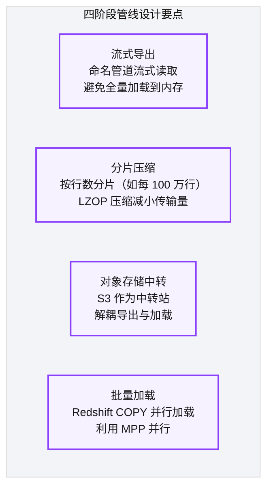
<p class="caption" markdown="span">**图 31-6** 设计要点</p>

| 阶段 | 设计 | 解决的问题 |
|---|---|---|
| 流式导出 | 命名管道（named pipe）流式读取 | 10TB 不可能全加载到内存 |
| 分片压缩 | 按行数分片 + LZOP 压缩 | 大文件难管理；压缩减网络传输 |
| S3 中转 | 导出和加载通过 S3 解耦 | 导出慢不阻塞加载，加载失败可从 S3 重试 |
| 批量加载 | Redshift COPY 并行加载分片 | MPP 并行加载，利用多节点 |
<p class="caption" markdown="span">**表 31-4** 设计要点</p>


!!! warning "Trade-off"
    四阶段管线比"直接 JDBC 导到 Redshift"复杂得多，但解决了三个关键问题：①内存（流式不全量加载）②网络（压缩减传输）③容错（S3 中转可重试）。对于 10TB 级迁移，这些是必须的。

---

## 31.4 任务状态持久化、断点续传与并发资源治理

### 断点续传

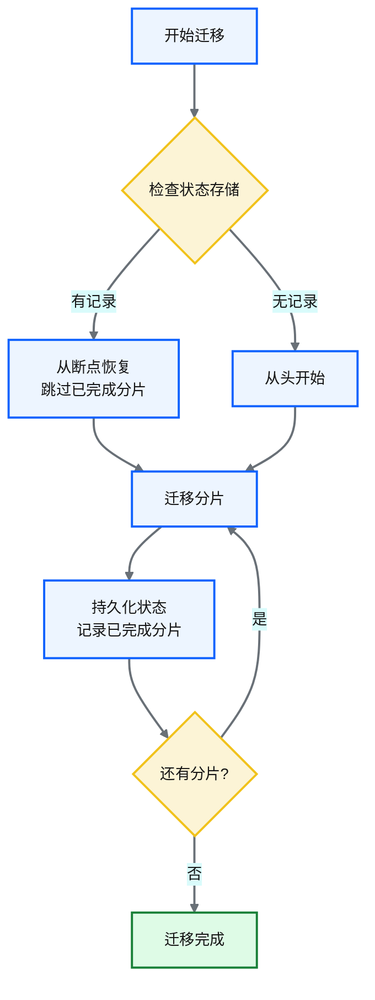
<p class="caption" markdown="span">**图 31-7** 断点续传</p>

### 状态持久化

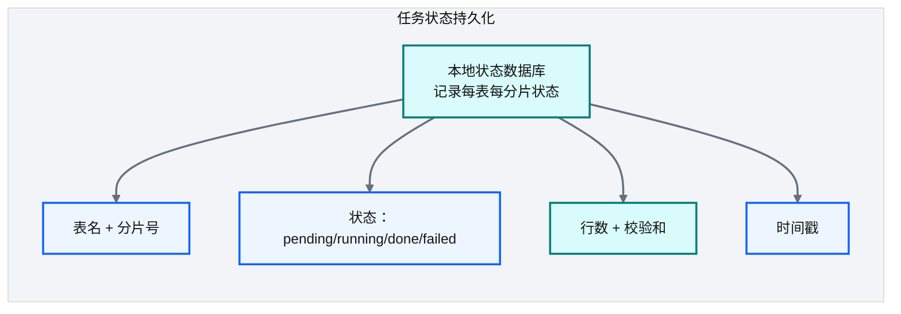
<p class="caption" markdown="span">**图 31-8** 状态持久化</p>

| 设计要点 | 说明 |
|---|---|
| **分片级状态** | 每个分片独立记录状态，可精确恢复 |
| **校验和** | 记录行数+校验和，加载后验证完整性 |
| **本地存储** | 状态存本地轻量数据库，避免依赖远程服务 |
<p class="caption" markdown="span">**表 31-5** 状态持久化</p>


分片状态落到一个轻量表里，每个分片一行，断点续传时查这张表跳过已完成分片：

```python
# 示意：分片状态 schema（断点续传的依据）
# CREATE TABLE shard_state (
#     table_name  VARCHAR(128),
#     shard_id    INT,
#     status      VARCHAR(16),    -- pending/running/done/failed
#     row_count   BIGINT,
#     checksum    VARCHAR(64),
#     updated_at  TIMESTAMP,
#     PRIMARY KEY (table_name, shard_id));

def resume_migration(table: str, shards: list) -> list:
    # 核心意图：查状态表，跳过已完成分片，只跑 pending/failed
    done = {s.shard_id for s in shard_state.query(table=table, status="done")}
    return [s for s in shards if s.id not in done]   # 仅重跑未完成分片
```

### 回滚方案

迁移不可能一次成功——某张表 COPY 失败、对账不一致、下游报表报错，都需要回滚到迁移前的状态。回滚方案要在迁移前就设计好，而不是出事再想：

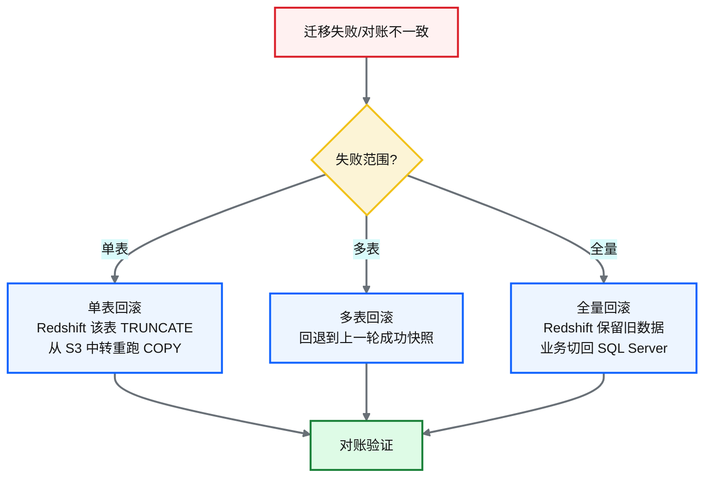
<p class="caption" markdown="span">**图 31-9** 回滚方案</p>

| 回滚级别 | 触发条件 | 做法 | 恢复时间 |
|---|---|---|---|
| **单表** | 某表 COPY 失败/对账不一致 | Redshift 该表 TRUNCATE + 从 S3 中转重跑 COPY | 分钟级 |
| **多表** | 多表对账失败，但有上一轮快照 | 回退到上一轮成功的 Redshift 快照 | 小时级 |
| **全量** | 全量迁移数据质量问题 | Redshift 保留旧数据，业务切回 SQL Server | 需协调停机窗口 |
<p class="caption" markdown="span">**表 31-6** 回滚方案</p>


!!! warning "Trade-off"
    全量回滚是"最后手段"——它意味着业务要切回 SQL Server，可能需要停机窗口。因此迁移采用"灰度切换"而非"一刀切"：先迁非关键表验证、再分批迁关键表、最后双跑对账一致后切换。任何一批失败，只回滚该批，不影响已成功的批。这是"既大胆又精细"的具体体现。

### 存储过程 → ETL 转换案例

迁移最费力的不是搬表，而是把 SQL Server 里的存储过程（SP）转成 Redshift/ETL 作业——SP 里往往是多年的业务逻辑沉淀，T-SQL 语法与 Redshift SQL 差异大。以"月度处方汇总"存储过程为例：

| 维度 | SQL Server 存储过程 | CDP ETL 作业 |
|---|---|---|
| **载体** | T-SQL 存储过程，定时 Job 调度 | :simple-apachespark: PySpark batch job（[Ch 17](./17-Landing到Raw到Enriched开发实战.md)） |
| **逻辑位置** | 过程内临时表 + 游标循环 | DataFrame 转换链（声明式） |
| **调度** | SQL Server Agent | Step Functions + EventBridge（[Ch 10](./10-编排与调度设计-StepFunctions与EventBridge.md)） |
| **重跑** | 手动改参数重跑 | 配置驱动，按 biz_date 分区幂等重跑 |
| **可观测** | 过程内 PRINT 日志 | 审计日志 + 行数对账（[Ch 20](./20-元数据管理与数据血缘.md)） |
<p class="caption" markdown="span">**表 31-7** 存储过程 → ETL 转换案例</p>


```sql
-- 示意：SP → ETL 的逻辑迁移（月度处方汇总）
-- 【before】SQL Server 存储过程（游标循环 + 临时表）
CREATE PROCEDURE sp_monthly_prescription AS
BEGIN
    DECLARE cur CURSOR FOR SELECT DISTINCT hospital_id FROM dim_hospital;
    -- 逐医院游标循环，累加处方量到 #temp，最后 INSERT 到汇总表
    ...
END;

-- 【after】Redshift SQL / PySpark（声明式，无游标，MPP 并行）
INSERT INTO monthly_prescription_summary
SELECT hospital_id, product_id, DATE_TRUNC('month', biz_date) AS month,
       SUM(qty) AS total_qty                              -- 核心意图：游标循环→集合式聚合，MPP 自动并行
FROM fact_prescription
WHERE biz_date >= DATE_TRUNC('month', CURRENT_DATE) - INTERVAL '1 month'
GROUP BY hospital_id, product_id, DATE_TRUNC('month', biz_date);
```

!!! tip "引申"
    SP→ETL 转换的精髓是"过程式→声明式"——游标循环是 OLTP 思维（逐行处理），GROUP BY 聚合是 OLAP 思维（集合式、MPP 并行）。同样的业务逻辑，声明式 SQL 在 Redshift 上比游标循环快几个数量级。这也是为什么迁移不是"翻译语法"而是"重写逻辑"——把 OLTP 的过程式思维彻底换成 OLAP 的集合式思维。

### 并发资源治理

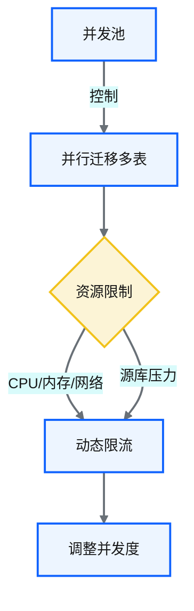
<p class="caption" markdown="span">**图 31-10** 并发资源治理</p>

!!! tip "引申"
    10TB 迁移最大的风险不是"跑不完"，而是"跑的时候把源库压垮了"。并发治理的核心是"在源库压力和迁移速度之间找平衡"——并发太高压垮源库，太低迁移耗时过长。通过监控源库 CPU/IO 指标，动态调整并发度，是最稳妥的策略。

---

## 31.5 引申：托管迁移服务 vs 自研管线

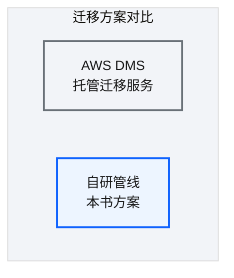
<p class="caption" markdown="span">**图 31-11** 引申：托管迁移服务 vs 自研管线</p>

| 维度 | AWS DMS | 自研管线 |
|---|---|---|
| **上手速度** | 快（配置即用） | 慢（需开发） |
| **schema 转换** | 有限（需 SCT 辅助） | 完全可控 |
| **断点续传** | 内置 | 需自建 |
| **精细控制** | 弱 | 强（分片/并发/压缩） |
| **维护成本** | 低（托管） | 高（自维护） |
| **适合场景** | 标准迁移 | 非标准/大规模/需精细控制 |
<p class="caption" markdown="span">**表 31-8** 引申：托管迁移服务 vs 自研管线</p>


!!! warning "Trade-off"
    自研管线的价值是"完全可控"——分片大小、压缩算法、并发度、断点策略全部可调。代价是开发维护成本高。对于"一次性迁移"，DMS 更经济；对于"需要反复迁移/特殊需求"的场景，自研管线值得投入。

---

## :material-check-circle: 本章小结
- 10TB 迁移挑战：数据量大/表结构复杂/停机窗口短/schema 差异/断点续传
- 数据库恢复子系统：先恢复到 RDS 副本，在副本上迁移避免压垮生产库
- Schema 自动转换：不只是语法替换（DDL before/after），更是"OLTP→OLAP 的架构范式转换"（聚集索引→分布键+排序键）
- 迁移性能基线：24h 窗口四阶段（导出 40%/压缩上传 20%/S3 中转 10%/COPY 30%），16-32 并发连接，压缩比 3:1，断点续传日均 1-2 次，三方对账行级 100%
- 四阶段管线：流式导出→分片压缩→S3 中转→批量加载，解决内存/网络/容错三大问题
- 断点续传 + 并发治理：分片级状态持久化（shard_state schema）+ 动态限流保护源库
- 回滚方案：单表（分钟级）/多表（快照）/全量（切回 SQL Server）三级，采用灰度切换避免一刀切
- 存储过程→ETL 转换：过程式（游标循环）→声明式（GROUP BY 集合式聚合），是"重写逻辑"而非"翻译语法"
- DMS vs 自研：标准迁移选 DMS，非标准/大规模选自研

---

!!! quote "下一章"
    [Ch 32 跨账号批量同步：双桶桥接架构](./32-跨账号批量同步-双桶桥接架构.md) —— 迁移讲完了，接下来看跨 AWS 账号的数据同步——一个更棘手的工程难题。

