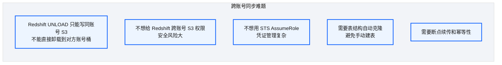
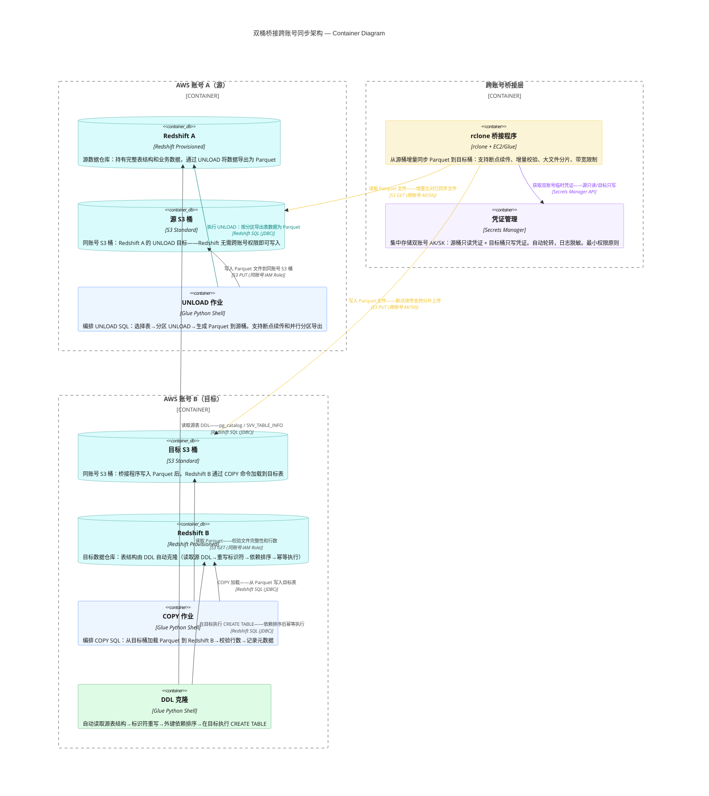
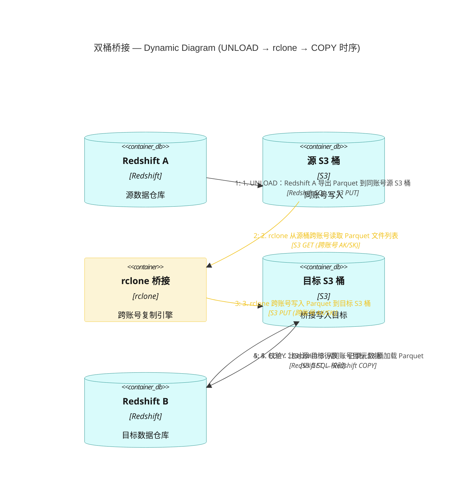
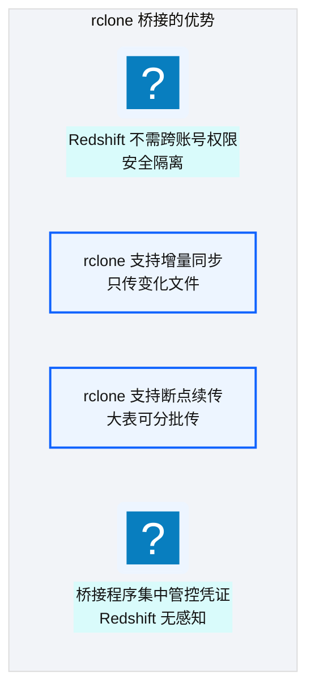
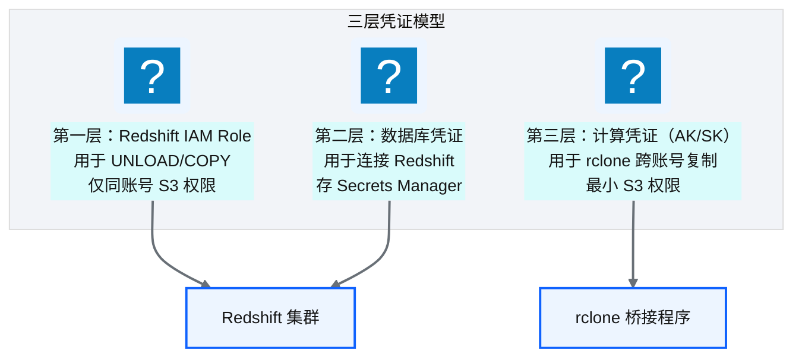
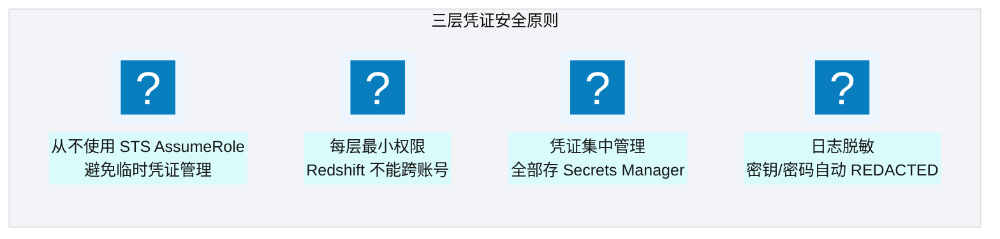
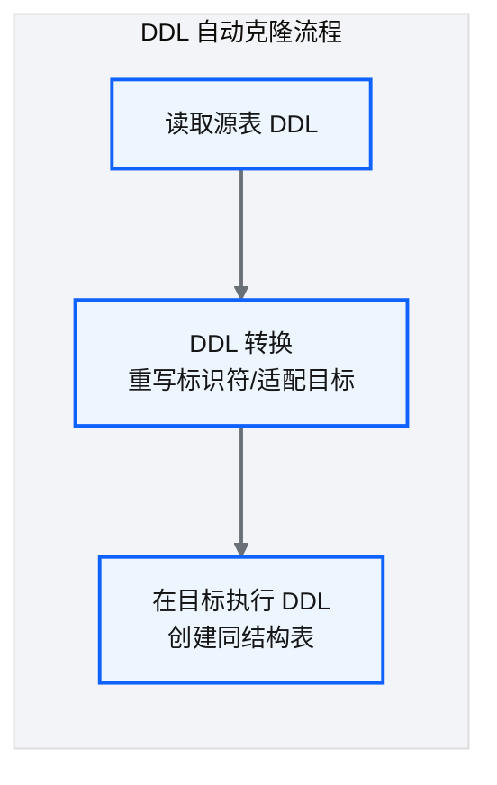
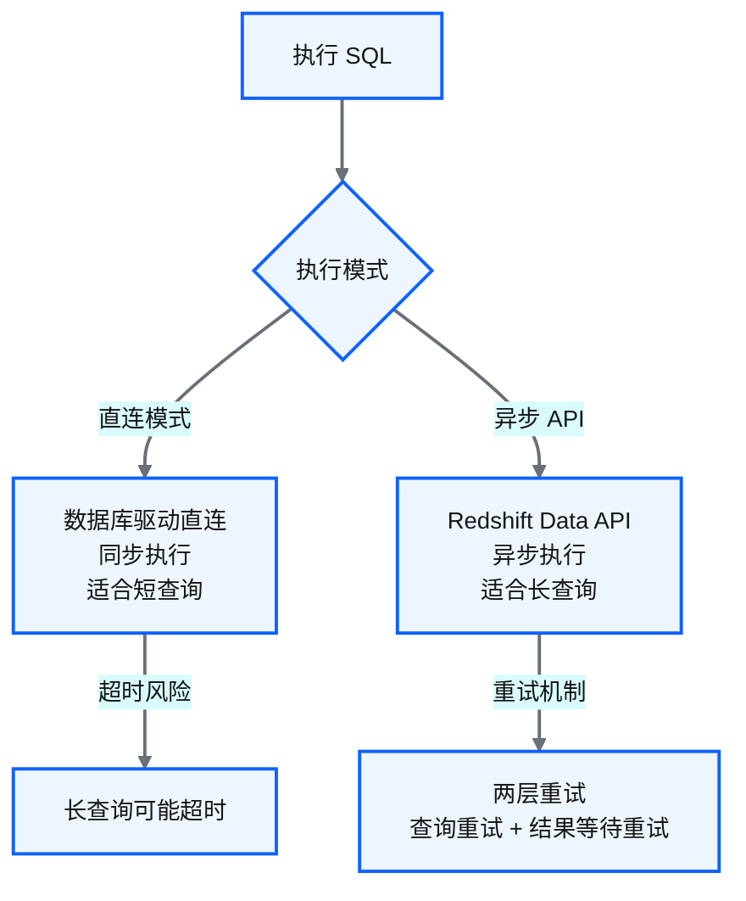
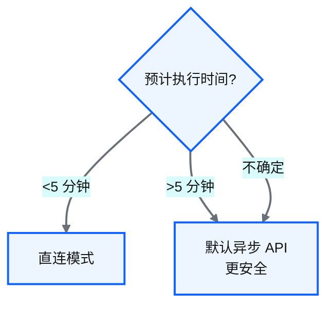

# Ch 32 跨账号批量同步：双桶桥接架构

!!! info "面包屑"
    [本书主页](./index.md) › [Part V 平台演进](./31-遗留系统迁移-SQLServer到Redshift.md) › Ch 32

!!! abstract "项目第 2-3 年 · 扩展与迁移期——跨账号安全同步"

---

## :material-school: 本章你将学到
- 跨账号 Redshift 数据同步的难题与约束
- 双桶桥接架构设计：源卸载→源桶→桥接→目标桶→目标加载
- 三层凭证模型：最小权限与跨账号安全
- DDL 自动克隆与执行通道双模式设计

---

迁移完 SQL Server（[Ch 31](./31-遗留系统迁移-SQLServer到Redshift.md)）后，又一个"没想到的"挑战出现了：Aurora 内部有多个 AWS 账号（不同业务线的独立账号），需要把账号 A 的 Redshift 数据批量同步到账号 B 的 Redshift。

"同步数据嘛，UNLOAD 出来再 COPY 进去不就行了？"——这是我最初的反应。但深入分析后发现事情没那么简单：Redshift 的 UNLOAD 只能写**同账号**的 S3 桶，不能直接卸载到对方账号的桶。而给 Redshift 集群跨账号 S3 权限？安全团队第一个不答应——一旦集群被入侵，影响面就跨账号了。

这个问题困扰了我们一周。最终在一个白板讨论中，"双桶桥接"的方案成型——它不是最简单的方案，但是最安全的。这一章就是这个方案的设计全过程。

---

## 32.1 跨账号数据同步的难题与约束

**场景**：Aurora 有两个 AWS 账号（如不同业务线的独立账号），需要把账号 A 的 Redshift 数据批量同步到账号 B 的 Redshift。

**图 32-1** 跨账号数据同步的难题与约束

!!! warning "Trade-off"
    最简单的方案是"给账号 A 的 Redshift 一个跨账号 S3 权限，直接 UNLOAD 到账号 B 的桶"。但这违背了最小权限原则——Redshift 集群获得了跨账号写入能力，一旦被入侵，影响面巨大。我们选择了更安全但更复杂的"双桶桥接"方案。

---

## 32.2 双桶架构设计：源卸载→源桶→桥接→目标桶→目标加载

**图 32-2** 双桶架构设计：源卸载→源桶→桥接→目标桶→目标加载

### 数据流详解

| 步骤 | 操作 | 账号 | 关键点 |
|---|---|---|---|
| ① UNLOAD | Redshift A 卸载数据到同账号 S3 桶 | A | Redshift 无需跨账号权限 |
| ② 桥接复制 | 用 :simple-rclone: rclone 从源桶复制到目标桶 | A→B | 桥接程序持双账号凭证 |
| ③ COPY | Redshift B 从同账号 S3 桶加载数据 | B | Redshift 无需跨账号权限 |

**表 32-1** 数据流详解

### 跨账号同步时序

**图 32-3** 跨账号同步时序

### 为什么用 rclone 做桥接

**图 32-4** 为什么用 rclone 做桥接

!!! tip "引申"
    双桶架构的本质是"在两个账号之间插入一个中转层"——源和目标都不需要跨账号权限，只有桥接程序持有双账号凭证。这就像国际贸易中的"保税仓"——出口方和进口方不直接交易，通过中间仓中转。安全性和解耦性都更好。

---

## 32.3 三层凭证模型：最小权限与跨账号安全

**图 32-5** 三层凭证模型：最小权限与跨账号安全

| 凭证层 | 用途 | 权限范围 | 存储位置 |
|---|---|---|---|
| **Redshift IAM Role** | UNLOAD/COPY 到同账号 S3 | 仅同账号 S3 读写 | IAM Role |
| **数据库凭证** | 连接 Redshift 执行 SQL | 数据库级权限 | Secrets Manager |
| **计算凭证（AK/SK）** | rclone 跨账号复制 | 双账号 S3 只读/只写 | Secrets Manager |

**表 32-2** 三层凭证模型：最小权限与跨账号安全

### 安全设计原则

**图 32-6** 安全设计原则

!!! warning "Trade-off"
    三层凭证比"一个 Role 管所有"复杂，但安全性大幅提升。Redshift 集群始终只有同账号权限——即使被入侵，攻击者也无法直接访问对方账号。桥接程序的 AK/SK 权限最小化（只读写特定桶），且日志中自动脱敏。

---

## 32.4 DDL 自动克隆与结构迁移

**图 32-7** DDL 自动克隆与结构迁移

| 设计要点 | 说明 |
|---|---|
| **源 DDL 读取** | 通过系统视图查询源表完整 DDL |
| **标识符重写** | 按规则重写表名/schema 名（如加环境前缀） |
| **外键排序** | 有外键依赖的表按依赖顺序创建（被引用表先建） |
| **幂等性** | 目标表已存在则跳过或重建（按配置） |

**表 32-3** DDL 自动克隆与结构迁移

!!! tip "引申"
    DDL 克隆的难点不是"读取 DDL"——而是"处理依赖关系"。外键约束要求"被引用表先于引用表创建"。平台通过依赖排序策略（[Ch 26](./26-StepFunctions模板注入.md) 介绍过类似思路）自动计算创建顺序，避免外键冲突。

---

## 32.5 执行通道双模式设计：直连 vs 异步 API

**图 32-8** 执行通道双模式设计：直连 vs 异步 API

| 模式 | 机制 | 适合场景 | 风险 |
|---|---|---|---|
| **直连模式** | 数据库驱动同步连接 | 短查询（DDL/小表 COPY） | 长查询超时断连 |
| **异步 API** | Redshift Data API 异步提交 | 长查询（大表 UNLOAD/COPY） | 需轮询结果 |

**表 32-4** 执行通道双模式设计：直连 vs 异步 API

### 双模式的自动选择

**图 32-9** 双模式的自动选择

!!! warning "Trade-off"
    直连模式简单直接，但长查询可能因网络超时断连——10TB 级 UNLOAD 可能跑数小时，直连几乎必然超时。异步 API 模式无超时风险，但增加了"提交→轮询→获取结果"的复杂度。平台的设计是"默认异步 API，短查询可选直连"，兼顾安全和效率。

---

## :material-check-circle: 本章小结
- 跨账号同步难题：Redshift 不能直接跨账号 UNLOAD；不想给集群跨账号权限
- 双桶桥接架构：源 UNLOAD→源桶→rclone 复制→目标桶→目标 COPY——Redshift 始终无跨账号权限
- 三层凭证模型：Redshift IAM Role（同账号 S3）+ DB 凭证 + 计算 AK/SK（跨账号）——从不 AssumeRole
- DDL 自动克隆：读取源 DDL→标识符重写→依赖排序→幂等执行
- 执行双模式：直连（短查询）vs 异步 API（长查询，两层重试）——默认异步更安全

---

!!! quote "下一章"
    [Ch 33 自研 DAG 调度器与任务编排](./33-自研DAG调度器与任务编排.md) —— 跨账号同步涉及复杂任务依赖，接下来看平台为什么自研了一个轻量 DAG 调度器。

