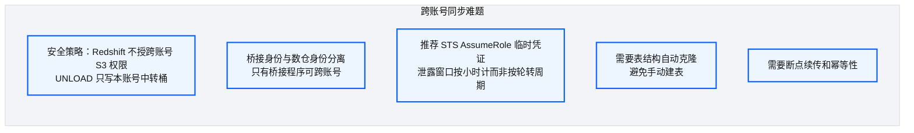
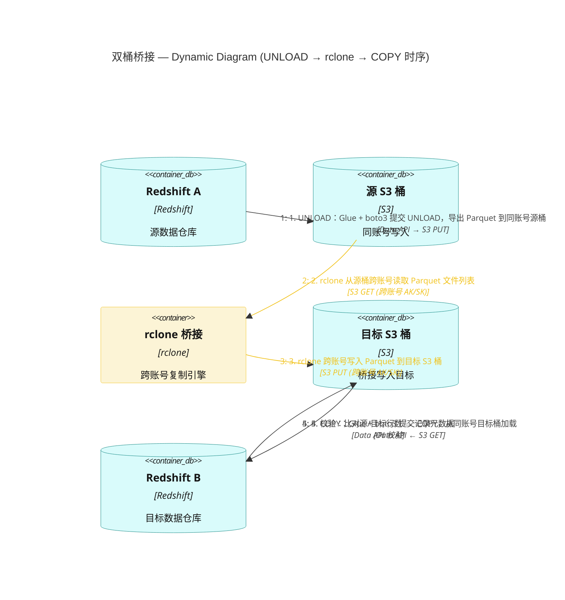
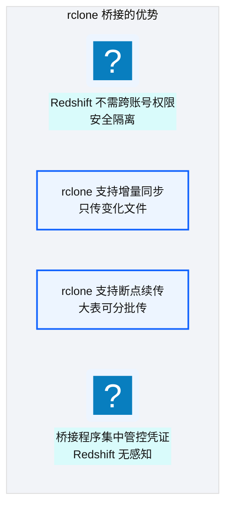
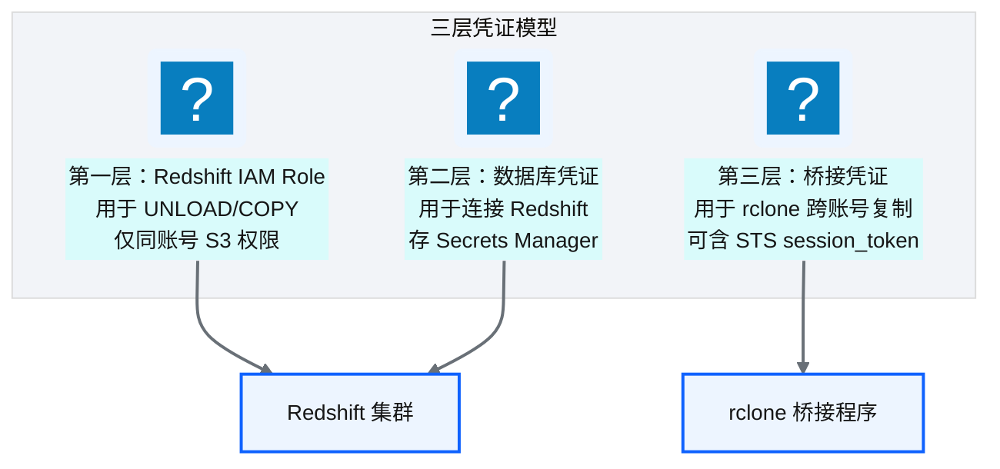
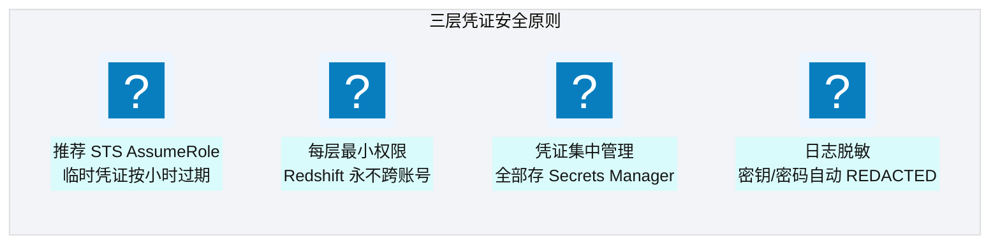
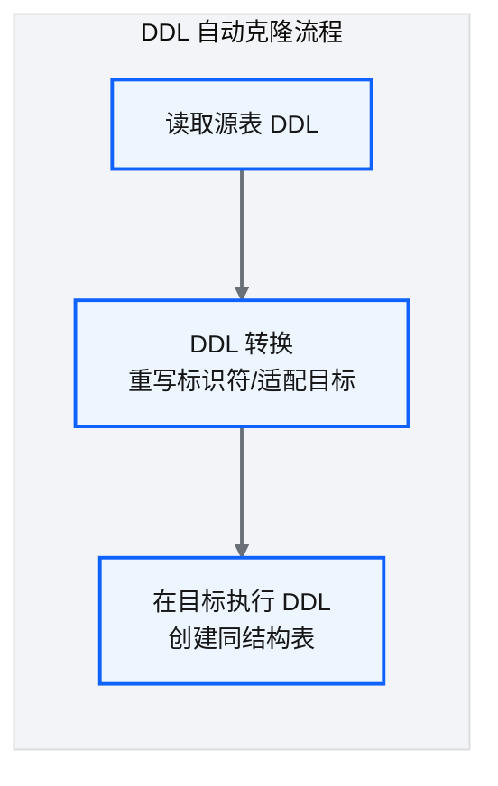
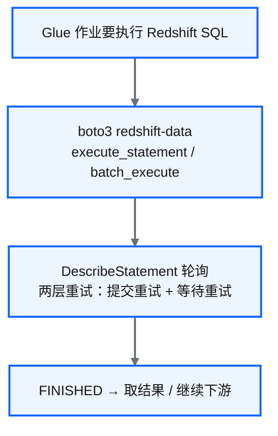

# Ch 32 跨账号批量同步：双桶桥接架构

!!! info "面包屑"
    [本书主页](./index.md) › [Part V 平台演进](./31-遗留系统迁移-SQLServer到Redshift.md) › Ch 32

!!! abstract "项目第 2-3 年 · 扩展与迁移期——跨账号安全同步"

---

## :material-school: 本章你将学到
- 跨账号 Redshift 数据同步的难题与约束
- 双桶桥接架构设计：源卸载→源桶→桥接→目标桶→目标加载
- 三层凭证模型：最小权限与跨账号安全
- DDL 自动克隆与 Glue + boto3（Data API）执行通道

---

迁移完 SQL Server（[Ch 31](./31-遗留系统迁移-SQLServer到Redshift.md)）后，又一个没想到的挑战出现了：Aurora 内部有多个 AWS 账号（不同业务线的独立账号），需要把账号 A 的 Redshift 数据批量同步到账号 B 的 Redshift。

"同步数据嘛，UNLOAD 出来再 COPY 进去不就行了？"我一开始也这么想。细看就不对了：Redshift UNLOAD 在技术上完全能靠 IAM Role + 目标账号桶策略直接写对方桶，但出于安全隔离，平台不给 Redshift 集群跨账号权限。集群一旦被入侵，影响面会跨账号，安全团队第一个不答应。所以 UNLOAD 只写本账号中转桶。

这个问题我们纠结了一周。有次白板讨论上，"双桶桥接"的方案成型——不是最简单的方案，但是最安全的。这一章就讲这个设计过程。

---

## 32.1 跨账号数据同步的难题与约束

跨账号同步发生在项目第 2–3 年。SQL Server 迁完了（[Ch 31](./31-遗留系统迁移-SQLServer到Redshift.md)），多账号隔离也立住了（[Ch 6](./06-环境与多账号隔离设计.md)），接下来要把账号 A 的 Redshift 业务表批量搬到账号 B。场景很具体：不同业务线各有独立 AWS 账号，合规要求边界清晰，分析又要跨账号汇聚。

我在架构评审会上被问过一句："UNLOAD 到对方桶不行吗？"技术上完全行。AWS 文档写得很清楚：UNLOAD 靠集群关联的 IAM Role 写 S3，目标账号桶策略把该 Role ARN 写进 `Principal`，再配 `s3:PutObject` 等权限，就能跨账号落盘；Spectrum 读跨账号桶也是同一套路。所以"Redshift 不能跨账号 UNLOAD"这句话本身是错的。我早期也差点这么写进设计文档。

真正卡住我们的是安全策略，不是能力。安全团队的立场很硬：Redshift 一旦拿到跨账号写权限，入侵面就从"一个账号的数仓"扩成"能污染对方账号的中转桶"。医药平台的账号隔离是给 GxP / PIPL 审计用的。控制面可以跨账号编排；数据面的常驻计算身份不能轻易跨边界。于是约束变成：

**图 32-1** 跨账号数据同步的难题与约束

图里五条约束不是并列清单：前三条是安全边界，后两条是工程可运维性。白板讨论那一周，我们对比过三条路。一是给 Redshift 跨账号 Role，最简单，安全否决。二是 STS AssumeRole + 直接跨账号写目标桶，符合 AWS 最佳实践，但当时增量校验与断点续传要自己补。三是双桶桥接，桥接程序持凭证，多一跳，但数仓两端保持"同账号 only"。我们选了第三条作为当时可上线的方案，同时把第二条记成终态方向。下一节会讲桥接层为什么落成 rclone，以及它和 STS 的关系。

!!! warning "Trade-off"
    最简单的方案是给账号 A 的 Redshift 跨账号 S3 权限，直接 UNLOAD 到账号 B 的桶。这违背最小权限：集群一旦被入侵，影响面巨大。我们选了更安全也更复杂的双桶桥接：数仓身份永不跨账号，跨账号动作收敛到可轮转、可审计的桥接身份上。

---

## 32.2 双桶架构设计：源卸载→源桶→桥接→目标桶→目标加载

**图 32-2** 双桶架构设计：源卸载→源桶→桥接→目标桶→目标加载

### 数据流详解

| 步骤 | 操作 | 账号 | 关键点 |
|---|---|---|---|
| ① UNLOAD | Redshift A 卸载数据到同账号 S3 桶 | A | Redshift 无需跨账号权限 |
| ② 桥接复制 | 用 :simple-rclone: rclone 从源桶复制到目标桶 | A→B | 桥接程序持双账号凭证 |
| ③ COPY | Redshift B 从同账号 S3 桶加载数据 | B | Redshift 无需跨账号权限 |

**表 32-1** 数据流详解

### 跨账号同步时序

**图 32-3** 跨账号同步时序

### 为什么用 rclone 做桥接

**图 32-4** 为什么用 rclone 做桥接

!!! tip "引申"
    双桶架构的思路是在两个账号之间插入一个中转层——源和目标都不需要跨账号权限，只有桥接程序持有双账号凭证。有点像国际贸易里的保税仓：出口方和进口方不直接交易，通过中间仓中转。安全性和解耦性都更好。

---

## 32.3 三层凭证模型：最小权限与跨账号安全

双桶架构把"跨账号"从数仓身上剥下来了，凭证问题却没消失，只是集中到了桥接层。我在实现 `UnloadCopyTool` 时把凭证拆成三层：每一种身份只做一件事。

工程上，整条管线由配置驱动的任务图串起来：`unloadSource` / `s3Staging` / `copyTarget` 三段配置，依赖是 `DDL 克隆 → UNLOAD → SyncS3Staging（rclone）→ COPY → 清理`。`TaskManager` 轮询就绪任务，支持 `failOnError` 栅栏。这就是下一章自研 DAG 的雏形。桥接那一步对应 `SyncS3StagingTask`：从 Secrets Manager 读源/目标 S3 凭证，生成 rclone 双 remote 配置，再 `rclone copy` 做增量同步。

**图 32-5** 三层凭证模型：最小权限与跨账号安全

| 凭证层 | 用途 | 权限范围 | 存储位置 |
|---|---|---|---|
| **Redshift IAM Role** | UNLOAD/COPY 到同账号 S3 | 仅同账号 S3 读写 | IAM Role（集群关联） |
| **数据库凭证** | 连接 Redshift 执行 SQL | 数据库级权限 | Secrets Manager（`clusterSecret`） |
| **桥接凭证** | rclone 跨账号复制 | 源桶只读 / 目标桶只写 | Secrets Manager（可含临时会话） |

**表 32-2** 三层凭证模型：最小权限与跨账号安全

第三层是我后来反复反思的地方。早期实现把长期 AK/SK 放进 Secrets Manager，rclone 直接用。能跑，泄露窗口却等于轮转周期（当时 90 天）。AWS 推荐 `sts.assume_role()` 拿临时凭证：默认 1 小时，最长 12 小时，过期自动失效。有意思的是，平台的 rclone 封装其实已经支持 `session_token`：Secrets 里若带临时会话字段，生成的 rclone conf 会写入 session token。也就是说，从长期密钥迁到"STS 临时凭证灌进同一 Secret"，桥接代码几乎不用改。缺的是轮转侧：用 Lambda / EventBridge 定期 AssumeRole，把临时三件套写回 Secrets，而不是人工发 AK/SK。

### 安全设计原则

**图 32-6** 安全设计原则

!!! warning "Trade-off"
    三层凭证比"一个 Role 管所有"复杂不少，安全性却是实在的。Redshift 集群始终只有同账号权限；即使被入侵，攻击者也没法直接访问对方账号。桥接程序权限最小化（只读写特定桶），日志自动脱敏。

!!! warning "Trade-off：rclone + 长期 AK/SK 是过渡方案，不是终态"
    这里得诚实交代设计债：桥接程序早期用 rclone + Secrets Manager 长期 AK/SK，这不是 AWS 推荐做法。最佳实践是 STS AssumeRole（临时凭证），外加可选的 S3 Cross-Account Replication。当时选 rclone，是因为要文件级增量比对和断点续传；S3 Replication 当时满足不了我们的校验语义。代价是长期凭证的泄露窗口。路线图分两步：先把 Secret 内容换成 STS 临时三件套（代码已支持 `session_token`），再评估是否用 S3 Replication / S3 Inventory 校验和替代 rclone 进程。过渡方案能解眼下的痛，不能当成终态。尤其别把"不想用 AssumeRole，凭证管理复杂"当架构理由：`assume_role` 本身就几行代码，复杂的是轮转与审计闭环。

---

## 32.4 DDL 自动克隆与结构迁移

**图 32-7** DDL 自动克隆与结构迁移

| 设计要点 | 说明 |
|---|---|
| **源 DDL 读取** | 通过系统视图查询源表完整 DDL |
| **标识符重写** | 按规则重写表名/schema 名（如加环境前缀） |
| **外键排序** | 有外键依赖的表按依赖顺序创建（被引用表先建） |
| **幂等性** | 目标表已存在则跳过或重建（按配置） |

**表 32-3** DDL 自动克隆与结构迁移

!!! tip "引申"
    DDL 克隆的难点不是"读取 DDL"，是"处理依赖关系"。外键约束要求被引用表先于引用表创建。平台通过依赖排序策略（[Ch 26](./26-StepFunctions模板注入.md) 介绍过类似思路）自动计算创建顺序，避免外键冲突。

    外键依赖排序这个需求，我第一次跑 DDL 克隆时踩了坑才意识到。当时让脚本按字母序创建表——`dim_hospital` 在 `fact_prescription` 前面创建，看起来没问题。但 `fact_prescription` 有外键引用 `dim_doctor`，而 `dim_doctor` 按字母序排在 `dim_hospital` 之后、`fact_prescription` 之前——创建 `fact_prescription` 时 `dim_doctor` 还不存在，外键约束失败了。从那以后我把依赖排序改成了拓扑排序——读取所有外键约束，按依赖图拓扑排序，无依赖的表可并行创建。这个拓扑排序逻辑和 [Ch 26](./26-StepFunctions模板注入.md) 的表加载顺序排序完全一样——**依赖排序是通用模式，不管是 DDL 创建还是数据加载**。

---

## 32.5 执行通道：Glue + boto3（Data API）为主

平台对 Redshift 的所有调用（UNLOAD、COPY、DDL、行数校验）统一走 Glue（Python Shell）+ boto3 `redshift-data` 客户端，提交给 Redshift Data API 异步执行。这和 [Ch 14](./14-数据库与JDBC连接器.md) 的 JDBC 路径是两回事：JDBC / ODBC 只用于从 MySQL、SQL Server、PostgreSQL 等源库摄取，从不用 JDBC 去驱动 Redshift。

**图 32-8** 执行通道：Glue + boto3（Data API）为主

| 路径 | 机制 | 用途 | 说明 |
|---|---|---|---|
| **主路径（本书默认）** | Glue + boto3 → Redshift Data API | UNLOAD / COPY / DDL / 校验 | 异步、无 JDBC、不占集群长连接 |
| **源库摄取（对照）** | Glue Spark + JDBC/ODBC Driver | MySQL / MSSQL / PostgreSQL → S3 | 见 [Ch 14](./14-数据库与JDBC连接器.md)，与 Redshift 无关 |

**表 32-4** Redshift 调用 vs 源库 JDBC：两条互不混淆的路径

!!! tip "为什么不用 JDBC 调 Redshift"
    Redshift 虽兼容 PostgreSQL 协议，平台仍选 Data API，主要有几条工程理由。Glue / Lambda 是短生命周期计算，长 JDBC 连接和超时、连接池治理不匹配。Data API 用 IAM + Secrets ARN 鉴权，凭证不落作业内存。大表 UNLOAD/COPY 可跑数小时，异步提交加轮询比同步驱动更稳。配置里虽保留过 `directConnect` 开关（底层是 psycopg2 线协议，也不是 JDBC），生产默认关闭，只作排障备用。

!!! warning "Trade-off"
    Data API 多了"提交→轮询→取结果"一层，短 DDL 会比同步驱动慢几百毫秒到数秒；换来的是超时免疫，也更贴 Serverless。跨账号同步这种小时级作业，这点开销可以忽略。

---

## :material-check-circle: 本章小结
- 跨账号同步难题：UNLOAD 技术上可跨账号，安全策略不给 Redshift 跨账号权限，故只写本账号中转桶
- 双桶桥接：源 UNLOAD→源桶→rclone→目标桶→目标 COPY；数仓两端始终无跨账号权限
- 三层凭证：Redshift IAM Role + DB 凭证 + 桥接凭证；推荐 STS AssumeRole；rclone 已支持 `session_token`，长期 AK/SK 是过渡
- DDL 自动克隆：读源 DDL→标识符重写→依赖排序→幂等执行
- Redshift 调用统一走 Glue + boto3（Data API）；JDBC 仅用于源库摄取

---

!!! quote "下一章"
    [Ch 33 自研 DAG 调度器与任务编排](./33-自研DAG调度器与任务编排.md) —— 跨账号同步涉及复杂任务依赖，接下来看平台为什么自研了一个轻量 DAG 调度器。

