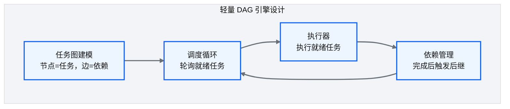
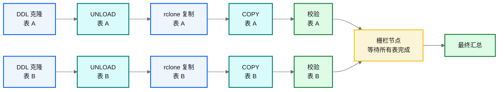
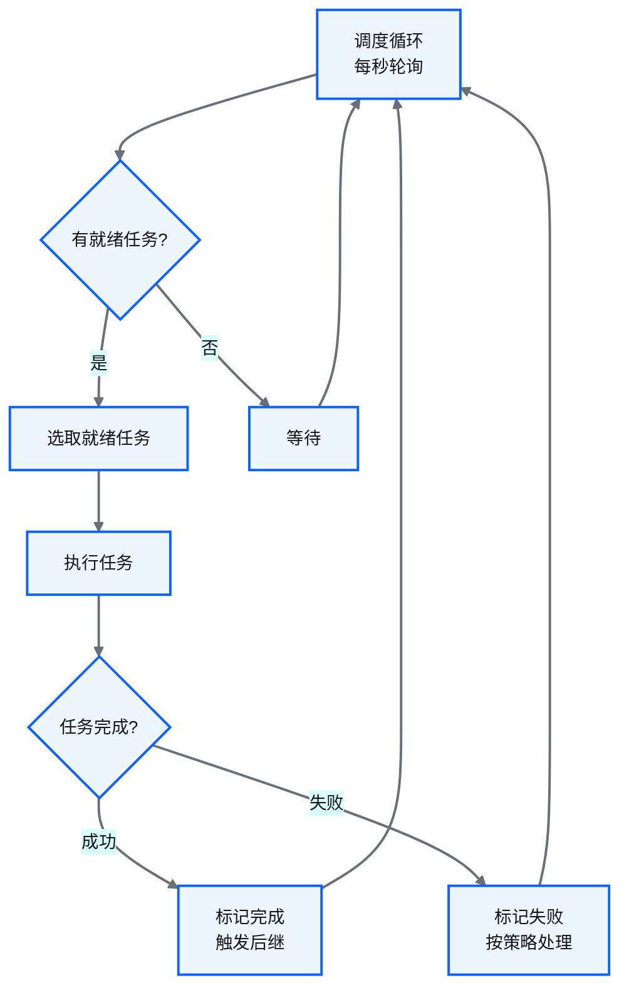
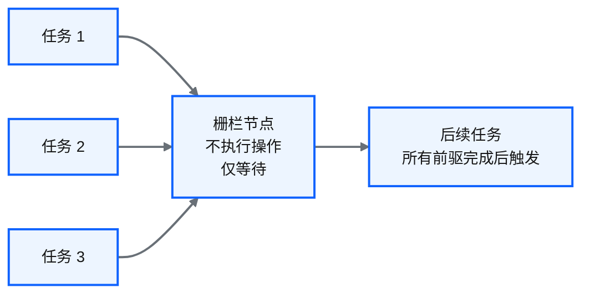
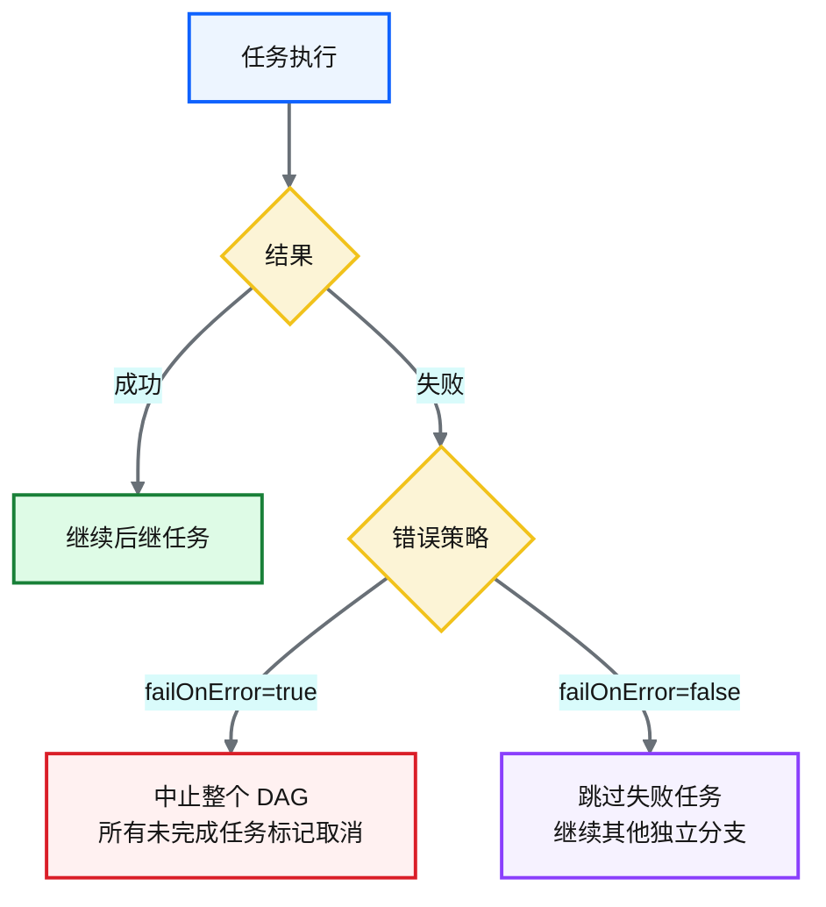
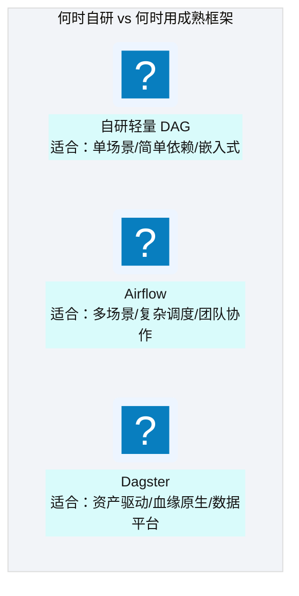

# Ch 33 自研 DAG 调度器与任务编排

!!! info "面包屑"
    [本书主页](./index.md) › [Part V 平台演进](./32-跨账号批量同步-双桶桥接架构.md) › Ch 33

!!! abstract "项目第 2-3 年 · 扩展与迁移期——DAG调度器"

---

## :material-school: 本章你将学到
- 轻量 DAG 引擎设计：任务图建模（Task/DAG dataclass）与调度循环（含伪代码）
- 栅栏节点、扇入汇聚与错误传播语义（含 failOnError 分支逻辑伪代码）
- DAG 可视化与调度器自身可观测性（Graphviz 着色 + 队列深度/吞吐/失败率指标）
- 自研轻量 DAG vs Airflow/Dagster 的边界

---

## 33.1 轻量 DAG 引擎设计：任务图建模与调度循环

跨账号同步（[Ch 32](./32-跨账号批量同步-双桶桥接架构.md)）涉及复杂的任务依赖：DDL 克隆→UNLOAD→:simple-rclone: rclone 复制→COPY→校验，多张表之间还有外键依赖。Step Functions 能做编排，但"大量同类任务 + 复杂依赖图"的场景下不够灵活。所以我们自研了一个轻量 DAG 调度器。


<p class="caption" markdown="span">**图 33-1** 轻量 DAG 引擎设计：任务图建模与调度循环</p>

### 任务图建模


<p class="caption" markdown="span">**图 33-2** 任务图建模</p>

任务图建模落到代码，就是一个 `Task` dataclass（唯一标识 + 依赖列表 + 状态机）+ `DAG` 容器（管理任务集合 + 拓扑关系）。状态机是 `pending → running → done/failed`，调度器按状态推进：

```python
# 示意：任务图数据结构（Task + DAG）
from dataclasses import dataclass, field
from enum import Enum

class TaskStatus(Enum):
    PENDING = "pending"; RUNNING = "running"; DONE = "done"; FAILED = "failed"

@dataclass
class Task:
    task_id: str                              # 唯一标识
    deps: list[str] = field(default_factory=list)   # 依赖的任务 id 列表
    status: TaskStatus = TaskStatus.PENDING
    fail_on_error: bool = True                # 核心意图：错误传播策略（见 §33.2）

@dataclass
class DAG:
    tasks: dict[str, Task] = field(default_factory=dict)
    def add(self, task: Task): self.tasks[task.task_id] = task
    def ready_tasks(self) -> list[Task]:      # 核心意图：依赖全完成即就绪
        return [t for t in self.tasks.values() if t.status == TaskStatus.PENDING
                and all(self.tasks[d].status == TaskStatus.DONE for d in t.deps)]
```

### 调度循环


<p class="caption" markdown="span">**图 33-3** 调度循环</p>

上面的流程图就是调度循环的精确描述，落到 :simple-python: Python 是一个 `while` 循环——每秒轮询就绪任务、执行、按结果更新状态、触发后继：

```python
# 示意：核心调度循环
def schedule_loop(dag: DAG, executor):
    while not dag_all_done(dag):                          # 核心意图：轮询直到全部完成或失败
        for task in dag.ready_tasks():
            task.status = TaskStatus.RUNNING
            try:
                executor.run(task)                        # 执行（Glue/Lambda/rclone）
                task.status = TaskStatus.DONE             # 成功 → 触发后继（ready_tasks 自动发现）
            except Exception as e:
                task.status = TaskStatus.FAILED
                handle_failure(task, e, dag)              # 按 fail_on_error 策略处理（见下）
        time.sleep(1)                                     # 无就绪任务时等待
```

| 设计要点 | 说明 |
|---|---|
| **轮询调度** | 每秒轮询就绪任务，简单可靠 |
| **任务标识** | 每个任务有唯一标识 |
| **依赖列表** | 每个任务声明依赖的前驱任务 |
| **状态机** | pending → running → done/failed |
<p class="caption" markdown="span">**表 33-1** 示意：核心调度循环</p>


!!! warning "Trade-off"
    自研 DAG 是"轻量"的——单线程调度、轮询模型，没有 Airflow 的分布式调度和丰富插件生态。但"跨账号同步"这种"几十张表乘五步流程"的批量任务，轻量 DAG 够用且更可控。为这个场景引入 Airflow 的运维成本太重了。

---

## 33.2 栅栏节点、扇入汇聚与错误传播语义

### 栅栏节点（Barrier）


<p class="caption" markdown="span">**图 33-4** 栅栏节点（Barrier）</p>

栅栏节点是一个"不执行任何操作"的特殊节点，作用是**fan-in（扇入汇聚）**——等待所有前驱任务完成后，才触发后续任务。

### 错误传播语义


<p class="caption" markdown="span">**图 33-5** 错误传播语义</p>

| 策略 | 行为 | 适合场景 |
|---|---|---|
| **failOnError=true** | 一个失败，全部中止 | 关键路径任务（如 DDL 克隆失败则不该继续 COPY） |
| **failOnError=false** | 跳过失败，继续独立分支 | 非关键任务（如表 A 失败不影响表 B 迁移） |
<p class="caption" markdown="span">**表 33-2** 错误传播语义</p>


错误传播落到代码，就是 `handle_failure` 按 `fail_on_error` 标志走两条分支——中止或跳过：

```python
# 示意：错误传播处理（failOnError 分支逻辑）
def handle_failure(task: Task, error: Exception, dag: DAG):
    if task.fail_on_error:
        # 核心意图：关键路径失败 → 中止整个 DAG
        for t in dag.tasks.values():
            if t.status == TaskStatus.PENDING:
                t.status = TaskStatus.FAILED              # 取消所有未完成任务
        raise DagAbortedError(f"任务 {task.task_id} 失败，中止 DAG")
    else:
        # 非关键失败 → 跳过本任务，独立分支继续
        log.warning(f"任务 {task.task_id} 失败但 failOnError=false，跳过继续: {error}")
        task.status = TaskStatus.FAILED                    # 仅本任务失败，后继不触发
```

!!! tip "引申"
    错误传播语义是 DAG 调度器的一个重要设计点。实际的任务图很少纯串行或纯并行——通常是部分串行、部分并行、加上汇聚点的混合。failOnError 策略让调度器能处理两种场景：关键路径失败中止，非关键路径失败继续。

---

## 33.3 引申：自研轻量 DAG vs Airflow/Dagster 的边界


<p class="caption" markdown="span">**图 33-6** 引申：自研轻量 DAG vs Airflow/Dagster 的边界</p>

| 维度 | 自研轻量 DAG | Airflow | Dagster |
|---|---|---|---|
| **开发成本** | 中（需自建） | 低（成熟框架） | 低（成熟框架） |
| **运维成本** | 低（无额外服务） | 中（需维护实例） | 中（需维护实例） |
| **灵活性** | 最高（完全可控） | 高（:simple-python: Python DAG） | 高（Asset 定义） |
| **生态** | 无 | 丰富插件 | 增长中 |
| **适合规模** | 小（单场景数十任务） | 大（企业级多场景） | 中大（数据平台级） |
<p class="caption" markdown="span">**表 33-3** 引申：自研轻量 DAG vs Airflow/Dagster 的边界</p>


!!! warning "Trade-off"
    自研 DAG 的核心优势是零运维加嵌入式——它作为跨账号同步工具的一部分运行，不需要单独维护 Airflow 实例。但如果平台有大量不同场景需要编排（ETL + 同步 + 导出 + 告警），引入 Airflow/Dagster 统一管理更合理。本书平台的主编排用 Step Functions，自研 DAG 仅用于跨账号同步这个特定场景的嵌入式编排——两者各司其职。

    我选自研而不用 Airflow，是被跨账号同步的特殊性逼的。这个同步流程有三个 Airflow 不好处理的特点：一是**嵌入式运行**——同步工具是独立脚本，需要在 Glue Job 里直接调用，不能依赖外部 Airflow 实例；二是**大量同类任务**——100 张表乘 5 步流程等于 500 个 DAG 节点，Airflow DAG 定义会非常臃肿；三是**跨账号凭证管理**——Airflow 的 Connection 管理不太适合这种"双账号 AK/SK"场景。自研的 DAG 引擎只有 200 行 Python，嵌入 Glue Job 里运行，零外部依赖——对这个特定场景，它比 Airflow 更合适。但如果未来平台要编排 ETL 加同步加导出加告警等多种场景，我会考虑引入 Dagster——它的"资产驱动"理念（见 [Ch 10 引申](./10-编排与调度设计-StepFunctions与EventBridge.md)）和数据平台的可观测性诉求很契合。自研是当前约束下的选择，不代表永远不要成熟框架——架构是演进的。

---

## 33.4 DAG 可视化与调度器可观测性

自研 DAG 容易"黑盒化"——任务跑完了但看不见过程，出问题难定位。两个手段缓解：**DAG 可视化**（把任务图渲染成图）和**调度器自身可观测**（暴露指标）。

DAG 可视化把任务图渲染成 Graphviz 图，每个任务标注状态颜色（绿=done/红=failed/灰=pending），排障时一眼看清"卡在哪、哪些失败了"：

```python
# 示意：DAG 可视化——渲染成 Graphviz
def render_dag(dag: DAG) -> str:
    lines = ["digraph dag {"]
    color = {TaskStatus.DONE: "green", TaskStatus.FAILED: "red", TaskStatus.PENDING: "gray", TaskStatus.RUNNING: "yellow"}
    for t in dag.tasks.values():
        lines.append(f'  "{t.task_id}" [style=filled, fillcolor={color[t.status]}];')
        for dep in t.deps:
            lines.append(f'  "{dep}" -> "{t.task_id}";')      # 核心意图：依赖边 + 状态着色
    lines.append("}")
    return "\n".join(lines)                                    # 输出 dot 文本，渲染为 PNG/SVG
```

调度器自身的可观测性——暴露就绪队列深度、吞吐、失败率等指标到 CloudWatch，让调度器自身也是"可观测的"：

| 指标 | 含义 | 告警阈值 |
|---|---|---|
| `ready_queue_depth` | 就绪待执行任务数 | 持续 >0 且无任务完成 → 调度卡住 |
| `tasks_per_minute` | 每分钟完成任务数（吞吐） | 突降 → 可能全部失败或源库不可达 |
| `failure_rate` | 失败率 | >5% → 大面积失败 |
| `dag_duration` | 单次 DAG 执行总时长 | 超基线 2× → 性能退化 |
<p class="caption" markdown="span">**表 33-4** 示意：DAG 可视化——渲染成 Graphviz</p>


!!! tip "引申"
    调度器可观测性常被忽略——"调度器自己跑得好好的，为什么要监控？"但当源库不可达时，所有任务会堆积在 ready 队列里假运行，如果没有 `ready_queue_depth` 监控，这个问题要到数据没出来才被业务感知。调度器是数据平台的心脏，心脏健康必须被监控——这也是 [Ch 49](./49-日志-监控-审计与告警.md) 可观测体系在编排层的延伸。

---

## :material-check-circle: 本章小结
- 轻量 DAG 引擎：任务图建模（Task dataclass：唯一标识+依赖+状态机 + DAG 容器）+ 轮询调度循环（含 schedule_loop 伪代码）+ 依赖管理
- 栅栏节点实现 fan-in 汇聚：等待所有前驱完成才触发后续
- 错误传播双策略：failOnError=true（关键路径中止，含 handle_failure 伪代码）/ false（非关键路径跳过继续）
- DAG 可视化（Graphviz 状态着色）+ 调度器可观测（就绪队列深度/吞吐/失败率/时长指标）
- 自研 vs Airflow/Dagster：自研适合单场景/嵌入式/零运维；成熟框架适合多场景/企业级——本书两者各司其职

---

!!! quote "下一章"
    [Ch 34 设计边界与已知取舍的诚实复盘](./34-设计边界与已知取舍的诚实复盘.md) —— Part V 最后一章：诚实面对设计中的已知缺陷与 trade-off。

