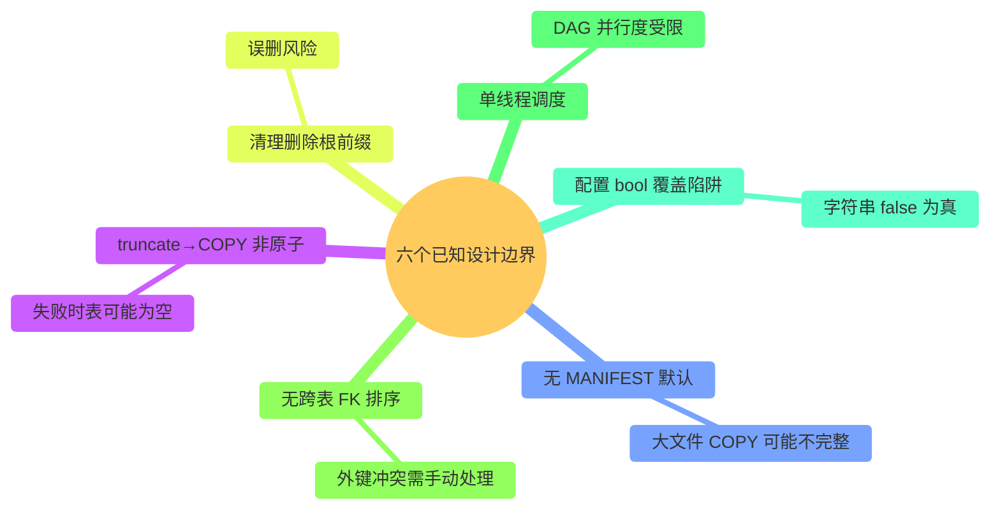
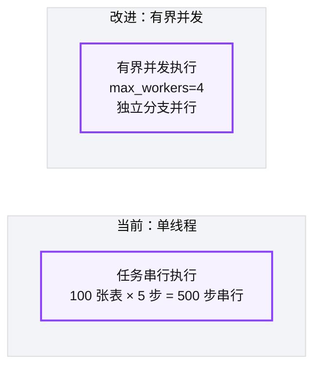
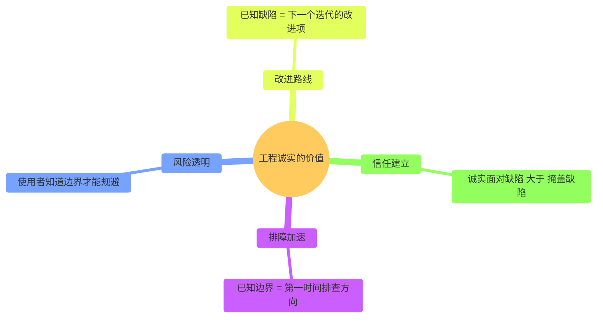
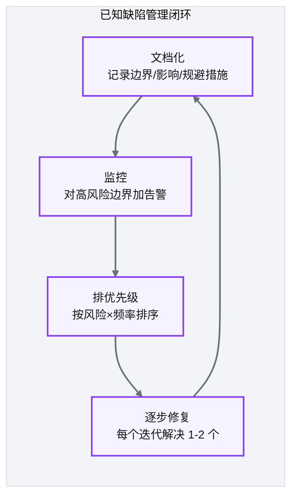

# Ch 34 设计边界与已知取舍的诚实复盘

!!! info "面包屑"
    [本书主页](./index.md) › [Part V 平台演进](./33-自研DAG调度器与任务编排.md) › Ch 34

!!! abstract "项目第 3 年 · 成熟与治理期——设计边界复盘"

---

## :material-school: 本章你将学到
- 平台已知的设计边界与原子性缺口
- 每个 trade-off 的当时约束与"如果重来"的改进方向
- 工程诚实的价值——文档化已知缺陷

---

## 34.1 已知设计边界与原子性缺口

!!! warning "工程诚实"
    这一章是全书最"不舒服"的一章——因为它要诚实地列出平台设计中的已知缺陷。但我认为这种诚实是工程实践的核心价值。

**图 34-1** 已知设计边界与原子性缺口

### 边界详解

| # | 设计边界 | 风险 | 当时约束 | 如果重来 |
|---|---|---|---|---|
| ① | truncate→COPY 非原子 | COPY 失败时表已被 truncate → 空表 | Redshift 无事务性 truncate+COPY | 用 CREATE→RENAME 原子切换，或 Staging 表 + ALTER TABLE EXCHANGE |
| ② | 无 MANIFEST 默认 | 大表 COPY 分片丢失不报错 | MANIFEST 增加配置复杂度 | 默认启用 MANIFEST，COPY 时校验文件完整性 |
| ③ | 清理删除根前缀 | 误删整个表的数据目录 | 按表级清理最简单 | 按批次级清理（只删当次 timestamp 目录） |
| ④ | 无跨表 FK 排序 | 外键约束表加载顺序冲突 | 自动排序增加引擎复杂度 | 配置声明依赖 + 拓扑排序自动计算 |
| ⑤ | 单线程调度 | DAG 并行度受限，大任务集慢 | 单线程最简单可靠 | 支持有界并发（如 max_workers=4） |
| ⑥ | bool 覆盖陷阱 | 配置中 `"false"` 字符串被视为真值 | 配置值未做类型转换 | 配置加载时强制类型转换 + schema 校验 |

**表 34-1** 边界详解

---

## 34.2 每个 trade-off 的当时约束与改进方向

### 边界①：truncate→COPY 非原子（最严重）

```mermaid
%%{init: {'theme':'base','themeVariables':{'primaryColor':'#edf5ff','primaryTextColor':'#161616','primaryBorderColor':'#0f62fe','lineColor':'#697077','secondaryColor':'#d9fbfb','tertiaryColor':'#f2f4f8','fontSize':'14px'}}}%%
flowchart TD
 subgraph 当前问题["当前：非原子加载"]
 T1[TRUNCATE 目标表] -->|表已空|C1[COPY 数据]
 C1 -->|失败|EMPTY[ 表为空<br/>业务中断]
 end

 subgraph 改进方向["改进：原子切换"]
 S1[COPY 到 Staging 表] -->|成功|S2[ALTER TABLE RENAME<br/>原子切换]
 S2 -->|原子|S3[旧表变为备份]
 end
classDef bpProcess fill:#edf5ff,stroke:#0f62fe,stroke-width:2px,color:#161616
classDef bpData fill:#d9fbfb,stroke:#007d79,stroke-width:2px,color:#161616
classDef bpDecision fill:#fcf4d6,stroke:#f1c21b,stroke-width:2px,color:#161616
classDef bpSuccess fill:#defbe6,stroke:#198038,stroke-width:2px,color:#161616
classDef bpError fill:#fff1f1,stroke:#da1e28,stroke-width:2px,color:#161616
classDef bpExternal fill:#f2f4f8,stroke:#697077,stroke-width:2px,color:#161616
classDef bpInfo fill:#f6f2ff,stroke:#8a3ffc,stroke-width:2px,color:#161616
classDef bpGroup fill:#ffffff,stroke:#0f62fe,stroke-width:2px,color:#161616
class C1 bpError
class EMPTY bpError
class S1 bpInfo
class S2 bpInfo
class S3 bpData
class T1 bpInfo
linkStyle default stroke:#697077,stroke-width:2px
```

**图 34-2** 边界①：truncate→COPY 非原子（最严重）

> 这是六个边界中**最危险**的——一旦 COPY 失败，目标表为空，业务直接中断。当时的约束是"快速实现 + Redshift 事务支持有限"。如果重来，Staging 表 + RENAME 切换是必须的，虽然复杂度增加，但原子性保障不可妥协。

### 边界⑤：单线程调度

**图 34-3** 边界⑤：单线程调度

> 单线程调度的约束是"最简单可靠 + 避免并发状态管理的复杂度"。对于数十张表够用，但千张表以上耗时显著。有界并发是改进方向——不是完全并行（避免压垮源库），而是限制并发度的并行。

---

## 34.3 引申：工程诚实——文档化已知缺陷的价值

**图 34-4** 引申：工程诚实——文档化已知缺陷的价值

### 为什么文档化已知缺陷

| 价值 | 说明 |
|---|---|
| **排障加速** | 运维遇到问题时，先查"已知边界"列表——80% 的问题在此 |
| **风险透明** | 使用者知道"truncate→COPY 非原子"后，会主动在 COPY 后加校验 |
| **改进路线** | 已知缺陷列表就是技术债 backlog 的来源 |
| **信任建立** | 诚实面对缺陷的团队，比声称"完美无缺"的团队更值得信任 |

**表 34-2** 为什么文档化已知缺陷

!!! tip "引申"
    软件工程中有一个反直觉的现象：**承认缺陷的团队往往比否认缺陷的团队更可靠**。因为承认意味着"已知"——已知可以规避、可以监控、可以改进；否认意味着"未知"——未知会在最不期望的时候爆发。这就是为什么我在这本书里花了整章讲"已知边界"——这不是示弱，而是工程成熟的标志。

### 如何管理已知缺陷

**图 34-5** 如何管理已知缺陷

---

## :material-check-circle: 本章小结
- 六个已知设计边界：truncate→COPY 非原子（最严重）/ 无 MANIFEST / 清理删根前缀 / 无 FK 排序 / 单线程调度 / bool 覆盖陷阱
- 每个边界都有"当时约束"和"如果重来"的改进方向——最重要的改进是 Staging 表+RENAME 原子切换
- 工程诚实的价值：排障加速 / 风险透明 / 改进路线 / 信任建立——承认缺陷比否认缺陷更可靠
- 已知缺陷管理闭环：文档化→监控→排优先级→逐步修复

---

!!! quote "下一部分"
    [Ch 35 衍生业务系统总领：平台的能力外延](./35-衍生业务系统总领.md) —— 平台核心和演进都讲完了，接下来进入 Part VI。先看衍生业务系统总领——什么是衍生系统、为什么需要、与 CDP 主平台什么关系，再逐章展开零售门户、SAS+DuckDB、T+1 同步、DaaS 四个系统。

