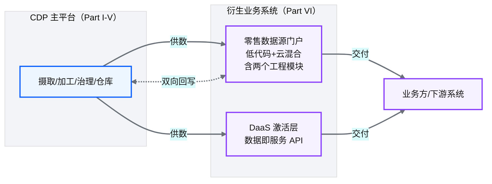
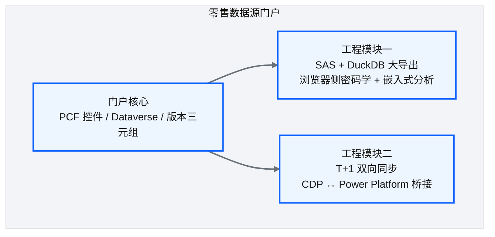
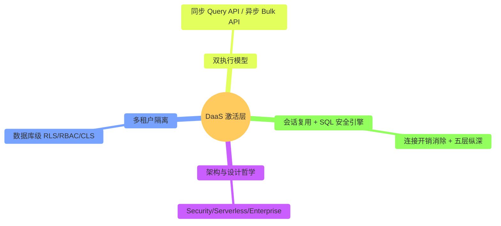
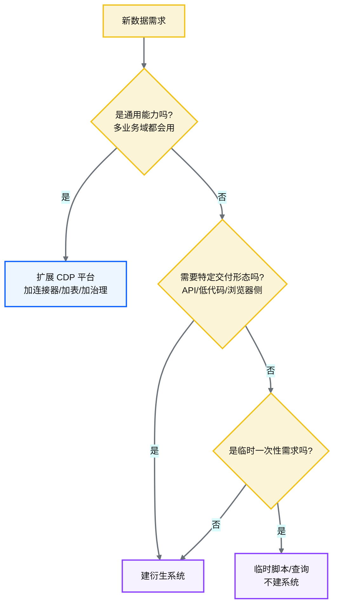

# Ch 35 衍生业务系统总领：平台的能力外延

!!! info "面包屑"
    [本书主页](./index.md) › [Part VI 衍生业务系统](./36-低代码与云混合-零售数据源门户.md) › Ch 35

!!! abstract "项目第 2-3 年 · 扩展与衍生期——平台能力外延"

---

## :material-school: 本章你将学到
- 什么是衍生业务系统，它和 CDP 主平台是什么关系
- 为什么数据平台建好后还需要衍生系统
- Part VI 两个衍生系统的定位、各自模块与共性模式

---

Part V 讲完迁移与平台演进，平台本身已经成型。但故事没结束——数据在仓库里躺着不会自动产生价值，它要流向业务系统、被业务方用起来。Part VI 就是讲这些把平台能力外延到业务侧的衍生系统。

这一篇是 Part VI 的总领，先讲清楚三个问题：什么是衍生系统、为什么需要、与主平台什么关系。

## 35.1 什么是衍生业务系统

衍生业务系统（Derived Business System）是**建在 CDP 数据平台之上、面向特定业务场景的消费侧系统**。它不是平台的一部分，是平台的用户——从平台取数、加工成业务需要的形态、交付给业务方或回写业务系统。

"衍生系统"这个概念不是我一开始就有意识定义的——是被现实需求逼出来的。平台上线一年后，零售业务团队来找我："供应商数据在平台里有，但我们想在浏览器里直接看零售销量报表，不想每次找数据团队跑 SQL。"另一个团队也来找我："下游应用需要通过 API 取数据，不想连 Redshift。"这两个需求有一个共同点：**它们都需要平台的数据，但平台不提供他们需要的交付形态**（低代码 UI / REST API）。硬塞进平台，平台就变成了什么都管的大杂烩（见 [Ch 2](./02-从需求到蓝图：一个数据平台的诞生.md) 的边界决策）。于是我定义了"衍生系统"这个概念——在平台之上建独立系统，复用平台数据和治理能力，但各自解决特定的交付问题。平台管数据能力，衍生系统管业务交付——各司其职。

**图 35-1** 什么是衍生业务系统

## 35.2 为什么需要衍生系统

平台建好了，为什么不直接让业务方连 Redshift 查询，还要再建一层衍生系统？因为平台是"通用基础设施"，而业务场景是"特定的"：

| 业务诉求 | 平台直接满足？ | 衍生系统的价值 |
|---|---|---|
| **业务方自助管理数据源 + 跨云交付零售数据**（增删供应商表、绕过下游导出限制、与业务系统双向同步） | ❌ 平台不暴露配置 UI，不解决跨云与下游工具限制 | 零售数据源门户：低代码界面管源 + 两个工程模块（SAS+DuckDB 大导出、T+1 双向同步） |
| **外部系统通过 API 安全取数** | ❌ 平台不暴露查询 API，也不解决多租户隔离 | DaaS 激活层：API Gateway + 数据库级多租户隔离 + 双执行模型 |

**表 35-1** 为什么需要衍生系统

!!! tip "引申"
    衍生系统做的事情是"激活"——把平台里就绪但静止的数据，变成业务可直接消费的形态。这对应行业里说的"反向 ETL（Reverse ETL）"或"数据激活（Data Activation）"。没有激活层的数据平台，就像建了水库但没修水管——水再多也流不到田里。Part VI 的两个系统，就是两条不同形态的水管。

    做这个决策时，我参考了企业征信的经历。企业征信时所有交付都走数仓 SQL——业务方要数据就提需求，数据团队写 SQL 跑报表。最初 3 个业务方还好，到第 10 个业务方时，数据团队变成了"SQL 工厂"——80% 的时间在跑临时查询，20% 的时间在建平台。到 Aurora 我不想重蹈覆辙——**数据团队应该建平台，不是跑报表**。衍生系统就是把跑报表的活自动化、产品化，让数据团队专注平台建设。衍生系统的投资回报是数据团队人力的释放——前期建系统花 2 个月，后续省下数据团队 80% 的临时查询时间。

## 35.3 两个衍生系统与各自的模块

Part VI 只有两个衍生系统，但每个系统内部都有值得展开的工程模块：

### 系统一：零售数据源门户（[Ch 36](./36-低代码与云混合-零售数据源门户.md)）

面向零售业务团队的低代码门户，管理上百张多供应商零售源表。它本身是"低代码 + 云混合"的产物——业务团队已在用 Microsoft 365，选 Power Platform + Azure 而非纯 AWS。门户除核心的界面管源与版本控制外，还有两个硬核工程模块：

**图 35-2** 系统一：零售数据源门户（Ch 36）

| 模块 | 解决的工程问题 |
|---|---|
| **门户核心** | 百张源表的低代码管理 + 可追溯可回滚的版本控制三元组 |
| **SAS + DuckDB 大导出** | Azure SDK 浏览器不可用 → 手写 HMAC-SHA256 SAS；Dataverse 10 万行限制 → DuckDB 谓词下推绕过 |
| **T+1 双向同步** | CDP↔PowerPlatform 跨云桥接（入向出向）+ 模板化脚本生成 + 最终一致性 trade-off |

**表 35-2** 系统一：零售数据源门户（Ch 36）

### 系统二：DaaS 激活层（[Ch 37](./37-数据即服务-DaaS激活层设计.md)）

把 Redshift 的分析能力通过 REST API 安全地暴露给下游应用——这是"数据即服务（Data as a Service）"激活层。它的设计核心不是"做一个 API"，而是**把多租户隔离下沉到数据库层（Redshift RLS/RBAC）**，并构建同步/异步双执行模型与会话复用、SQL 安全引擎等企业级能力。

**图 35-3** 系统二：DaaS 激活层（Ch 37）

两个系统的共性是：**都建在 CDP 平台之上，复用平台的治理能力（RLS/CLS/脱敏/审计），各自解决一个平台不直接覆盖的业务交付问题**。阅读时可以关注它们共同的操作模式——"从平台取数 → 按场景加工 → 安全交付"，以及各自的特殊工程难点（低代码 + 云混合、跨云同步；API 安全与多租户隔离）。

## 35.4 衍生系统 vs Data Mesh vs Data Products

"衍生系统"这个概念容易和行业热词 Data Mesh / Data Products 混淆，这里做一辨析——三者都关注"数据如何交付到消费端"，但出发点和粒度不同：

| 概念 | 核心主张 | 与本书衍生系统的关系 |
|---|---|---|
| **Data Mesh** | 去中心化：按业务域自治管理数据，每域有自己的数据产品+所有权 | 本书 CDP 是"中心化平台 + 衍生系统"，而非 Mesh 的去中心化——Aurora 规模未到需 Mesh 的程度 |
| **Data Products** | 数据即产品：有版本/SLA/文档/所有权的可发现数据资产 | 衍生系统是 Data Products 的"交付形态"——DaaS API、零售门户都是数据产品 |
| **衍生业务系统**（本书） | 面向特定业务场景的消费侧系统，解决平台不直接覆盖的交付问题 | 范围更聚焦——不涉及组织重构（Mesh），聚焦"数据如何流向业务" |

**表 35-3** 衍生系统 vs Data Mesh vs Data Products

!!! tip "引申"
    Data Mesh 是组织架构层面的主张（把数据所有权下放到域），适合超大规模企业（数千表加多独立业务线）。本书 Aurora 的规模（20000+ 表但业务域相对集中）用"中心化平台 + 衍生系统"更务实——平台统一治理，衍生系统灵活交付。如果未来 Aurora 业务域高度独立且各自有数据团队，再考虑向 Mesh 演进。规模决定架构，这里又是一例。

## 35.5 何时创建衍生系统 vs 扩展平台

一个常见决策是："新需求该做成衍生系统，还是扩展 CDP 平台本身？" 这取决于需求的"通用性"——通用需求扩展平台，特定需求建衍生系统：

**图 35-4** 何时创建衍生系统 vs 扩展平台

| 判断维度 | 扩展平台 | 建衍生系统 |
|---|---|---|
| **通用性** | 多业务域共用 | 单一业务场景 |
| **交付形态** | 数仓表/SQL 查询 | API/低代码/浏览器/同步 |
| **治理归属** | 平台团队统一治理 | 衍生系统团队治理（复用平台能力） |
| **典型例子** | 新增数据源、加事实表 | 零售门户、DaaS |

**表 35-4** 何时创建衍生系统 vs 扩展平台

!!! warning "Trade-off"
    判断错误有代价——把本该建衍生系统的需求塞进平台，会让平台臃肿、职责模糊；把本该扩展平台的需求做成衍生系统，会导致治理碎片化、数据口径不一致。原则是：**平台管通用数据能力，衍生系统管特定交付形态**。拿不准时，先问"这个需求其他业务域会不会用？"——会则平台，不会则衍生。

    我在做零售门户决策时就纠结过这个边界。零售业务团队的需求是"自助管理供应商数据源"——如果把它做成平台功能（在平台 UI 里加个数据源管理页面），所有业务域都能用，看起来更通用。但实际分析后发现：零售的数据源管理有大量零售特有的逻辑（供应商编码规则、多源合并策略、Azure 云混合），塞进平台会让平台功能变得臃肿且职责模糊。最终我选了"衍生系统"——独立建一个零售门户，复用平台的数据和治理，但 UI 和业务逻辑独立。通用不等于所有需求都要通用——有些需求天然就是特定场景的，强塞进平台反而破坏平台的纯粹性。

---

## :material-check-circle: 本章小结
- 衍生业务系统是建在 CDP 平台之上、面向特定业务场景的消费侧系统，是平台的"用户"而非一部分
- 需要衍生系统的根因：平台是通用基础设施，业务场景是特定的——自助管源+跨云交付、API 安全取数都是平台不直接覆盖的
- Part VI 两个系统：**零售数据源门户**（低代码+云混合，含 SAS+DuckDB 大导出、T+1 双向同步两个工程模块）、**DaaS 激活层**（API 激活 + 数据库级多租户隔离）。二者共享"取数→加工→安全交付"模式，复用平台治理能力

---

!!! quote "下一章"
    [Ch 36 低代码 + 云混合：零售数据源门户](./36-低代码与云混合-零售数据源门户.md) —— 先看第一个衍生系统：业务方如何通过低代码门户自助管理零售数据源，以及门户内两个硬核工程模块（SAS+DuckDB 大导出、T+1 双向同步）。
