# Ch 36 低代码 + 云混合：零售数据源门户

!!! info "面包屑"
    [本书主页](./index.md) › [Part VI 衍生业务系统](./35-衍生业务系统总领.md) › Ch 36

!!! abstract "项目第 2 年 · 扩展与迁移期——零售门户"

---

## :material-school: 本章你将学到
- 零售数据源门户的业务背景：百张零售源表的多供应商管理
- 为什么选 Power Platform + Azure 而非纯 AWS（混合云 trade-off）
- 三个 PCF 控件的产品设计与版本控制三元组
- 门户内两个硬核工程模块：浏览器侧 SAS + DuckDB 大导出、T+1 双向同步

---

## 36.1 业务背景：百张零售源表的多供应商管理

平台运行到第二年，零售业务团队提了个新需求：他们需要一个门户来管理上百张零售源表——查看数据、上传修正、追踪版本、监控质量。需求本身不复杂，但它触碰了一个敏感问题：**业务团队不熟悉 AWS，他们已经在用 Microsoft 365，有 Power Platform 许可。**

这让我面临一个架构抉择：坚持纯 AWS 路线，在 AWS 上建门户？还是承认混合云的现实，用 Power Platform + Azure 建门户，然后和 AWS CDP 做数据同步？最终我们选了后者——这个决策的 trade-off 和背后的思考，是这一章要展开的内容。

Aurora 中国区的零售数据来自多个供应商（Vendor-A/B/C/D），约 100 张源表，涵盖药店销量、O2O、电商等。业务团队需要一个**低代码门户**来管理这些数据源——查看、上传、版本追踪、质量控制。

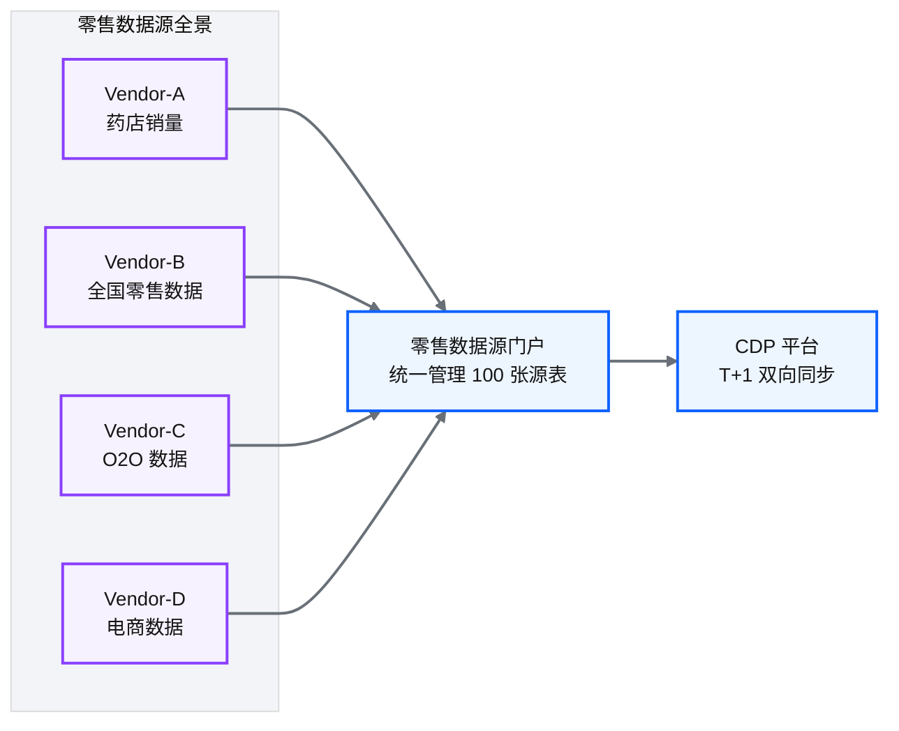

**图 36-1** 业务背景：百张零售源表的多供应商管理

### 业务痛点

| 痛点 | 说明 |
|---|---|
| 数据源分散 | 4 个供应商、100 张表，格式各异 |
| 版本管理缺失 | 改了数据不知道改了什么、何时改的 |
| 质量控制靠人工 | 业务人员 :fontawesome-solid-file-excel: Excel 比对，效率低 |
| 与 CDP 脱节 | 数据进入 CDP 后，业务看不到中间状态 |
| 导出受限 | Dataverse 单次 API 导出上限 10 万行，零售数据动辄百万行 |

**表 36-1** 业务痛点

---

## 36.2 为什么选 Power Platform + Azure 而非纯 AWS（混合云 trade-off）

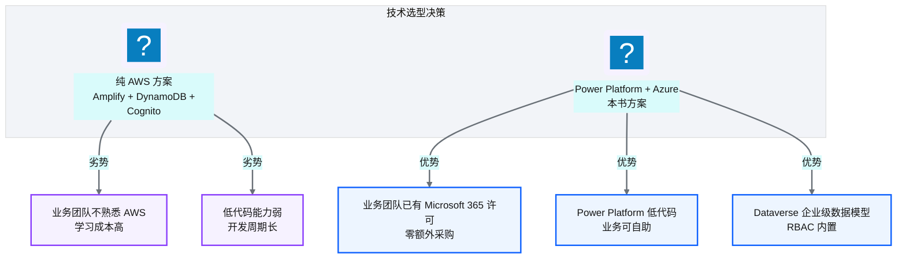

**图 36-2** 为什么选 Power Platform + Azure 而非纯 ...

!!! warning "Trade-off"
    作为一个以 AWS 为核心的数据平台，选 Power Platform + Azure 做衍生系统看起来矛盾。但这个决策的驱动力很实在——**业务团队的技术栈**。Aurora 的业务团队已经在用 Microsoft 365，有 Power Platform 许可，Power Apps 的低代码能力让业务人员可以自助操作。纯 AWS 方案开发周期更长，而且业务团队没法自助维护。

    代价是引入了跨云复杂度——AWS CDP 和 Azure Power Platform 之间需要数据同步（见 [36.6 工程模块二](#366-t1)）。但对于面向业务用户的低代码门户场景，这个 trade-off 是值得的。

---

## 36.3 产品设计：三个 PCF 控件

PCF（Power Apps Component Framework）允许用 :simple-react: React + TypeScript 开发自定义控件，嵌入 Power Apps。门户设计了三个核心控件：

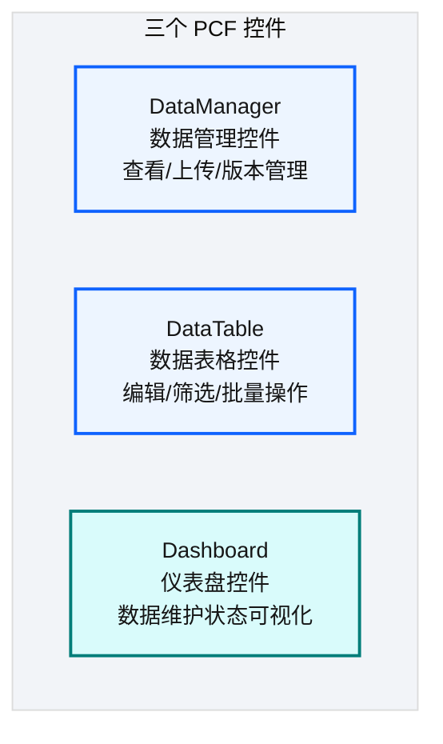

**图 36-3** 产品设计：三个 PCF 控件

| 控件 | 功能 | 技术栈 |
|---|---|---|
| **DataManager** | 数据查看、Excel 上传、版本历史、作业状态 | React + Fluent UI |
| **DataTable** | 可编辑表格、多选、筛选、上下文菜单、权限控制 | React + Fluent UI |
| **Dashboard** | 只读仪表盘、排序、分页、粘性表头 | React + 图表库 |

**表 36-2** 产品设计：三个 PCF 控件

### PCF 架构

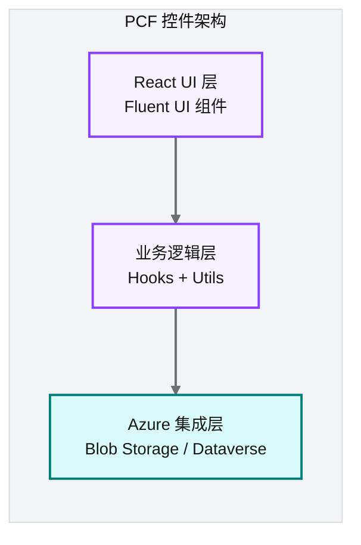

**图 36-4** PCF 架构

!!! tip "引申"
    PCF 的价值是在低代码平台中嵌入专业代码——Power Apps 的原生控件能力有限，但 PCF 允许用 React 写复杂交互。这是低代码加专业代码的混合模式：80% 用低代码配置，20% 复杂交互用 PCF 专业开发。

    三个控件的划分不是一步到位的——最初我只设计了一个万能控件（DataManager），把数据查看、上传、版本管理全塞在一起。结果代码膨胀到 3000+ 行 React，业务方每次提个小需求（"加个筛选功能""改个排序逻辑"）都要改这个大控件，改一处可能影响另一处。后来我把万能控件拆成了三个——DataManager 管数据管理流程，DataTable 管表格交互，Dashboard 管只读展示——每个控件聚焦单一职责，代码量降到 500-800 行，改一个不影响另一个。这个拆分和 [Ch 24](./24-通用Terraform模块设计.md) 的模块拆分是同一条教训——大而全的组件看起来方便，实则破坏了可维护性和组合性。

---

## 36.4 Dataverse 数据模型与版本控制三元组

### 版本控制三元组

这是门户最核心的设计——每个数据记录通过**三元组**实现版本控制：

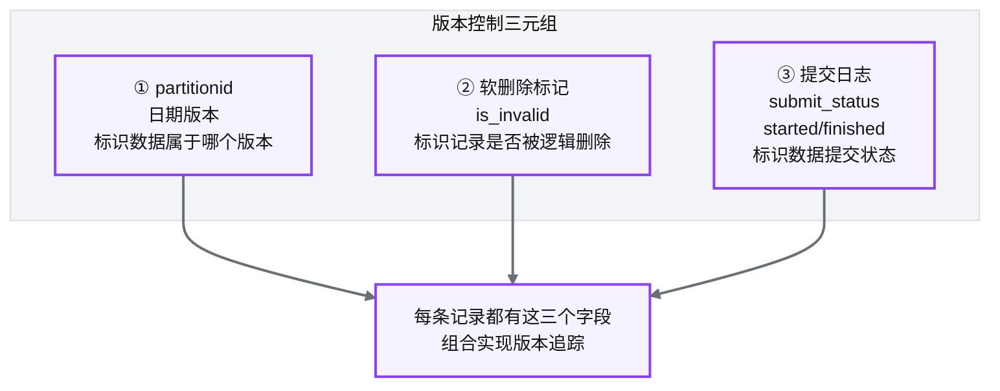

**图 36-5** 版本控制三元组

| 三元组组件 | 作用 | 举例 |
|---|---|---|
| **partitionid** | 数据版本标识（按日期） | `2026-06-18` 版本的数据 |
| **软删除标记** | 逻辑删除（非物理删除） | `is_invalid=true` 表示已删除 |
| **提交日志** | 数据提交状态追踪 | `started`→数据正在提交；`finished`→提交完成 |

**表 36-3** 版本控制三元组

### 为什么用三元组而非传统版本控制

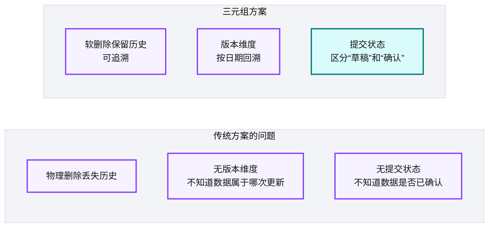

**图 36-6** 为什么用三元组而非传统版本控制

!!! warning "Trade-off"
    三元组增加了每条记录三个字段的存储开销，且查询时需要过滤 `is_invalid=false`。但对于医药零售数据，"可追溯 + 可回滚"是合规要求，这个开销是值得的。

### Dataverse 特性利用

| 特性 | 用途 |
|---|---|
| **Elastic Table** | 弹性表支持大规模数据 |
| **Change Tracking** | 变更追踪，支持增量同步（见 36.6 出向同步） |
| **RBAC** | 基于角色的访问控制，内置安全 |

**表 36-4** Dataverse 特性利用

---

## 36.5 工程模块一：浏览器侧 SAS 令牌与 DuckDB 大导出

门户核心的界面与版本控制解决了"怎么管"，但还有两个硬核工程问题：浏览器如何直连 Azure Blob 上传/下载、如何绕过 Dataverse 10 万行的导出限制。这两个问题合起来构成门户的第一个工程模块。

### 36.5.1 手写 HMAC-SHA256 SAS 令牌（Azure SDK 浏览器不可用）

**问题**：PCF 控件运行在浏览器中，需要直接访问 Azure Blob Storage 上传/下载文件。Azure SDK 依赖 Node.js 模块，**在浏览器环境中不可用**。

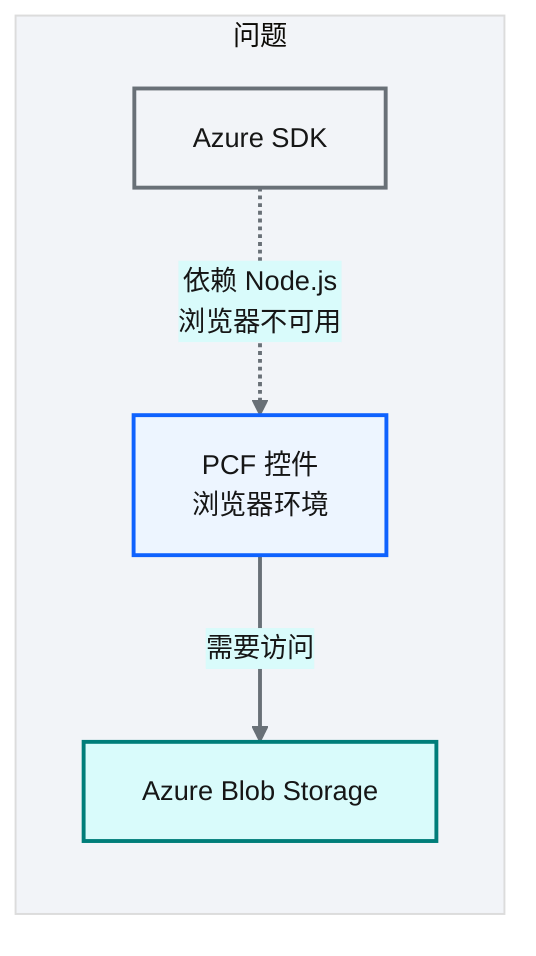

**图 36-7** 手写 HMAC-SHA256 SAS 令牌（Azure SD...

**解决方案**：Azure Blob Storage 支持 SAS（Shared Access Signature）令牌认证——一个签名 URL，持有者可在权限范围内访问资源。SAS 令牌的本质是 HMAC-SHA256 签名，可以在浏览器中用 Web Crypto API 手工实现。

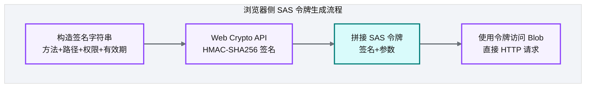

**图 36-8** 手写 HMAC-SHA256 SAS 令牌（Azure SD...

| 步骤 | 说明 |
|---|---|
| 构造签名字符串 | 按 Azure SAS 规范拼接：HTTP 方法 + 资源路径 + 权限 + 有效期 |
| HMAC-SHA256 签名 | 用 Web Crypto API 的 `crypto.subtle.sign()` 对签名字符串签名 |
| 拼接 SAS 令牌 | 将签名 Base64 编码 + 参数组合成完整 SAS URL |
| 访问 Blob | 用 SAS URL 直接 HTTP GET/PUT 访问，无需 SDK |

**表 36-5** 手写 HMAC-SHA256 SAS 令牌（Azure SDK 浏览器不可用）

!!! tip "引申"
    SAS 令牌的签名机制是标准的 HMAC-SHA256——跟 AWS Signature V4、JWT 签名原理一样。理解了 HMAC 签名是怎么回事，就能在任何语言/环境里实现。Web Crypto API 是浏览器原生加密 API，比第三方库更安全，不引入额外依赖。

!!! warning "Trade-off"
    手写 SAS 令牌的代价是需要理解 Azure SAS 签名规范——不是简单 API 调用，是密码学协议实现。但好处是零依赖、完全可控。浏览器环境下，Azure SDK 不可用时这就是正确的解法。

### 36.5.2 DuckDB 绕过 Dataverse 10 万行导出限制

**问题**：Dataverse 的 API 导出限制为 **10 万行/次**。零售数据动辄百万行，无法通过 API 直接导出。

**解决方案**：DuckDB + Synapse Link :simple-apacheparquet: Parquet

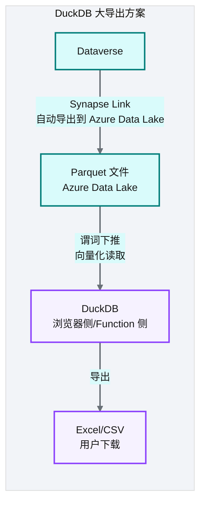

**图 36-9** DuckDB 绕过 Dataverse 10 万行导出限制

| 步骤 | 说明 |
|---|---|
| Synapse Link | Dataverse 原生功能，自动将数据导出为 Parquet 到 Azure Data Lake |
| DuckDB 读取 | DuckDB 直接读取 Parquet 文件，支持谓词下推和向量化执行 |
| 导出 | DuckDB 将结果导出为 :fontawesome-solid-file-excel: Excel/ :fontawesome-solid-file-csv: CSV 供用户下载 |

**表 36-6** DuckDB 绕过 Dataverse 10 万行导出限制

### 36.5.3 增量合并优化：LeftAnti 连接的 O(M+N) 策略

每次同步时，需要把新数据（增量）与已有数据（存量） :octicons-git-merge-16: 合并——保留增量中的新记录，丢弃已存在的旧记录。朴素的逐行比对是 O(M×N)。

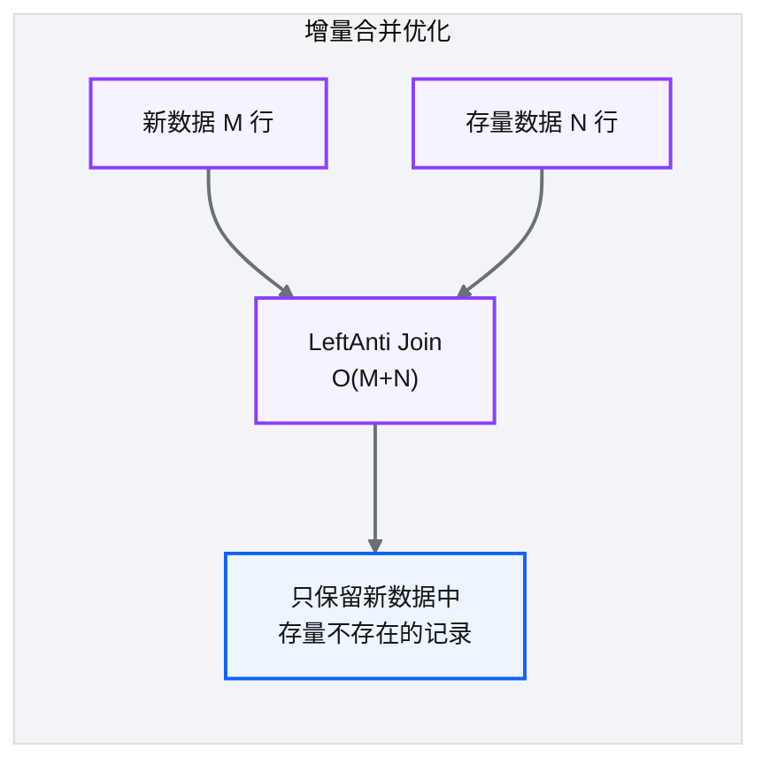

**图 36-10** 增量合并优化：LeftAnti 连接的 O(M+N) 策略

| 方案 | 复杂度 | 说明 |
|---|---|---|
| 逐行比对 | O(M×N) | 朴素方案，慢 |
| **LeftAnti Join** | **O(M+N)** | 利用哈希连接，新数据中排除存量已有的记录 |

**表 36-7** 增量合并优化：LeftAnti 连接的 O(M+N) 策略

LeftAnti Join 的语义是"返回左表中在右表没有匹配的行"——即"新数据中存量没有的记录"。利用哈希连接，复杂度从 O(M×N) 降为 O(M+N)。

!!! tip "引申"
    DuckDB 是分析领域的 SQLite——嵌入式、零部署、高性能。它的价值在于把分析数据库的能力带到任何环境：浏览器（通过 WASM）、Azure Function（进程内）、本地脚本。对于绕过 SaaS 平台导出限制这类场景，DuckDB + Parquet 是优雅的解法。

!!! warning "Trade-off"
    LeftAnti Join 需要主键可哈希——如果主键是复合格且无法高效哈希，优化效果打折。大多数有明确主键的场景下，这个优化能把合并性能提升几十倍。

---

## 36.6 工程模块二：T+1 双向同步

门户要与 AWS CDP 平台互通数据：CDP 加工好的零售数据要进门户供业务查看，门户里业务编辑/上传的数据要回写 CDP。这就是门户的第二个工程模块——跨云 T+1 双向同步。

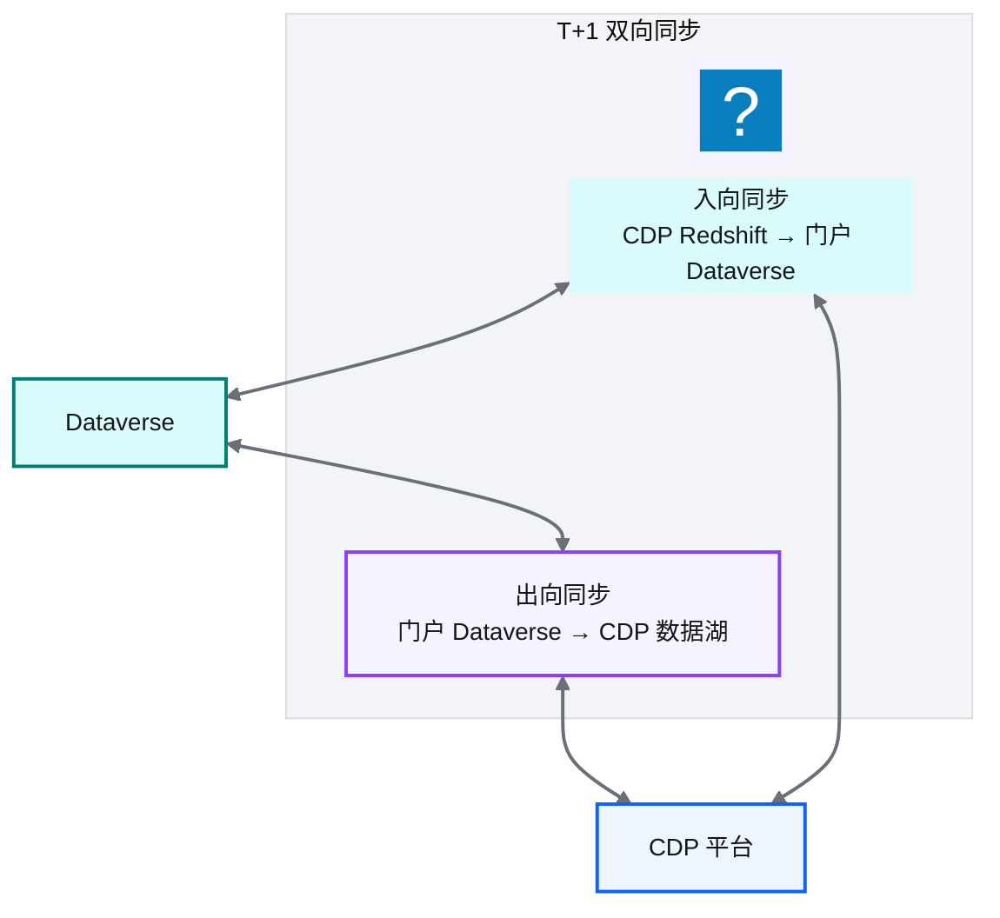

**图 36-11** 工程模块二：T+1 双向同步

### 36.6.1 入向同步：Redshift → Parquet → Azure Blob → Power Query → Dataverse

入向同步把 CDP Redshift 中加工好的零售数据同步到 Power Platform 门户，供业务用户查看。

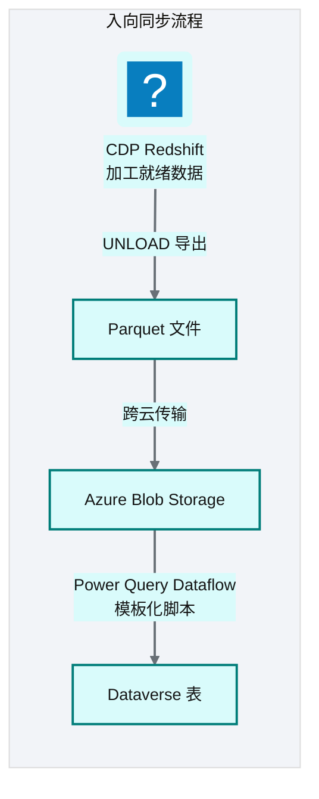

**图 36-12** 入向同步：Redshift → Parquet → Azur...

| 步骤 | 操作 | 执行者 | 频率 |
|---|---|---|---|
| ① UNLOAD | Redshift 数据导出为 Parquet | CDP Glue | T+1 每日 |
| ② 跨云传输 | Parquet 文件从 AWS S3 传到 Azure Blob | 跨云同步程序 | T+1 每日 |
| ③ Power Query | Dataflow 读取 Azure Blob 的 Parquet，写入 Dataverse | Power Platform Dataflow | T+1 每日 |
| ④ 版本标记 | Dataverse 中打上 partitionid 版本标记 | Power Query 脚本 | 随 ③ |

**表 36-8** 入向同步：Redshift → Parquet → Azure Blob → Power Query → Dataverse

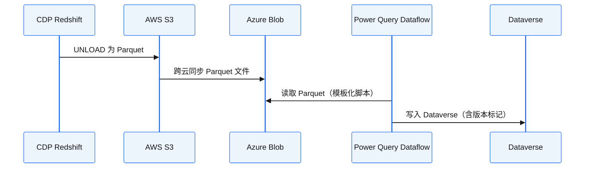

**图 36-13** 入向同步：Redshift → Parquet → Azur...

### 36.6.2 出向同步：Synapse Link → Data Lake → CDP S3/JDBC

出向同步把 Power Platform 门户中业务用户编辑/上传的数据同步回 CDP 平台。

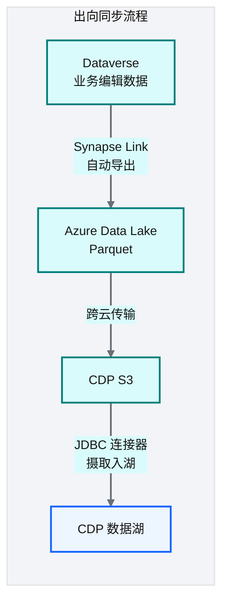

**图 36-14** 出向同步：Synapse Link → Data Lake ...

| 步骤 | 操作 | 执行者 | 频率 |
|---|---|---|---|
| ① Synapse Link | Dataverse 数据自动导出为 Parquet 到 Azure Data Lake | Dataverse 原生功能 | 近实时 |
| ② 跨云传输 | Parquet 从 Azure Data Lake 传到 CDP S3 | 跨云同步程序 | T+1 每日 |
| ③ CDP 摄取 | CDP JDBC/文件连接器摄取入湖 | CDP Glue | T+1 每日 |

**表 36-9** 出向同步：Synapse Link → Data Lake → CDP S3/JDBC

### 36.6.3 模板化 Power Query 脚本生成

100 张表的同步如果手动写 Power Query 脚本，工作量巨大且易错。平台通过**模板化生成**解决：

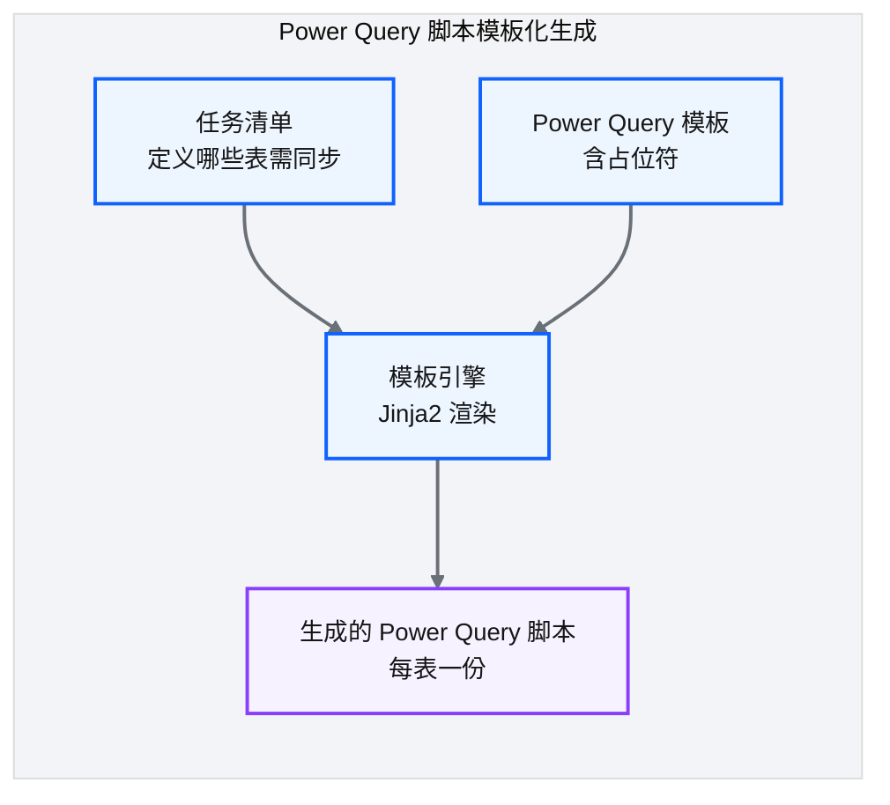

**图 36-15** 模板化 Power Query 脚本生成

| 设计要点 | 说明 |
|---|---|
| **任务清单** | 在配置中声明"哪些表、从哪个 Blob 路径、写到哪个 Dataverse 表" |
| **Jinja2 模板** | Power Query 脚本是模板，占位符由任务清单填充 |
| **批量生成** | 一次生成所有表的 Power Query 脚本 |
| **Dataflow 注册** | 生成的脚本注册为 Power Platform Dataflow，定时执行 |

**表 36-10** 模板化 Power Query 脚本生成

!!! tip "引申"
    模板化生成的本质是 DRY 原则在数据同步中的应用。100 张表的 Power Query 脚本逻辑相同（读 Parquet→写 Dataverse），差异只在表名/路径/字段映射。用模板加配置生成，比手动维护 100 份脚本可靠得多。这跟平台核心的配置驱动理念一脉相承。

### 36.6.4 跨云同步的一致性与时效性权衡

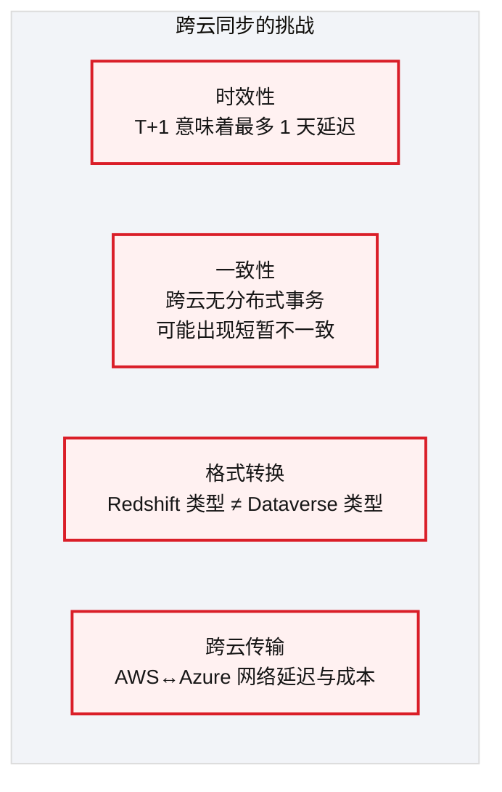

**图 36-16** 跨云同步的一致性与时效性权衡

| 挑战 | 应对策略 |
|---|---|
| **时效性** | T+1 满足零售场景（日报级别）；如需近实时可改用流式同步 |
| **一致性** | 最终一致性模型：以版本标记（partitionid）区分批次，避免新旧混读 |
| **格式转换** | 模板化脚本中做类型映射（如 Redshift TIMESTAMP → Dataverse DateTime） |
| **跨云传输** | Parquet 压缩减小传输量；定时批量传输而非实时 |

**表 36-11** 跨云同步的一致性与时效性权衡

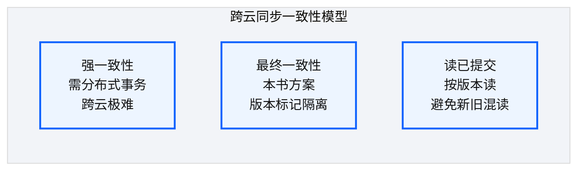

**图 36-17** 跨云同步的一致性与时效性权衡

!!! warning "Trade-off"
    T+1 同步的核心 trade-off 是"时效性 vs 复杂度"。如果要做近实时同步（分钟级），需要引入流式管道（如 :simple-apachekafka: Kafka + CDC），复杂度和成本大幅增加。零售场景下，T+1 的日报级别延迟完全可接受——业务用户看的是"昨天的数据"，不需要实时。

---

## 36.7 引申：低代码 + 云混合的边界

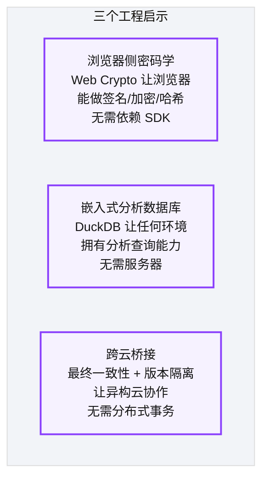

**图 36-18** 引申：低代码 + 云混合的边界

!!! tip "引申"
    SAS 手写与 DuckDB 大导出体现的是同一个工程思路——**把能力推到边缘**。传统架构中，签名和查询都需要服务器中转；Web Crypto 和 DuckDB 让浏览器/Function 直接拥有这些能力，减少了网络往返和服务端负载。T+1 双向同步则体现了跨云协作的务实做法——不强求强一致性，用版本隔离换工程简洁。

!!! warning "Trade-off"
    零售门户是低代码加云混合的典型，但这条路线有明确边界：它适合**面向业务用户的、T+1 时效可接受的、低代码可自助的场景**。一旦需要实时交互、复杂事务、或纯 AWS 技栈团队，这个 trade-off 就不划算了——那更适合走 DaaS 激活层（[Ch 37](./37-数据即服务-DaaS激活层设计.md)）这样的纯 AWS API 路线。衍生系统的形态选择，说到底就是场景决定架构。

---

## :material-check-circle: 本章小结
- 零售数据源门户：4 个供应商、100 张表，需要低代码门户做统一管理
- 选 Power Platform + Azure 而非纯 AWS：业务团队已有 M365 许可 + 低代码自助能力——代价是跨云复杂度
- 三个 PCF 控件：DataManager（管理）/ DataTable（编辑）/ Dashboard（可视化）——React + Fluent UI
- 版本控制三元组：partitionid（版本）+ 软删除标记 + 提交日志——实现可追溯、可回滚的版本管理
- **工程模块一（SAS + DuckDB 大导出）**：Web Crypto API 手写 HMAC-SHA256 SAS（零依赖）+ DuckDB 谓词下推绕过 10 万行限制 + LeftAnti Join 增量合并 O(M+N)
- **工程模块二（T+1 双向同步）**：入向（Redshift UNLOAD→Parquet→跨云→Azure Blob→Power Query→Dataverse）/ 出向（Synapse Link→Data Lake→CDP S3）+ Jinja2 模板化生成 + 最终一致性（版本标记隔离）trade-off

---

!!! quote "下一章"
    [Ch 37 数据即服务（DaaS）：激活层设计](./37-数据即服务-DaaS激活层设计.md) —— 零售门户是"低代码 + 云混合"路线；Part VI 的另一个衍生系统是"纯 AWS API"路线——DaaS 激活层，把 Redshift 的分析能力通过 REST API 安全暴露给下游，核心是把多租户隔离下沉到数据库层。
