# Ch 37 数据即服务（DaaS）：激活层设计

!!! info "面包屑"
    [本书主页](./index.md) › [Part VI 衍生业务系统](./35-衍生业务系统总领.md) › Ch 37

!!! abstract "项目第 2-3 年 · 扩展与迁移期——DaaS激活层"

---

## :material-school: 本章你将学到
- DaaS 激活层的设计哲学与分层架构
- API 框架选型：为何选 aws-lambda-powertools（而非 FastAPI+Mangum / 裸 handler）
- 运维归位：激活层如何挂靠 CDP 的 `aurora-core-platform`，而非另起一套 IaC
- 多租户隔离的关键决策：为何把隔离下沉到数据库层（Redshift RLS/RBAC）
- 同步 Query API 与异步 Bulk API 的双执行模型
- 会话复用消除 Data API 连接开销、SQL 安全引擎的五层纵深防御
- 数据激活/反向 ETL 的主流模式对比与 trade-off

---

CDP 平台的数据要供 BI，也要经 **REST API** 给下游系统。这就是 DaaS（Data as a Service）激活层。"做一个查询 API"不难；难的是多个租户共用一座 Redshift 时，怎么保证 A 永远看不到 B 的数据。本章围绕"安全暴露分析能力"讲一组架构决策：隔离下沉、双执行模型，以及 **API 框架怎么选、运维怎么挂回 CDP**。

我在第二年初版过一个 DaaS：应用层做列白名单、纯 JWT 鉴权、只支持 CSV、靠应用代码拼 `WHERE tenant_id=?`。它能跑，但每次 review 都让人不安：隔离靠自觉，漏一条就是泄露。第三年我们重构：隔离沉到数据库层，补上同步/异步双执行、会话复用、SQL 安全引擎；应用侧用 **aws-lambda-powertools**，基础设施挂靠 Part IV 已有的 CDP IaC，不另起 Terraform 栈。本章讲这套重构后的设计。

## 37.1 架构总览与设计哲学

### 三条设计原则

重构后的 DaaS 激活层建立在三条原则之上：

| 原则 | 含义 | 对应设计 |
|---|---|---|
| **Security by Design** | 租户隔离在数据库层强制，而非应用代码 | Redshift RLS/RBAC，每租户独立 `db_user` |
| **Serverless First** | 无服务器，按用量付费，自动伸缩 | Lambda + API Gateway + DynamoDB + S3 |
| **Enterprise Ready** | 合规、可审计、可运维 | 全审计 + X-Ray 链路追踪 + 五层纵深防御 |

**表 37-1** 三条设计原则

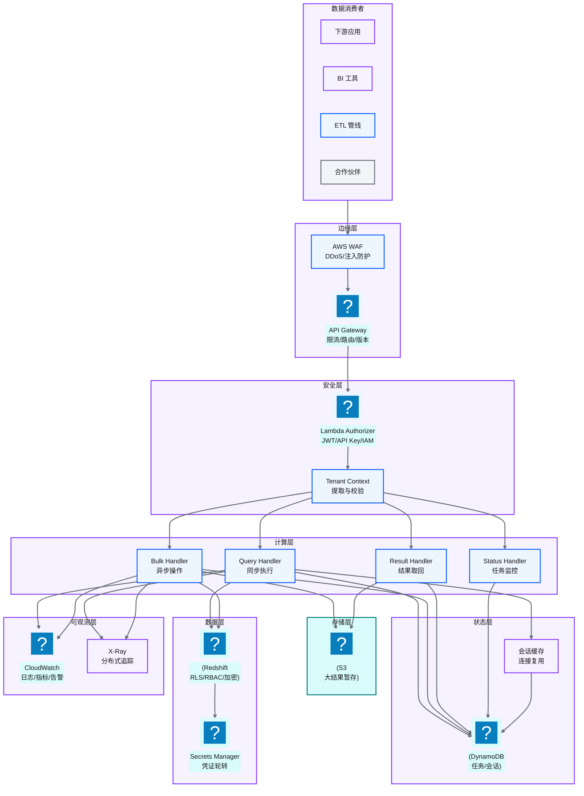
```mermaid
%%{init: {'theme':'base','themeVariables':{'primaryColor':'#edf5ff','primaryTextColor':'#161616','primaryBorderColor':'#0f62fe','lineColor':'#697077','secondaryColor':'#d9fbfb','tertiaryColor':'#f2f4f8','fontSize':'14px'}}}%%
flowchart TB
 subgraph Clients["数据消费者"]
 APP[下游应用] & BI[BI 工具] & ETL[ETL 管线] & PARTNER[合作伙伴]
 end

 subgraph Edge["边缘层"]
 WAF[AWS WAF<br/>DDoS/注入防护]
 APIGW@{ icon: "logos:aws-api-gateway", form: "rounded", label: API Gateway<br/>限流/路由/版本, pos: "b", h: 40 }
 end

 subgraph Security["安全层"]
 AUTHORIZER@{ icon: "logos:aws-lambda", form: "rounded", label: Lambda Authorizer<br/>JWT/API Key/IAM, pos: "b", h: 40 }
 CONTEXT[Tenant Context<br/>提取与校验]
 end

 subgraph Compute["计算层"]
 QUERY[Query Handler<br/>同步执行]
 BULK[Bulk Handler<br/>异步操作]
 RESULT[Result Handler<br/>结果取回]
 STATUS[Status Handler<br/>任务监控]
 end

 subgraph State["状态层"]
 DDB@{ icon: "logos:aws-dynamodb", form: "rounded", label: (DynamoDB<br/>任务/会话), pos: "b", h: 40 }
 CACHE[会话缓存<br/>连接复用]
 end

 subgraph Storage["存储层"]
 S3@{ icon: "logos:aws-s3", form: "rounded", label: (S3<br/>大结果暂存), pos: "b", h: 40 }
 end

 subgraph Data["数据层"]
 RS@{ icon: "logos:aws-redshift", form: "rounded", label: (Redshift<br/>RLS/RBAC/加密), pos: "b", h: 40 }
 SM@{ icon: "logos:aws-secrets-manager", form: "rounded", label: Secrets Manager<br/>凭证轮转, pos: "b", h: 40 }
 end

 subgraph Observe["可观测层"]
 CW@{ icon: "logos:aws-cloudwatch", form: "rounded", label: CloudWatch<br/>日志/指标/告警, pos: "b", h: 40 }
 XRAY[X-Ray<br/>分布式追踪]
 end

 Clients --> WAF --> APIGW --> AUTHORIZER --> CONTEXT
 CONTEXT --> QUERY & BULK & RESULT & STATUS
 QUERY --> DDB & RS
 BULK --> DDB & S3 & RS
 RESULT --> DDB & S3
 STATUS --> DDB
 QUERY --> CACHE --> DDB
 RS --> SM
 QUERY & BULK --> CW & XRAY
classDef bpProcess fill:#edf5ff,stroke:#0f62fe,stroke-width:2px,color:#161616
classDef bpData fill:#d9fbfb,stroke:#007d79,stroke-width:2px,color:#161616
classDef bpDecision fill:#fcf4d6,stroke:#f1c21b,stroke-width:2px,color:#161616
classDef bpSuccess fill:#defbe6,stroke:#198038,stroke-width:2px,color:#161616
classDef bpError fill:#fff1f1,stroke:#da1e28,stroke-width:2px,color:#161616
classDef bpExternal fill:#f2f4f8,stroke:#697077,stroke-width:2px,color:#161616
classDef bpInfo fill:#f6f2ff,stroke:#8a3ffc,stroke-width:2px,color:#161616
classDef bpGroup fill:#ffffff,stroke:#0f62fe,stroke-width:2px,color:#161616
class APIGW bpProcess
class APP bpInfo
class AUTHORIZER bpProcess
class BI bpInfo
class BULK bpProcess
class CACHE bpInfo
class CONTEXT bpProcess
class CW bpInfo
class Clients bpInfo
class Compute bpInfo
class DDB bpData
class Data bpInfo
class ETL bpProcess
class Edge bpInfo
class Observe bpInfo
class PARTNER bpExternal
class QUERY bpProcess
class RESULT bpProcess
class RS bpData
class S3 bpData
class SM bpData
class STATUS bpProcess
class Security bpInfo
class State bpInfo
class Storage bpData
class WAF bpProcess
class XRAY bpInfo
linkStyle default stroke:#697077,stroke-width:2px
```

**图 37-1** 三条设计原则

### 统一 Lambda 分发器

部署视角上，激活层只有 **三个 Lambda 角色**：API（HTTP 入口）、Authorizer（鉴权）、Worker（异步 Bulk）。其中 API 这一个部署里，又按路径前缀拆成四个**逻辑域**：`/v1/queries`、`/v1/bulk`、`/v1/jobs/.../results`、`/v1/jobs`。四个域共享配置、依赖与租户上下文，流量特征也相近，所以我没有做成四个独立函数。

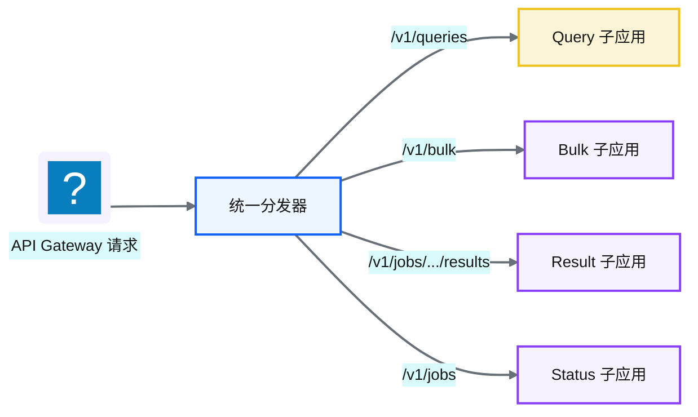
```mermaid
%%{init: {'theme':'base','themeVariables':{'primaryColor':'#edf5ff','primaryTextColor':'#161616','primaryBorderColor':'#0f62fe','lineColor':'#697077','secondaryColor':'#d9fbfb','tertiaryColor':'#f2f4f8','fontSize':'14px'}}}%%
flowchart LR
 REQ@{ icon: "logos:aws-api-gateway", form: "rounded", label: "API Gateway 请求", pos: "b", h: 40 } --> DISPATCH[统一分发器]
 DISPATCH -->|"/v1/queries"|Q[Query 子应用]
 DISPATCH -->|"/v1/bulk"|B[Bulk 子应用]
 DISPATCH -->|"/v1/jobs/.../results"|R[Result 子应用]
 DISPATCH -->|"/v1/jobs"|S[Status 子应用]
classDef bpProcess fill:#edf5ff,stroke:#0f62fe,stroke-width:2px,color:#161616
classDef bpData fill:#d9fbfb,stroke:#007d79,stroke-width:2px,color:#161616
classDef bpDecision fill:#fcf4d6,stroke:#f1c21b,stroke-width:2px,color:#161616
classDef bpSuccess fill:#defbe6,stroke:#198038,stroke-width:2px,color:#161616
classDef bpError fill:#fff1f1,stroke:#da1e28,stroke-width:2px,color:#161616
classDef bpExternal fill:#f2f4f8,stroke:#697077,stroke-width:2px,color:#161616
classDef bpInfo fill:#f6f2ff,stroke:#8a3ffc,stroke-width:2px,color:#161616
classDef bpGroup fill:#ffffff,stroke:#0f62fe,stroke-width:2px,color:#161616
class B bpInfo
class DISPATCH bpProcess
class Q bpDecision
class R bpInfo
class REQ bpInfo
class S bpInfo
linkStyle default stroke:#697077,stroke-width:2px
```

**图 37-2** 统一 Lambda 分发器

| 方案 | 优势 | 劣势 |
|---|---|---|
| **单 API Lambda 多路由**（本书） | 一次部署、共享配置/依赖、冷启动成本低 | 单一爆炸半径，需控制包体 |
| 每逻辑域一个 Lambda | 故障隔离、独立伸缩 | 多套部署与冷启动叠加 |
| Authorizer / Worker 独立 | 鉴权与长任务不堵 HTTP 路径 | 多一个部署单元（值得） |

**表 37-2** 统一 Lambda 分发器

应用代码按分层组织：`handlers/`（路由）→ `services/`（Redshift Data API、Job、Session、Export）→ `middleware/`（Tenant Context）→ `models/`（Pydantic）→ `utils/`（配置、SQL 校验、鉴权）。各域各自一个路由应用，统一入口按 path 前缀 `resolve`；做法对齐 Powertools 的 `Router` / `include_router`，只是按域拆成子应用方便单测。路径统一挂 `/v1`，给破坏性变更留版本空间。

!!! tip "引申"
    选单 API Lambda 多路由，是因为四个域共享同一套密钥、表名与租户上下文；拆成四个函数大约四倍部署与冷启动成本，这个规模下故障隔离收益不明显。YAGNI。Authorizer 与 Worker 则必须独立：前者挂在 API Gateway 前置链路，后者可能跑满异步任务窗口，不能和交互型 HTTP 抢同一生命周期。

### API 框架选型：为何是 aws-lambda-powertools

路由怎么写，是我在第三年重构时争论最多的工程决策之一。候选大致有五条路：

| 方案 | 本质 | 冷启动 / 包体 | 可观测 | 适合我们吗 |
|---|---|---|---|---|
| 裸 Lambda handler | 手写 `if path == ...` | 最轻 | 全靠自建 | 路由一多就崩 |
| Flask + Mangum | WSGI 迁到 Lambda | 偏重 | 需另接 X-Ray/指标 | 多一层适配器 |
| FastAPI + Mangum | ASGI 全功能 Web | 更重 | 生态强，但与 Lambda 脱节 | 路由面窄时杀鸡用牛刀 |
| AWS Chalice | 原生 Serverless 框架 | 中 | 可接 Powertools | 多一套框架心智 |
| **Powertools `APIGatewayRestResolver`** | Lambda 原生 Event Handler | 轻 | Logger/Tracer/Metrics 同库 | **本书选用** |

**表 37-3** API 框架候选对比

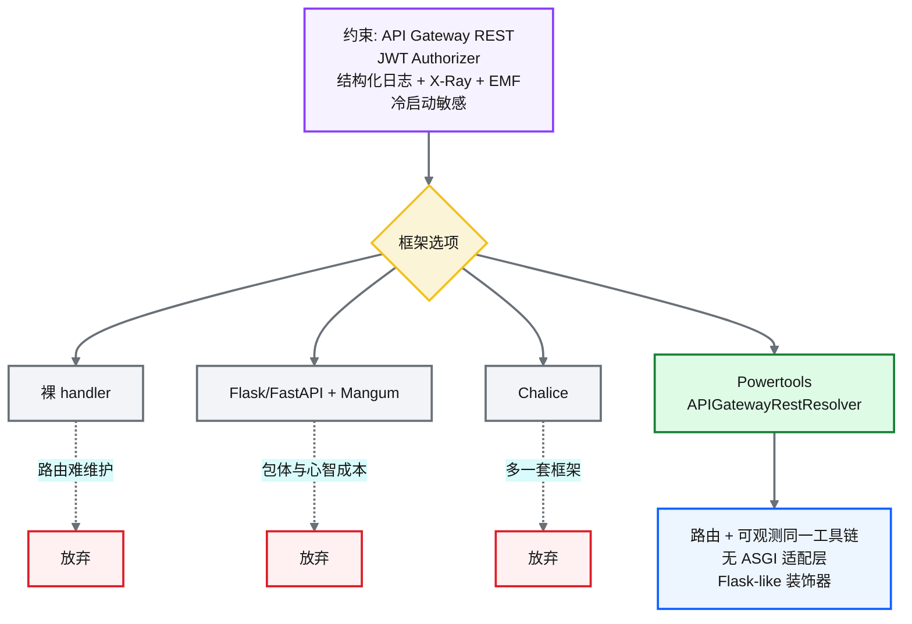
```mermaid
%%{init: {'theme':'base','themeVariables':{'primaryColor':'#edf5ff','primaryTextColor':'#161616','primaryBorderColor':'#0f62fe','lineColor':'#697077','secondaryColor':'#d9fbfb','tertiaryColor':'#f2f4f8','fontSize':'14px'}}}%%
flowchart TB
  NEED[约束: API Gateway REST<br/>JWT Authorizer<br/>结构化日志 + X-Ray + EMF<br/>冷启动敏感]
  NEED --> OPT{框架选项}
  OPT --> A[裸 handler]
  OPT --> B[Flask/FastAPI + Mangum]
  OPT --> C[Chalice]
  OPT --> D[Powertools<br/>APIGatewayRestResolver]
  D --> WHY[路由 + 可观测同一工具链<br/>无 ASGI 适配层<br/>Flask-like 装饰器]
  A -.->|路由难维护|DROP1[放弃]
  B -.->|包体与心智成本|DROP2[放弃]
  C -.->|多一套框架|DROP3[放弃]
classDef bpProcess fill:#edf5ff,stroke:#0f62fe,stroke-width:2px,color:#161616
classDef bpData fill:#d9fbfb,stroke:#007d79,stroke-width:2px,color:#161616
classDef bpDecision fill:#fcf4d6,stroke:#f1c21b,stroke-width:2px,color:#161616
classDef bpSuccess fill:#defbe6,stroke:#198038,stroke-width:2px,color:#161616
classDef bpError fill:#fff1f1,stroke:#da1e28,stroke-width:2px,color:#161616
classDef bpExternal fill:#f2f4f8,stroke:#697077,stroke-width:2px,color:#161616
classDef bpInfo fill:#f6f2ff,stroke:#8a3ffc,stroke-width:2px,color:#161616
class NEED bpInfo
class OPT bpDecision
class A bpExternal
class B bpExternal
class C bpExternal
class D bpSuccess
class WHY bpProcess
class DROP1 bpError
class DROP2 bpError
class DROP3 bpError
linkStyle default stroke:#697077,stroke-width:2px
```

**图 37-3** API 框架选型决策

Aurora 当时的约束很具体：入口是 API Gateway REST；鉴权要走 Lambda Authorizer；合规要求结构化日志、请求级 correlation id、X-Ray 与自定义指标；团队日常就是 Python Lambda，冷启动敏感；路由面很窄（queries / bulk / jobs），用不上完整 Web 框架的中间件生态。

我选 Powertools，看重的是 **路由与可观测三件套落在同一工具链**：

- `APIGatewayRestResolver`：Flask-like 的 `@app.get/post`，直接吃 API Gateway 事件，**没有 Mangum/ASGI 适配层**
- `@logger.inject_lambda_context` + `correlation_paths.API_GATEWAY_REST`：JSON 日志自动带上 request id
- `@tracer.capture_lambda_handler` / `@tracer.capture_method`：X-Ray 子段开箱即用
- `@metrics.log_metrics(capture_cold_start_metric=True)`：CloudWatch EMF 异步打点，不拖延迟

Authorizer 与 Worker 同样挂这套 Logger/Tracer/Metrics，HTTP 与非 HTTP 路径的可观测口径一致。FastAPI+Mangum 很难白送这一层。

!!! warning "Trade-off"
    Powertools Event Handler 不是完整 Web 框架：插件、中间件链、教程都不如 FastAPI。但包体更小、冷启动更短，事件模型也贴 Lambda/API Gateway。我们这种路由面窄、只想安全暴露分析能力的 DaaS，够用了。将来若要做带复杂 OAuth 回调和大量 HTML 表单的门户，我会另开服务，不硬撑 Powertools。

### 运维归位：挂靠 CDP IaC，不另起 Infra 栈

实现上，激活层的应用代码可以独立成仓（handlers / services / 测试），但 **infra 绝不另起一套 Terraform**。衍生系统若各自维护 API Gateway、DynamoDB、Secrets、IAM，凭证轮转和环境隔离立刻碎片化；Part IV 建仓分层，就是为了避免这件事。

DaaS 是跨域共享的激活能力，挂在 [Ch 21](./21-Terraform架构总览.md) 的 **`aurora-core-platform`**；经 remote state 消费 [Ch 22](./22-核心基础设施仓库设计.md) 已有的 Redshift、Secrets、IAM、VPC 与湖桶输出。应用仓只产出 zip / Layer，不拥有账号级资源的真相源。

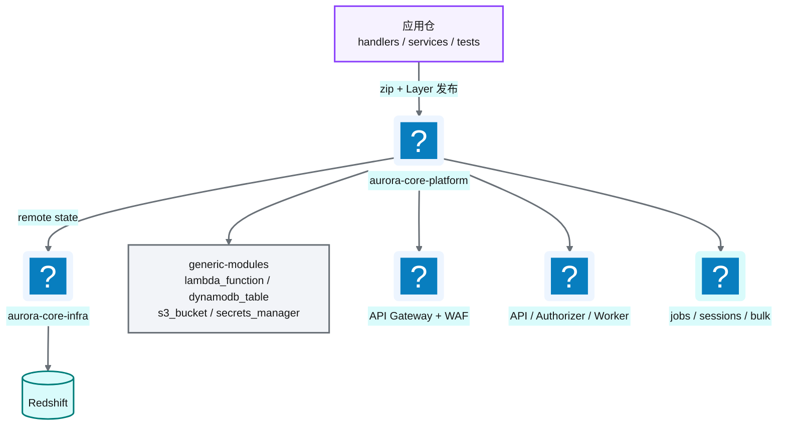
```mermaid
%%{init: {'theme':'base','themeVariables':{'primaryColor':'#edf5ff','primaryTextColor':'#161616','primaryBorderColor':'#0f62fe','lineColor':'#697077','secondaryColor':'#d9fbfb','tertiaryColor':'#f2f4f8','fontSize':'14px'}}}%%
flowchart TB
  APP[应用仓<br/>handlers / services / tests]
  CORE@{ icon: "logos:terraform", form: "rounded", label: "aurora-core-platform", pos: "b", h: 40 }
  INFRA@{ icon: "logos:terraform", form: "rounded", label: "aurora-core-infra", pos: "b", h: 40 }
  MOD[generic-modules<br/>lambda_function / dynamodb_table<br/>s3_bucket / secrets_manager]
  RS[(Redshift)]
  APP -->|zip + Layer 发布| CORE
  CORE --> MOD
  CORE -->|remote state| INFRA
  INFRA --> RS
  CORE --> APIGW@{ icon: "logos:aws-api-gateway", form: "rounded", label: "API Gateway + WAF", pos: "b", h: 40 }
  CORE --> LAPI@{ icon: "logos:aws-lambda", form: "rounded", label: "API / Authorizer / Worker", pos: "b", h: 40 }
  CORE --> DDB@{ icon: "logos:aws-dynamodb", form: "rounded", label: "jobs / sessions / bulk", pos: "b", h: 40 }
classDef bpProcess fill:#edf5ff,stroke:#0f62fe,stroke-width:2px,color:#161616
classDef bpData fill:#d9fbfb,stroke:#007d79,stroke-width:2px,color:#161616
classDef bpDecision fill:#fcf4d6,stroke:#f1c21b,stroke-width:2px,color:#161616
classDef bpSuccess fill:#defbe6,stroke:#198038,stroke-width:2px,color:#161616
classDef bpError fill:#fff1f1,stroke:#da1e28,stroke-width:2px,color:#161616
classDef bpExternal fill:#f2f4f8,stroke:#697077,stroke-width:2px,color:#161616
classDef bpInfo fill:#f6f2ff,stroke:#8a3ffc,stroke-width:2px,color:#161616
class APP bpInfo
class CORE bpProcess
class INFRA bpProcess
class MOD bpExternal
class RS bpData
class APIGW bpProcess
class LAPI bpProcess
class DDB bpData
linkStyle default stroke:#697077,stroke-width:2px
```

**图 37-4** DaaS 挂靠 CDP IaC

| 资源 | CDP 落点 | 说明 |
|---|---|---|
| API / Authorizer / Worker | [Ch 24](./24-通用Terraform模块设计.md) `lambda_function`（可选 Layer） | Layer 放 powertools / pydantic / boto3 / pyarrow；函数 zip 只含业务代码 |
| jobs / sessions / bulk 表 | `dynamodb_table` | TTL、按租户分区键在模块参数里声明 |
| 大结果桶 | `s3_bucket` | 前缀 `bulk/{tenant_id}/...`；生命周期规则清结果 |
| JWT / Redshift 凭证 | `secrets_manager` + core-infra 已有 Secret ARN | 应用只拿 ARN，不落明文 |
| API Gateway + WAF | core-platform 内编排 | 通用模块未必有独立 `api_gateway` 模块；**在 platform 仓组合即可**，不必为此 fork 一套 Terraform |
| 发布 | [Ch 28](./28-四类发布流.md) zip → S3 → update function | 与平台其它 Lambda 同一条发布流 |

**表 37-4** DaaS 资源与 CDP 模块映射

配置边界对齐 [Ch 25](./25-环境参数与tfvars模型.md)：超时、内存、表名、桶名进 tfvars；租户映射、SQL 安全等级、会话保活等运行参数进 DynamoDB / Secrets（环境变量前缀在实现里常写作激活层配置，与部署参数分离）。这样改安全等级不必跑 Terraform，改函数规格才走 IaC。

!!! warning "Trade-off"
    挂靠 core-platform 的代价是：激活层的发布节奏要服从平台仓的变更门禁，不能像独立 SaaS 那样"应用仓一推，infra 全跟着变"。但凭证轮转、账号隔离、OIDC 和审计能跟主平台一致。医药合规场景下，我宁可少一点发布自由度，也不要衍生系统各自为政。

---

## 37.2 多租户隔离：从应用层过滤到数据库级 RLS

这是整个 DaaS 设计里**最关键的架构决策**，也是重构前后差别最大的地方。上一节讲完 API 框架与 CDP 挂靠，下一层才是安全内核：隔离强制在哪一层。

### 核心问题：隔离该在哪里强制？

当多个租户共享同一座 Redshift 时，"谁能看到谁的数据"是头等安全命题。传统做法是在应用代码里给每条 SQL 拼 `WHERE tenant_id = ?`——这套做法有致命弱点：

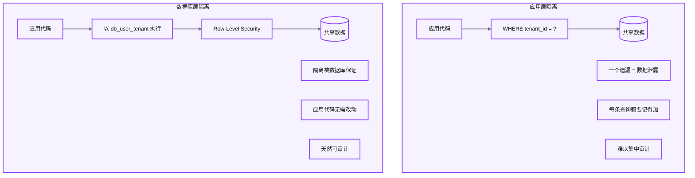
```mermaid
%%{init: {'theme':'base','themeVariables':{'primaryColor':'#edf5ff','primaryTextColor':'#161616','primaryBorderColor':'#0f62fe','lineColor':'#697077','secondaryColor':'#d9fbfb','tertiaryColor':'#f2f4f8','fontSize':'14px'}}}%%
flowchart TB
 subgraph AppLevel[" 应用层隔离"]
 APP1[应用代码] --> FILTER["WHERE tenant_id = ?"]
 FILTER --> DATA1[(共享数据)]
 RISK1[ 一个遗漏 = 数据泄露]
 RISK2[ 每条查询都要记得加]
 RISK3[ 难以集中审计]
 end

 subgraph DBLevel[" 数据库层隔离"]
 APP2[应用代码] --> USER["以 db_user_tenant 执行"]
 USER --> RLS[Row-Level Security]
 RLS --> DATA2[(共享数据)]
 SAFE1[ 隔离被数据库保证]
 SAFE2[ 应用代码无需改动]
 SAFE3[ 天然可审计]
 end
classDef bpProcess fill:#edf5ff,stroke:#0f62fe,stroke-width:2px,color:#161616
classDef bpData fill:#d9fbfb,stroke:#007d79,stroke-width:2px,color:#161616
classDef bpDecision fill:#fcf4d6,stroke:#f1c21b,stroke-width:2px,color:#161616
classDef bpSuccess fill:#defbe6,stroke:#198038,stroke-width:2px,color:#161616
classDef bpError fill:#fff1f1,stroke:#da1e28,stroke-width:2px,color:#161616
classDef bpExternal fill:#f2f4f8,stroke:#697077,stroke-width:2px,color:#161616
classDef bpInfo fill:#f6f2ff,stroke:#8a3ffc,stroke-width:2px,color:#161616
classDef bpGroup fill:#ffffff,stroke:#0f62fe,stroke-width:2px,color:#161616
class APP1 bpInfo
class APP2 bpInfo
class AppLevel bpInfo
class DATA1 bpInfo
class DATA2 bpInfo
class DBLevel bpInfo
class FILTER bpInfo
class RISK1 bpInfo
class RISK2 bpInfo
class RISK3 bpInfo
class RLS bpInfo
class SAFE1 bpInfo
class SAFE2 bpInfo
class SAFE3 bpInfo
class USER bpInfo
linkStyle default stroke:#697077,stroke-width:2px
```

**图 37-5** 核心问题：隔离该在哪里强制？

| 应用层过滤的风险 | 说明 |
|---|---|
| **开发者遗漏** | 忘了加 `tenant_id` 过滤 → 完整数据泄露 |
| **SQL 注入** | 恶意查询绕过过滤 → 跨租户访问 |
| **复杂查询漏过滤** | 多层子查询/JOIN 漏掉一处 → 部分泄露 |
| **审计困难** | 无集中强制点，难以证明"从未泄露" |
| **性能开销** | 重复的过滤逻辑 |

**表 37-5** 核心问题：隔离该在哪里强制？

!!! danger "现实影响"
    多租户系统里，**漏掉一个 `WHERE tenant_id = ?` 子句就会把一个租户的敏感数据暴露给另一个**。不是理论风险——它是多租户数据泄露最常见的根因之一。

### 数据库层隔离如何工作

重构后的方案把隔离下沉到 Redshift 原生安全能力：**每个租户映射到一个独立的数据库用户，Redshift 的 RLS 策略自动按执行用户过滤数据**。

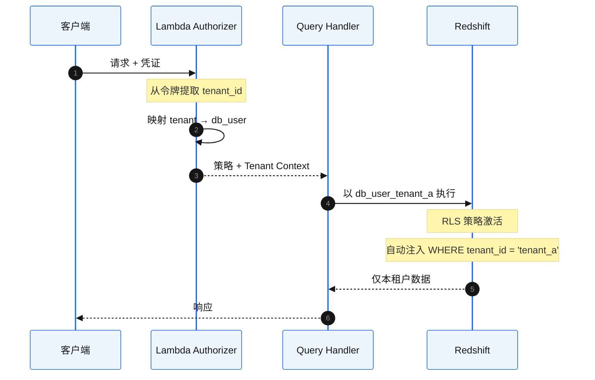
```mermaid
%%{init: {'theme':'base','themeVariables':{'primaryColor':'#edf5ff','primaryTextColor':'#161616','primaryBorderColor':'#0f62fe','lineColor':'#697077','secondaryColor':'#d9fbfb','tertiaryColor':'#f2f4f8','fontSize':'14px'}}}%%
sequenceDiagram
 autonumber
 participant C as 客户端
 participant A as Lambda Authorizer
 participant H as Query Handler
 participant RS as Redshift

 C->>A: 请求 + 凭证
 Note over A: 从令牌提取 tenant_id
 A->>A: 映射 tenant → db_user
 A-->>H: 策略 + Tenant Context

 H->>RS: 以 db_user_tenant_a 执行
 Note over RS: RLS 策略激活
 Note over RS: 自动注入 WHERE tenant_id = 'tenant_a'
 RS-->>H: 仅本租户数据
 H-->>C: 响应
```

**图 37-6** 数据库层隔离如何工作

关键点：**应用代码里没有任何 `WHERE tenant_id=?`**。同一条 SQL 对所有租户都一样，Redshift 根据执行用户自动注入过滤。访问通道是 **Redshift Data API**（`execute_statement` 带 `DbUser=`），不是 JDBC：Lambda 里不持长连接，凭证用 Secrets Manager ARN（或 Serverless Workgroup），由 Data API 代为认证。即便应用代码有 bug，租户隔离也不会破。隔离由数据库保证，不靠应用。

### Tenant Context 全程流转

每个请求在边缘层建立一个 **Tenant Context**，它贯穿整个请求生命周期，是决定"以哪个 db_user 执行查询"的唯一依据：

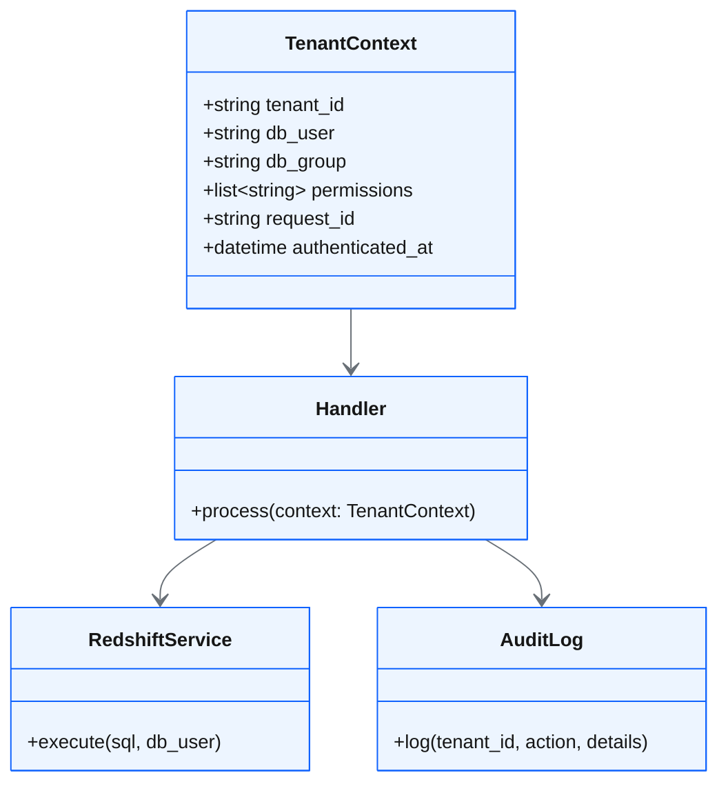
```mermaid
%%{init: {'theme':'base','themeVariables':{'primaryColor':'#edf5ff','primaryTextColor':'#161616','primaryBorderColor':'#0f62fe','lineColor':'#697077','secondaryColor':'#d9fbfb','tertiaryColor':'#f2f4f8','fontSize':'14px'}}}%%
classDiagram
 class TenantContext {
 +string tenant_id
 +string db_user
 +string db_group
 +list~string~ permissions
 +string request_id
 +datetime authenticated_at
 }
 class Handler {
 +process(context: TenantContext)
 }
 class RedshiftService {
 +execute(sql, db_user)
 }
 class AuditLog {
 +log(tenant_id, action, details)
 }
 TenantContext --> Handler
 Handler --> RedshiftService
 Handler --> AuditLog
```

**图 37-7** Tenant Context 全程流转

Tenant Context 的来源按优先级级联：① **Lambda Authorizer 的上下文声明**（首选：JWT/API Key/IAM 校验后写入 `tenant_id`、`db_user`、`db_group`、`permissions`）→ ② API Key 身份中的租户前缀 → ③ 内部请求头（仅可信内部服务与本地开发；生产必须关掉或告警）。它一旦建立，就决定了 Data API 的 `DbUser`、审计日志的租户归属、速率配额。路由函数入口先抽 Context，再谈业务；这层 middleware 比"每个 handler 自己解析 JWT"可靠得多。

### 三种租户映射模式

| 模式 | 机制 | 适用 |
|---|---|---|
| **直接映射** | `tenant-123` → `db_user_123`，RLS `tenant_id='tenant-123'` | 简单场景、边界清晰 |
| **分组角色** | 按租户层级分组（enterprise/standard/trial 角色），不同列访问 | 分层服务、不同访问级别 |
| **动态上下文** | 查询时 `SET app.tenant_id`，RLS 读会话变量 | 复杂多租户、动态开通 |

**表 37-6** 三种租户映射模式

本书采用"直接映射 + 分组角色"组合：每租户一个 `db_user_{tenant}`，归入 `tenant_readers`/`tenant_writers`/`tenant_admins` 组——RBAC 管基础对象权限，RLS 管行级隔离，CLS 管列级敏感字段。

### RBAC + RLS + CLS 三层防护

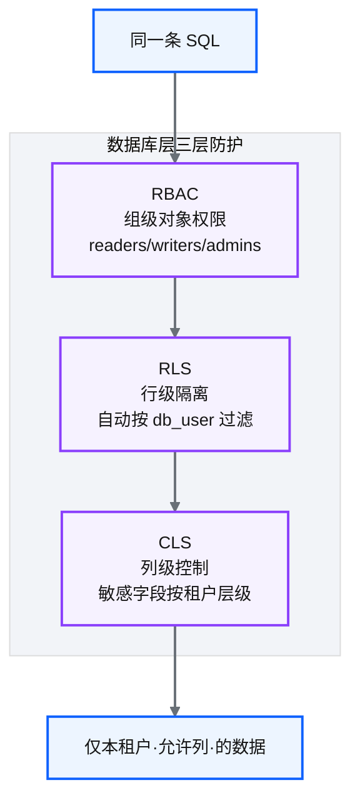
```mermaid
%%{init: {'theme':'base','themeVariables':{'primaryColor':'#edf5ff','primaryTextColor':'#161616','primaryBorderColor':'#0f62fe','lineColor':'#697077','secondaryColor':'#d9fbfb','tertiaryColor':'#f2f4f8','fontSize':'14px'}}}%%
flowchart TB
 subgraph 三层["数据库层三层防护"]
 RBAC[RBAC<br/>组级对象权限<br/>readers/writers/admins]
 RLS[RLS<br/>行级隔离<br/>自动按 db_user 过滤]
 CLS[CLS<br/>列级控制<br/>敏感字段按租户层级]
 end
 QUERY[同一条 SQL] --> RBAC --> RLS --> CLS --> RESULT[仅本租户·允许列·的数据]
classDef bpProcess fill:#edf5ff,stroke:#0f62fe,stroke-width:2px,color:#161616
classDef bpData fill:#d9fbfb,stroke:#007d79,stroke-width:2px,color:#161616
classDef bpDecision fill:#fcf4d6,stroke:#f1c21b,stroke-width:2px,color:#161616
classDef bpSuccess fill:#defbe6,stroke:#198038,stroke-width:2px,color:#161616
classDef bpError fill:#fff1f1,stroke:#da1e28,stroke-width:2px,color:#161616
classDef bpExternal fill:#f2f4f8,stroke:#697077,stroke-width:2px,color:#161616
classDef bpInfo fill:#f6f2ff,stroke:#8a3ffc,stroke-width:2px,color:#161616
classDef bpGroup fill:#ffffff,stroke:#0f62fe,stroke-width:2px,color:#161616
class CLS bpInfo
class QUERY bpProcess
class RBAC bpInfo
class RESULT bpProcess
class RLS bpInfo
linkStyle default stroke:#697077,stroke-width:2px
```

**图 37-8** RBAC + RLS + CLS 三层防护

| 层 | 防护对象 | 机制 |
|---|---|---|
| **RBAC** | 能访问哪些对象 | 组授予 SELECT/INSERT on 视图 |
| **RLS** | 能看到哪些行 | 策略 `tenant_id = current_user()` |
| **CLS** | 能看到哪些列 | 按租户层级限制 PII/成本等敏感列 |

**表 37-7** RBAC + RLS + CLS 三层防护

!!! tip "引申"
    这套 RBAC/RLS/CLS 体系与本书 [Ch 8 数据仓库设计](./08-数据仓库设计-Redshift.md)、[Ch 18 脱敏与隐私治理](./18-数据脱敏与隐私治理.md)、[Ch 50 安全合规与治理](./50-安全-合规与治理.md) 一脉相承——平台在数仓层就建好了 RLS/CLS 策略，DaaS 激活层只是复用这套治理，而非另起炉灶。这正是中心化平台加衍生系统模式的价值：衍生系统复用平台的治理能力，避免治理碎片化。

!!! warning "Trade-off"
    数据库层隔离的代价是每个租户要维护 db_user 与 RLS 策略，开通/注销都得做数据库 DDL。换来的是隔离由数据库硬性保证，对 SOC 2 / GDPR / HIPAA / ISO 27001 这类合规检查更站得住。应用层过滤省了 DDL，却把安全押在开发者自觉上——企业级场景里这笔账通常不划算。

!!! danger "绝不用超级用户连接"
    Redshift 超级用户会绕过所有 RLS 策略。DaaS 必须用专用的每租户应用用户，通过 Secrets Manager 轮转凭证，并监控超级用户访问——任何用超级用户执行租户查询的设计都是隔离漏洞。

---

## 37.3 双执行模型：同步 Query API 与异步 Bulk API

不同数据消费场景对延迟和规模的诉求差别很大：仪表盘要秒级响应、几万行；ETL 导出要跑几小时、几百万行。一套 API 模型没法同时满足。DaaS 据此设计了**同步 Query API 与异步 Bulk API 两套执行模型**。访问数仓的统一通道仍是 **Redshift Data API**（与 [Ch 32](./32-跨账号批量同步-双桶桥接架构.md) 的执行通道一致），不给下游 JDBC。

### 为什么是两套

平台有硬性限制：API Gateway 单请求约 30 秒、Lambda 最长 15 分钟，但大型分析查询可能跑数小时。单靠同步模型，长查询必然超时。解法是**把请求生命周期与查询生命周期解耦**——短查询同步返回，长查询异步提交后客户端轮询。

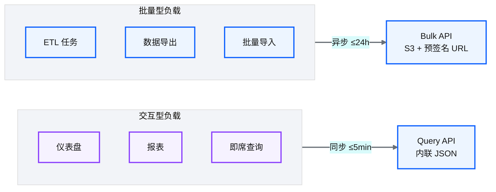
```mermaid
%%{init: {'theme':'base','themeVariables':{'primaryColor':'#edf5ff','primaryTextColor':'#161616','primaryBorderColor':'#0f62fe','lineColor':'#697077','secondaryColor':'#d9fbfb','tertiaryColor':'#f2f4f8','fontSize':'14px'}}}%%
flowchart LR
 subgraph 交互["交互型负载"]
 DASH[仪表盘] & REPORT[报表] & ADHOC[即席查询]
 end
 subgraph 批量["批量型负载"]
 ETL2[ETL 任务] & EXPORT[数据导出] & IMPORT[批量导入]
 end
 交互 -->|同步 ≤5min|QUERY[Query API<br/>内联 JSON]
 批量 -->|异步 ≤24h|BULK[Bulk API<br/>S3 + 预签名 URL]
classDef bpProcess fill:#edf5ff,stroke:#0f62fe,stroke-width:2px,color:#161616
classDef bpData fill:#d9fbfb,stroke:#007d79,stroke-width:2px,color:#161616
classDef bpDecision fill:#fcf4d6,stroke:#f1c21b,stroke-width:2px,color:#161616
classDef bpSuccess fill:#defbe6,stroke:#198038,stroke-width:2px,color:#161616
classDef bpError fill:#fff1f1,stroke:#da1e28,stroke-width:2px,color:#161616
classDef bpExternal fill:#f2f4f8,stroke:#697077,stroke-width:2px,color:#161616
classDef bpInfo fill:#f6f2ff,stroke:#8a3ffc,stroke-width:2px,color:#161616
classDef bpGroup fill:#ffffff,stroke:#0f62fe,stroke-width:2px,color:#161616
class ADHOC bpInfo
class BULK bpProcess
class DASH bpInfo
class ETL2 bpProcess
class EXPORT bpProcess
class IMPORT bpProcess
class QUERY bpProcess
class REPORT bpInfo
linkStyle default stroke:#697077,stroke-width:2px
```

**图 37-9** 为什么是两套

| 维度 | Query API | Bulk API |
|---|---|---|
| 执行模型 | 同步（≤5 min） | 异步（≤24 h） |
| 结果交付 | 内联 JSON | S3 导出 + 预签名 URL |
| 行数上限 | 阈值内（默认 1 万），超则截断 | 无上限 |
| 典型场景 | 仪表盘、即席、API 集成 | ETL、大导出、数据湖投递 |
| 写操作 | ❌ 仅 SELECT | ✅ insert/update/upsert/delete/query |

**表 37-8** 为什么是两套

### Query API：同步查询与 LIMIT+1 截断检测

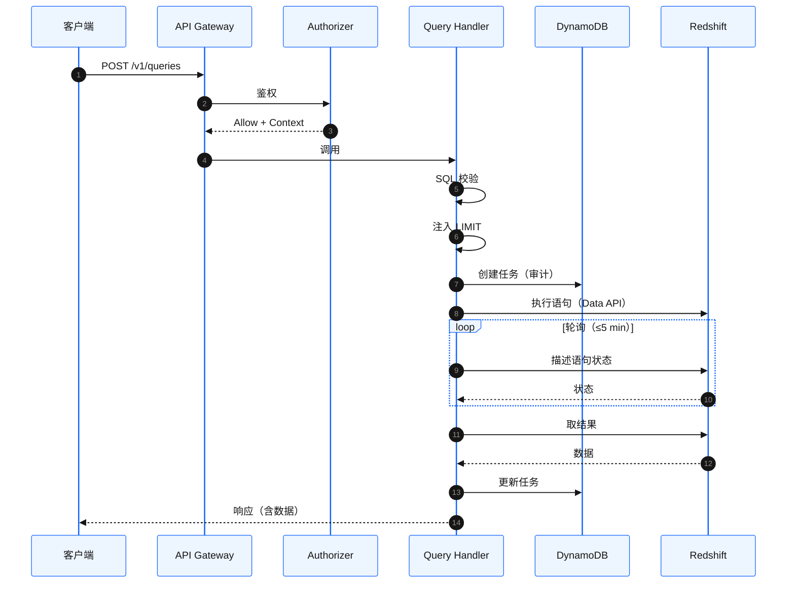
```mermaid
%%{init: {'theme':'base','themeVariables':{'primaryColor':'#edf5ff','primaryTextColor':'#161616','primaryBorderColor':'#0f62fe','lineColor':'#697077','secondaryColor':'#d9fbfb','tertiaryColor':'#f2f4f8','fontSize':'14px'}}}%%
sequenceDiagram
 autonumber
 participant C as 客户端
 participant GW as API Gateway
 participant A as Authorizer
 participant H as Query Handler
 participant D as DynamoDB
 participant RS as Redshift

 C->>GW: POST /v1/queries
 GW->>A: 鉴权
 A-->>GW: Allow + Context
 GW->>H: 调用

 H->>H: SQL 校验
 H->>H: 注入 LIMIT
 H->>D: 创建任务（审计）
 H->>RS: 执行语句（Data API）

 loop 轮询（≤5 min）
 H->>RS: 描述语句状态
 RS-->>H: 状态
 end

 H->>RS: 取结果
 RS-->>H: 数据
 H->>D: 更新任务
 H-->>C: 响应（含数据）

```

**图 37-10** Query API：同步查询与 LIMIT+1 截断检测

Query API 的几个关键设计：

1. **SQL 校验在前**（见 37.5），任何 SQL 进 Redshift 前先过校验引擎。
2. **LIMIT+1 截断检测**：若查询无 LIMIT，自动注入 `LIMIT (阈值+1)`；执行后若返回行数 > 阈值，说明结果被截断——返回阈值行并置 `truncated: true`，指引客户端改用 Bulk API。**这个技巧无需重跑查询即可判断是否截断**。
3. **Data API 轮询**：`execute_statement` → 指数退避 `describe_statement`（起始约 0.5s，封顶约 5s）→ 取结果时优先 CSV 通道（`get_statement_result_v2`），再回落 typed 结果。少一次序列化，类型精度略让步。
4. **全审计**：即使是同步查询，也落一条 DynamoDB 任务记录（租户、SQL、耗时、状态）。

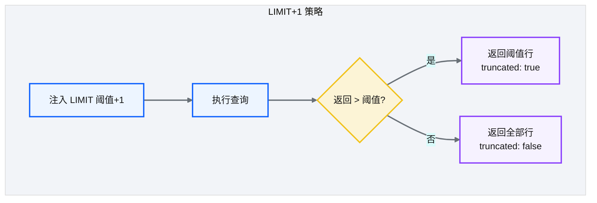
```mermaid
%%{init: {'theme':'base','themeVariables':{'primaryColor':'#edf5ff','primaryTextColor':'#161616','primaryBorderColor':'#0f62fe','lineColor':'#697077','secondaryColor':'#d9fbfb','tertiaryColor':'#f2f4f8','fontSize':'14px'}}}%%
flowchart TB
 subgraph 策略["LIMIT+1 策略"]
 INJECT[注入 LIMIT 阈值+1] --> EXEC[执行查询]
 EXEC --> CHECK{返回 > 阈值?}
 CHECK -->|是|TRUNC[返回阈值行<br/>truncated: true]
 CHECK -->|否|FULL[返回全部行<br/>truncated: false]
 end
classDef bpProcess fill:#edf5ff,stroke:#0f62fe,stroke-width:2px,color:#161616
classDef bpData fill:#d9fbfb,stroke:#007d79,stroke-width:2px,color:#161616
classDef bpDecision fill:#fcf4d6,stroke:#f1c21b,stroke-width:2px,color:#161616
classDef bpSuccess fill:#defbe6,stroke:#198038,stroke-width:2px,color:#161616
classDef bpError fill:#fff1f1,stroke:#da1e28,stroke-width:2px,color:#161616
classDef bpExternal fill:#f2f4f8,stroke:#697077,stroke-width:2px,color:#161616
classDef bpInfo fill:#f6f2ff,stroke:#8a3ffc,stroke-width:2px,color:#161616
classDef bpGroup fill:#ffffff,stroke:#0f62fe,stroke-width:2px,color:#161616
class CHECK bpDecision
class EXEC bpProcess
class FULL bpInfo
class INJECT bpProcess
class TRUNC bpInfo
linkStyle default stroke:#697077,stroke-width:2px
```

**图 37-11** Query API：同步查询与 LIMIT+1 截断检测

### Bulk API：异步状态机与 S3 交付

Bulk API 借鉴了 **Salesforce Bulk v2** 的任务化模式——这是企业集成的成熟范式，客户端开发者熟悉，且有清晰的状态语义。任务状态机：

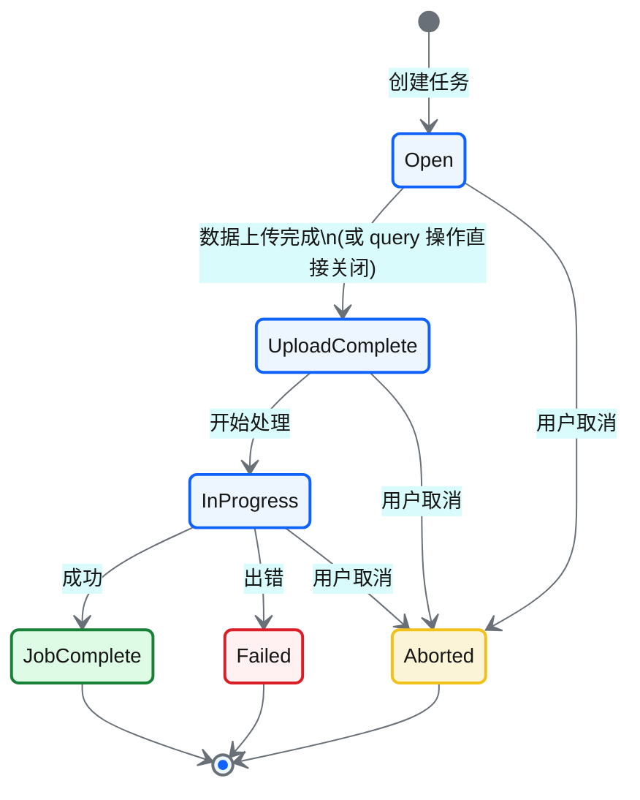
```mermaid
%%{init: {'theme':'base','themeVariables':{'primaryColor':'#edf5ff','primaryTextColor':'#161616','primaryBorderColor':'#0f62fe','lineColor':'#697077','secondaryColor':'#d9fbfb','tertiaryColor':'#f2f4f8','fontSize':'14px'}}}%%
stateDiagram-v2
    classDef bpProcess fill:#edf5ff,stroke:#0f62fe,stroke-width:2px,color:#161616
    classDef bpSuccess fill:#defbe6,stroke:#198038,stroke-width:2px,color:#161616
    classDef bpError   fill:#fff1f1,stroke:#da1e28,stroke-width:2px,color:#161616
    classDef bpDecision fill:#fcf4d6,stroke:#f1c21b,stroke-width:2px,color:#161616

    [*] --> Open: 创建任务

    Open --> UploadComplete: 数据上传完成\n(或 query 操作直接关闭)
    Open --> Aborted: 用户取消

    UploadComplete --> InProgress: 开始处理
    UploadComplete --> Aborted: 用户取消

    InProgress --> JobComplete: 成功
    InProgress --> Failed: 出错
    InProgress --> Aborted: 用户取消

    JobComplete --> [*]
    Failed --> [*]
    Aborted --> [*]

    class Open,UploadComplete,InProgress bpProcess
    class JobComplete bpSuccess
    class Failed bpError
    class Aborted bpDecision
```

**图 37-12** Bulk API：异步状态机与 S3 交付

| 状态 | 含义 | 后续 |
|---|---|---|
| `Open` | 任务已建，待上传数据（导入）或关闭（导出） | UploadComplete/Aborted |
| `UploadComplete` | 就绪待处理 | InProgress/Aborted |
| `InProgress` | 执行中 | JobComplete/Failed/Aborted |
| `JobComplete` | 成功，结果可取 | 终态 |
| `Failed` | 出错 | 终态 |
| `Aborted` | 用户取消 | 终态 |

**表 37-9** Bulk API：异步状态机与 S3 交付

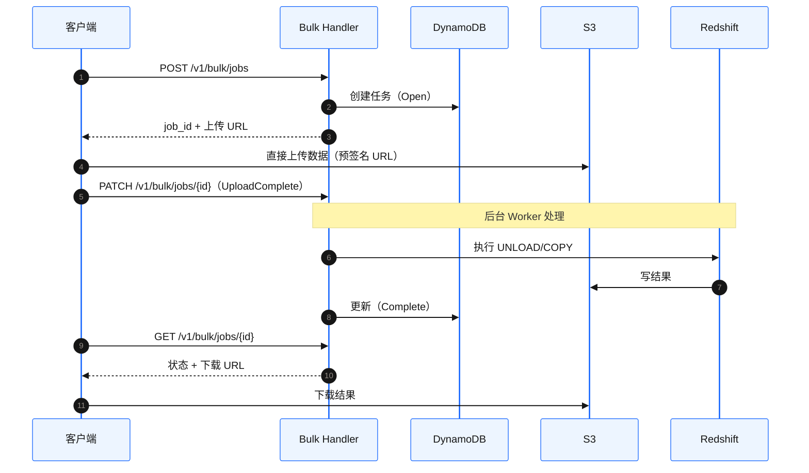
```mermaid
%%{init: {'theme':'base','themeVariables':{'primaryColor':'#edf5ff','primaryTextColor':'#161616','primaryBorderColor':'#0f62fe','lineColor':'#697077','secondaryColor':'#d9fbfb','tertiaryColor':'#f2f4f8','fontSize':'14px'}}}%%
sequenceDiagram
 autonumber
 participant C as 客户端
 participant H as Bulk Handler
 participant D as DynamoDB
 participant S as S3
 participant RS as Redshift

 C->>H: POST /v1/bulk/jobs
 H->>D: 创建任务（Open）
 H-->>C: job_id + 上传 URL

 C->>S: 直接上传数据（预签名 URL）
 C->>H: PATCH /v1/bulk/jobs/{id}（UploadComplete）

 Note over H,RS: 后台 Worker 处理
 H->>RS: 执行 UNLOAD/COPY
 RS->>S: 写结果
 H->>D: 更新（Complete）

 C->>H: GET /v1/bulk/jobs/{id}
 H-->>C: 状态 + 下载 URL
 C->>S: 下载结果

```

**图 37-13** Bulk API：异步状态机与 S3 交付

Bulk API 的关键设计：

1. **预签名 URL 直传 S3**：导入数据由客户端直接 PUT 到 S3（预签名 URL），绕过 Lambda 6MB payload 限制；导出结果也通过预签名 URL 下载，客户端无需 AWS 凭证。
2. **Worker Lambda 解耦执行**：API 路径只做任务状态机（建单、关单、查状态）；真正的 UNLOAD/COPY 由独立 **Worker**（SQS 或 DynamoDB Streams 触发）驱动。客户端断开后任务继续，才能跑满远超单次 Lambda 15 分钟的窗口。这跟 [Ch 9](./09-计算与ETL设计-Glue与Lambda.md) 的控制面/数据面分离是同一套想法：HTTP 管控制，Worker 管执行。
3. **租户分区隔离**：S3 路径按 `bulk/{tenant_id}/{job_id}/...` 分区，IAM 策略可按前缀限制，配合生命周期规则自动清理。

### 数据交付策略矩阵

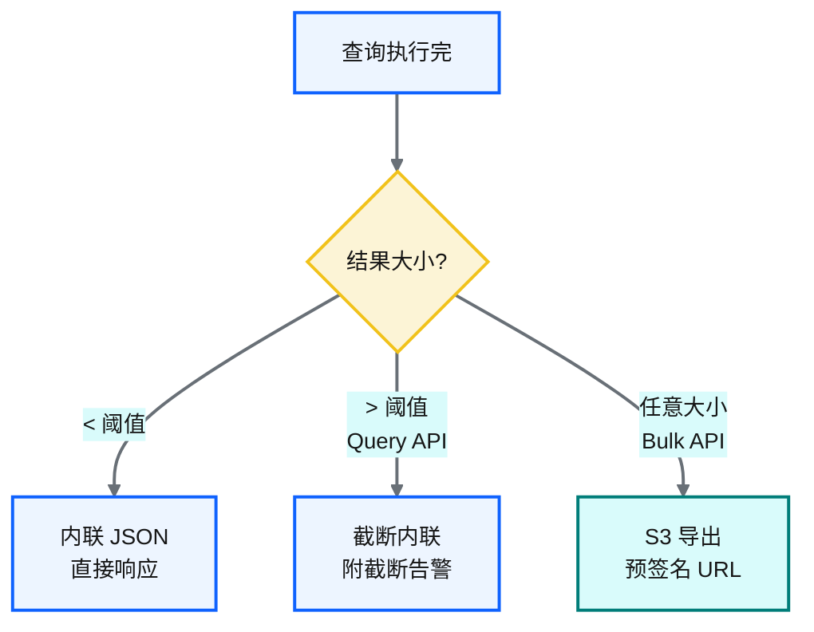
```mermaid
%%{init: {'theme':'base','themeVariables':{'primaryColor':'#edf5ff','primaryTextColor':'#161616','primaryBorderColor':'#0f62fe','lineColor':'#697077','secondaryColor':'#d9fbfb','tertiaryColor':'#f2f4f8','fontSize':'14px'}}}%%
flowchart TB
 QUERY[查询执行完] --> SIZE{结果大小?}
 SIZE -->|"< 阈值"|INLINE[内联 JSON<br/>直接响应]
 SIZE -->|"> 阈值<br/>Query API"|TRUNCATE[截断内联<br/>附截断告警]
 SIZE -->|"任意大小<br/>Bulk API"|S3[S3 导出<br/>预签名 URL]
classDef bpProcess fill:#edf5ff,stroke:#0f62fe,stroke-width:2px,color:#161616
classDef bpData fill:#d9fbfb,stroke:#007d79,stroke-width:2px,color:#161616
classDef bpDecision fill:#fcf4d6,stroke:#f1c21b,stroke-width:2px,color:#161616
classDef bpSuccess fill:#defbe6,stroke:#198038,stroke-width:2px,color:#161616
classDef bpError fill:#fff1f1,stroke:#da1e28,stroke-width:2px,color:#161616
classDef bpExternal fill:#f2f4f8,stroke:#697077,stroke-width:2px,color:#161616
classDef bpInfo fill:#f6f2ff,stroke:#8a3ffc,stroke-width:2px,color:#161616
classDef bpGroup fill:#ffffff,stroke:#0f62fe,stroke-width:2px,color:#161616
class INLINE bpProcess
class QUERY bpProcess
class S3 bpData
class SIZE bpDecision
class TRUNCATE bpProcess
linkStyle default stroke:#697077,stroke-width:2px
```

**图 37-14** 数据交付策略矩阵

| API | 小结果 | 大结果 |
|---|---|---|
| **Query API** | 内联 JSON | 截断 + 告警 |
| **Bulk API** | S3 导出 | S3 导出 |

**表 37-10** 数据交付策略矩阵

Bulk API 支持三种格式 × 多种压缩：JSON（API 友好）/ CSV（表格友好）/ :simple-apacheparquet: Parquet（分析优化，原生压缩）；压缩可选 GZIP/ZSTD。

!!! tip "引申"
    双执行模型是 Serverless 加分析数据库交互的经典模式。它本质上是把用户感知的请求时长和查询实际执行时长解耦——同步模型用 Lambda 超时兜底（5 分钟内能完成的才同步），异步模型用状态机加 S3 承载超长任务。这种解耦在 [Ch 9 计算与 ETL 设计](./09-计算与ETL设计-Glue与Lambda.md) 讨论控制面/数据面分离时也出现过——同一思想在不同层面的再现。

---

## 37.4 会话复用：Data API 连接开销的消除

选用 Data API 而不是 JDBC，Serverless 友好、`DbUser` 注入方便，代价是每次 `execute_statement` 都要建会话/认证，大约 200-500ms。交互型查询（仪表盘秒级响应）吃不消。**会话复用**就是为此：用 DynamoDB 当分布式会话表，模拟传统连接池，把连接成本摊薄。

### 问题与方案

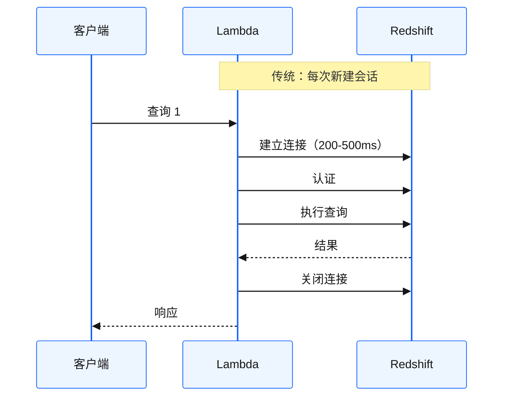
```mermaid
%%{init: {'theme':'base','themeVariables':{'primaryColor':'#edf5ff','primaryTextColor':'#161616','primaryBorderColor':'#0f62fe','lineColor':'#697077','secondaryColor':'#d9fbfb','tertiaryColor':'#f2f4f8','fontSize':'14px'}}}%%
sequenceDiagram
 participant C as 客户端
 participant L as Lambda
 participant R as Redshift

 Note over L,R: 传统：每次新建会话
 C->>L: 查询 1
 L->>R: 建立连接（200-500ms）
 L->>R: 认证
 L->>R: 执行查询
 R-->>L: 结果
 L->>R: 关闭连接
 L-->>C: 响应

```

**图 37-15** 问题与方案

会话复用的思路：**按 `(tenant_id, db_user)` 把 Data API 的 SessionId 缓存到 DynamoDB，命中则复用，miss 才建新会话**。

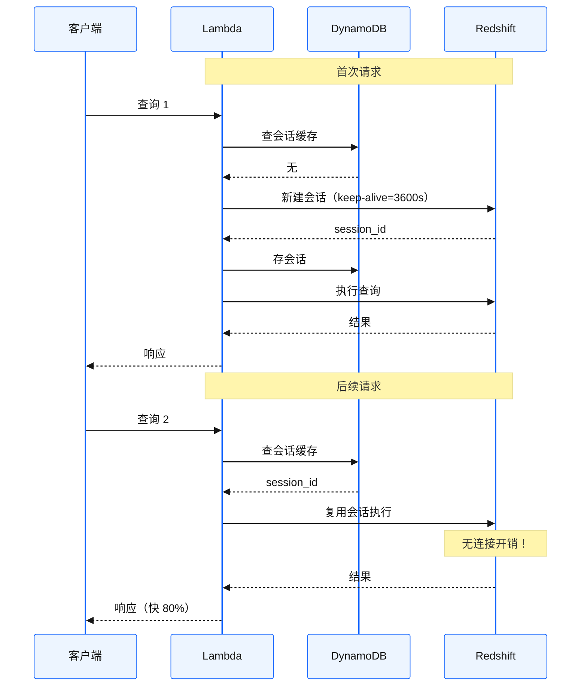
```mermaid
%%{init: {'theme':'base','themeVariables':{'primaryColor':'#edf5ff','primaryTextColor':'#161616','primaryBorderColor':'#0f62fe','lineColor':'#697077','secondaryColor':'#d9fbfb','tertiaryColor':'#f2f4f8','fontSize':'14px'}}}%%
sequenceDiagram
 participant C as 客户端
 participant L as Lambda
 participant DDB as DynamoDB
 participant R as Redshift

 Note over L,R: 首次请求
 C->>L: 查询 1
 L->>DDB: 查会话缓存
 DDB-->>L: 无
 L->>R: 新建会话（keep-alive=3600s）
 R-->>L: session_id
 L->>DDB: 存会话
 L->>R: 执行查询
 R-->>L: 结果
 L-->>C: 响应

 Note over L,R: 后续请求
 C->>L: 查询 2
 L->>DDB: 查会话缓存
 DDB-->>L: session_id
 L->>R: 复用会话执行
 Note over R: 无连接开销！
 R-->>L: 结果
 L-->>C: 响应（快 80%）

```

**图 37-16** 问题与方案

### 会话生命周期

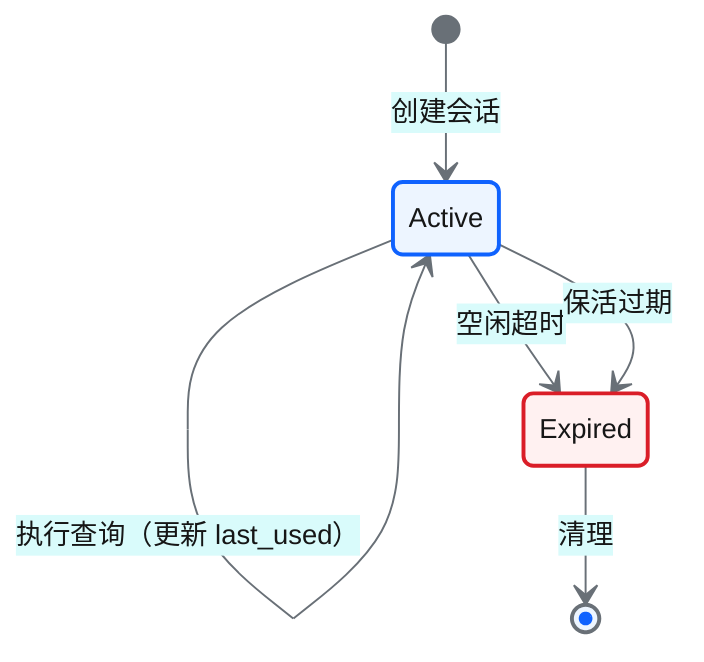
```mermaid
%%{init: {'theme':'base','themeVariables':{'primaryColor':'#edf5ff','primaryTextColor':'#161616','primaryBorderColor':'#0f62fe','lineColor':'#697077','secondaryColor':'#d9fbfb','tertiaryColor':'#f2f4f8','fontSize':'14px'}}}%%
stateDiagram-v2
    classDef bpProcess fill:#edf5ff,stroke:#0f62fe,stroke-width:2px,color:#161616
    classDef bpError   fill:#fff1f1,stroke:#da1e28,stroke-width:2px,color:#161616

    [*] --> Active: 创建会话
    Active --> Active: 执行查询（更新 last_used）
    Active --> Expired: 空闲超时
    Active --> Expired: 保活过期
    Expired --> [*]: 清理

    class Active bpProcess
    class Expired bpError
```

**图 37-17** 会话生命周期

会话记录存 DynamoDB，含 `session_id`、`tenant_id`、`db_user`、`created_at`、`last_used_at`、`expires_at`、TTL。创建时带上 Data API 的 `SessionKeepAliveSeconds`（默认约 1 小时，上限可达 24 小时），空闲超时默认约 5 分钟。超时即过期，TTL 与业务逻辑两边清。

### 容错：失效会话自动重试

会话可能因 Redshift 侧回收而失效。DaaS 在执行时捕获会话相关错误，**自动失效缓存并降级为无会话重试一次**——避免一个过期会话让查询失败：

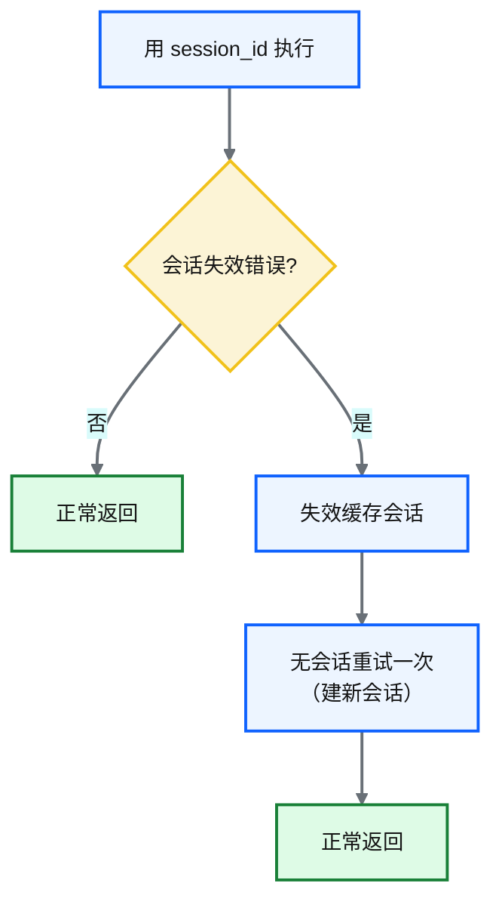
```mermaid
%%{init: {'theme':'base','themeVariables':{'primaryColor':'#edf5ff','primaryTextColor':'#161616','primaryBorderColor':'#0f62fe','lineColor':'#697077','secondaryColor':'#d9fbfb','tertiaryColor':'#f2f4f8','fontSize':'14px'}}}%%
flowchart TB
 EXEC[用 session_id 执行] --> ERR{会话失效错误?}
 ERR -->|否|OK[正常返回]
 ERR -->|是|INVALID[失效缓存会话]
 INVALID --> RETRY[无会话重试一次<br/>（建新会话）]
 RETRY --> OK2[正常返回]
classDef bpProcess fill:#edf5ff,stroke:#0f62fe,stroke-width:2px,color:#161616
classDef bpData fill:#d9fbfb,stroke:#007d79,stroke-width:2px,color:#161616
classDef bpDecision fill:#fcf4d6,stroke:#f1c21b,stroke-width:2px,color:#161616
classDef bpSuccess fill:#defbe6,stroke:#198038,stroke-width:2px,color:#161616
classDef bpError fill:#fff1f1,stroke:#da1e28,stroke-width:2px,color:#161616
classDef bpExternal fill:#f2f4f8,stroke:#697077,stroke-width:2px,color:#161616
classDef bpInfo fill:#f6f2ff,stroke:#8a3ffc,stroke-width:2px,color:#161616
classDef bpGroup fill:#ffffff,stroke:#0f62fe,stroke-width:2px,color:#161616
class ERR bpDecision
class EXEC bpProcess
class INVALID bpProcess
class OK bpSuccess
class OK2 bpSuccess
class RETRY bpProcess
linkStyle default stroke:#697077,stroke-width:2px
```

**图 37-18** 容错：失效会话自动重试

### 性能影响

| 指标 | 无会话复用 | 有会话复用 | 提升 |
|---|---|---|---|
| 连接开销 | 200-500ms | 0ms | 100% |
| 首次查询 | 500ms | 500ms | — |
| 后续查询 | 500ms | 50-100ms | 80-90% |
| 10 次查询均延迟 | 500ms | 150ms | 70% |

**表 37-11** 性能影响

!!! tip "引申"
    会话复用的本质是把昂贵的连接建立摊销到多次查询上。这和数据库连接池（如 HikariCP）思想一致，但 Data API 是无状态的 HTTP 接口，没有传统连接池，所以用 DynamoDB 当分布式会话表来模拟。监控目标是会话命中率 > 90%——命中率低说明空闲超时设得太短或查询太稀疏，需要调参。

!!! warning "Trade-off"
    会话是租户隔离的——**绝不能跨租户共享会话**，否则 `db_user` 上下文错乱会破坏 RLS。会话键必须包含 `tenant_id`。同时 Redshift 有并发会话上限，租户多了要监控会话数，必要时要缩短保活时长。

---

## 37.5 SQL 安全引擎：五层纵深防御中的查询网关

DaaS 接受用户提交的 SQL——这是最大的攻击面，安全不能只靠一层。DaaS 构建了**五层纵深防御**，SQL 校验引擎是中间承重的那层。

### 五层纵深

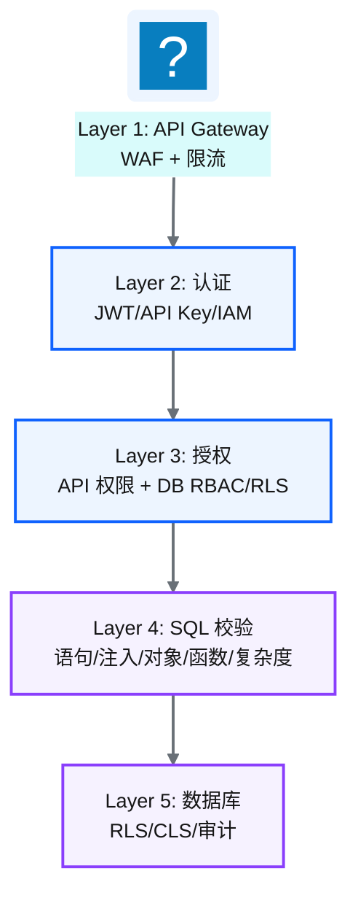
```mermaid
%%{init: {'theme':'base','themeVariables':{'primaryColor':'#edf5ff','primaryTextColor':'#161616','primaryBorderColor':'#0f62fe','lineColor':'#697077','secondaryColor':'#d9fbfb','tertiaryColor':'#f2f4f8','fontSize':'14px'}}}%%
flowchart TB
    L1@{ icon: "logos:aws-api-gateway", form: "rounded", label: "Layer 1: API Gateway<br/>WAF + 限流", pos: "b", h: 48 } --> L2["Layer 2: 认证<br/>JWT/API Key/IAM"]
    L2 --> L3["Layer 3: 授权<br/>API 权限 + DB RBAC/RLS"]
    L3 --> L4["Layer 4: SQL 校验<br/>语句/注入/对象/函数/复杂度"]
    L4 --> L5["Layer 5: 数据库<br/>RLS/CLS/审计"]

    classDef bpProcess fill:#edf5ff,stroke:#0f62fe,stroke-width:2px,color:#161616
    classDef bpInfo fill:#f6f2ff,stroke:#8a3ffc,stroke-width:2px,color:#161616

    class L1,L2,L3 bpProcess
    class L4,L5 bpInfo
    linkStyle default stroke:#697077,stroke-width:2px
```

**图 37-19** 五层纵深

| 层 | 防护 | 拦截什么 |
|---|---|---|
| **API Gateway** | WAF、限流 | DDoS、常见攻击 |
| **认证** | 令牌校验、租户提取 | 未授权访问 |
| **授权** | 权限串检查、用户映射 | 越权操作 |
| **SQL 校验** | 查询分析 | 注入、危险语句、资源滥用 |
| **数据库** | RLS/CLS/审计 | 跨租户数据访问 |

**表 37-12** 五层纵深

### SQL 校验管线

SQL 校验引擎在**查询进 Redshift 之前**运行一道完整管线：

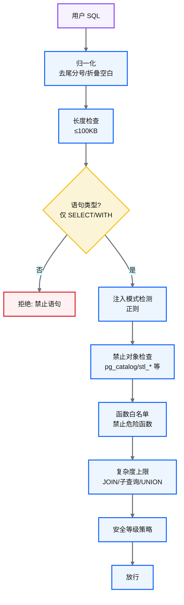
```mermaid
%%{init: {'theme':'base','themeVariables':{'primaryColor':'#edf5ff','primaryTextColor':'#161616','primaryBorderColor':'#0f62fe','lineColor':'#697077','secondaryColor':'#d9fbfb','tertiaryColor':'#f2f4f8','fontSize':'14px'}}}%%
flowchart TB
 SQL[用户 SQL] --> NORM[归一化<br/>去尾分号/折叠空白]
 NORM --> LEN[长度检查<br/>≤100KB]
 LEN --> TYPE{语句类型?<br/>仅 SELECT/WITH}
 TYPE -->|否|DENY1[拒绝: 禁止语句]
 TYPE -->|是|INJECT[注入模式检测<br/>正则]
 INJECT --> OBJ[禁止对象检查<br/>pg_catalog/stl_* 等]
 OBJ --> FUNC[函数白名单<br/>禁止危险函数]
 FUNC --> COMPLEX[复杂度上限<br/>JOIN/子查询/UNION]
 COMPLEX --> LEVEL[安全等级策略]
 LEVEL --> PASS[放行]
classDef bpProcess fill:#edf5ff,stroke:#0f62fe,stroke-width:2px,color:#161616
classDef bpData fill:#d9fbfb,stroke:#007d79,stroke-width:2px,color:#161616
classDef bpDecision fill:#fcf4d6,stroke:#f1c21b,stroke-width:2px,color:#161616
classDef bpSuccess fill:#defbe6,stroke:#198038,stroke-width:2px,color:#161616
classDef bpError fill:#fff1f1,stroke:#da1e28,stroke-width:2px,color:#161616
classDef bpExternal fill:#f2f4f8,stroke:#697077,stroke-width:2px,color:#161616
classDef bpInfo fill:#f6f2ff,stroke:#8a3ffc,stroke-width:2px,color:#161616
classDef bpGroup fill:#ffffff,stroke:#0f62fe,stroke-width:2px,color:#161616
class COMPLEX bpProcess
class DENY1 bpError
class FUNC bpProcess
class INJECT bpProcess
class LEN bpProcess
class LEVEL bpProcess
class NORM bpProcess
class OBJ bpProcess
class PASS bpProcess
class SQL bpInfo
class TYPE bpDecision
linkStyle default stroke:#697077,stroke-width:2px
```

**图 37-20** SQL 校验管线

| 校验维度 | 机制 | 拦截示例 |
|---|---|---|
| **语句类型** | 仅允许 SELECT（含 WITH…SELECT CTE）；禁止 INSERT/UPDATE/DELETE/DROP/CREATE/ALTER/TRUNCATE/GRANT/REVOKE/COPY/UNLOAD 等 | `; DROP TABLE` |
| **注入模式** | 正则检测堆叠查询、注释注入、UNION、十六进制编码、时间盲注、系统执行 | `OR 1=1 --`、`UNION SELECT`、`0x44524f50` |
| **禁止对象** | 阻断 `pg_catalog`、`information_schema`、`stl_/stv_/svl_/svv_/sys_/pg_` 系统表 | `SELECT * FROM pg_catalog.pg_user` |
| **函数白名单** | 禁止 `pg_read_file`、`pg_terminate_backend`、`lo_import` 等危险函数；放行聚合/窗口/JSON/日期函数 | 文件读取、进程终止 |
| **复杂度上限** | JOIN ≤ 10、子查询 ≤ 5、长度 ≤ 100KB、UNION 默认禁止 | 昂贵跨连接、结果集操纵 |

**表 37-13** SQL 校验管线

### 三级安全等级

```mermaid
%%{init: {'theme':'base','themeVariables':{'primaryColor':'#edf5ff','primaryTextColor':'#161616','primaryBorderColor':'#0f62fe','lineColor':'#697077','secondaryColor':'#d9fbfb','tertiaryColor':'#f2f4f8','fontSize':'14px'}}}%%
flowchart LR
 STRICT["STRICT<br/>仅 SELECT·无子查询·最小函数"] -.->|"更严"|STANDARD["STANDARD<br/>SELECT·子查询+CTE·安全函数"] -.->|"更松"|PERMISSIVE["PERMISSIVE<br/>SELECT·全部子查询/CTE·更多函数"]
classDef bpProcess fill:#edf5ff,stroke:#0f62fe,stroke-width:2px,color:#161616
classDef bpData fill:#d9fbfb,stroke:#007d79,stroke-width:2px,color:#161616
classDef bpDecision fill:#fcf4d6,stroke:#f1c21b,stroke-width:2px,color:#161616
classDef bpSuccess fill:#defbe6,stroke:#198038,stroke-width:2px,color:#161616
classDef bpError fill:#fff1f1,stroke:#da1e28,stroke-width:2px,color:#161616
classDef bpExternal fill:#f2f4f8,stroke:#697077,stroke-width:2px,color:#161616
classDef bpInfo fill:#f6f2ff,stroke:#8a3ffc,stroke-width:2px,color:#161616
classDef bpGroup fill:#ffffff,stroke:#0f62fe,stroke-width:2px,color:#161616
class PERMISSIVE bpProcess
class STANDARD bpProcess
class STRICT bpProcess
linkStyle default stroke:#697077,stroke-width:2px
```

**图 37-21** 三级安全等级

| 等级 | 适用 | 查询复杂度 |
|---|---|---|
| **strict** | 不可信外部用户 | 仅简单查询 |
| **standard**（默认） | 内部应用 | 多数分析查询 |
| **permissive** | 可信数据工程师 | 复杂分析查询 |

**表 37-14** 三级安全等级

### LIMIT+1 截断检测

37.3 已述，这里强调它与 SQL 校验的协同：校验引擎负责"SQL 安全"，LIMIT 注入负责"资源安全"——前者防注入/越权，后者防内存爆炸/资源耗尽。两者合起来是"受限灵活"的核心。

!!! tip "引申"
    本书 [Ch 44 五层 SQL 护栏与执行安全](./44-五层SQL护栏与执行安全.md)（Agentic BI 侧）也讲 SQL 护栏，但那边防的是 **LLM 生成的 SQL**，重心在语义正确与查询规划。DaaS 这边防的是 **人/外部系统提交的 SQL**，重心在注入与越权。场景不同，纵深思路一样：进入数据库的 SQL 一律不可信，不管来自人还是 AI。后来 Part VII 能较快复用"网关 + 护栏"，部分原因是 DaaS 这一年已经把"查询入口必须可审计、可拒绝"练熟了。

!!! warning "Trade-off"
    SQL 校验比只接受预定义查询模板灵活（用户能写自由 SELECT），比直接执行任意 SQL 安全（危险模式被拦）。代价是校验引擎本身要持续维护——新的注入手法、新的危险函数都要跟进。但它只是纵深防御的一层，**不替代** RLS/CLS 和参数绑定——即使校验有漏，数据库层仍兜底。

---

## 37.6 可观测性、审计与幂等

企业级 DaaS 不能"跑了就忘"：每次查询都要可追溯、可重放、可观测。§37.1 选 Powertools，好处在这一节才显出来：**路由与可观测共用同一套装饰器栈**，不用事后再补日志 SDK。

### Powertools 三件套：Logger / Tracer / Metrics

API Lambda 入口典型叠三层装饰器：`inject_lambda_context`（带上 API Gateway correlation id）→ `capture_lambda_handler`（X-Ray）→ `log_metrics(capture_cold_start_metric=True)`（EMF）。业务方法再用 `capture_method` 打子段；校验失败、查询完成等打自定义指标（如 `QueryCompleted`、`SQLValidationFailed`、`BulkJobCreated`）。

```mermaid
%%{init: {'theme':'base','themeVariables':{'primaryColor':'#edf5ff','primaryTextColor':'#161616','primaryBorderColor':'#0f62fe','lineColor':'#697077','secondaryColor':'#d9fbfb','tertiaryColor':'#f2f4f8','fontSize':'14px'}}}%%
flowchart LR
  H[Lambda handler] --> L[Logger<br/>JSON + correlation id]
  H --> T[Tracer<br/>X-Ray 子段]
  H --> M[Metrics<br/>EMF 异步打点]
  L --> CW@{ icon: "logos:aws-cloudwatch", form: "rounded", label: "CloudWatch Logs", pos: "b", h: 40 }
  T --> XR[X-Ray]
  M --> CWM@{ icon: "logos:aws-cloudwatch", form: "rounded", label: "CloudWatch Metrics", pos: "b", h: 40 }
classDef bpProcess fill:#edf5ff,stroke:#0f62fe,stroke-width:2px,color:#161616
classDef bpData fill:#d9fbfb,stroke:#007d79,stroke-width:2px,color:#161616
classDef bpInfo fill:#f6f2ff,stroke:#8a3ffc,stroke-width:2px,color:#161616
class H bpProcess
class L bpProcess
class T bpProcess
class M bpProcess
class CW bpData
class XR bpInfo
class CWM bpData
linkStyle default stroke:#697077,stroke-width:2px
```

**图 37-22** Powertools 可观测三件套

| 能力 | 做什么 | 作用 |
|---|---|---|
| **Logger** | 结构化 JSON；注入 Lambda 上下文与 API Gateway request id | 一次查询从边缘到 Data API 可串起来查 |
| **Tracer** | 自动 ColdStart/Service 注解；方法级子段 | 区分"慢在轮询"还是"慢在取结果" |
| **Metrics** | EMF 异步写自定义指标 + 冷启动指标 | 不额外同步调 CloudWatch API，少拖延迟 |

**表 37-15** Powertools 可观测落地

Authorizer 与 Worker 同样挂这套三件套。异步 Bulk 失败时，我能用同一个 service name / metrics namespace 把 HTTP 请求和后台任务对齐。这是我当初拒绝 FastAPI+Mangum 的实操理由：OpenTelemetry 当然能接，但**默认就该一体**；团队一忙，漏接几乎是必然。

### 全审计：每次查询都留痕

即使是同步查询，也落一条 DynamoDB 任务记录，含租户、SQL（归一化哈希）、耗时、状态、结果引用。再叠 Redshift 审计日志与 CloudWatch，审计链才完整，能回答"谁看了什么数据、何时看的"。GxP / PIPL 场景下，这是刚需。

### 幂等：SQL 哈希 + 幂等键

为防止客户端重试导致重复执行，DaaS 支持幂等：对 SQL 做归一化 SHA-256 哈希，配合客户端传入的幂等键，用 DynamoDB 条件写（`job_id not_exists`）保证同一幂等键只创建一个任务，重复请求返回原任务结果。

```mermaid
%%{init: {'theme':'base','themeVariables':{'primaryColor':'#edf5ff','primaryTextColor':'#161616','primaryBorderColor':'#0f62fe','lineColor':'#697077','secondaryColor':'#d9fbfb','tertiaryColor':'#f2f4f8','fontSize':'14px'}}}%%
flowchart LR
 REQ[请求含幂等键] --> HASH[SQL 归一化哈希]
 HASH --> DDB[DynamoDB 条件写]
 DDB -->|新建成功|EXEC[执行]
 DDB -->|键已存在|RETURN[返回原任务结果]
classDef bpProcess fill:#edf5ff,stroke:#0f62fe,stroke-width:2px,color:#161616
classDef bpData fill:#d9fbfb,stroke:#007d79,stroke-width:2px,color:#161616
classDef bpDecision fill:#fcf4d6,stroke:#f1c21b,stroke-width:2px,color:#161616
classDef bpSuccess fill:#defbe6,stroke:#198038,stroke-width:2px,color:#161616
classDef bpError fill:#fff1f1,stroke:#da1e28,stroke-width:2px,color:#161616
classDef bpExternal fill:#f2f4f8,stroke:#697077,stroke-width:2px,color:#161616
classDef bpInfo fill:#f6f2ff,stroke:#8a3ffc,stroke-width:2px,color:#161616
classDef bpGroup fill:#ffffff,stroke:#0f62fe,stroke-width:2px,color:#161616
class DDB bpData
class EXEC bpProcess
class HASH bpProcess
class REQ bpInfo
class RETURN bpInfo
linkStyle default stroke:#697077,stroke-width:2px
```

**图 37-23** 幂等：SQL 哈希 + 幂等键

### 租户隔离的存储与清理

- **S3 租户分区**：`bulk/{tenant_id}/{job_id}/...`，IAM 按前缀限制
- **生命周期规则**：S3 结果到期自动清理
- **DynamoDB TTL**：任务记录默认 7 天、批量任务 30 天自动删除
- **可观测**：上表 Powertools 三件套 + CloudWatch 告警（错误率、冷启动、会话命中率）

---

## 37.7 引申：数据激活/反向 ETL 主流模式对比

### 三种数据激活模式

```mermaid
%%{init: {'theme':'base','themeVariables':{'primaryColor':'#edf5ff','primaryTextColor':'#161616','primaryBorderColor':'#0f62fe','lineColor':'#697077','secondaryColor':'#d9fbfb','tertiaryColor':'#f2f4f8','fontSize':'14px'}}}%%
flowchart TB
 subgraph 模式["数据激活/反向 ETL 模式"]
 DAAS[DaaS API<br/>本书·下游主动拉]
 REV[反向 ETL<br/>Hightouch/Census·平台主动推]
 SYNC[实时同步<br/>Debezium/Flink CDC·双向实时]
 end
classDef bpProcess fill:#edf5ff,stroke:#0f62fe,stroke-width:2px,color:#161616
classDef bpData fill:#d9fbfb,stroke:#007d79,stroke-width:2px,color:#161616
classDef bpDecision fill:#fcf4d6,stroke:#f1c21b,stroke-width:2px,color:#161616
classDef bpSuccess fill:#defbe6,stroke:#198038,stroke-width:2px,color:#161616
classDef bpError fill:#fff1f1,stroke:#da1e28,stroke-width:2px,color:#161616
classDef bpExternal fill:#f2f4f8,stroke:#697077,stroke-width:2px,color:#161616
classDef bpInfo fill:#f6f2ff,stroke:#8a3ffc,stroke-width:2px,color:#161616
classDef bpGroup fill:#ffffff,stroke:#0f62fe,stroke-width:2px,color:#161616
class DAAS bpInfo
class REV bpProcess
class SYNC bpProcess
linkStyle default stroke:#697077,stroke-width:2px
```

**图 37-24** 三种数据激活模式

| 模式 | 方向 | 机制 | 延迟 | 代表产品 | 适用场景 |
|---|---|---|---|---|---|
| **DaaS API**（本书） | 下游拉 | REST API 按需查询 | 实时（查询时） | 本书方案 | 按需取数、API 集成 |
| **反向 ETL** | 平台推 | 定时把数仓数据同步到下游 SaaS | 分钟~小时 | Hightouch / Census | 定期同步到 SaaS |
| **实时同步** | 双向 | CDC/事件驱动 | 秒级 | Debezium / Flink CDC | 实时性要求高 |

**表 37-16** 三种数据激活模式

!!! tip "引申"
    反向 ETL（Reverse ETL）是近年数据领域的新概念——传统 ETL 是把数据搬进数仓，反向 ETL 是把数仓数据搬回业务系统。Hightouch 和 Census 是这一领域的代表产品。本书的 DaaS API 是拉模式的反向 ETL——下游按需来取；Hightouch 式是推模式——平台定时推送。两者各有适用场景：拉模式适合按需查询，推模式适合定期同步。

### DaaS 多租户方案对比

把视角再拉高一层，"多租户如何隔离"本身有多种实现路径：

| 方案 | 隔离强度 | 成本 | 运维 | 合规 |
|---|---|---|---|---|
| **数据库级 RLS**（本书） | 🟢 强（DB 保证） | 🟢 低（共享仓库） | 🟡 中（维护 db_user/策略） | 🟢 易审计 |
| 应用层过滤 | 🔴 弱（靠代码自觉） | 🟢 低 | 🟢 低 | 🔴 难证明 |
| 逻辑库隔离（每租户一个 schema） | 🟢 较强 | 🟡 中 | 🟡 中 | 🟢 较易 |
| 物理库隔离（每租户一个集群） | 🟢 最强 | 🔴 高 | 🔴 高 | 🟢 最易 |

**表 37-17** DaaS 多租户方案对比

```mermaid
%%{init: {'theme':'base','themeVariables':{'primaryColor':'#edf5ff','primaryTextColor':'#161616','primaryBorderColor':'#0f62fe','lineColor':'#697077','secondaryColor':'#d9fbfb','tertiaryColor':'#f2f4f8','fontSize':'14px'}}}%%
flowchart LR
 A[应用层过滤<br/>弱/省/难审] --> B[逻辑库隔离<br/>较强/中/中]
 B --> C[数据库级 RLS<br/>强/省/易审<br/>本书]
 C --> D[物理库隔离<br/>最强/贵/繁]
 A -.对比.-> C
classDef bpProcess fill:#edf5ff,stroke:#0f62fe,stroke-width:2px,color:#161616
classDef bpData fill:#d9fbfb,stroke:#007d79,stroke-width:2px,color:#161616
classDef bpDecision fill:#fcf4d6,stroke:#f1c21b,stroke-width:2px,color:#161616
classDef bpSuccess fill:#defbe6,stroke:#198038,stroke-width:2px,color:#161616
classDef bpError fill:#fff1f1,stroke:#da1e28,stroke-width:2px,color:#161616
classDef bpExternal fill:#f2f4f8,stroke:#697077,stroke-width:2px,color:#161616
classDef bpInfo fill:#f6f2ff,stroke:#8a3ffc,stroke-width:2px,color:#161616
classDef bpGroup fill:#ffffff,stroke:#0f62fe,stroke-width:2px,color:#161616
class A bpInfo
class B bpInfo
class C bpInfo
class D bpInfo
linkStyle default stroke:#697077,stroke-width:2px
```

**图 37-25** DaaS 多租户方案对比

本书选"数据库级 RLS"是因为 Aurora 规模（20000+ 表、多租户但共享分析负载）下，它在"隔离强度/成本/合规"上取得最佳平衡：共享仓库省成本，RLS 保证隔离，审计天然可查。物理库隔离只在超大租户或强监管隔离要求时才值得。

### 为何不直接暴露 Redshift 连接（JDBC / 驱动）

常有人问："既然都是查 Redshift，为什么不直接给下游 JDBC 连接？" 三个原因：

1. **JDBC 长连接与 Serverless 不合拍**：Data API 异步无状态，适配 Lambda；JDBC 是长连接，冷启动与超时是噩梦。平台内部 ETL 优先 Data API，也是同一理由。
2. **安全收敛**：直接暴露 JDBC 等于把数据库凭证和 SQL 权限下放，没法做 SQL 校验、限流、审计收敛。DaaS 把所有访问收束到一个 API 边界，安全可控。
3. **多租户治理**：直接 JDBC 没法做按租户自动切 `db_user` 加 RLS，DaaS 的 Tenant Context 流转是治理的载体。

!!! warning "Trade-off"
    DaaS API 的受限灵活是有代价的——下游不能写任意 DDL/DML，只能 SELECT（Query）或受控的批量写（Bulk）。对需要深度数据库操作的场景，DaaS 不合适，那应走平台内部的 ETL 通道。DaaS 定位是安全的只读/受控写数据供应，不是数据库代理。

---

## :material-check-circle: 本章小结
- **设计哲学**：Security by Design（隔离下沉数据库）/ Serverless First / Enterprise Ready；单 API Lambda 多路由 + 独立 Authorizer/Worker
- **API 框架**：选用 **aws-lambda-powertools**（`APIGatewayRestResolver` + Logger/Tracer/Metrics）；相对 FastAPI+Mangum，冷启动更轻，可观测原生；路由面窄时够用
- **运维归位**：应用可独立仓，**infra 挂靠 `aurora-core-platform`**，复用 `lambda_function` / DynamoDB / S3 / Secrets 与 Ch 28 发布流，不另起 IaC
- **多租户隔离**：从应用层 `WHERE tenant_id=?` 下沉到数据库级 RLS；每租户 `db_user_{tenant}` + Data API `DbUser`；Tenant Context 级联；RBAC+RLS+CLS。**即使应用有 bug，隔离也不被破坏**
- **双执行模型**：同步 Query（Data API、LIMIT+1）/ 异步 Bulk（Salesforce Bulk v2 状态机、预签名 URL、Worker 解耦）
- **会话复用**：按 `(tenant_id, db_user)` 缓存 SessionId，后续查询降延迟 80-90%，失效自动重试
- **SQL 安全引擎**：五层纵深中的查询网关 + 三级安全等级；与 Ch 44（LLM SQL）场景不同、思想同源
- **可观测与幂等**：Powertools 三件套落地 + 全审计 + SQL 哈希幂等 + S3 租户分区 + DDB TTL
- **主流对比**：激活三模式（拉/推/CDC）；多租户四方案，本书选 RLS 取得强度-成本-合规平衡

---

!!! quote "下一部分"
    [Part VII Data + AI 转型：从数据平台到 Agentic BI](./38-时代命题-AI-Ready数据供应.md) —— 衍生系统讲完了，数据已经能"激活"到业务侧。但新的瓶颈出现了：数据统一了、API 有了，业务方却不会写 SQL。接下来进入全书的高潮：Data + AI 转型，从数据平台走向 Agentic BI。
