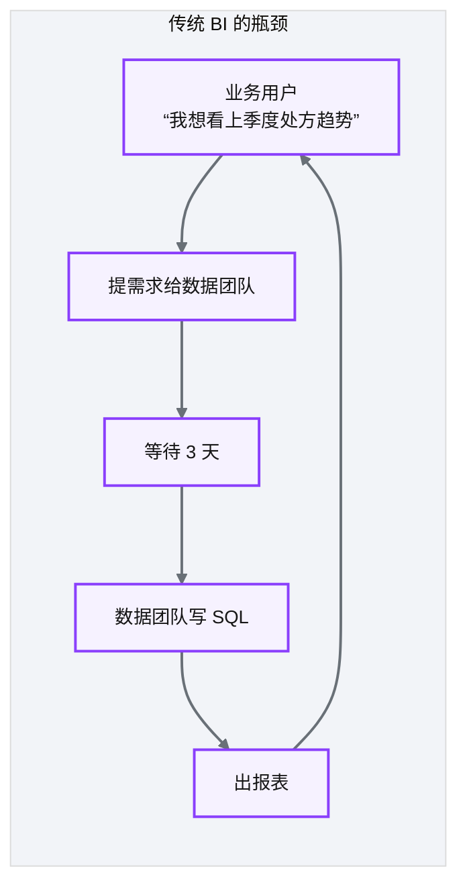
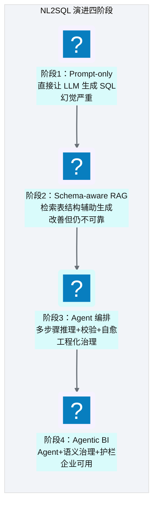
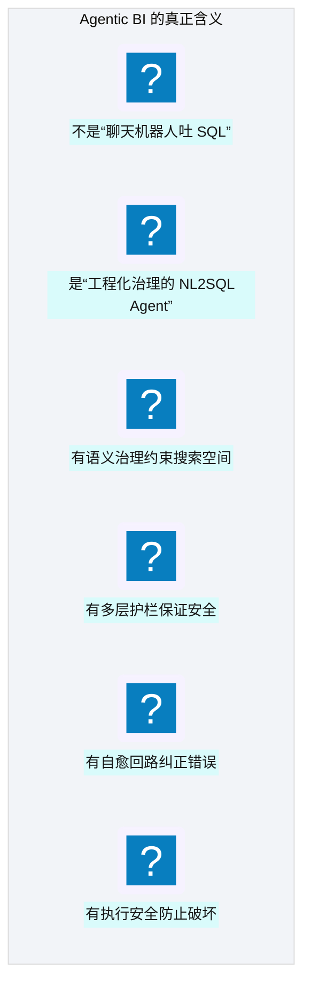
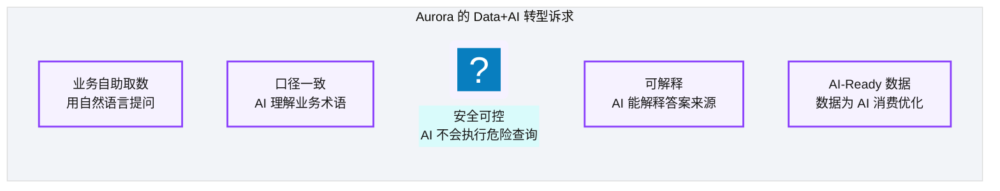
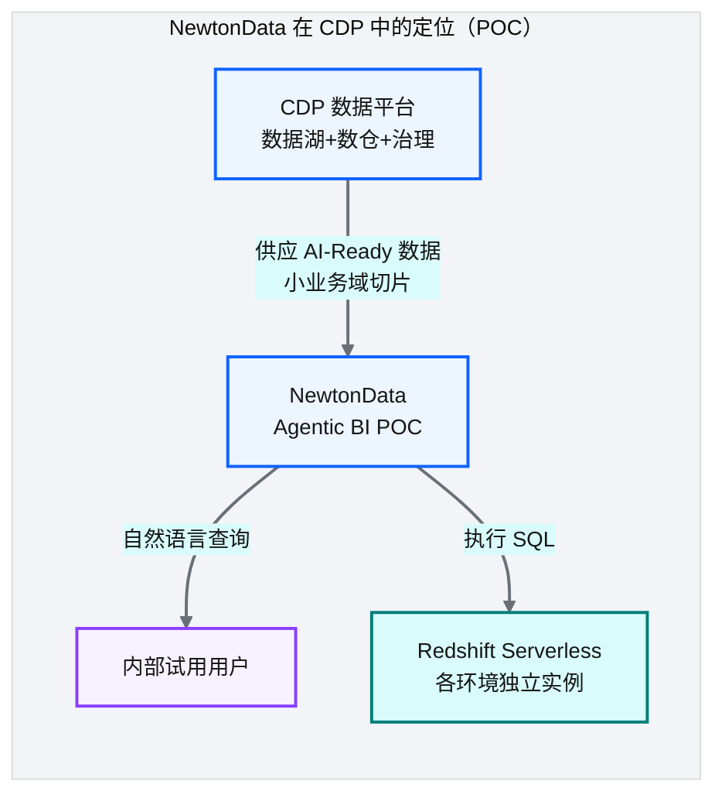
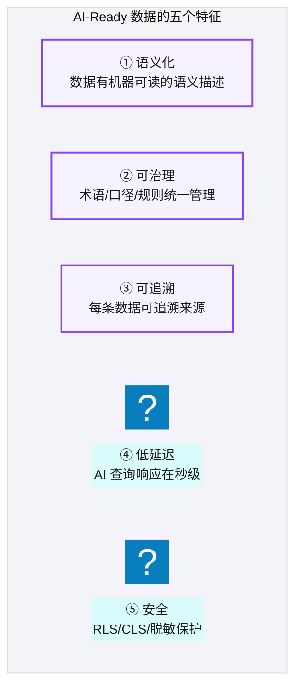
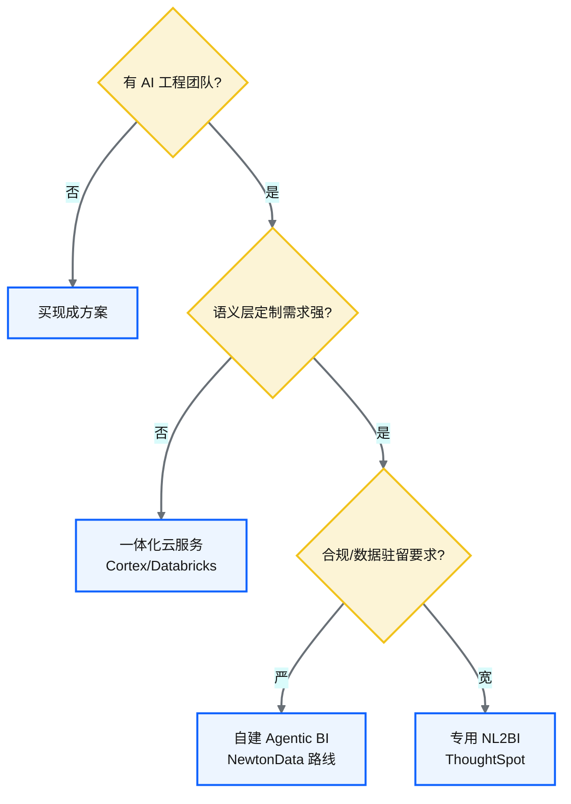

# Ch 38 时代命题：AI-Ready 数据供应

!!! info "面包屑"
    [本书主页](./index.md) › [Part VII Data+AI 转型](./37-数据即服务-DaaS激活层设计.md) › Ch 38

!!! abstract "项目第 4 年 · Data+AI 转型期——方向探索与 POC 验证"

---

## :material-school: 本章你将学到
- 为什么纯数据平台不够了：BI 自助化的瓶颈（含量化证据：被阻塞请求量/等待时间/队列深度）
- Agentic BI 概念：从 prompt-only NL2SQL 到 Agent 编排
- Aurora 的 Data+AI 转型诉求与 NewtonData 的引入
- AI-Ready 数据的五个特征
- build vs buy 决策框架（Cortex/Databricks/ThoughtSpot/自建对比）
- NL2SQL 失败模式分类学（术语歧义/鸿沟陷阱/幻觉列/不安全查询 + 应对）

---

> **⚠️ Part VII 定位声明**
> Part VII（Ch 38–49）写的是 Aurora 第 4 年 **Data+AI 方向探索与 POC**，不是教学示例，也不是全平台生产替换。两条线并行：① **NewtonData**（Agentic BI）——小业务域把语义资产 → NL2SQL 跑通，给内部用户试用；② **LumenKB / FieldGenie**——说明书、价策等版式文档的理解与检索，再经 MCP 给 Agentic BI 补证据（[Ch 47](./47-多模态业务知识库-Knowhere与PixelRAG与LumenKB.md)/[Ch 48](./48-一线产品助手-FieldGenie与MCP增强.md)）。后文架构和取舍来自这些 POC；评测数字是内部观测量级，外推还要验证。Steiner 树规划器标为**实验性**（见 [Ch 43](./43-语义查询规划器-Steiner树与代数改写.md)）。

---

前三年的建设下来，我们解决了一件事：**让数据从"散落各处"变成"统一可用"**。数据湖建成了、数仓跑起来了、连接器框架上了、CI/CD 平台化了，迁移和衍生系统也都上线了。按道理说，平台已经"够用"了。

但第四年初，一个新瓶颈出现了，而且问题不在技术——在**人**。

业务团队开始频繁抱怨："数据平台是好了，但我们还是取不到数。"我当时不太理解——DaaS API 都上线了（[Ch 37](./37-数据即服务-DaaS激活层设计.md)），BI 工具也连上了 Redshift，为什么还说取不到数？

深入调研之后才发现：问题出在 SQL。Aurora 的业务用户——销售总监、市场经理、准入分析师——不会写 SQL，他们要取数还是得提需求给数据团队。平台降低了"数据可用性"的门槛，但没有降低"数据可查性"的门槛——数据是在那里，但你会 SQL 才查得动。

同一时期，大模型的能力正在爆发。ChatGPT 让人看到了"自然语言对话"能做成什么样。一个念头很自然地冒出来：**如果业务用户用自然语言提问，AI 自动生成 SQL 查出来，行不行？** 这就是 Agentic BI 的起点。

---

## 38.1 为什么纯数据平台不够了：BI 自助化的瓶颈
平台运行两年后，数据覆盖、加工质量、治理体系都已成熟。但一个新的瓶颈出现了：**业务方取数仍然依赖数据团队**。

**图 38-1** 为什么纯数据平台不够了：BI 自助化的瓶颈

| 瓶颈 | 说明 |
|---|---|
| **取数依赖** | 每个问题都需数据团队写 SQL，业务方无法自助 |
| **口径困惑** | "GMV"在不同场景含义不同，业务方不知道该用哪个 |
| **时效延迟** | 从提问到拿答案，平均 3 天 |
| **规模化困境** | 数据团队成为瓶颈，问题积压 |

**表 38-1** 为什么纯数据平台不够了：BI 自助化的瓶颈

这些瓶颈不只是定性感受——平台日志里有数。以下数据从真实生产值等比例缩放而来，量级保留，具体数值脱敏：

| 量化指标 | 平台运行两年时的实测值 | 说明 |
|---|---|---|
| **被阻塞的取数请求量** | 月均 ~120 条待处理请求 | 业务方提交后等待 IT 排期，队列深度持续增长 |
| **平均等待时间** | 3-5 天（从提需求到出数） | 含 IT 排期 + 开发 + 验证 |
| **SQL 请求队列深度** | 高峰期 15-20 条积压 | 月底/季末报表扎堆时尤甚 |
| **数据团队人数** | 5-8 人 | 服务 100+ 业务用户，1:15 的供需比 |
| **月活取数用户** | ~20 人（会写 SQL 的） | 仅占注册用户的 20%——80% 的用户被 SQL 门槛挡在门外 |

**表 38-2** 为什么纯数据平台不够了：BI 自助化的瓶颈

这组数字说实话挺残酷的：**数据平台建得再好，80% 的用户被 SQL 挡在门外，平台的价值就只释放了 20%**。Agentic BI 要打破的天花板就是这个——让那 80% 的用户用自然语言取到数据。

!!! tip "引申"
    这不是 Aurora 独有的问题——所有企业级数据平台都会遇到"建好了数据湖和数仓，但业务方还是取不到数"的瓶颈。根本原因是"SQL 技能门槛"——不是所有业务用户都会写 SQL，更别说写出正确的、口径一致的 SQL。这个瓶颈正是 NL2SQL（自然语言转 SQL）和 Agentic BI 要解决的。

---

## 38.2 Agentic BI 概念：从 prompt-only NL2SQL 到 Agent 编排
### NL2SQL 的演进谱系

**图 38-2** NL2SQL 的演进谱系

| 阶段 | 特征 | 问题 |
|---|---|---|
| Prompt-only | 把问题直接丢给 LLM 生成 SQL | 幻觉列、错误 join、不安全查询 |
| Schema-aware RAG | 检索表结构辅助生成 | 术语歧义、鸿沟陷阱、无安全护栏 |
| Agent 编排 | 多步推理+校验+自愈 | 复杂但可靠 |
| **Agentic BI** | **Agent+语义治理+护栏+执行安全** | **企业级可用** |

**表 38-3** NL2SQL 的演进谱系

!!! tip "引申：基石回扣——从 DaaS 到 Agentic BI 的自然延伸"
    [Ch 37](./37-数据即服务-DaaS激活层设计.md) 的 DaaS 解决了"数据如何被外部系统调用"的问题——它提供了统一的 Query API 和 Bulk API，把数仓数据"激活"到业务侧。但 DaaS 的消费者仍然需要会写 SQL——API 接收的是 SQL，不是自然语言。Agentic BI 是 DaaS 的自然延伸：DaaS 解决了"数据怎么传"，Agentic BI 解决了"SQL 怎么来"。两者共享同一套安全骨架（RLS/CLS/五层校验），只是 SQL 的来源从"人写"变成了"AI 生成"。这正是"Data+AI 转型是平台演变而非另起炉灶"的体现。

    阶段 3 的"Agent 编排"融合了三种 Agent 理论：ReAct（思考→行动→观察循环，[arxiv.org/abs/2210.03629](https://arxiv.org/abs/2210.03629)）、Plan-and-Execute（先规划再执行，[arxiv.org/abs/2305.04091](https://arxiv.org/abs/2305.04091)）、Reflexion（失败后自我反思，[arxiv.org/abs/2303.11366](https://arxiv.org/abs/2303.11366)）。详见 [Ch 42](./42-Agent编排-LangGraph与状态机.md) 的三理论统一。

### Agentic BI 不是"聊天机器人"

**图 38-3** Agentic BI 不是"聊天机器人"

!!! warning "Trade-off"
    Agentic BI 的核心挑战不在"生成 SQL"——LLM 生成 SQL 的能力已经很强。真正的挑战在"**生成正确的、安全的、可解释的 SQL**"。NL2SQL 在生产中失败，不是败在生成步骤，而是败在术语歧义、join 路径选择、幻觉列、执行安全。Agentic BI 把这些当作**工程治理问题**来解决。

---

## 38.3 Aurora 的 Data+AI 转型诉求与 NewtonData 的引入
### 转型诉求

**图 38-4** 转型诉求

### NewtonData 的引入

为验证这些诉求是不是站得住，Aurora 第 4 年做了 NewtonData——挂在 CDP 上的 Agentic BI POC。我没一上来啃最大最难的域：先挑一个相对小的业务域，把语义资产 → 检索 → 规划 → 护栏 → 执行跑通，再丢给内部用户试用。不是想一夜换掉全部 BI，就想先看清楚：架构能不能立住，人愿不愿意用，哪些该进主路径、哪些只能当实验。

**图 38-5** NewtonData 的引入

| 特征 | 说明 |
|---|---|
| **定位** | Data+AI 方向探索 + POC 验证；小业务域落地，内部用户体验 |
| **数据平面** | 默认使用 Redshift Serverless，dev/qa/prod 各环境对应独立实例 |
| **语义治理** | 三层语义治理约束 LLM 搜索空间 |
| **Agent 编排** | LangGraph 状态机编排多步推理 |
| **多层护栏** | 五层 SQL 护栏保证安全 |
| **实验能力** | Steiner 树规划器等：面向单域上千表复杂 join 的探索（[Ch 43](./43-语义查询规划器-Steiner树与代数改写.md)） |

**表 38-4** NewtonData 的引入

---

## 38.4 AI-Ready 数据的五个特征

**图 38-6** AI-Ready 数据的五个特征

| 特征 | 传统数据平台 | AI-Ready 数据平台 |
|---|---|---|
| **语义化** | 表名/列名靠人理解 | 机器可读的语义层（指标/维度/关系） |
| **可治理** | 口径散落在文档中 | 术语治理+业务规则+CI 校验 |
| **可追溯** | 被动审计日志 | 主动血缘+版本化语义资产 |
| **低延迟** | T+1 批量 | 秒级查询（Redshift Serverless） |
| **安全** | 基本权限控制 | RLS/CLS/脱敏/执行护栏 |

**表 38-5** AI-Ready 数据的五个特征

!!! tip "引申"
    AI-Ready 数据说到底就是"**让数据从'人读'变成'机读'**"。传统数仓里，`dim_hospital` 这个表名你一看就懂，但 AI 不知道它是什么、怎么用、跟哪些表有关系。语义层干的事就是把这些"人的知识"翻译成"机器的约束"——AI 不是在瞎猜表结构，而是在一个有限制的语义空间里推理。从"数据平台"到"Data+AI 平台"，本质上跨的就是这一步。

---

## 38.5 build vs buy：Agentic BI 的方案决策框架
定下来"要做 Agentic BI"之后，下一个问题就是：自己做还是买？市面上已经有不少方案了，各有各的取舍：

| 方案 | 代表产品 | 优势 | 劣势 | 适合场景 |
|---|---|---|---|---|
| **一体化云服务** | :simple-snowflake: Snowflake Cortex / :simple-databricks: Databricks AI/BI | 与数仓原生集成、零运维、开箱即用 | 锁定深、语义层定制弱、China 可用性受限 | 已用该数仓且需求标准化 |
| **专用 NL2BI** | ThoughtSpot / Seeklight | 自然语言搜索体验好、预置可视化 | 价格高、语义层适配需大量配置、与自建数仓集成有摩擦 | 预算充足、BI 体验优先 |
| **自建 Agentic BI** | NewtonData（本书方案） | 完全可控、语义层深度定制、可嵌入业务流程 | 开发成本高、需 AI 工程能力、维护负担 | 行业定制深、合规要求严、有工程团队 |

**表 38-6** build vs buy：Agentic BI 的方案决策框架

**图 38-7** build vs buy：Agentic BI 的方案决策框架

Aurora 选自建，两个原因：① 医药合规要求语义层深度定制（GxP 口径/脱敏规则/RLS 联动），现成方案里的语义层做不到这么灵活；② AWS China 的服务子集限制，那时候 Cortex 和 Databricks AI 在中国区基本不可用。这是个典型的"能力 vs 成本"取舍——自建省了许可费但要养工程人力，[Ch 1](./01-数字化转型下的医药数据困局.md) 的平台经济学部分聊过这个。

!!! warning "Trade-off"
    自建 Agentic BI 的隐性成本常被低估——不只是初始开发，还有持续的 LLM API 成本、语义资产维护、护栏调优、评估迭代。如果团队 AI 工程能力不足或语义定制需求不强，买现成方案是更务实的选择。自建适合"定制需求深 + 有工程能力 + 长期投入"的组合，三者缺一建议买。

## 38.6 NL2SQL 失败模式分类学：真实 bad case 前例
自建 Agentic BI，最大的风险是"你不知道会在哪里翻车"。NewtonData 上线磨合的那个月（[Ch 53](./53-价值度量与案例复盘.md) 30 天阶段），我们攒了一批典型的失败案例，按模式分了类——这些前例后来者能参考，提前布防：

| 失败模式 | 真实 bad case | 错误 SQL 节选 | 根因 |
|---|---|---|---|
| **术语歧义** | "上月的活跃医生数" | `WHERE last_active > '2026-05-01'`（"活跃"定义未绑定） | "活跃"无明确术语定义，LLM 自由发挥 |
| **鸿沟陷阱** | "各区域总处方量与医生数" | `JOIN fact_prescription JOIN dim_doctor → SUM`（fan-out 放大） | 未走 Steiner 树，直接 join 导致重复计数 |
| **幻觉列** | "心内科的处方占比" | `SELECT dept FROM dim_hospital WHERE dept='Cardiology'`（列不存在，实为 `department`） | LLM 凭语义猜列名，未检索 schema |
| **不安全查询** | "删掉测试数据" | `DELETE FROM fact_prescription WHERE test_flag=1` | 用户输入含 DDL 意图，护栏应拦截 |

**表 38-7** NL2SQL 失败模式分类学：真实 bad case 前例

每种失败模式都有对应的解法：术语歧义走 L2 术语绑定（[Ch 40](./40-语义平面-三层治理与Git-YAML.md)）；鸿沟陷阱靠 Steiner 树 + 代数改写（[Ch 43](./43-语义查询规划器-Steiner树与代数改写.md)）；幻觉列用 RAG + AST 列白名单挡住（[Ch 44](./44-五层SQL护栏与执行安全.md)）；不安全查询交给策略黑名单 + 提示注入防御（[Ch 44](./44-五层SQL护栏与执行安全.md)）。这些前例就是 NewtonData 五层护栏和语义平面设计的"需求来源"——先看见失败，再设计防护。

!!! tip "引申"
    失败模式分类学的价值在于"把随机错误变为可分类问题"。上线初期准确率 75% 看似低，但拆开看：术语歧义占 40%、幻觉列占 30%、鸿沟陷阱占 20%、其他 10%——前三类都有明确应对手段。补齐术语绑定 + RAG + Steiner 树后，准确率跳到 93%+（[Ch 53](./53-价值度量与案例复盘.md)）。这就是"用失败驱动改进"的闭环：收集 bad case → 分类 → 针对性布防 → 验证提升。

---

## :material-check-circle: 本章小结
- 传统 BI 瓶颈：取数依赖数据团队、口径困惑、时效延迟、规模化困境
- NL2SQL 演进四阶段：Prompt-only → Schema-aware RAG → Agent 编排 → Agentic BI（企业可用）
- Agentic BI 不是聊天机器人，是工程化治理的 NL2SQL Agent——挑战在"正确/安全/可解释"而非"生成"
- NewtonData 引入：挂在 CDP 上的 Agentic BI POC，小业务域落地、内部试用；方向探索，不是全平台生产替换
- AI-Ready 数据五特征：语义化/可治理/可追溯/低延迟/安全——本质是"从人读变为机读"

---

!!! quote "下一章"
    [Ch 39 Agentic BI 架构总览](./39-Agentic-BI架构总览.md) —— 了解了"为什么"要转型，接下来看 NewtonData 的完整架构设计。

