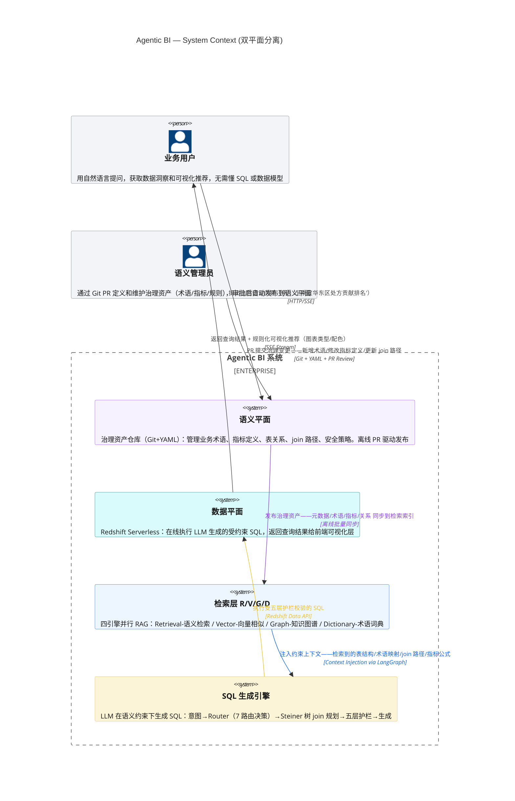
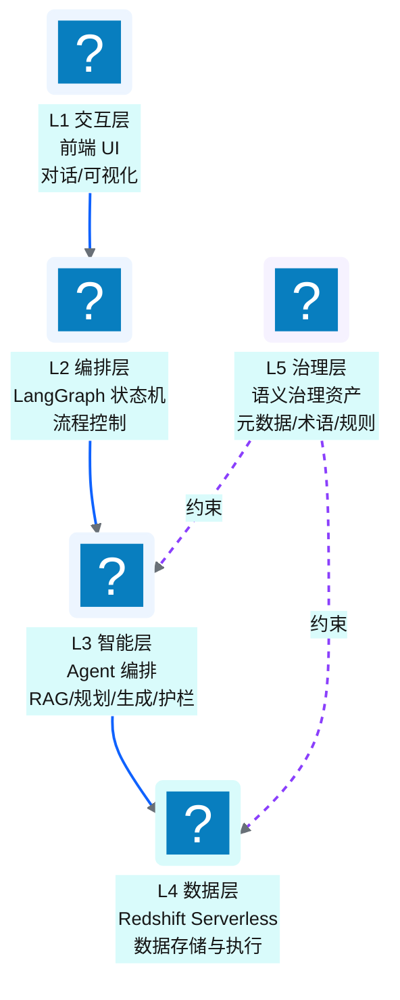
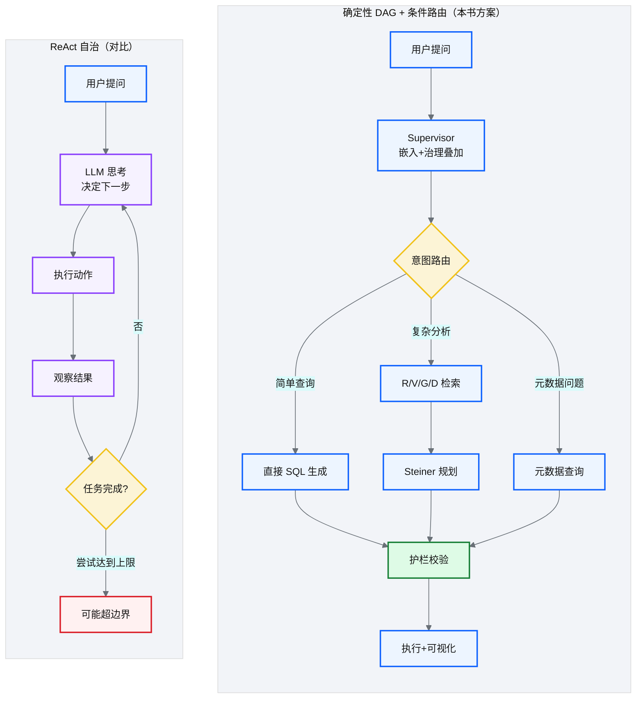
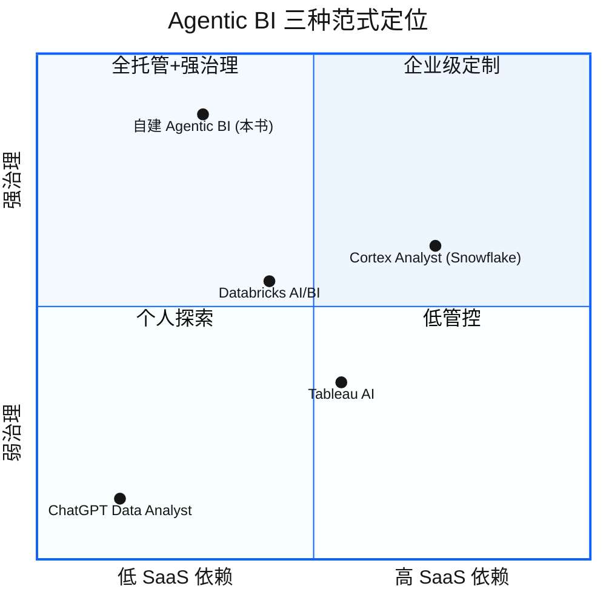

# Ch 39 Agentic BI 架构总览

!!! info "面包屑"
    [本书主页](./index.md) › [Part VII Data+AI 转型](./38-时代命题-AI-Ready数据供应.md) › Ch 39

!!! abstract "项目第 4 年 · Data+AI 转型期——架构设计"

---

## :material-school: 本章你将学到
- 双平面分离：语义平面（治理）+ 数据平面（执行）
- 五层逻辑模型（L1 交互→L5 治理，单向调用）
- 9 步在线查询流的完整链路
- 确定性 DAG + 条件路由 vs ReAct 自治的取舍

---

[Ch 38](./38-时代命题-AI-Ready数据供应.md) 把"为什么要做 Agentic BI"讲清楚了，这一章展开讲"架构怎么设计"。

做这个架构，最难缠的一个问题跳不过去：**怎么让 LLM 生成的 SQL 既"灵活"又"安全"？** 灵活，什么都能问；安全，不能出危险 SQL、不能泄漏敏感数据、不能查错口径。

这两个方向天然互掐。放太宽，LLM 敢自由发挥出离谱的 SQL；收太紧，用户问个稍偏的问题它又接不住。后来琢磨出来的思路是**把"知识"和"执行"拆开**——搞一个"语义平面"，把业务知识（指标定义、术语映射、join 路径）统统编码成机器能读的约束。LLM 不是在整个数仓里瞎猜，而是在一面有边界的墙里面发挥。这就是"双平面分离"架构的起点。

我早年做专利数据时有类似感受。专利检索也是"自然语言查专利"，当时靠一套分类体系加同义词词典把检索范围框住。Agentic BI 的语义平面思路是一样的，只不过约束更细、执行更复杂。

---

## 39.1 双平面分离：语义平面（治理）+ 数据平面（执行）

**图 39-1** 双平面分离：语义平面（治理）+ 数据平面（执行）

| 平面 | 职责 | 管理方式 | 更新频率 |
|---|---|---|---|
| **语义平面** | 治理资产（元数据/术语/规则/指标定义） | Git + :simple-yaml: YAML，离线发布 | 低频（ :octicons-git-pull-request-16: PR 驱动） |
| **数据平面** | SQL 执行（查询/加载） | Redshift Serverless | 高频（每次查询） |

**表 39-1** 双平面分离：语义平面（治理）+ 数据平面（执行）

### 为什么要分离

!!! tip "引申：基石回扣——双平面分离 = 配置驱动的 AI 延伸"
    双平面分离就是把"治理"和"执行"拆开。语义平面管知识——GMV 是什么、怎么算、用哪些表；数据平面管执行，跑算出来的 SQL。拆开后，改 GMV 定义不用动执行引擎，升级执行引擎也不会弄坏治理资产。

    这跟 CDP 平台的"配置驱动"是一回事。[Ch 11](./11-配置与状态管理.md) 把"做什么"（runtime config in DynamoDB）跟"在哪跑"（deploy config in Terraform）拆开管；Agentic BI 把"知识"（语义平面 Git+YAML）跟"执行"（数据平面 Redshift）拆开管。同一套分离原则，在不同抽象层级反复用。runtime config 描述任务怎么跑，语义资产描述 AI 怎么理解业务，核心都是把描述和执行解耦。ADR-1 就是基于这个判断做出的。

---

## 39.2 五层逻辑模型（L1 交互→L5 治理，单向调用）

**图 39-2** 五层逻辑模型（L1 交互→L5 治理，单向调用）

| 层 | 职责 | 技术 | 为什么独立成层 |
|---|---|---|---|
| **L1 交互** | 对话界面、结果可视化、SSE 流式 | Next.js + :simple-react: React | 前端迭代节奏快，不能跟后 Agent 逻辑耦合 |
| **L2 编排** | Agent 流程状态机、路由决策 | LangGraph StateGraph | 流程变更（加一路由、加一步骤）不应波及智能层实现 |
| **L3 智能** | RAG 检索、SQL 规划/生成/护栏 | LangGraph + LLM | LLM 版本升级、prompt 调优都在这一层闭环 |
| **L4 数据** | SQL 执行、数据存储 | Redshift Serverless | 执行引擎可替换（Redshift → Databricks），不应影响上层 |
| **L5 治理** | 语义资产、术语、业务规则 | Git + YAML | 变更频率最低，但约束力最强——PR 驱动，离线发布 |

**表 39-2** 五层逻辑模型（L1 交互→L5 治理，单向调用）

**核心原则：依赖只能向下，L5 治理层约束 L3/L4 但不被它们修改。**

### 为什么是五层，不是三层或七层

这个分层不是一开始就定下来的。最早做 PoC 的时候，我把编排和智能塞在一层里——LangGraph 的 `StateGraph` 里既有路由逻辑（`conditional_edges`），又有 RAG 检索和 SQL 生成的节点。跑起来没问题，但改一个路由规则就得去翻一堆节点函数，调试时经常搞混"这是流程控制还是业务逻辑"。

后来拆成 L2 和 L3，原因很具体：**LangGraph 的 `StateGraph` 天然支持节点（node）和边（edge）的分离**。L2 只管"哪些节点以什么顺序执行"——用 `add_conditional_edges` 定义路由、用 `add_edge` 定义线性流程；L3 管"每个节点内部做什么"——调 RAG、调 LLM、跑护栏。这样一来，加一条新路由（比如"元数据问题走元数据查询节点"）只需改 L2 的图定义，L3 的节点代码一行不动。

L4 独立出来是另一个教训。我们最初用 Redshift 直连，后来有一段时间想试 Databricks SQL Warehouse。如果执行逻辑散在 L3 的节点函数里，替换就意味着改每一个涉及 SQL 执行的节点。把 L4 抽出来之后，替换执行引擎只需实现一个新的 L4 adapter，L3 通过统一接口调用。这个思路跟 CDP 平台的连接器抽象一模一样（[Ch 13](./13-连接器框架总览.md)）。

L5 治理层最特殊——它不参与调用链，而是以"约束注入"的方式影响 L3 和 L4。语义资产（术语表、指标定义、join 路径）通过 Git PR 离线发布，L3 在生成 SQL 时检索这些资产作为上下文约束。这种"旁路约束"模式比"把规则硬编码到 L3"灵活得多——改一个指标定义，只需提一个 PR，不用改代码。

!!! warning "Trade-off"
    五层的代价是层间通信开销。每一层之间都有序列化/反序列化、网络调用的开销。在我们的场景里，一次查询的端到端延迟约 3-8 秒，其中层间传递约占 200-400ms——相比 LLM 推理的 2-5 秒，这个代价可以接受。但如果场景是毫秒级延迟要求的实时分析，可能需要把 L2/L3 合并减少一次调用。**分层粒度的选择本质上是"可维护性"与"性能"的 trade-off**——我们选了可维护性，因为 Agentic BI 的瓶颈在 LLM 推理，不在层间通信。

---

## 39.3 9 步在线查询流

**图 39-3** 9 步在线查询流

| 步骤 | 做什么 | 对应层 | 关键设计 | 异常降级 |
|---|---|---|---|---|
| ① 提问 | 用户用自然语言提问 | L1 | 前端 SSE 流式 | — |
| ② Supervisor | 嵌入问题 + 叠加治理上下文 | L2 | 轻量入口，不过 LLM | 嵌入服务不可用 → 降级为关键词匹配 |
| ③ 查询理解 | LLM 识别意图和实体 | L3 | 意图分类 + 实体抽取 | LLM 超时 → 默认走"复杂分析"路由 |
| ④ 路由 | 7 条确定性路由决策 | L2 | 条件路由，非 ReAct | — |
| ⑤ 检索 | R/V/G/D 四引擎并行检索 | L3 | 四引擎并行，结果融合 | 单引擎超时 → 其余三引擎降级继续 |
| ⑥ 规划 | Steiner 树求最小代价 join 子图 | L3 | 代数改写，非 LLM 猜 | 规划失败 → 回退到 LLM 直接生成 join |
| ⑦ 生成 | LLM 在约束下生成 SQL | L3 | 约束上下文注入 | — |
| ⑧ 护栏 | 五层校验 + 自愈回路 | L3 | 校验失败自动回退到 ⑦ 重新生成 | 3 次重试仍失败 → 返回"无法安全回答" |
| ⑨ 执行 | Redshift 执行 + 可视化推荐 | L4 | 规则化可视化（非 LLM 推荐） | 查询超时 → 返回部分结果 + 超时提示 |

**表 39-3** 9 步在线查询流（含异常降级策略）

### 从 PoC 的 4 步到生产的 9 步

这 9 步不是设计出来的，是"长"出来的。最早做 PoC 的时候，流程只有 4 步：提问 → LLM 生成 SQL → 执行 → 返回结果。Demo 效果惊艳，但一上真实数据就翻车——LLM 不知道"处方贡献"该用哪张表、join 路径猜错、生成了 `SELECT *` 这种危险 SQL。

第一次加厚是在"生成"之前插入了检索步骤（⑤）。光有检索还不够，因为检索回来的语义资产太多，LLM 会"消化不良"——所以又加了规划器（⑥），用 Steiner 树算法从检索结果中选出最小代价的 join 子图，只把精炼后的约束喂给 LLM。

第二次加厚是在"生成"之后插入了护栏（⑧）。这是被一次线上事故逼出来的——LLM 生成了一条 `DELETE` 语句，虽然被 Redshift 的权限拦住了，但这个教训太深刻。五层护栏（语法检查 → 策略过滤 → AST 解析 → 术语校验 → 成本估算）逐层收紧，任何一层不通过就回退到 ⑦ 重新生成。

第三次加厚是把"路由"（④）从 LLM 自主决策改成了确定性条件路由。最初用 ReAct 模式让 LLM 自己决定"下一步做什么"，结果路径不可追踪，审计根本没法做。而且 LLM 经常在"该检索"和"该直接生成"之间犹豫不决，多跑一两轮无意义的思考。改成确定性路由后，7 条路径清清楚楚，每条路径的输入输出都可预期。

!!! warning "Trade-off"
    9 步比 4 步慢了不少——端到端延迟从 2 秒涨到 3-8 秒。但换来的是：错误率从 PoC 的 ~30% 降到生产的 <5%，危险 SQL 归零，审计可追踪。在医药行业，"慢一点但对"远比"快但可能错"重要。这也是为什么我们宁可牺牲延迟，也要把检索、规划、护栏三道工序加进去。

---

## 39.4 确定性 DAG + 条件路由 vs ReAct 自治的取舍

**图 39-4** 确定性 DAG + 条件路由 vs ReAct 自治的取舍

| 维度 | 确定性 DAG（本书） | ReAct 自治 |
|---|---|---|
| **流程控制** | 预定义 DAG + 条件分支 | LLM 自主决策 |
| **可预测性** | 高（路径确定） | 低（LLM 可能走偏） |
| **灵活性** | 中（条件路由适应变化） | 高（完全自主） |
| **调试** | 易（路径可追踪） | 难（每次路径不同） |
| **安全** | 高（护栏在节点间） | 低（自主行为难约束） |
| **适合场景** | 企业级（需可靠/安全） | 探索性（容错高） |

**表 39-4** 确定性 DAG + 条件路由 vs ReAct 自治的取舍

!!! warning "Trade-off"
    选确定性 DAG，最根本的理由是"企业级可靠性"——在医药行业，AI 跑 SQL 必须可预测、可审计、可追责。ReAct 灵活归灵活，但"每次路径不同"这七个字对审计和排障来说就是噩梦。确定性 DAG 靠条件路由已经能覆盖"不同意图走不同路径"的需要，流程路径始终可追踪。

---

## 39.5 引申：Agentic BI 的三种范式对比

**图 39-5** 引申：Agentic BI 的三种范式对比

| 维度 | ChatGPT DA | Cortex Analyst | Databricks AI/BI | 自建（NewtonData） |
|---|---|---|---|---|
| **语义治理** | 无 | 有（Snowflake 语义层） | 有（Unity Catalog） | 有（三层治理+Git） |
| **数据仓库** | 任意（通过代码） | 仅 Snowflake | 仅 Databricks | Redshift/可扩展 |
| **安全护栏** | 弱 | 中（平台内置） | 中（平台内置） | 强（五层护栏） |
| **定制性** | 低 | 中 | 中 | 高（全栈可控） |
| **运维成本** | 零（SaaS） | 低（平台托管） | 低（平台托管） | 高（自维护） |
| **Agent 编排** | 黑盒 | 平台托管 | 平台托管 | 全自控（LangGraph） |
| **适合场景** | 个人探索 | Snowflake 用户 | Databricks 用户 | 企业级深度定制 |

**表 39-5** 引申：Agentic BI 四种范式对比

### 我们为什么选了自建

做技术选型的时候，我花了两周时间把 Cortex Analyst、Databricks AI/BI 和 ChatGPT Data Analyst 都跑了一遍。结论很明确：**现有平台方案都解决不了我们的核心问题——医药行业的语义治理**。

Cortex Analyst 最接近我们的需求，它的语义层能定义指标和维度，但有两个硬伤。一是绑死 Snowflake（我们用 Redshift，迁移成本不现实）。二是语义治理粒度不够——我们需要的不只是"指标定义"，还有"术语同义词映射"（比如"阿司匹林"="乙酰水杨酸"="ASA"）、"join 路径约束"（哪些表能 join、哪些不能）、"GxP 审计追踪"。这些在 Cortex 的语义层里做不到。

ChatGPT Data Analyst 适合"把 CSV 丢进去问问题"的场景，但没有语义治理、没有安全护栏、没有审计，对医药行业来说完全不可用。

Databricks AI/BI 的 Unity Catalog 提供了不错的元数据治理，但同样绑死 Databricks 生态，而且 Agent 编排是黑盒，我们无法控制"LLM 生成 SQL 的过程"。

自建的代价很明显：**运维成本高**。五层护栏要自己维护、LangGraph 状态机要自己调试、语义资产要自己用 Git 管理。但换来的是"全栈可控"——从用户提问到 SQL 执行，每一步都能追踪、每一层都能调优。对 Aurora 这种有深度定制需求的企业（GxP 合规、特殊术语治理、跨账号数据隔离），这个 trade-off 值得。

!!! warning "Trade-off"
    如果你的企业不需要医药级别的语义治理，Cortex Analyst 或 Databricks AI/BI 可能是更好的选择，省掉 80% 的运维成本，换来 80% 的功能覆盖。自建不是银弹，只在平台方案覆盖不了核心需求的时候才划算。我们之所以自建，是因为医药行业的语义治理需求太特殊，没有现成方案能覆盖。

---

## :material-check-circle: 本章小结
- 双平面分离：语义平面（Git+YAML 治理资产，离线发布）+ 数据平面（Redshift Serverless，在线执行）
- 五层逻辑模型：L1 交互→L2 编排→L3 智能→L4 数据→L5 治理，依赖只能向下，L5 约束 L3/L4
- 9 步查询流：提问→Supervisor→查询理解→路由→R/V/G/D 检索→Steiner 规划→SQL 生成→五层护栏→执行+可视化
- 选确定性 DAG + 条件路由而非 ReAct：企业级需要可预测、可审计、可追责
- 四种范式：ChatGPT DA（无治理）/ Cortex（绑 Snowflake）/ Databricks AI/BI（绑 Databricks）/ 自建（全栈可控）——按定制需求和运维能力选择

---

!!! quote "下一章"
    [Ch 40 语义平面：三层治理与 Git+YAML](./40-语义平面-三层治理与Git-YAML.md) —— 架构总览清楚了，接下来深入第一块——语义平面的三层治理设计。

