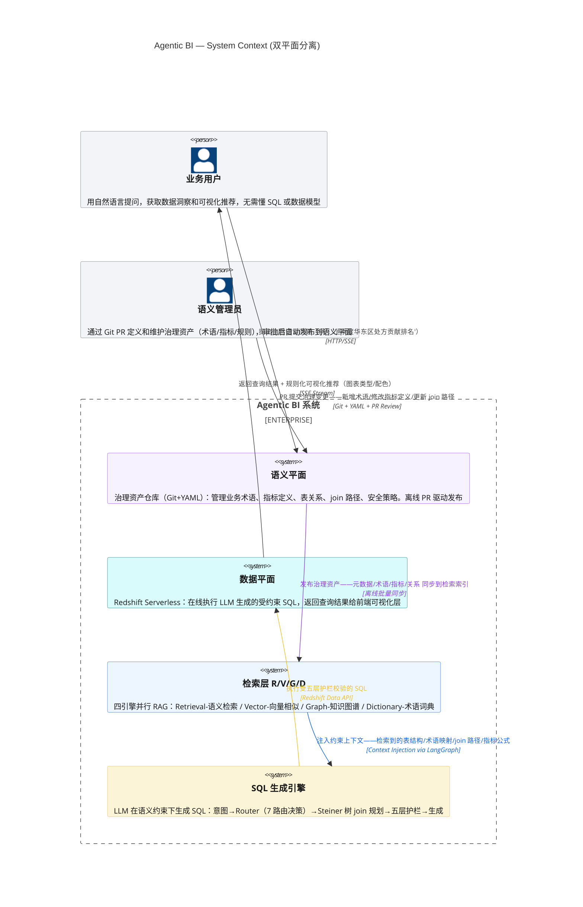
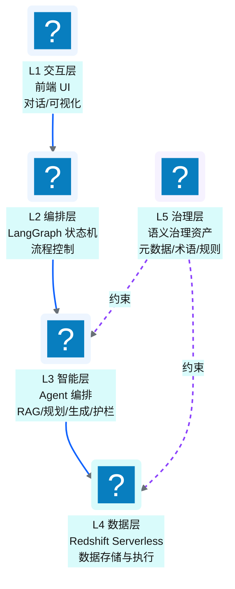
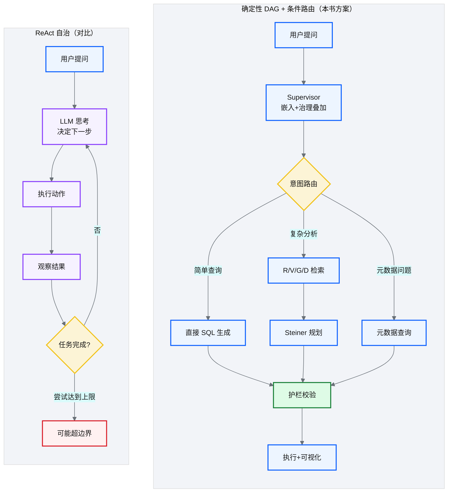
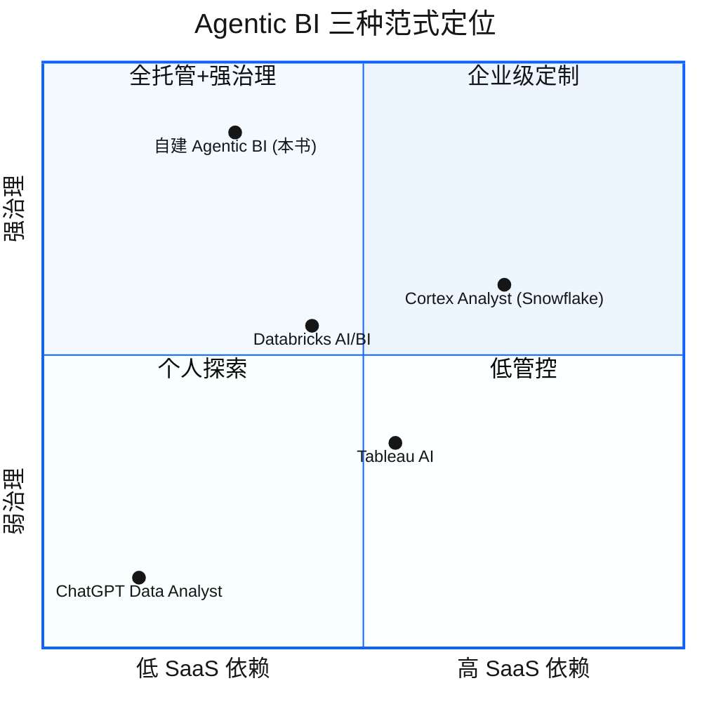

# Ch 39 Agentic BI 架构总览

!!! info "面包屑"
    [本书主页](./index.md) › [Part VII Data+AI 转型](./38-时代命题-AI-Ready数据供应.md) › Ch 39

!!! abstract "项目第 4 年 · Data+AI 转型期——架构设计"

---

## :material-school: 本章你将学到
- 双平面分离：语义平面（治理）+ 数据平面（执行）
- 五层逻辑模型（L1 交互→L5 治理，单向调用）
- 9 步在线查询流的完整链路
- 确定性 DAG + 条件路由 vs ReAct 自治的取舍

---

[Ch 38](./38-时代命题-AI-Ready数据供应.md) 说了"为什么要做 Agentic BI"，这一章讲"Agentic BI 的架构怎么设计"。

设计这个架构时，我面临的最大挑战是：**怎么让 LLM 生成的 SQL 既"灵活"又"安全"？** 灵活——用户什么问题都能问；安全——AI 不能生成危险 SQL、不能泄露敏感数据、不能查错口径。

这两个要求看似矛盾。如果给 LLM 太多自由，它可能"自由发挥"出错误的 SQL；如果限制太死，它又无法回答灵活的问题。解决方案的核心思想是：**把"知识"和"执行"分开**——用一个"语义平面"把业务知识（指标定义、术语映射、join 路径）编码为机器可读的约束，让 LLM 在受约束的空间内"发挥"，而不是在"整个数仓"里"猜"。这个思想后来演化为"双平面分离"架构。

我在专利数据领域有过类似经验——专利检索系统也是"让用户用自然语言查专利"，当时用了一套"专利分类体系+同义词词典"来约束检索范围。Agentic BI 的语义平面是同一个思想的升级版，只是约束更细、执行更复杂。

---

## 39.1 双平面分离：语义平面（治理）+ 数据平面（执行）

**图 39-1** 双平面分离：语义平面（治理）+ 数据平面（执行）

| 平面 | 职责 | 管理方式 | 更新频率 |
|---|---|---|---|
| **语义平面** | 治理资产（元数据/术语/规则/指标定义） | Git + :simple-yaml: YAML，离线发布 | 低频（ :octicons-git-pull-request-16: PR 驱动） |
| **数据平面** | SQL 执行（查询/加载） | Redshift Serverless | 高频（每次查询） |

**表 39-1** 双平面分离：语义平面（治理）+ 数据平面（执行）

### 为什么要分离

!!! tip "引申：基石回扣——双平面分离 = 配置驱动的 AI 延伸"
    双平面分离的本质是"治理与执行解耦"。语义平面是"知识"——它定义"GMV 是什么、怎么算、用哪些表"；数据平面是"执行"——它执行"算出来的 SQL"。分离让治理变更（如修改 GMV 定义）不影响执行引擎，执行引擎升级不影响治理资产。

    这与 CDP 平台的"配置驱动"理念一脉相承——[Ch 11](./11-配置与状态管理.md) 把"做什么"（runtime config in DynamoDB）和"在哪跑"（deploy config in Terraform）分开管理；Agentic BI 把"知识"（语义平面 Git+YAML）和"执行"（数据平面 Redshift）分开管理。**同一个分离原则，在不同抽象层级反复应用**——runtime config 描述"任务怎么跑"，语义资产描述"AI 怎么理解业务"，两者都是"把描述与执行解耦"。这也是 ADR-1（双平面分离）的核心决策依据。

---

## 39.2 五层逻辑模型（L1 交互→L5 治理，单向调用）

**图 39-2** 五层逻辑模型（L1 交互→L5 治理，单向调用）

| 层 | 职责 | 技术 |
|---|---|---|
| **L1 交互** | 对话界面、结果可视化、SSE 流式 | Next.js + :simple-react: React |
| **L2 编排** | Agent 流程状态机、路由决策 | LangGraph |
| **L3 智能** | RAG 检索、SQL 规划/生成/护栏 | LangGraph + LLM |
| **L4 数据** | SQL 执行、数据存储 | Redshift Serverless |
| **L5 治理** | 语义资产、术语、业务规则 | Git + YAML |

**表 39-2** 五层逻辑模型（L1 交互→L5 治理，单向调用）

**核心原则：依赖只能向下，L5 治理层约束 L3/L4 但不被它们修改。**

---

## 39.3 9 步在线查询流

**图 39-3** 9 步在线查询流

| 步骤 | 做什么 | 关键设计 |
|---|---|---|
| ① 提问 | 用户用自然语言提问 | 前端 SSE 流式 |
| ② Supervisor | 嵌入问题 + 叠加治理上下文 | 轻量入口 |
| ③ 查询理解 | LLM 识别意图和实体 | 意图分类 |
| ④ 路由 | 7 条确定性路由决策 | 条件路由非 ReAct |
| ⑤ 检索 | R/V/G/D 四引擎并行检索语义资产 | 四引擎 RAG |
| ⑥ 规划 | Steiner 树求最小代价 join 子图 | 代数改写 |
| ⑦ 生成 | LLM 在约束下生成 SQL | 约束生成 |
| ⑧ 护栏 | 五层校验+自愈回路 | 安全护栏 |
| ⑨ 执行 | Redshift 执行+可视化推荐 | 规则化可视化 |

**表 39-3** 9 步在线查询流

---

## 39.4 确定性 DAG + 条件路由 vs ReAct 自治的取舍

**图 39-4** 确定性 DAG + 条件路由 vs ReAct 自治的取舍

| 维度 | 确定性 DAG（本书） | ReAct 自治 |
|---|---|---|
| **流程控制** | 预定义 DAG + 条件分支 | LLM 自主决策 |
| **可预测性** | 高（路径确定） | 低（LLM 可能走偏） |
| **灵活性** | 中（条件路由适应变化） | 高（完全自主） |
| **调试** | 易（路径可追踪） | 难（每次路径不同） |
| **安全** | 高（护栏在节点间） | 低（自主行为难约束） |
| **适合场景** | 企业级（需可靠/安全） | 探索性（容错高） |

**表 39-4** 确定性 DAG + 条件路由 vs ReAct 自治的取舍

!!! warning "Trade-off"
    选确定性 DAG 的核心理由是"企业级可靠性"——在医药行业，AI 执行 SQL 必须可预测、可审计、可追责。ReAct 的自主性虽灵活，但"每次路径不同"让审计和排障极困难。确定性 DAG 的条件路由已足够应对"不同意图走不同路径"的灵活性需求，同时保证了流程可追踪。

---

## 39.5 引申：Agentic BI 的三种范式对比

**图 39-5** 引申：Agentic BI 的三种范式对比

| 维度 | ChatGPT DA | Cortex Analyst | 自建（NewtonData） |
|---|---|---|---|
| **语义治理** | 无 | 有（:simple-snowflake: Snowflake 语义层） | 有（三层治理+Git） |
| **数据仓库** | 任意（通过代码） | 仅 Snowflake | Redshift/可扩展 |
| **安全护栏** | 弱 | 中（平台内置） | 强（五层护栏） |
| **定制性** | 低 | 中 | 高（全栈可控） |
| **运维成本** | 零（SaaS） | 低（平台托管） | 高（自维护） |
| **适合场景** | 个人探索 | Snowflake 用户 | 企业级深度定制 |

**表 39-5** 引申：Agentic BI 的三种范式对比

!!! tip "引申"
    自建 Agentic BI 的核心价值是"全栈可控"——语义治理、Agent 编排、护栏、执行引擎全部自主。代价是运维成本高。对于有深度定制需求的企业（如医药行业的 GxP 合规、特殊术语治理），自建是值得的。对于标准化需求，Cortex Analyst 这类平台方案更经济。

---

## :material-check-circle: 本章小结
- 双平面分离：语义平面（Git+YAML 治理资产，离线发布）+ 数据平面（Redshift Serverless，在线执行）
- 五层逻辑模型：L1 交互→L2 编排→L3 智能→L4 数据→L5 治理，依赖只能向下，L5 约束 L3/L4
- 9 步查询流：提问→Supervisor→查询理解→路由→R/V/G/D 检索→Steiner 规划→SQL 生成→五层护栏→执行+可视化
- 选确定性 DAG + 条件路由而非 ReAct：企业级需要可预测、可审计、可追责
- 三种范式：ChatGPT DA（无治理）/ Cortex（绑 Snowflake）/ 自建（全栈可控）——按定制需求和运维能力选择

---

!!! quote "下一章"
    [Ch 40 语义平面：三层治理与 Git+YAML](./40-语义平面-三层治理与Git-YAML.md) —— 架构总览清楚了，接下来深入第一块——语义平面的三层治理设计。

