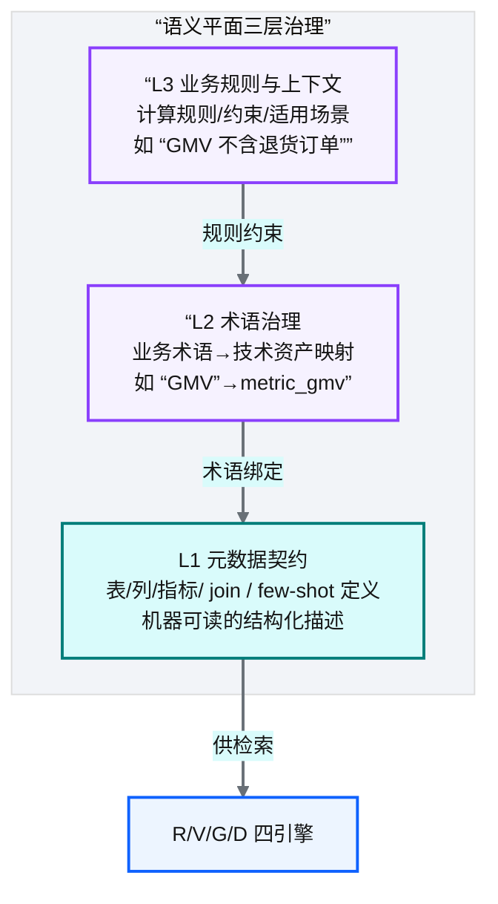
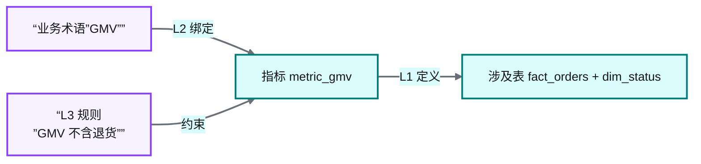
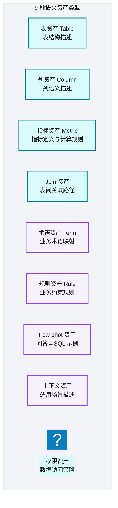
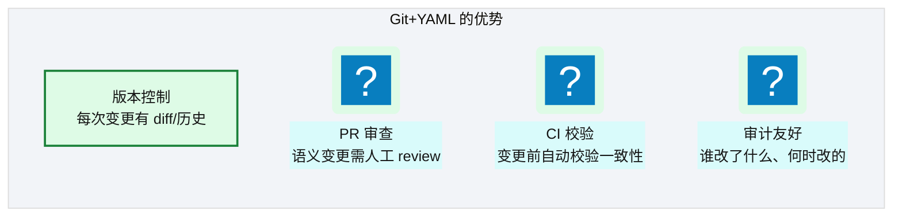
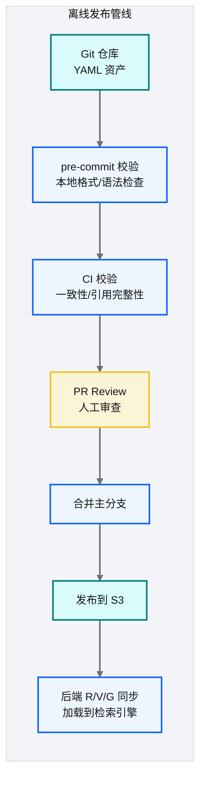
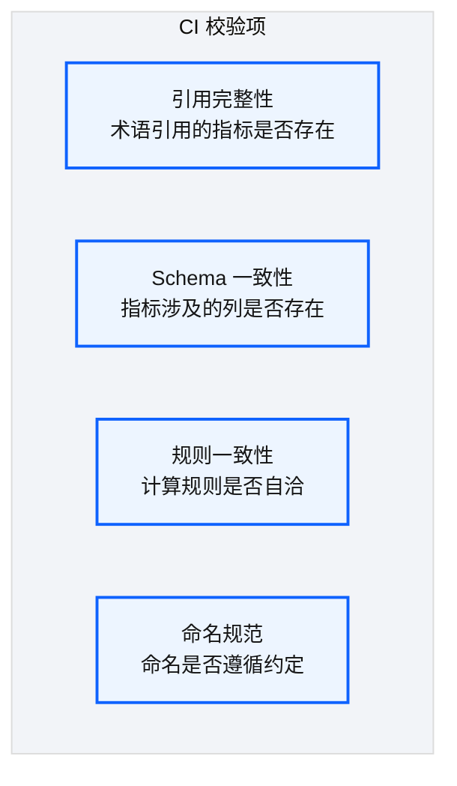
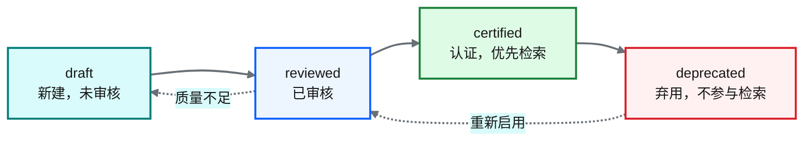
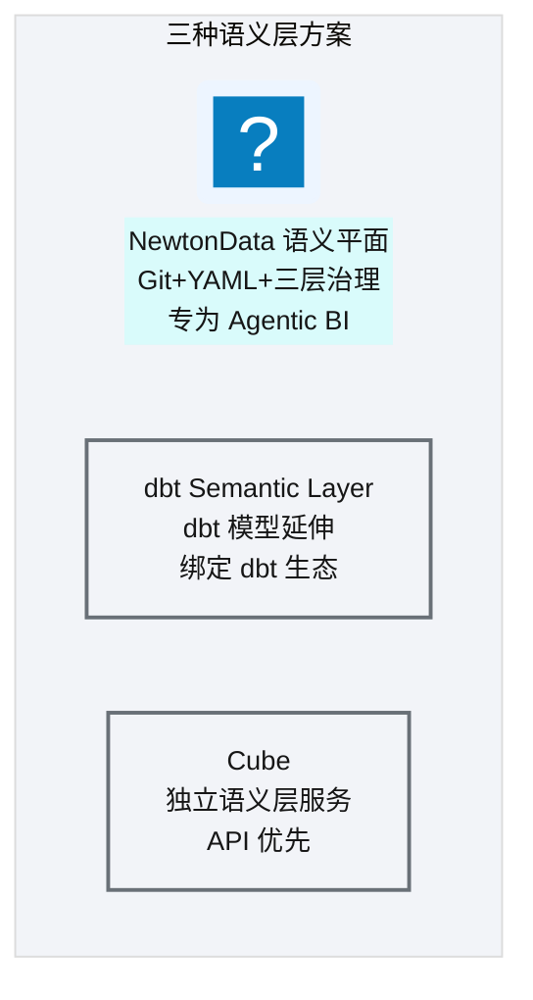

# Ch 40 语义平面：三层治理与 Git+:simple-yaml: YAML
!!! info "面包屑"
    [本书主页](./index.md) › [Part VII Data+AI 转型](./39-Agentic-BI架构总览.md) › Ch 40

!!! abstract "项目第 4 年 · Data+AI转型期——语义平面"

---

## :material-school: 本章你将学到
- 三层治理：L1 元数据契约 / L2 术语治理 / L3 业务规则，以及对应的 YAML 资产示例
- 资产类型体系（9 种，含 Join/Few-shot YAML）与 Git+YAML 选型理由
- System Prompt 设计：分层模板 + few-shot 分级注入 + 术语绑定强路由
- 离线发布管线设计（含 CI 引用完整性校验伪代码）
- 对比 dbt Semantic Layer / Cube 的语义层设计

---

## 40.1 三层治理：L1 元数据契约 / L2 术语治理 / L3 业务规则
[Ch 39](./39-Agentic-BI架构总览.md) 讲了 Agentic BI 的整体架构，其中"语义平面"是治理层的核心。这一章深入语义平面的内部设计——它怎么把"人的业务知识"变成"机器可读的约束"。

我在专利数据领域做过类似的事。专利检索系统需要理解"同义词"——用户搜"锂电池"，系统要知道它也属于"二次电池""储能器件"这些概念。当时我们维护了一个"专利术语词典"，把同义词、上下位词、相关词编码为机器可读的映射。Agentic BI 的语义平面是这个思想的升级版——不只是术语映射，还包括指标定义、join 路径、业务规则，形成一套完整的"机器可读业务知识库"。

但语义平面最大的挑战不是"设计"——而是"维护"。谁来写这些 YAML？怎么保证它们正确？怎么让变更受控？这些问题比技术设计更难，也是这一章重点讨论的。

### 治理 vs 元数据

普通元数据（如 `information_schema`）只描述"表结构是什么"——列名、类型、是否可空。语义治理还描述"这个字段在业务上意味着什么、应该怎么用、和别的字段什么关系"——后者是 LLM 无法从世界知识补全的企业特有知识。这是把治理称为"一等公民"的原因：

| 维度 | 普通元数据（information_schema） | 语义治理（NewtonData 语义平面） |
|---|---|---|
| **描述内容** | 表结构（列名/类型/约束） | 业务含义（指标定义/术语映射/join 路径/规则） |
| **来源** | DDL 自动生成 | 人工编写 + CI 校验 |
| **消费者** | BI 工具、ETL 工具 | LLM Agent（RAG 检索） |
| **变更频率** | 随 DDL 变更 | 低频高治理（PR 审查） |
| **LLM 能否补全** | 能（通用知识） | **不能**（企业特有知识） |
<p class="caption" markdown="span">**表 40-1** 治理 vs 元数据</p>


!!! tip "引申：基石回扣——从被动血缘到主动语义资产"
    语义平面是 [Ch 20](./20-元数据管理与数据血缘.md) 元数据管理的演进。Ch 20 的被动血缘（审计日志、batch_id 关联、Glue Catalog）只能"事后追溯数据怎么来的"——它是描述性的，回答"数据是什么、从哪来"。语义平面则是"主动的、机器可读的业务知识"——它是规范性的，回答"数据应该怎么用、业务上意味着什么"。Ch 20 把"主动血缘"列为演进目标（[Ch 52](./52-架构师的复盘-取舍遗憾与主流对比.md) 复盘），语义平面正是这个目标的 AI 消费侧实现：Git+YAML 的版本化语义资产 = Ch 20 想要的"主动、版本化、可审查的元数据层"。


<p class="caption" markdown="span">**图 40-1** 三层治理：L1 元数据契约 / L2 术语治理 / L3 业务规则</p>

| 层 | 职责 | 举例 |
|---|---|---|
| **L1 元数据契约** | 表/列/指标/join 的结构化定义 | `table: fact_prescription, columns: [...]` |
| **L2 术语治理** | 业务术语→技术资产映射 | `term: "GMV" → metric: metric_gmv` |
| **L3 业务规则** | 计算规则/约束/上下文 | `rule: GMV = SUM(amount) WHERE status='completed'` |
<p class="caption" markdown="span">**表 40-2** 三层治理：L1 元数据契约 / L2 术语治理 / L3 业务规则</p>


### 三层的关系


<p class="caption" markdown="span">**图 40-2** 三层的关系</p>

!!! tip "引申"
    三层治理的本质是"把业务知识分层编码"。L1 是"数据长什么样"（结构），L2 是"业务术语对应什么"（映射），L3 是"怎么算才对"（规则）。这三层从不同维度约束 LLM 的搜索空间——LLM 不是在"整个数仓中猜"，而是在"受约束的语义空间中推理"。

把上面表格里的 GMV 例子落到 YAML，三层资产各是一个文件，相互引用、由 CI 校验引用完整性：

```yaml
# 示意：L1 元数据契约——Table 资产（fact_orders 的结构化描述）
# 文件：semantic-assets/tables/fact_orders.yaml
asset_type: table
name: fact_orders
description: "订单事实表，记录每笔销售订单"
columns:
  - name: order_id
    type: string
    role: primary_key
    sensitivity: P2
  - name: product_id
    type: string
    role: foreign_key
    references: dim_product.product_id
  - name: amount
    type: decimal
    description: "订单金额（含税）"
  - name: status
    type: string
    description: "订单状态：completed/returned/cancelled"
grain: "一行 = 一笔订单"
```

```yaml
# 示意：L2 术语治理——Term 资产（业务术语 "GMV" → 技术资产映射）
# 文件：semantic-assets/terms/gmv.yaml
asset_type: term
name: GMV
synonyms: ["成交额", "总销售额", "Gross Merchandise Volume"]
binding:
  asset_type: metric
  asset_name: metric_gmv      # 核心意图：业务术语→指标，强路由绑定
description: "Gross Merchandise Volume，已成交订单的商品总额"
```

```yaml
# 示意：L3 业务规则——Metric + Rule 资产（GMV 怎么算才对）
# 文件：semantic-assets/metrics/metric_gmv.yaml
asset_type: metric
name: metric_gmv
base_table: fact_orders
expression: "SUM(amount)"
filter: "status = 'completed'"   # 核心意图：L3 规则约束——GMV 不含退货/取消订单
dimensions: [product_id, region, biz_date]
rules:
  - type: exclude_status
    values: ["returned", "cancelled"]
    reason: "GMV 仅统计已成交订单"
```

这三份 YAML 经 CI 校验后发布——`term: GMV` 引用的 `metric_gmv` 必须存在（引用完整性），`metric_gmv` 引用的 `fact_orders.amount`/`status` 列必须在 L1 Table 资产中存在（Schema 一致性）。任何一处断裂，CI 阻断发布。

---

## 40.2 资产类型体系与 Git+YAML 选型
### 9 种资产类型


<p class="caption" markdown="span">**图 40-3** 种资产类型</p>

除了上面三层示例里的 Table/Term/Metric，Join 和 Few-shot 两类资产对 NL2SQL 尤为关键——前者告诉 LLM 表怎么连，后者告诉 LLM 好的 SQL 长什么样：

```yaml
# 示意：Join 资产（表间关联路径，供 Ch 43 Steiner 树消费）
# 文件：semantic-assets/joins/fact_orders_dim_product.yaml
asset_type: join
left_table: fact_orders
right_table: dim_product
condition: "fact_orders.product_id = dim_product.product_id"
cardinality: many_to_one
cost: 1.0     # 供查询规划器评估 join 代价
```

```yaml
# 示意：Few-shot 资产（问答→SQL 示例，供 Ch 42 System Prompt 注入）
# 文件：semantic-assets/few-shots/gmv_by_region.yaml
asset_type: few_shot
complexity: simple       # simple/medium/complex，决定注入数量
question: "华东区上月的 GMV 是多少？"
bound_terms: [GMV, 华东区, 上月]
sql: |
  SELECT SUM(amount) AS gmv
  FROM fact_orders
  WHERE status = 'completed'
    AND region = 'East China'
    AND biz_date >= dateadd(month, -1, trunc(current_date, 'mon'))
```

### 9 类资产的运行时消费映射

9 种资产不是孤立存在的——它们在运行时被 R/V/G/D 四引擎（[Ch 41](./41-RVGD四引擎RAG检索.md)）以不同方式消费。理解这个映射，才能理解为什么需要 9 类而非更少：

| 资产类型 | 层级 | 运行时消费方式 | 消费引擎 |
|---|---|---|---|
| `table_asset` | L1 | 向量检索表定义 | Engine V |
| `column_asset` | L1 | 别名精确匹配 + 向量检索 | Engine R+ / V |
| `metric_asset` | L1 | 向量检索 + 规划器源表推导 | Engine V / [Ch 43](./43-语义查询规划器-Steiner树与代数改写.md) 规划器 |
| `join_rule` | L1 | Steiner 树建图（join 路径规划） | [Ch 43](./43-语义查询规划器-Steiner树与代数改写.md) 规划器 |
| `few_shot_example` | L1 | 检索后注入 Prompt | Engine D / Prompt |
| `business_term` | L1+2 | 精确匹配 + 术语绑定强路由 | Engine R / 全链路 |
| `term_relationship` | L2 | Cypher 图遍历（同义/上下位） | Engine G |
| `business_rule` | L3 | 直接注入 Prompt + 护栏校验 | Prompt / [Ch 44](./44-五层SQL护栏与执行安全.md) |
| `business_context` | L3 | 直接注入 Prompt | Prompt |
<p class="caption" markdown="span">**表 40-5** 9 类资产的运行时消费映射</p>


### ID 命名规范

资产 ID 用正则约束，确保全局唯一与可追溯——CI 强制校验命名规范：

| 资产类型 | ID 格式 | 示例 |
|---|---|---|
| `table_asset` | `tbl_<domain>_<name>` | `tbl_pharma_fact_prescription` |
| `column_asset` | `col_<table>_<column>` | `col_fact_txn_price` |
| `metric_asset` | `metric_<name>` | `metric_gmv` |
| `business_term` | `term_<name>` | `term_gmv` |
<p class="caption" markdown="span">**表 40-6** ID 命名规范</p>


### System Prompt 设计

语义资产最终要注入到 LLM 的 System Prompt 里，才能约束 SQL 生成。一个设计良好的 System Prompt 是分层的：角色定义 → 数据库 schema 约束 → 安全规则 → 输出格式，再按查询复杂度分级注入 few-shot 示例，术语绑定强路由优先：

```python
# 示意：System Prompt 模板 + few-shot 分级注入 + 术语强路由
SYSTEM_PROMPT = """你是 Aurora CDP 的 NL2SQL 引擎，只输出 :simple-amazons3: Redshift SQL。
【数据库约束】只能引用语义资产中定义的表/列，禁止臆造。
【安全规则】禁止 DROP/DELETE/TRUNCATE；必须带 LIMIT；PII 列不可 SELECT。
【术语绑定】用户提到 "GMV" → 必须用 metric_gmv 的定义（SUM(amount) WHERE status='completed'）。
【输出格式】仅返回 SQL，无解释。"""

def build_few_shot(query: str, complexity: str) -> str:
    # 核心意图①：术语绑定强路由优先注入（GMV/华东区 等命中即注入对应 few-shot）
    bound = match_terms(query)                              # 命中 GMV → gmv_by_region.yaml
    shots = load_few_shots(terms=bound, complexity=complexity)
    # 核心意图②：按复杂度分级注入数量（simple=2, medium=4, complex=6）
    n = {"simple": 2, "medium": 4, "complex": 6}[complexity]
    return "\n".join(f"问：{s['question']}\nSQL：{s['sql']}" for s in shots[:n])

prompt = f"{SYSTEM_PROMPT}\n\n【示例】\n{build_few_shot(user_query, 'simple')}\n\n【问题】{user_query}"
```

!!! tip "引申"
    System Prompt 的分层设计是"约束 LLM 搜索空间"的关键——角色定义限定输出范围，schema 约束禁止臆造列，术语绑定把"GMV"这种业务术语硬路由到正确指标定义，few-shot 给出"好 SQL 长什么样"的范例。其中**术语绑定强路由**最重要：它让"GMV"不再靠 LLM 猜，而是强制走 L2 术语→L3 规则的确定路径，这是降低幻觉的核心手段（详见 [Ch 43](./43-语义查询规划器-Steiner树与代数改写.md) 的幻觉分类学）。

### 为什么选 Git+YAML 而非数据库


<p class="caption" markdown="span">**图 40-4** 为什么选 Git+YAML 而非数据库</p>

| 维度 | Git+YAML | 数据库驱动 |
|---|---|---|
| **版本控制** | ✅ 原生 Git | ❌ 需自建 |
| **审查流程** | ✅ :octicons-git-pull-request-16: PR review | ❌ 直接改库 |
| **CI 校验** | ✅ pre-commit + CI | ❌ 需额外工具 |
| **审计** | ✅ Git log | ❌ 需审计日志 |
| **查询性能** | ❌ 需加载到内存 | ✅ 原生快 |
| **适合场景** | 低频变更+高治理 | 高频变更+低治理 |
<p class="caption" markdown="span">**表 40-3** 为什么选 Git+YAML 而非数据库</p>


!!! warning "Trade-off"
    语义资产变更频率低（不是每次查询都改），但治理要求高（改错了 GMV 定义影响所有查询）。Git+YAML 的版本控制+PR 审查+CI 校验完美匹配这个特征。代价是 YAML 编写成本较高——但这正是"治理"的本意：让变更不容易随意发生。

---

## 40.3 离线发布管线

<p class="caption" markdown="span">**图 40-5** 离线发布管线</p>

| 阶段 | 作用 | 阻断级别 |
|---|---|---|
| pre-commit | 本地格式/语法检查 | 警告 |
| CI 校验 | 一致性（引用的表/列是否存在） | 阻断 |
| PR Review | 人工审查业务正确性 | 阻断 |
| 发布 | YAML → S3 → 检索引擎同步 | 自动 |
<p class="caption" markdown="span">**表 40-4** 离线发布管线</p>


### CI 校验内容


<p class="caption" markdown="span">**图 40-6** CI 校验内容</p>

CI 校验落到代码就是对所有 YAML 跑一遍引用完整性检查——术语引用的指标必须存在、指标引用的列必须在 Table 资产中：

```python
# 示意：CI 一致性校验——引用完整性（term→metric→columns 不断链）
def validate_references(assets):
    tables = {a.name: a for a in assets if a.type == "table"}
    metrics = {a.name: a for a in assets if a.type == "metric"}
    errors = []
    for term in (a for a in assets if a.type == "term"):
        bound = term.binding["asset_name"]                       # L2→L3：术语绑定的指标
        if bound not in metrics:
            errors.append(f"术语 {term.name} 绑定的指标 {bound} 不存在")
    for metric in metrics.values():
        if metric.base_table not in tables:                      # L3→L1：指标的基表必须存在
            errors.append(f"指标 {metric.name} 的基表 {metric.base_table} 不存在")
        table = tables[metric.base_table]
        cols = {c["name"] for c in table.columns}
        for col in extract_columns(metric.expression):           # L3→L1：表达式引用的列必须存在
            if col not in cols:
                errors.append(f"指标 {metric.name} 引用了不存在的列 {col}")
    if errors:
        raise CiCheckError("\n".join(errors))                    # 核心意图：任何断链阻断发布
```

!!! tip "引申"
    离线发布管线的设计灵感来自"代码发布"——语义资产像代码一样经历"写→lint→CI→review→merge→deploy"的全流程。这让语义治理从"随意修改"变为"受控变更"，是企业级 AI 系统与"玩具 demo"的本质区别。

    发布管线还有两个细节值得说明。**增量发布**：PR 合并后 `build_changeset.py` 基于 git diff 构建增量变更集（只含变更的资产），而非全量重发——减少传输量与处理时间。仅在首次发布或 MAJOR 变更时才用全量发布。**后台自动同步**：Backend 后台服务定时轮询 S3 manifest hash，检测到变更后触发 `semantic_plane` agent 执行 R/V/G pipeline——R 引擎 Upsert 关系表、G 引擎 MERGE AGE 图、V 引擎生成 embedding 写入 pgvector。S3 快照中缺失的资产被软删除（标记 `deleted_at`，保留可追溯，非物理删除）。这实现了"业务开发只管写 YAML，其余全自动"的体验。

---

## 40.4 SemVer 版本化与认证生命周期

语义资产是高治理对象——每次变更都必须可追溯、可回滚。这通过两个机制保证：SemVer 版本号与认证生命周期。

### SemVer 版本化

每条资产有 SemVer（语义化版本）版本号，CI 强制检查变更必须 bump version：

| 版本类型 | 触发条件 | 影响范围 | 同步动作 |
|---|---|---|---|
| **MAJOR** | 破坏性变更（如改了指标 SQL 定义） | 影响所有依赖此资产的查询 | 触发全量重向量化 |
| **MINOR** | 新增字段（如给 Table 资产加了一列描述） | 增量更新，不影响已有引用 | 增量同步 |
| **PATCH** | 描述修正（如修正拼写、补充注释） | 不影响检索行为 | 不触发重向量化 |
<p class="caption" markdown="span">**表 40-8** SemVer 版本化规则</p>

```python
# 示意：CI 版本号递增检查（check_version_bump.py 的核心逻辑）
def check_version_bump(changed_assets, git_diff):
    for asset in changed_assets:
        old_ver = git_diff.get_old_version(asset.id)
        new_ver = asset.version
        if not is_version_bumped(old_ver, new_ver):
            raise CiCheckError(f"资产 {asset.id} 有变更但未 bump version（{old_ver}）")
        if asset.has_breaking_change() and not is_major_bump(old_ver, new_ver):
            raise CiCheckError(f"资产 {asset.id} 有破坏性变更但未 MAJOR bump")
```

### 资产认证生命周期

资产不只是"存在"或"不存在"——它有质量状态。新资产从 `draft` 开始，经人工 review 后进入 `certified`，certified 资产在 RAG 检索中优先排序。质量差的资产会被 `deprecated`，不再参与检索：


<p class="caption" markdown="span">**图 40-7** 资产认证生命周期</p>

资产有 `quality_score`（质量分）和 `lifecycle_status`（生命周期状态）两个字段。Reranker（[Ch 41](./41-RVGD四引擎RAG检索.md)）在重排时给 certified 资产加分——这是"用质量信号驱动检索优先级"的设计，让高质资产优先被 LLM 看到。

---

## 40.5 引申：对比 dbt Semantic Layer / Cube 的语义层设计

<p class="caption" markdown="span">**图 40-8** 引申：对比 dbt Semantic Layer / Cube ...</p>

| 维度 | NewtonData 语义平面 | dbt Semantic Layer | Cube |
|---|---|---|---|
| **管理方式** | Git + YAML | dbt YAML（同 repo） | JS/Schema 文件 |
| **治理层级** | 三层（元数据/术语/规则） | 两层（metrics/dimensions） | 两层（cubes/dimensions） |
| **发布方式** | 离线 CI + PR | dbt build | Cube Server |
| **查询接口** | R/V/G/D 四引擎 | MetricFlow API | REST/GraphQL API |
| **生态绑定** | 无（全栈自建） | dbt | 独立 |
| **适合场景** | Agentic BI 深度定制 | dbt 用户 | 通用语义层 |
<p class="caption" markdown="span">**表 40-7** 引申：对比 dbt Semantic Layer / Cube 的语义层设计</p>


!!! tip "引申"
    dbt Semantic Layer 和 Cube 都是优秀的语义层方案，但它们主要为"BI 工具"设计——把指标定义统一，让 BI 工具查询一致。而 NewtonData 的语义平面专为"AI Agent"设计——除了指标定义，还有术语治理（L2）和业务规则（L3），这些是 AI 理解业务上下文所必需的。这是"BI 语义层"和"AI 语义层"的区别。

---

## :material-check-circle: 本章小结
- 三层治理：L1 元数据契约（表/列/指标/join 结构，YAML 示例）→ L2 术语治理（业务术语→技术映射）→ L3 业务规则（计算规则/约束），三层相互引用、CI 校验不断链
- 治理 vs 元数据：information_schema 只描述结构，语义治理还描述业务含义——后者是 LLM 无法补全的企业特有知识（Ch 20 被动血缘→主动语义资产的演进）
- 9 种语义资产类型：表/列/指标/join/术语/规则/few-shot/上下文/权限，各有运行时消费映射（table→Engine V、join→Steiner 树建图、term→强路由...）；ID 命名规范（`tbl_<domain>_<name>` 等）确保全局唯一
- System Prompt 分层设计：角色定义→schema 约束→安全规则→输出格式，few-shot 按复杂度分级注入，术语绑定强路由优先——降低幻觉的核心手段
- Git+YAML 选型理由：版本控制+PR 审查+CI 校验+审计——匹配"低频变更+高治理"特征（与 Ch 11 配置驱动理念一脉相承）
- 离线发布管线：pre-commit→CI 校验（引用完整性伪代码）→PR Review→增量变更集发布 S3→后台 R/V/G 自动同步（Upsert/MERGE/重向量化+软删除）——"业务开发只管写 YAML，其余全自动"
- SemVer 版本化（MAJOR/MINOR/PATCH）+ 认证生命周期（draft→reviewed→certified→deprecated + quality_score 驱动检索优先级）
- 对比 dbt/Cube：NewtonData 语义平面专为 AI Agent 设计（三层+术语+规则），dbt/Cube 主要为 BI 工具设计（两层，无术语治理层）——"BI 语义层"与"AI 语义层"的区别

---

!!! quote "下一章"
    [Ch 41 R/V/G/D 四引擎 RAG 检索](./41-RVGD四引擎RAG检索.md) —— 语义资产发布好了，AI 怎么检索它们？接下来看四引擎 RAG 设计。

