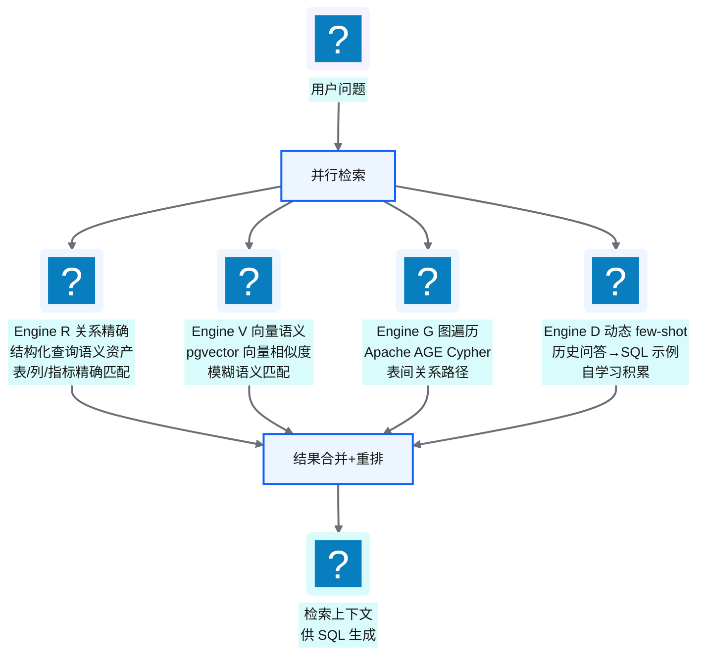
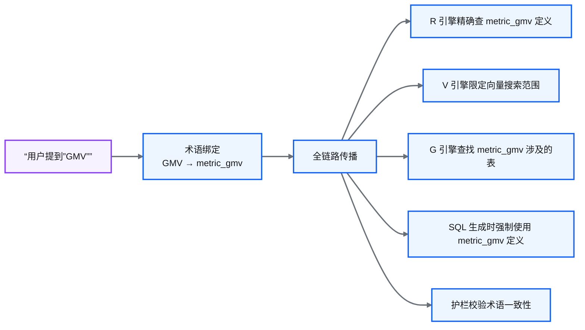
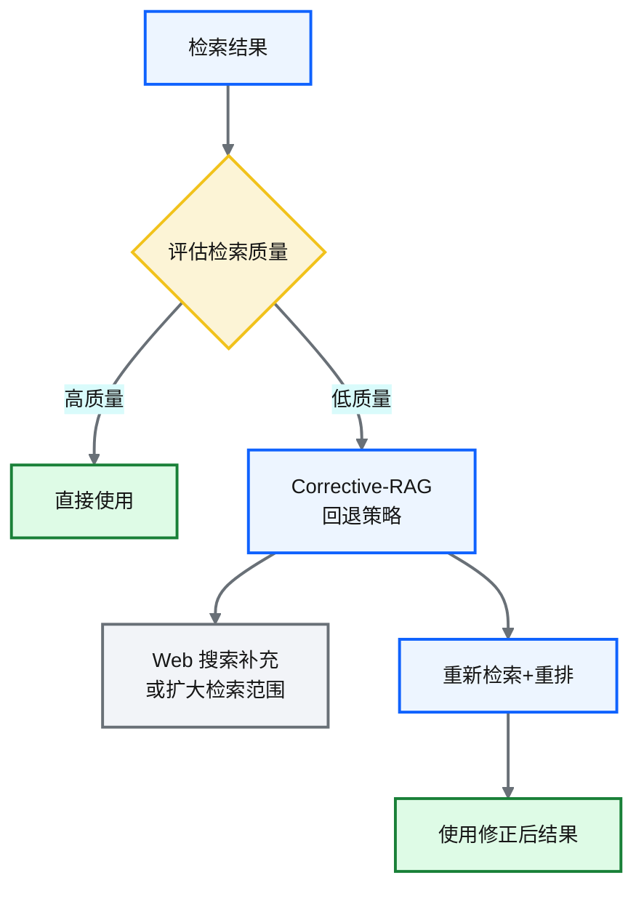

# Ch 41 R/V/G/D 四引擎 RAG 检索
!!! info "面包屑"
    [本书主页](./index.md) › [Part VII Data+AI 转型](./40-语义平面-三层治理与Git-YAML.md) › Ch 41

!!! abstract "项目第 4 年 · Data+AI转型期——四引擎RAG"

---

## :material-school: 本章你将学到
- 四引擎 RAG：R（关系精确）/ V（向量语义）/ G（图遍历）/ D（动态 few-shot）
- 术语绑定强路由：业务术语全链路传播
- Corrective-RAG 回退与重排
- Naive→Advanced→Modular RAG 演进谱系

---

## 41.1 四引擎 RAG：R/V/G/D

**图 41-1** 四引擎 RAG：R/V/G/D

| 引擎 | 检索方式 | 解决的问题 | 技术 |
|---|---|---|---|
| **R（关系精确）** | 结构化查询语义资产表 | 精确匹配表/列/指标 | 关系型查询 |
| **V（向量语义）** | 向量相似度搜索 | 模糊语义匹配（"销量"≈"处方量"） | pgvector |
| **G（图遍历）** | 图查询表间关系 | join 路径发现 | Apache AGE + Cypher |
| **D（动态 few-shot）** | 检索历史问答示例 | 类似问题的 SQL 参考 | 向量检索 + 自积累 |

**表 41-1** 四引擎 RAG：R/V/G/D

### 为什么需要四引擎而非单一向量检索

!!! warning "Trade-off"
    单一向量检索（V）是大多数 RAG 系统的默认选择，但在 NL2SQL 场景不够：
    - V 擅长"语义相似"但不擅长"精确匹配"——用户问"GMV"时，V 可能返回"销售额"而非精确的 GMV 指标定义
    - V 不擅长"关系推理"——"哪些表能 join"需要图遍历（G）
    - V 不擅长"示例学习"——"类似问题之前怎么解的"需要 few-shot（D）

    四引擎互补：R 保证精确性，V 保证灵活性，G 保证关系推理，D 保证经验复用。

---

## 41.2 术语绑定强路由：业务术语全链路传播

**图 41-2** 术语绑定强路由：业务术语全链路传播

### 术语绑定的价值

| 场景 | 无术语绑定 | 有术语绑定 |
|---|---|---|
| 用户问"GMV 趋势" | LLM 可能猜错 GMV 定义 | 强制使用 metric_gmv 的精确定义 |
| 用户问"华东 GMV" | 可能 join 错区域表 | G 引擎沿 metric_gmv 的表路径找区域维度 |
| 生成 SQL 后 | 护栏不知道"GMV"该用什么 | 护栏校验 SQL 中的 GMV 计算是否符合定义 |

**表 41-2** 术语绑定的价值

!!! tip "引申"
    术语绑定强路由是 the-ttd 区别于"普通 RAG"的关键创新。普通 RAG 是"检索完就完了"，LLM 可能忽略检索结果；术语绑定是"检索结果强制注入全链路"——从检索到生成到护栏，GMV 这个术语始终绑定到 metric_gmv，不会被 LLM "自由发挥"。

---

## 41.3 Corrective-RAG 回退与重排

**图 41-3** Corrective-RAG 回退与重排

| 检索质量 | 策略 |
|---|---|
| 高（相关度分数高） | 直接使用 |
| 中（部分相关） | 重排后使用 |
| 低（不相关） | CRAG 回退：扩大范围/补充检索 |

**表 41-3** Corrective-RAG 回退与重排

---

## 41.4 引申：Naive→Advanced→Modular RAG 演进谱系

**图 41-4** 引申：Naive→Advanced→Modular RAG 演进谱系

| 阶段 | 特征 | 代表 |
|---|---|---|
| Naive | 单次向量检索→生成 | 早期 ChatGPT 插件 |
| Advanced | 检索前优化（查询改写）+检索后重排 | :simple-langchain: LangChain RAG |
| **Modular** | **多引擎并行+CRAG 回退+术语绑定** | **the-ttd** |

**表 41-4** 引申：Naive→Advanced→Modular RAG 演进谱系

!!! tip "引申"
    RAG 的演进方向是"从单引擎到多引擎、从一次性到自适应"。the-ttd 的四引擎 + CRAG + 术语绑定属于 Modular RAG——它不是"检索一次就交给 LLM"，而是"多角度检索+质量评估+回退修正"。这是企业级 RAG 与"demo RAG"的区别。

---

## :material-check-circle: 本章小结
- 四引擎 RAG：R（关系精确）/ V（向量语义）/ G（图遍历）/ D（动态 few-shot）——互补解决精确性/灵活性/关系推理/经验复用
- 术语绑定强路由：业务术语（如 GMV）→ 绑定技术资产（metric_gmv）→ 全链路传播（检索/生成/护栏）
- Corrective-RAG：检索质量低时回退扩大范围+重排——自适应修正
- RAG 演进：Naive（单次检索）→ Advanced（优化+重排）→ Modular（多引擎+回退+术语绑定）——the-ttd 属于 Modular

---

!!! quote "下一章"
    [Ch 42 Agent 编排：LangGraph 与状态机](./42-Agent编排-LangGraph与状态机.md) —— 检索完了，接下来看 Agent 怎么编排这些步骤。

