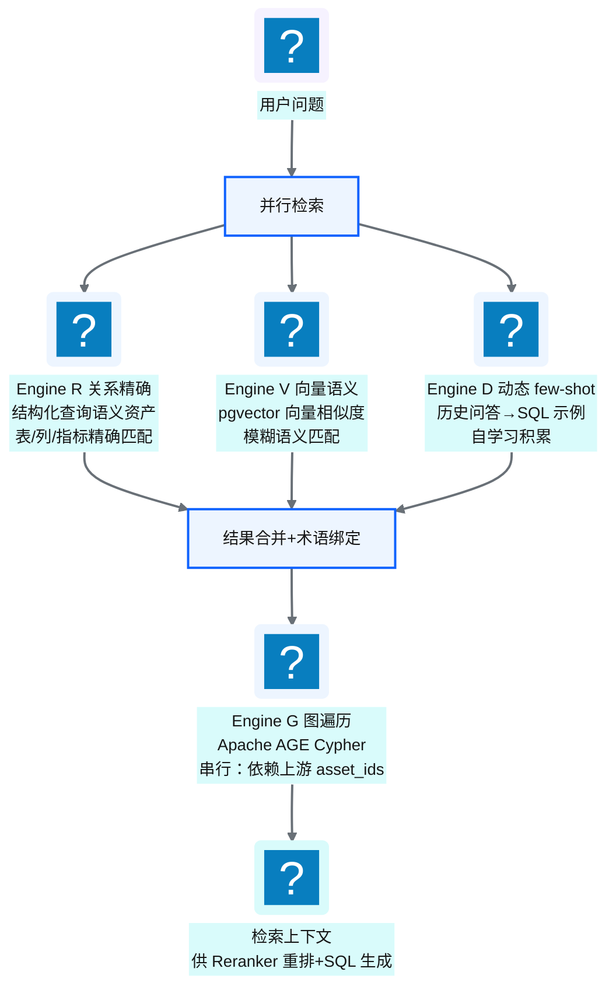
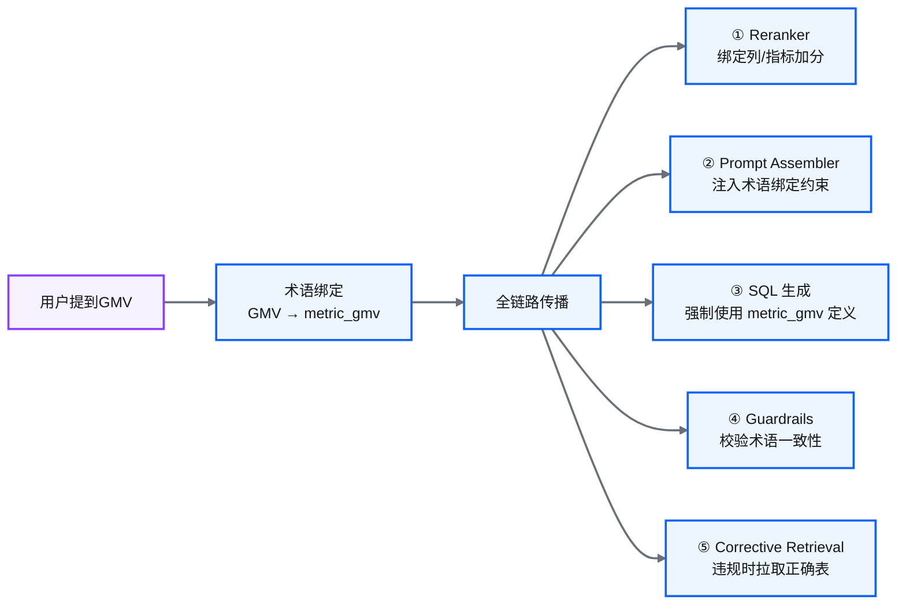
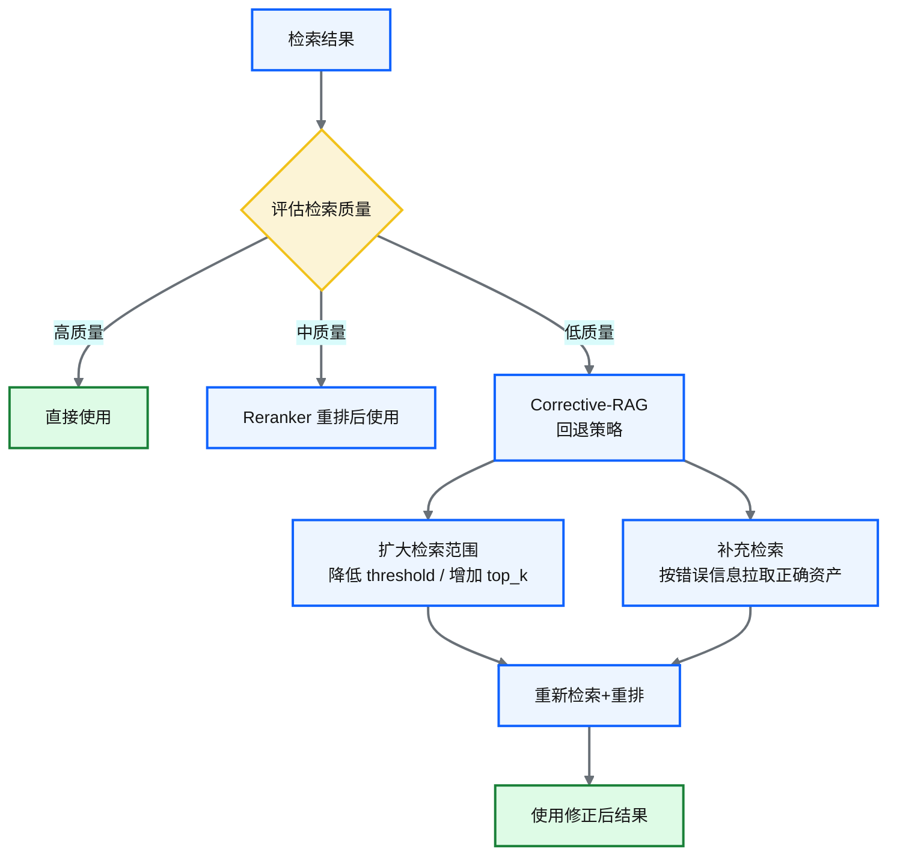
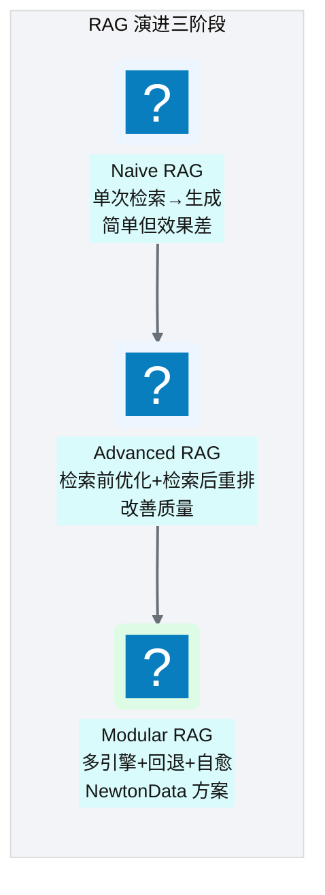

# Ch 41 R/V/G/D 四引擎 RAG 检索
!!! info "面包屑"
    [本书主页](./index.md) › [Part VII Data+AI 转型](./40-语义平面-三层治理与Git-YAML.md) › Ch 41

!!! abstract "项目第 4 年 · Data+AI转型期——四引擎RAG"

---

## :material-school: 本章你将学到
- 四引擎 RAG：R（关系精确）/ V（向量语义）/ G（图遍历）/ D（动态 few-shot）——各引擎的访问模式、目标表与并行/串行协作
- Reranker 四阶段重排：术语绑定提升 → QU 信号 → 动态列裁剪 → Join 路径简化
- 术语绑定强路由：业务术语全链路传播（检索→重排→Prompt→护栏→自愈）
- Corrective-RAG 回退与重排（含 Self-RAG / CRAG 理论引用）
- Token 预算分配与上下文压缩
- Naive→Advanced→Modular RAG 演进谱系与当前实现可改进之处

---

## 41.1 四引擎 RAG：R/V/G/D

[Ch 40](./40-语义平面-三层治理与Git-YAML.md) 把业务知识编码为语义资产发布到了检索引擎，这一章讲 AI 怎么检索这些资产。

我在专利数据领域做过类似的事。专利检索系统需要理解"同义词"——用户搜"锂电池"，系统要知道它也属于"二次电池""储能器件"。当时我们维护了一个专利术语词典，把同义词、上下位词编码为机器可读的映射，用一个倒排索引做精确匹配。但只靠精确匹配不够——用户问"和储能相关的专利"，需要语义相似度；问"这个分类下有哪些子类"，需要层级遍历。所以我们最终用了"精确匹配 + 语义召回 + 层级遍历"三路检索再融合。

Agentic BI 的四引擎 RAG 是这个思想的升级版——但检索对象从"专利文档"变成了"结构化语义资产"（表/列/指标/join/术语），多了一种"经验复用"（D 引擎），复杂度也高了一个量级。

### 为什么需要四引擎而非单一向量检索

通用 RAG（如文档问答）检索的是"知识 chunks"——一段段文本，用向量相似度召回即可。而 NL2SQL 检索的是**结构化元数据**——表定义、列属性、指标公式、join 规则、术语映射、业务规则。这些元数据有本质不同的访问模式：

| 检索需求 | 例子 | 适合的引擎 | 为什么单一向量不够 |
|---|---|---|---|
| 精确匹配 | "GMV 是什么" → 查术语定义 | R（关系查询，精确） | V 擅长"语义相似"但不擅长"精确匹配"——问"GMV"可能返回"销售额"而非精确的 GMV 定义 |
| 语义模糊 | "和销售相关的表" → 向量相似度 | V（pgvector，模糊） | R 只能精确匹配，"和销售相关的表"没有精确关键词可查 |
| 关系推理 | "fact_transaction 能 join 到哪些表" | G（图遍历，关系） | V 不擅长"关系推理"——"哪些表能 join"需要图遍历而非相似度 |
| 经验复用 | "上次类似查询怎么写的" | D（动态 few-shot） | 以上三引擎都不提供"历史成功案例"参考 |

四引擎互补：R 保证精确性，V 保证灵活性，G 保证关系推理，D 保证经验复用。单一引擎无法同时优化这四种模式。


<p class="caption" markdown="span">**图 41-1** 四引擎 RAG：R/V/G/D 并行+串行协作</p>

| 引擎 | 目标表 | 访问模式 | 解决的问题 | 技术 |
|---|---|---|---|---|
| **R（关系精确）** | `semlayer.business_term` | LLM 提取的 search_terms 逐词 ILIKE | 精确匹配表/列/指标——"GMV"不能靠向量近似 | 关系型查询 |
| **V（向量语义）** | 7 张 `*_embedding` 表 | pgvector cosine, top-k, threshold=0.65 | 模糊语义召回——"和销售相关的表" | pgvector |
| **G（图遍历）** | AGE `ttd_governance` 图 | Cypher 遍历, depth=3 | 关系推理——join 路径、术语网络、治理边界 | Apache AGE + Cypher |
| **D（动态 few-shot）** | `semlayer.dynamic_few_shot_cache` | cosine ≥ 0.95 + approved | 经验复用——从修复成功中自学习的 few-shot | 向量检索 + 自积累 |
<p class="caption" markdown="span">**表 41-1** 四引擎职责深度解析</p>


### 并行与串行的设计原理

Engine R+V+D **并行执行**（`asyncio.gather`），Engine G **串行**（依赖上游 asset_ids 做图遍历）。这是依赖关系决定的——图遍历需要先知道有哪些 asset，才能遍历它们的关系。这个设计把无依赖的检索并行化以降低延迟，把有依赖的检索串行化以保证正确性。

落到代码，检索编排是一个 `async def` 函数，用 `asyncio.gather` 并行拉起 R/V/D 三路检索，合并后再触发 G 图遍历：

```python
# 示意：四引擎检索编排（R+V+D 并行，G 串行）
import asyncio

async def data_retrieval(state):
    embedding = state["question_embedding"]
    search_terms = from_query_understanding(state["qu"])  # 复用 QU 的 LLM 输出，零额外调用

    # Engine R + V + D 并行（asyncio.gather）
    term_hits, vector_results, dynamic_few_shots = await asyncio.gather(
        exact_term_match(search_terms),                    # Engine R：ILIKE 精确匹配 business_term
        pgvector_search(embedding, top_k=20, threshold=0.65),  # Engine V：向量相似度
        dynamic_few_shot_cache.search_similar(embedding),   # Engine D：历史成功问答
    )

    # 合并：Engine D 的 few-shot 追加到 V 结果中（仅 approved + sim ≥ 0.95）
    if dynamic_few_shots:
        vector_results["few_shots"].extend(dynamic_few_shots)

    # 构建术语绑定视图（核心创新，见 41.3）
    term_bindings = build_term_bindings(term_hits, vector_results["terms"])

    # Engine G 串行：依赖上游 asset_ids 做图遍历
    all_asset_ids = collect_asset_ids(vector_results)
    graph_context = await graph_traversal(all_asset_ids, depth=3)  # Cypher 遍历 join 路径

    return {
        "retrieval_results": {**vector_results, "_term_bindings": term_bindings},
        "graph_context": graph_context,     # join 路径供 Ch 43 Steiner 树消费
    }
```

!!! tip "引申：基石回扣——从被动血缘到主动语义资产"
    四引擎检索的对象是 [Ch 40](./40-语义平面-三层治理与Git-YAML.md) 发布的语义资产，而这些资产是 [Ch 20](./20-元数据管理与数据血缘.md) 元数据管理的演进。Ch 20 的被动血缘（审计日志、batch_id 关联）只能"事后追溯数据怎么来的"；语义资产则是"主动的、机器可读的业务知识"——它不只描述"表结构是什么"，还描述"这个字段在业务上意味着什么、应该怎么用、和别的字段什么关系"。四引擎 RAG 正是消费这些主动语义资产的运行时机制。

---

## 41.2 Reranker 四阶段重排

四引擎并行检索回来的上下文不能直接塞进 Prompt——可能有几十张表、上百个列，既超 token 预算又稀释关键信号。Reranker 对检索结果做检索后优化（post-retrieval），这是 Advanced RAG 的核心模块。

| 阶段 | 动作 | 理论依据 |
|---|---|---|
| **① 术语绑定提升** | 绑定列 boost 到 0.95，父表 +0.25，无绑定表 -0.10 | 强信号优先——术语绑定是高置信度信号 |
| **② QU 信号重排** | 匹配 metric/entity 加分，certified 资产加分 | 查询理解信号应影响检索排序 |
| **③ 动态列裁剪** | 保留 metric/dimension/filter 相关、PK/FK/时间列，裁剪无关列 | 上下文压缩——只保留相关列，省 token |
| **④ Join 路径简化** | 按 fanout 风险去重，优先 low risk | 避免高扇出 join 导致重复计数 |
<p class="caption" markdown="span">**表 41-2** Reranker 四阶段重排</p>


<p class="caption" markdown="span">**图 41-2** Reranker 四阶段重排</p>

### 重排算法：规则 vs Cross-encoder

!!! tip "引申：重排算法理论"
    检索重排（Reranking）是 RAG 提升精度的关键环节，主流方法有三类：

    - **Cross-encoder 模型**：把 query 和 document 拼接输入 BERT 类模型，输出相关性分数。精度最高但慢（每个 query-doc 对都要前向传播）。代表：BGE-reranker、Cohere Rerank。
    - **Bi-encoder + 近似最近邻**：query 和 doc 分别编码，向量相似度召回。快但精度低——这正是 Engine V 做的。
    - **规则重排**：基于领域信号（如术语绑定、certified 状态）手工规则加分/降权。快、可解释、领域定制性强，但精度不及模型。

    NewtonData 当前用**规则重排**（阶段 ①②），优势是快且可解释，劣势是精度不及 cross-encoder 模型。改进方向是支持 Admin 配置的 Reranker 模型，在精度要求高的场景启用 cross-encoder。

---

## 41.3 术语绑定强路由：业务术语全链路传播

术语绑定强路由是 NewtonData 区别于"普通 RAG"的**核心创新**，也是降低 NL2SQL 幻觉的关键手段。普通 RAG 是"检索完就完了"，LLM 可能忽略检索结果；术语绑定是"检索结果强制注入全链路"——从检索到生成到护栏，GMV 这个术语始终绑定到 `metric_gmv`，不会被 LLM "自由发挥"。

当 Engine R 命中了带 `mapped_asset_id` 的术语（如"GMV" → `metric_gmv`），这个绑定作为**强路由信号**贯穿全管道五个环节：

```python
# 示意：术语绑定数据结构
_term_bindings = [
    {
        "term_id": "term_gmv",
        "canonical_term": "GMV",
        "mapped_asset_type": "metric",
        "mapped_asset_id": "metric_gmv",   # 核心意图：业务术语→技术资产，强路由绑定
    },
]
```


<p class="caption" markdown="span">**图 41-3** 术语绑定强路由：业务术语全链路传播</p>

| 环节 | 术语绑定的作用 |
|---|---|
| **① Reranker** | 绑定列/指标加分（0.95），其父表提升（+0.25），不含绑定列的表降权（-0.10） |
| **② Prompt Assembler** | 注入"## 术语绑定约束"，明确告知 LLM 必须从哪取该列 |
| **③ SQL 生成** | 强制使用 `metric_gmv` 的定义（`SUM(amount) WHERE status='completed'`） |
| **④ Guardrails** | Layer 4 术语绑定语义校验，拦截引用到错误表的 SQL |
| **⑤ Corrective Retrieval** | 检测到绑定违规时，优先按绑定关系拉取正确表 |
<p class="caption" markdown="span">**表 41-3** 术语绑定全链路传播的五个环节</p>


### 术语绑定的价值

| 场景 | 无术语绑定 | 有术语绑定 |
|---|---|---|
| 用户问"GMV 趋势" | LLM 可能猜错 GMV 定义 | 强制使用 metric_gmv 的精确定义 |
| 用户问"华东 GMV" | 可能 join 错区域表 | G 引擎沿 metric_gmv 的表路径找区域维度 |
| 生成 SQL 后 | 护栏不知道"GMV"该用什么 | 护栏校验 SQL 中的 GMV 计算是否符合定义 |
| 检索失败时 | 硬生成，可能幻觉列 | Corrective Retrieval 按绑定关系补充正确表 |
<p class="caption" markdown="span">**表 41-4** 术语绑定的价值</p>


!!! tip "引申"
    术语绑定强路由把"术语消歧"从"LLM 的自觉"变为"全链路强制的硬约束"——这是 NewtonData 提升 SQL 准确性的核心手段。术语绑定的资产定义在 [Ch 40](./40-语义平面-三层治理与Git-YAML.md) 的 L2 术语治理层（`term: "GMV" → metric: metric_gmv`），校验在 [Ch 44](./44-五层SQL护栏与执行安全.md) 的第四层护栏（术语语义校验），自愈在 [Ch 42](./42-Agent编排-LangGraph与状态机.md) 的修复回路（corrective_retrieval）。一个术语绑定信号贯穿三章四个环节——这是 Agentic BI "受控自治"的微观体现。

---

## 41.4 Corrective-RAG：检索质量评估与回退

检索回来的上下文不一定都靠谱——可能召回不全、可能相关度低。如果不评估检索质量就直接生成 SQL，错误会传播到下游。Corrective-RAG（CRAG）的核心思想是：**检索质量不够时不硬生成，而是评估检索结果质量，低质量时触发纠正——改写查询重新检索或补充检索**。

| 检索质量 | 判据 | 策略 |
|---|---|---|
| **高**（相关度分数高） | 术语绑定命中 + 向量 top-k 分数 > 0.8 | 直接使用 |
| **中**（部分相关） | 部分术语命中 + 分数 0.65-0.8 | Reranker 重排后使用 |
| **低**（不相关） | 无术语命中 + 分数 < 0.65 | CRAG 回退：扩大范围 / 补充检索 |
<p class="caption" markdown="span">**表 41-5** Corrective-RAG 检索质量三级评估</p>


<p class="caption" markdown="span">**图 41-4** Corrective-RAG 回退与重排</p>

!!! tip "引申：CRAG 与 Self-RAG 理论"
    CRAG（Corrective Retrieval Augmented Generation，[arxiv.org/abs/2401.15884](https://arxiv.org/abs/2401.15884)）的核心思想：检索后自评估，质量差时触发重新检索或改写。它与 Self-RAG（[arxiv.org/abs/2310.11511](https://arxiv.org/abs/2310.11511)）一脉相承——Self-RAG 让 LLM 自主决定何时检索、检索什么、是否采纳检索结果。

    NewtonData 的 corrective_retrieval 是 CRAG 的简化版：不评估检索质量（无 retrieval confidence score），而是在护栏失败后才触发补充检索——检测到术语绑定违规时优先按绑定关系拉取正确表，检测到列引用错误时拉取可用列清单。改进方向是把检索评估前置（pre-generation），而非等生成失败后才纠正。

---

## 41.5 Token 预算分配与上下文压缩

检索结果经过 Reranker 重排后，仍可能超出 LLM 的上下文窗口。为避免上下文爆炸，按类别分配 Prompt 空间——这是 Advanced RAG 的 compress 模块：

| 类别 | 预算占比 | 说明 |
|---|---|---|
| **tables** | 30% | 表定义是 NL2SQL 的基础，占最大预算 |
| **columns** | 25% | 列属性（含别名/数据类型/暴露策略）次之 |
| **metrics** | 15% | 指标定义与计算规则 |
| **few_shots** | 10% | 动态 few-shot 示例 |
| **join_rules** | 10% | Join 路径规则（供 Steiner 树消费） |
| **business_rules** | 10% | 业务规则约束 |
<p class="caption" markdown="span">**表 41-6** Token 预算分配</p>

Token 预算分配的本质是**上下文压缩**——不是把检索到的所有东西都塞进 Prompt，而是按类别裁剪到预算内，优先保留高信号内容（术语绑定的列、certified 的资产、与 QU 匹配的 metric）。这与 [Ch 40](./40-语义平面-三层治理与Git-YAML.md) 的 `build_few_shot()` 分级注入（simple=2/medium=4/complex=6）是同一个思想——按查询复杂度动态控制注入量。

---

## 41.6 引申：Naive→Advanced→Modular RAG 演进谱系


<p class="caption" markdown="span">**图 41-5** Naive→Advanced→Modular RAG 演进谱系</p>

| 阶段 | 特征 | 代表 |
|---|---|---|
| **Naive** | 单次向量检索→生成；无重排、无质量评估、上下文冗余 | 早期 ChatGPT 插件 |
| **Advanced** | 检索前优化（查询改写）+ 检索后重排（rerank）+ 上下文压缩（compress）+ 多路召回 | :simple-langchain: LangChain RAG、LlamaIndex |
| **Modular** | 多引擎并行 + CRAG 回退 + 术语绑定 + 可插拔模块（Router/Fusion/Corrective/Self-RAG） | Microsoft GraphRAG、**NewtonData** |
<p class="caption" markdown="span">**表 41-7** Naive→Advanced→Modular RAG 演进谱系</p>


!!! tip "引申：RAG 范式演进理论"
    RAG（Retrieval-Augmented Generation）技术经历了清晰的三个范式阶段（参考 survey: [arxiv.org/abs/2312.10997](https://arxiv.org/abs/2312.10997)）：

    - **Naive RAG**：Index → Retrieve → Generate，把文档切块、向量化、检索 top-k、拼进 prompt。问题：召回不准、无重排、上下文冗余、无质量评估。
    - **Advanced RAG**：在检索前（pre-retrieval）做 query 改写/扩展；检索后（post-retrieval）做重排、压缩；多路召回。NewtonData 的 R+V 多路召回 + Reranker 重排 + Token 预算压缩属于这一层。
    - **Modular RAG**：把 RAG 拆为可插拔模块——Router（决定检索什么）、Fusion（多查询结果融合，如 RRF）、Corrective RAG（检索后自评估纠错）、Self-RAG（LLM 自主决定何时检索）。NewtonData 的 G 图增强是 GraphRAG 思想，corrective_retrieval 是 CRAG 工程实现，术语绑定是 NL2SQL 特有的强路由信号。NewtonData 横跨了 Advanced 到 Modular RAG。

### 当前实现可改进之处

!!! warning "Trade-off：四引擎 RAG 的架构局限"
    1. **检索阶段缺乏查询分解**：复杂问题（如"对比华东和华北的 GMV 趋势"）单次检索召回不全——架构上缺少 query decomposer 模块做子查询分解与并行检索。改进方向：引入多查询生成与结果融合（参考 RAG-Fusion，[arxiv.org/abs/2402.03367](https://arxiv.org/abs/2402.03367)）。
    2. **重排策略规则化而非模型化**：当前 Reranker 是基于领域信号的规则重排，精度不及 cross-encoder 模型。改进方向：架构上支持可插拔的 Reranker 模型，在精度要求高的场景启用 BGE-reranker / Cohere Rerank 等。
    3. **检索质量评估未常态化**：检索后自评估仅在特定路由启用，未形成"评估→低分自动纠错"的闭环。改进方向：将 Self-RAG 的自评估机制常态化（[arxiv.org/abs/2310.11511](https://arxiv.org/abs/2310.11511)），每次检索后评估，低分自动触发纠正。
    4. **向量引擎规模上限**：单机向量检索在百万级 embedding 尚可，千万级会退化。改进方向：抽象 VectorStore 接口，生产态可切换专用向量数据库（Qdrant/Milvus），保持检索层接口不变。

---

## :material-check-circle: 本章小结
- 四引擎 RAG：R（关系精确）/ V（向量语义）/ G（图遍历）/ D（动态 few-shot）——R+V+D 并行（asyncio.gather），G 串行（依赖上游 asset_ids），互补解决精确性/灵活性/关系推理/经验复用
- Reranker 四阶段重排：术语绑定提升 → QU 信号 → 动态列裁剪 → Join 路径简化——规则重排优先（快且可解释），cross-encoder 模型为改进方向
- 术语绑定强路由：业务术语（GMV）→ 绑定技术资产（metric_gmv）→ 全链路传播五个环节（Reranker / Prompt / SQL 生成 / Guardrails / Corrective Retrieval）——把术语消歧从"LLM 自觉"变为"硬约束"
- Corrective-RAG：检索质量低时回退扩大范围+补充检索——CRAG 的工程实现（[arxiv.org/abs/2401.15884](https://arxiv.org/abs/2401.15884)），与 Self-RAG（[arxiv.org/abs/2310.11511](https://arxiv.org/abs/2310.11511)）一脉相承
- Token 预算分配：tables 30% / columns 25% / metrics 15% / few_shots 10% / join_rules 10% / business_rules 10%——上下文压缩避免 Prompt 爆炸
- RAG 演进：Naive（单次检索）→ Advanced（优化+重排）→ Modular（多引擎+回退+术语绑定）——NewtonData 属于 Modular（[arxiv.org/abs/2312.10997](https://arxiv.org/abs/2312.10997)）

---

!!! quote "下一章"
    [Ch 42 Agent 编排：LangGraph 与状态机](./42-Agent编排-LangGraph与状态机.md) —— 检索完了，接下来看 Agent 怎么编排这些步骤。
