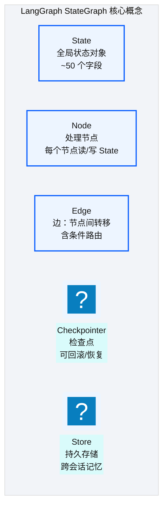
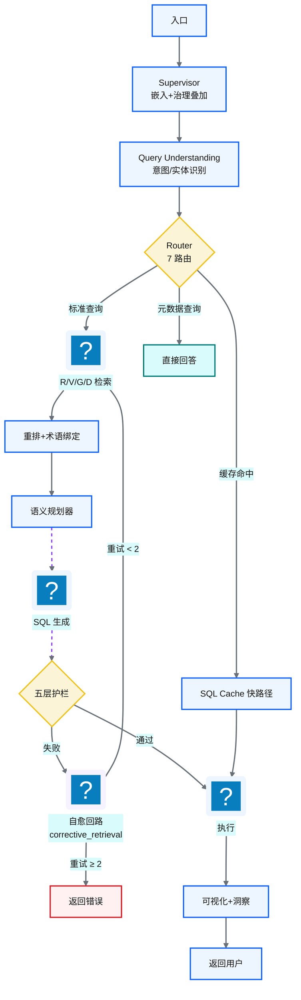
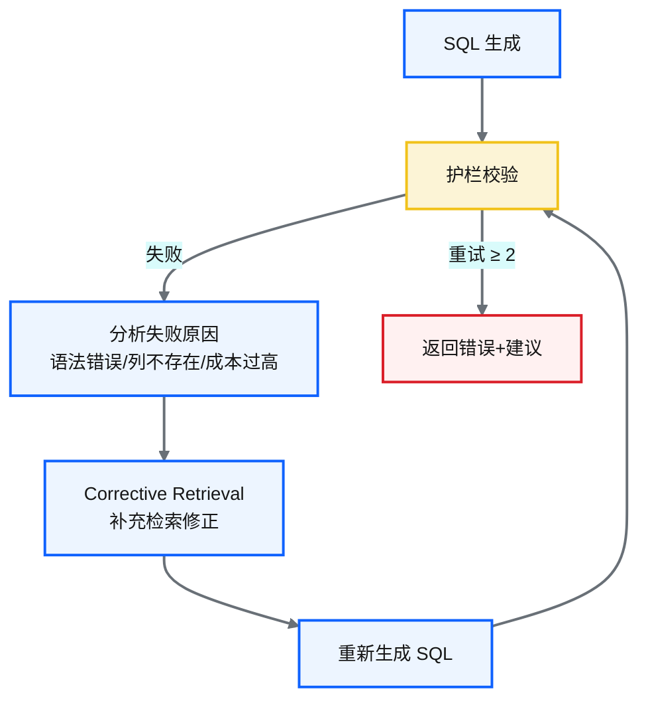
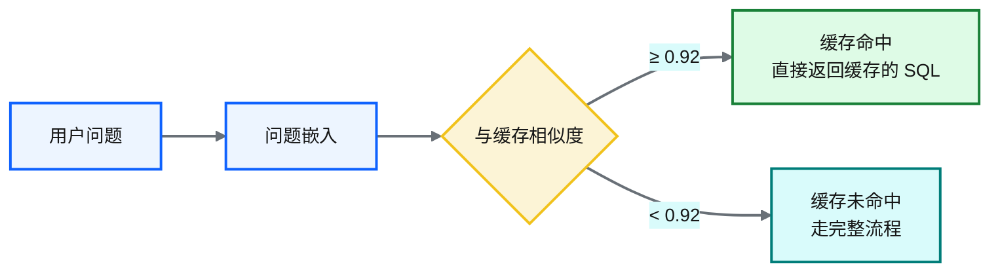
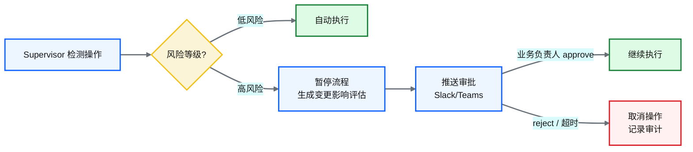
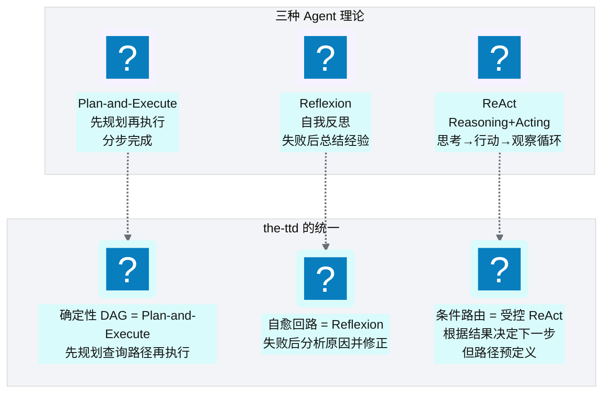

# Ch 42 Agent 编排：LangGraph 与状态机
!!! info "面包屑"
    [本书主页](./index.md) › [Part VII Data+AI 转型](./41-RVGD四引擎RAG检索.md) › Ch 42

!!! abstract "项目第 4 年 · Data+AI转型期——Agent编排"

---

## :material-school: 本章你将学到
- LangGraph StateGraph 机制：State/Node/Edge/Checkpointer/Store（含 State TypedDict 与 StateGraph 骨架伪代码）
- 节点拓扑、路由决策与状态模型设计（含 9 节点 + 7 条件路由装配伪代码）
- 修复回路与 SQL 缓存快路径（含自愈节点、缓存命中伪代码）+ HITL 审批流程
- ReAct / Plan-and-Execute / Reflexion 三理论的统一

---

## 42.1 LangGraph StateGraph 机制
LangGraph 是 :simple-langchain: LangChain 出品的 Agent 编排框架，核心抽象是 **StateGraph（状态图）**——把 Agent 流程建模为"状态驱动的有向图"。


<p class="caption" markdown="span">**图 42-1** LangGraph StateGraph 机制</p>

| 概念 | 作用 | 在 the-ttd 中的体现 |
|---|---|---|
| **State** | 全局状态，在节点间传递 | ~50 字段（问题/意图/检索结果/SQL/错误/重试次数...） |
| **Node** | 处理单元，读写 State | 20+ 节点（Supervisor/QU/Router/RAG/Planner/Generator/Guardrail...） |
| **Edge** | 节点转移，含条件路由 | 7 条路由（正常/重试/缓存命中/护栏失败...） |
| **Checkpointer** | 状态检查点 | 可恢复中断的会话 |
| **Store** | 跨会话持久存储 | 记忆系统（见 [Ch 45](./45-记忆系统与工具使用.md)） |
<p class="caption" markdown="span">**表 42-1** LangGraph StateGraph 机制</p>


!!! tip "引申"
    LangGraph 与 CDP 平台的 Step Functions 是同一个思想——"状态机编排"。区别在于：Step Functions 编排 AWS 服务（Glue/Lambda），LangGraph 编排 LLM 调用和 :simple-python: Python 逻辑。两者的核心都是"把复杂流程建模为状态图+条件路由"，只是执行域不同。

把 StateGraph 机制落到代码，State 是一个 `TypedDict`（节点共用的全局状态），节点是读写 State 的函数，图通过 `add_node`/`add_edge`/`add_conditional_edges` 装配：

```python
# 示意：LangGraph State 定义 + StateGraph 骨架
from typing import TypedDict, Annotated
from langgraph.graph import StateGraph, END

class AgentState(TypedDict):
    # 核心意图：所有节点共享的全局状态（~50 字段的精简版）
    question: str                # 原始问题
    intent: str                  # QU 识别的意图
    entities: list               # 识别的实体/术语
    retrieved: list              # R/V/G/D 检索结果
    sql: str                     # 生成的 SQL
    error: str                   # 失败原因（供自愈）
    retry: int                   # 自愈重试次数
    result: list                 # 执行结果
    viz: dict                    # 可视化建议

graph = StateGraph(AgentState)
# 节点装配见 42.2
```

---

## 42.2 节点拓扑、路由决策与状态模型设计
### 节点拓扑


<p class="caption" markdown="span">**图 42-2** 节点拓扑</p>

### 7 条路由

| 路由 | 触发条件 | 去向 |
|---|---|---|
| 标准查询 | 正常分析问题 | RAG 检索 |
| 缓存命中 | 语义相似度 ≥ 0.92 | SQL Cache 快路径 |
| 元数据查询 | "有哪些表"类问题 | 直接回答 |
| 护栏通过 | SQL 校验通过 | 执行 |
| 护栏失败 | SQL 校验失败 | 自愈回路 |
| 重试上限 | 自愈 ≥ 2 次 | 返回错误 |
| 执行成功 | SQL 执行成功 | 可视化 |
<p class="caption" markdown="span">**表 42-2** 条路由</p>


上面的拓扑和路由落到 LangGraph 代码，就是把 9 个节点注册到图，再用 `add_conditional_edges` 声明 Router 和 Guard 的分支逻辑：

```python
# 示意：9 节点 + 7 条件路由的 LangGraph 装配
def router_branch(state: AgentState) -> str:        # Router 的 7 路由决策
    if state.get("cache_hit"):    return "cache"     # 语义相似度 ≥0.92 → 快路径
    if state["intent"] == "meta": return "meta"      # "有哪些表"类 → 直接回答
    return "rag"                                     # 标准查询

def guard_branch(state: AgentState) -> str:         # Guard 的护栏分支
    if state.get("guard_passed"): return "exec"
    if state["retry"] >= 2:        return END        # 自愈达上限 → 结束
    return "heal"                                    # 护栏失败 → 自愈

graph.add_node("supervisor", supervisor_node)
graph.add_node("qu",         query_understanding_node)
graph.add_node("rag",        rag_node)               # R/V/G/D 检索
graph.add_node("plan",       planner_node)           # Steiner 树规划（见 Ch 43）
graph.add_node("gen",        generate_sql_node)
graph.add_node("guard",      guardrail_node)         # 五层护栏（见 Ch 44）
graph.add_node("exec",       execute_node)
graph.add_node("viz",        visualize_node)
graph.add_node("heal",       heal_node)

graph.set_entry_point("supervisor")
graph.add_edge("supervisor", "qu")
graph.add_conditional_edges("qu", router_branch, {"rag": "rag", "cache": "exec", "meta": "viz"})
graph.add_edge("rag", "plan"); graph.add_edge("plan", "gen"); graph.add_edge("gen", "guard")
graph.add_conditional_edges("guard", guard_branch, {"exec": "exec", "heal": "heal", END: END})
graph.add_edge("heal", "rag")                        # 核心意图：自愈回路回到检索重新生成
graph.add_edge("exec", "viz"); graph.add_edge("viz", END)
app = graph.compile(checkpointer=MemorySaver())      # 检查点支持会话恢复
```

---

## 42.3 修复回路与 SQL 缓存快路径
### 修复回路（自愈）


<p class="caption" markdown="span">**图 42-3** 修复回路（自愈）</p>

自愈回路落到代码，关键是用护栏返回的失败原因构造"纠错反馈"，重新检索正确资产后再生成，并用 `retry` 计数防止无限循环：

```python
# 示意：自愈回路节点（corrective retrieval）
def heal_node(state: AgentState) -> dict:
    # 核心意图：用失败原因构造纠错反馈，重新检索后重生成
    feedback = f"上次生成的 SQL 失败：{state['error']}。请修正后重新生成。"
    corrected = rag_corrective(state["question"], state["error"])  # 补充检索正确列名/表名
    return {"retrieved": corrected, "retry": state["retry"] + 1,
            "error": ""}   # 清空 error，下一轮 gen 节点带纠错上下文重生成
```

| 自愈场景 | 修正方式 |
|---|---|
| SQL 语法错误 | 语法解析反馈→重新生成 |
| 列不存在 | R 引擎重新检索正确列名→重新生成 |
| 成本过高 | 规划器调整 join 策略→重新生成 |
| 术语不一致 | 术语绑定重新校准→重新生成 |
<p class="caption" markdown="span">**表 42-3** 示意：自愈回路节点（corrective retrieval）</p>


### SQL 缓存快路径


<p class="caption" markdown="span">**图 42-4** SQL 缓存快路径</p>

```python
# 示意：SQL 语义缓存快路径
def check_cache(question: str, threshold=0.92) -> str | None:
    # 核心意图：embedding 相似度 ≥ 阈值直接返回缓存 SQL，跳过检索+规划+生成
    q_emb = embed(question)
    hit = vector_store.search(q_emb, top_k=1)
    if hit and hit.score >= threshold:
        return hit.sql                      # 直接复用历史 SQL（可能需参数微调）
    return None
```

!!! warning "Trade-off"
    SQL 缓存快路径大幅降低延迟（跳过检索+规划+生成），但缓存命中率取决于问题分布。对于高频重复问题（如"昨天 GMV"），命中率很高；对于新颖问题，命中率低。相似度阈值 0.92 是精确性 vs 命中率的平衡——太高命中率低，太低可能返回错误 SQL。

### HITL 审批流程

并非所有操作都适合 Agent 自动执行——涉及 DDL（建表/删表）、大批量 DELETE、跨租户数据导出等高风险操作，必须引入**人工审批（Human-in-the-Loop, HITL）**。LangGraph 支持节点中断（interrupt），Supervisor 检测到高风险操作时暂停流程，推送审批到协作工具，审批通过后继续：


<p class="caption" markdown="span">**图 42-5** HITL 审批流程</p>

| 风险等级 | 操作类型 | 处理方式 |
|---|---|---|
| **低** | SELECT 查询、LIMIT 限制的结果集 | 自动执行 |
| **中** | 大结果集导出、跨域聚合 | 自动执行 + 审计记录 |
| **高** | DDL、大批量 DELETE/UPDATE、跨租户导出 | HITL 审批 |
<p class="caption" markdown="span">**表 42-4** HITL 审批流程</p>


!!! tip "引申"
    HITL 是"受控自治"的最后一道阀门——Agent 可以自治处理低风险操作提升效率，但高风险操作必须有人类把关。这与医药行业 GxP 的"可归属"原则一致：高风险变更必须可追溯到审批人。HITL 把"AI 的效率"和"合规的可控"结合在一起，是企业级 Agentic BI 区别于个人 AI 助手的关键。

---

## 42.4 引申：ReAct / Plan-and-Execute / Reflexion 三理论的统一

<p class="caption" markdown="span">**图 42-6** 引申：ReAct / Plan-and-Execute / Re...</p>

| 理论 | 核心思想 | 在 the-ttd 中的体现 |
|---|---|---|
| **ReAct** | 思考→行动→观察循环 | 条件路由（受控版） |
| **Plan-and-Execute** | 先规划再执行 | 确定性 DAG + 语义规划器 |
| **Reflexion** | 失败后自我反思 | 自愈回路（corrective retrieval） |
<p class="caption" markdown="span">**表 42-5** 引申：ReAct / Plan-and-Execute / Reflexion 三理论的统一</p>


!!! tip "引申"
    the-ttd 不是简单套用某一种理论，而是"取三者之长"——Plan-and-Execute 的"先规划"保证流程有序，Reflexion 的"自我修正"保证容错性，ReAct 的"根据结果决策"保证灵活性。但与纯 ReAct 不同，the-ttd 的"决策"是预定义的条件路由而非 LLM 自主决策——这是企业级可靠性需要的"受控自治"。

---

## :material-check-circle: 本章小结
- LangGraph StateGraph：State（TypedDict，~50 字段全局状态）+ Node（20+ 节点）+ Edge（7 条路由）+ Checkpointer + Store
- 节点拓扑：Supervisor→QU→Router→RAG→Plan→Gen→Guard→Exec→Viz，9 节点 + 7 条件路由用 add_conditional_edges 装配
- 自愈回路：护栏失败→分析原因→corrective retrieval→重新生成，最多 2 次——Reflexion 思想（含 heal_node 伪代码）
- SQL 缓存快路径：相似度 ≥ 0.92 直接返回缓存 SQL，跳过检索+规划+生成
- HITL 审批流程：高风险操作（DDL/大批量 DELETE/跨租户导出）Supervisor 暂停→推送审批→通过继续/拒绝取消，兼顾 AI 效率与合规可控
- 三理论统一：Plan-and-Execute（先规划）+ Reflexion（自愈）+ 受控 ReAct（条件路由）——"受控自治"

---

!!! quote "下一章"
    [Ch 43 语义查询规划器：Steiner 树与代数改写](./43-语义查询规划器-Steiner树与代数改写.md) —— Agent 编排清楚了，接下来看查询规划器如何用 Steiner 树解决 join 路径问题。

