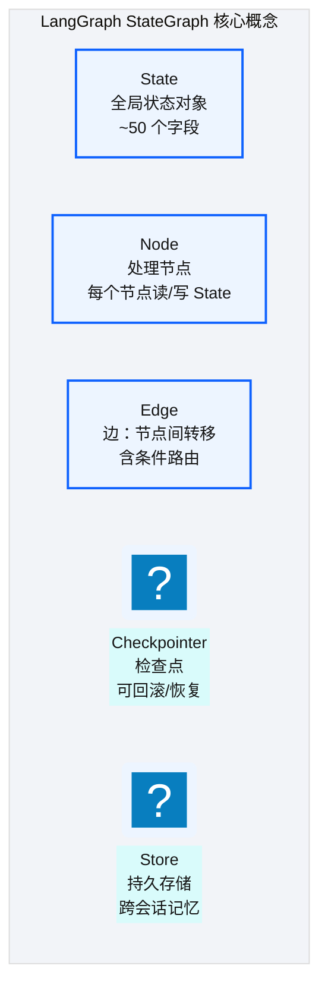
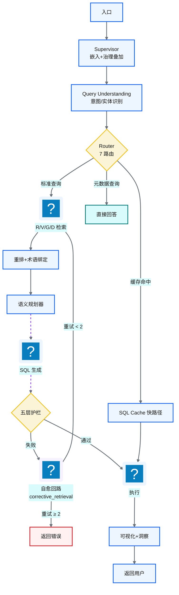
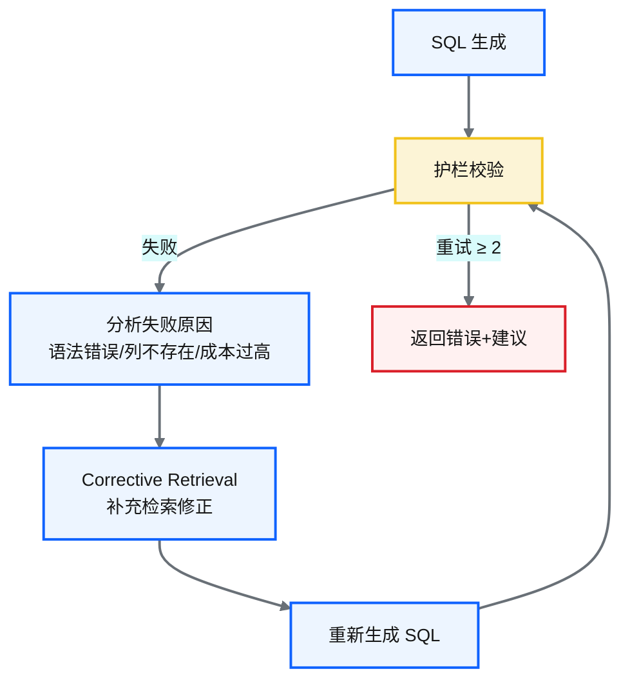
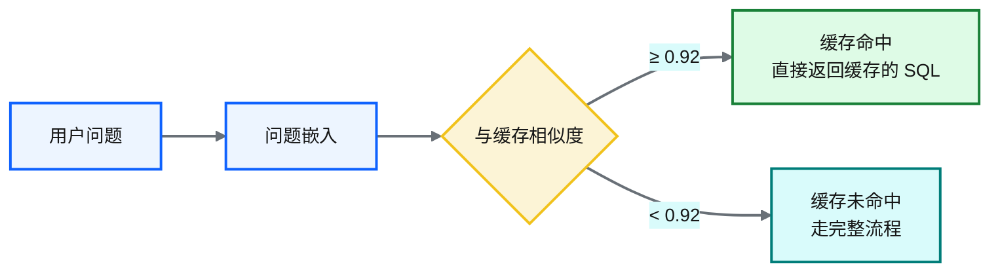
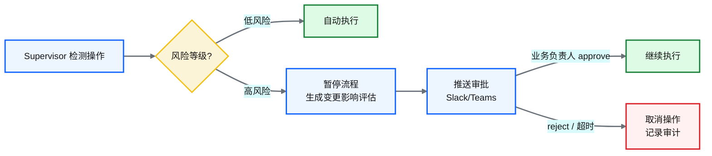
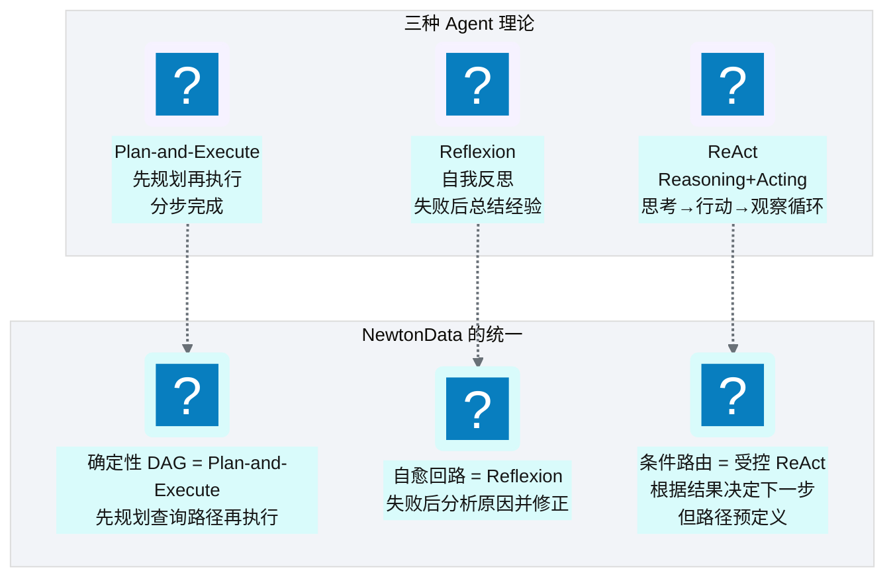

# Ch 42 Agent 编排：LangGraph 与状态机
!!! info "面包屑"
    [本书主页](./index.md) › [Part VII Data+AI 转型](./41-RVGD四引擎RAG检索.md) › Ch 42

!!! abstract "项目第 4 年 · Data+AI转型期——Agent编排"

---

## :material-school: 本章你将学到
- LangGraph StateGraph 机制：State/Node/Edge/Checkpointer/Store（含 State TypedDict 与 StateGraph 骨架伪代码）
- 节点拓扑、路由决策与状态模型设计（含 9 节点 + 7 条件路由装配伪代码）
- 修复回路与 SQL 缓存快路径（含自愈节点、缓存命中伪代码）+ HITL 审批流程
- ReAct / Plan-and-Execute / Reflexion 三理论的统一

---

## 42.1 LangGraph StateGraph 机制
LangGraph 是 :simple-langchain: LangChain 出品的 Agent 编排框架，核心抽象是 **StateGraph（状态图）**——把 Agent 流程建模为"状态驱动的有向图"。


<p class="caption" markdown="span">**图 42-1** LangGraph StateGraph 机制</p>

| 概念 | 作用 | 在 NewtonData 中的体现 |
|---|---|---|
| **State** | 全局状态，在节点间传递 | ~50 字段（问题/意图/检索结果/SQL/错误/重试次数...） |
| **Node** | 处理单元，读写 State | 20+ 节点（Supervisor/QU/Router/RAG/Planner/Generator/Guardrail...） |
| **Edge** | 节点转移，含条件路由 | 7 条路由（正常/重试/缓存命中/护栏失败...） |
| **Checkpointer** | 状态检查点 | 可恢复中断的会话 |
| **Store** | 跨会话持久存储 | 记忆系统（见 [Ch 45](./45-记忆系统与工具使用.md)） |
<p class="caption" markdown="span">**表 42-1** LangGraph StateGraph 机制</p>


!!! tip "引申"
    LangGraph 与 CDP 平台的 Step Functions 是同一个思想——"状态机编排"。区别在于：Step Functions 编排 AWS 服务（Glue/Lambda），LangGraph 编排 LLM 调用和 :simple-python: Python 逻辑。两者的核心都是"把复杂流程建模为状态图+条件路由"，只是执行域不同。

把 StateGraph 机制落到代码，State 是一个 `TypedDict`（节点共用的全局状态），节点是读写 State 的函数，图通过 `add_node`/`add_edge`/`add_conditional_edges` 装配：

```python
# 示意：LangGraph State 定义 + StateGraph 骨架
from typing import TypedDict, Annotated
from langgraph.graph import StateGraph, END

class AgentState(TypedDict):
    # 核心意图：所有节点共享的全局状态（~50 字段的精简版）
    question: str                # 原始问题
    intent: str                  # QU 识别的意图
    entities: list               # 识别的实体/术语
    retrieved: list              # R/V/G/D 检索结果
    sql: str                     # 生成的 SQL
    error: str                   # 失败原因（供自愈）
    retry: int                   # 自愈重试次数
    result: list                 # 执行结果
    viz: dict                    # 可视化建议

graph = StateGraph(AgentState)
# 节点装配见 42.2
```

LangGraph 还提供了两个高级控制流原语——`Command` 和 `interrupt`——它们在 NewtonData 的 HITL 和动态路由中发挥作用：

```python
# 示意：Command 动态跳转 + interrupt 暂停与恢复
from langgraph.types import Command, interrupt

def guard_node(state: AgentState) -> Command:
    # 核心意图①：Command 让节点内部决定跳转目标（比条件边更灵活）
    if state.get("guard_passed"):
        return Command(update={}, goto="exec")      # 通过→执行
    if state["retry"] >= 2:
        return Command(update={}, goto=END)          # 重试上限→结束
    return Command(update={"retry": state["retry"] + 1}, goto="heal")

def high_risk_node(state: AgentState) -> dict:
    # 核心意图②：interrupt 暂停执行，等待人工审批后恢复（HITL 基础）
    approval = interrupt({"sql": state["sql"], "risk": "high"})
    # approval 由外部 Command(resume=...) 提供
    return {"approved": approval["approved"]}
```

`Command(goto=...)` 让节点内部根据状态动态决定跳转目标——比 `add_conditional_edges` 更灵活，因为跳转逻辑封装在节点内部而非声明在图编译时。`interrupt()` 在指定节点暂停执行，等待外部输入（如人工审批）后用 `Command(resume=...)` 恢复——这是 HITL（Human-in-the-Loop）的基础机制。

---

## 42.2 节点拓扑、路由决策与状态模型设计
### 节点拓扑


<p class="caption" markdown="span">**图 42-2** 节点拓扑</p>

### 7 条路由

Router 根据 Query Understanding 的输出，用 `_INTENT_TO_ROUTE` 映射表（非 ML）决定路径。7 条路由覆盖从 KPI 直查到深度分析的全场景：

| 路由 | 触发意图 | 执行路径 | 设计理由 |
|---|---|---|---|
| **标准查询** | KPI 直查 / 趋势对比排名 | RAG→重排→规划→生成→护栏→执行→可视化 | 主路径，覆盖 80% 查询 |
| **缓存命中** | 语义相似度 ≥ 0.92 | 跳过检索+规划+生成，直接护栏→执行 | 用空间换时间 |
| **元数据查询** | "有哪些表"类问题 | 直接回答，不走 SQL 流水线 | 不需要查数据 |
| **深度分析** | 根因分析 / 报告 | + planner 节点 + 三级评估器 | Plan-and-Execute 范式 |
| **图推理** | 关系探索 | graph_rag_agent（NL2Cypher），失败回退 SQL | 图遍历优于 SQL |
| **知识问答** | 政策 / SOP 问答 | 检索→knowledge_qa_agent | 非数据查询 |
| **澄清请求** | 模糊意图 | 检索→follow_up_agent 追问 | 避免在模糊意图上硬生成 |
<p class="caption" markdown="span">**表 42-2** 7 条路由：意图→路径映射</p>

### 条件路由函数

条件边是编排的"控制流大脑"。每个条件函数根据当前状态决定下一个节点：

| 函数 | 位置 | 可能返回值 | 决策依据 |
|---|---|---|---|
| `_route_after_router` | Router 后 | 7 路由分支 | QU 的 intent_type 映射 |
| `_route_after_retrieval` | 检索后 | rerank / knowledge_qa / no_context / clarify | 检索结果质量 |
| `_route_after_validation` | 护栏后 | execute / corrective_repair / reject | 校验失败类型 |
| `_route_after_execution` | 执行后 | proceed / repair / fail | 执行结果 / 超时 |
| `_route_after_result` | 解释后 | visualize / evaluate / insight / done | 路由计划 |
| `_route_after_graph_rag` | 图推理后 | done / fallback_sql | Cypher 是否成功 |
<p class="caption" markdown="span">**表 42-3** 条件路由函数</p>


上面的拓扑和路由落到 LangGraph 代码，就是把 9 个节点注册到图，再用 `add_conditional_edges` 声明 Router 和 Guard 的分支逻辑：

```python
# 示意：9 节点 + 7 条件路由的 LangGraph 装配
def router_branch(state: AgentState) -> str:        # Router 的 7 路由决策
    if state.get("cache_hit"):    return "cache"     # 语义相似度 ≥0.92 → 快路径
    if state["intent"] == "meta": return "meta"      # "有哪些表"类 → 直接回答
    return "rag"                                     # 标准查询

def guard_branch(state: AgentState) -> str:         # Guard 的护栏分支
    if state.get("guard_passed"): return "exec"
    if state["retry"] >= 2:        return END        # 自愈达上限 → 结束
    return "heal"                                    # 护栏失败 → 自愈

graph.add_node("supervisor", supervisor_node)
graph.add_node("qu",         query_understanding_node)
graph.add_node("rag",        rag_node)               # R/V/G/D 检索
graph.add_node("plan",       planner_node)           # Steiner 树规划（见 Ch 43）
graph.add_node("gen",        generate_sql_node)
graph.add_node("guard",      guardrail_node)         # 五层护栏（见 Ch 44）
graph.add_node("exec",       execute_node)
graph.add_node("viz",        visualize_node)
graph.add_node("heal",       heal_node)

graph.set_entry_point("supervisor")
graph.add_edge("supervisor", "qu")
graph.add_conditional_edges("qu", router_branch, {"rag": "rag", "cache": "exec", "meta": "viz"})
graph.add_edge("rag", "plan"); graph.add_edge("plan", "gen"); graph.add_edge("gen", "guard")
graph.add_conditional_edges("guard", guard_branch, {"exec": "exec", "heal": "heal", END: END})
graph.add_edge("heal", "rag")                        # 核心意图：自愈回路回到检索重新生成
graph.add_edge("exec", "viz"); graph.add_edge("viz", END)
app = graph.compile(checkpointer=MemorySaver())      # 检查点支持会话恢复
```

---

## 42.3 修复回路与 SQL 缓存快路径
### 修复回路（自愈）


<p class="caption" markdown="span">**图 42-3** 修复回路（自愈）</p>

自愈回路落到代码，关键是用护栏返回的失败原因构造"纠错反馈"，重新检索正确资产后再生成，并用 `retry` 计数防止无限循环：

```python
# 示意：自愈回路节点（corrective retrieval）
def heal_node(state: AgentState) -> dict:
    # 核心意图：用失败原因构造纠错反馈，重新检索后重生成
    feedback = f"上次生成的 SQL 失败：{state['error']}。请修正后重新生成。"
    corrected = rag_corrective(state["question"], state["error"])  # 补充检索正确列名/表名
    return {"retrieved": corrected, "retry": state["retry"] + 1,
            "error": ""}   # 清空 error，下一轮 gen 节点带纠错上下文重生成
```

| 自愈场景 | 修正方式 |
|---|---|
| SQL 语法错误 | 语法解析反馈→重新生成 |
| 列不存在 | R 引擎重新检索正确列名→重新生成 |
| 成本过高 | 规划器调整 join 策略→重新生成 |
| 术语不一致 | 术语绑定重新校准→重新生成 |
<p class="caption" markdown="span">**表 42-4** 自愈场景与修正方式</p>


### SQL 缓存快路径


<p class="caption" markdown="span">**图 42-4** SQL 缓存快路径</p>

```python
# 示意：SQL 语义缓存快路径
def check_cache(question: str, threshold=0.92) -> str | None:
    # 核心意图：embedding 相似度 ≥ 阈值直接返回缓存 SQL，跳过检索+规划+生成
    q_emb = embed(question)
    hit = vector_store.search(q_emb, top_k=1)
    if hit and hit.score >= threshold:
        return hit.sql                      # 直接复用历史 SQL（可能需参数微调）
    return None
```

!!! warning "Trade-off"
    SQL 缓存快路径大幅降低延迟（跳过检索+规划+生成），但缓存命中率取决于问题分布。对于高频重复问题（如"昨天 GMV"），命中率很高；对于新颖问题，命中率低。相似度阈值 0.92 是精确性 vs 命中率的平衡——太高命中率低，太低可能返回错误 SQL。

### HITL 审批流程

并非所有操作都适合 Agent 自动执行——涉及 DDL（建表/删表）、大批量 DELETE、跨租户数据导出等高风险操作，必须引入**人工审批（Human-in-the-Loop, HITL）**。LangGraph 支持节点中断（interrupt），Supervisor 检测到高风险操作时暂停流程，推送审批到协作工具，审批通过后继续：


<p class="caption" markdown="span">**图 42-5** HITL 审批流程</p>

| 风险等级 | 操作类型 | 处理方式 |
|---|---|---|
| **低** | SELECT 查询、LIMIT 限制的结果集 | 自动执行 |
| **中** | 大结果集导出、跨域聚合 | 自动执行 + 审计记录 |
| **高** | DDL、大批量 DELETE/UPDATE、跨租户导出 | HITL 审批 |
<p class="caption" markdown="span">**表 42-5** HITL 审批流程</p>


!!! tip "引申"
    HITL 是"受控自治"的最后一道阀门——Agent 可以自治处理低风险操作提升效率，但高风险操作必须有人类把关。这与医药行业 GxP 的"可归属"原则一致：高风险变更必须可追溯到审批人。HITL 把"AI 的效率"和"合规的可控"结合在一起，是企业级 Agentic BI 区别于个人 AI 助手的关键。

---

## 42.4 模型分配与 Fallback 链

不同节点对 LLM 的要求不同——Query Understanding 需要快但不需要最强推理，SQL 生成需要最强推理但可以慢，洞察分析需要长文本生成能力。ModelRegistry 统一管理 task→model 映射，支持 Admin 在线覆盖和 Fallback 链降级：

```python
# 示意：模型分配 + Fallback 链 + Circuit Breaker
class ModelRegistry:
    """统一模型管理——task→model 映射，Admin 可在线覆盖，失败自动降级。"""
    _task_models = {
        "query_understanding": ["deepseek-v4-flash"],     # 快：意图识别不需要最强模型
        "sql_generation":       ["deepseek-v4-pro", "qwen3.7-max"],  # 强：SQL 生成要最强推理
        "insight":              ["qwen3.7-max"],           # 长文本生成
    }
    _failure_counts = {}     # 模型失败计数，用于 Circuit Breaker

    def get_model(self, task: str):
        chain = self._task_models.get(task, ["deepseek-v4-flash"])
        for model in chain:
            if self._circuit_open(model):      # Circuit Breaker：连续 3 次失败暂停 60s
                continue
            return model
        raise ModelUnavailableError(f"任务 {task} 的所有模型均不可用")

    def _circuit_open(self, model: str) -> bool:
        # 核心意图：连续 3 次失败暂停模型 60s，避免故障扩散
        return self._failure_counts.get(model, 0) >= 3 and not self._cooldown_expired(model)
```

| 机制 | 说明 | 价值 |
|---|---|---|
| **task→model 映射** | 不同任务分配不同模型（快/强/长文本） | 成本与质量平衡——简单任务用便宜模型 |
| **Admin 在线覆盖** | Admin 可在数据库中修改模型配置 | 不重启切换模型，运维灵活 |
| **Fallback 链** | 主模型失败自动切备选模型 | 不绑定单一 LLM，可用性有保障 |
| **Circuit Breaker** | 连续 3 次失败暂停模型 60s | 避免故障扩散，快速失败而非排队等待 |

### Graph RAG 降级

`graph_reasoning` 路由的 `graph_rag_agent` 用 NL2Cypher 查 Apache AGE 图。如果 Cypher 生成失败（语法错误、查询不存在的节点），自动回退到 SQL 流水线——这是**优雅降级**的典型实现，任何子路径失败都有 fallback，不阻塞用户：

```python
# 示意：Graph RAG 降级到 SQL 流水线
def _route_after_graph_rag(state: AgentState) -> str:
    if state.get("graph_rag_success"):
        return "done"                    # Cypher 成功→直接返回图结果
    return "fallback_sql"                # 失败→回退到 SQL 流水线
```

---

## 42.5 引申：ReAct / Plan-and-Execute / Reflexion 三理论的统一

<p class="caption" markdown="span">**图 42-6** 引申：ReAct / Plan-and-Execute / Re...</p>

| 理论 | 核心思想 | 在 NewtonData 中的体现 |
|---|---|---|
| **ReAct** | 思考→行动→观察循环 | 条件路由（受控版） |
| **Plan-and-Execute** | 先规划再执行 | 确定性 DAG + 语义规划器 |
| **Reflexion** | 失败后自我反思 | 自愈回路（corrective retrieval） |
<p class="caption" markdown="span">**表 42-6** 引申：ReAct / Plan-and-Execute / Reflexion 三理论的统一</p>


!!! tip "引申：三理论引用与受控自治"
    NewtonData 不是简单套用某一种理论，而是"取三者之长"——Plan-and-Execute 的"先规划"保证流程有序，Reflexion 的"自我修正"保证容错性，ReAct 的"根据结果决策"保证灵活性。但与纯 ReAct 不同，NewtonData 的"决策"是预定义的条件路由而非 LLM 自主决策——这是企业级可靠性需要的"受控自治"。

    三理论的原始论文：ReAct（[arxiv.org/abs/2210.03629](https://arxiv.org/abs/2210.03629)）——LLM 交替推理与行动；Plan-and-Execute（[arxiv.org/abs/2305.04091](https://arxiv.org/abs/2305.04091)）——先规划全局再分步执行；Reflexion（[arxiv.org/abs/2303.11366](https://arxiv.org/abs/2303.11366)）——失败后自我反思修正。NewtonData 的取舍是用确定性图保证安全可审计（不同于纯 ReAct 的不可预测），用节点内的 LLM 保证局部智能，用 Plan-and-Execute 处理复杂分析，用 Reflexion 做质量兜底。

### 当前实现可改进之处

!!! warning "Trade-off：编排架构的已知局限"
    1. **Supervisor 角色过轻**：Supervisor 仅在入口出现一次，无法在检索失败、SQL 生成困难等关键决策点介入。架构改进方向：在关键节点后增加状态评估点，由监督逻辑动态调整路径，而非仅做一次入口分发。
    2. **路由设计缺乏自学习**：路由是静态的意图→路径映射，无法从历史查询中自动发现新模式。架构改进方向：增加路由效果反馈环，基于失败率与覆盖率自动提示扩展路由类别。
    3. **全局状态耦合度高**：单一状态对象承载所有环节的中间结果，字段间隐含依赖难以追踪，是"上帝对象"反模式。架构改进方向：按职责分组为子状态域（输入/检索/生成/控制），显式声明依赖关系。
    4. **HITL 覆盖面不足**：人机协同中断点仅覆盖可视化环节，SQL 执行前缺高危查询确认。架构改进方向：对高成本/高风险查询增加执行前 HITL 中断点，呼应纵深安全设计。

---

## :material-check-circle: 本章小结
- LangGraph StateGraph：State（TypedDict，~50 字段全局状态）+ Node（20+ 节点）+ Edge（7 条路由）+ Checkpointer + Store；Command(goto) 动态跳转 + interrupt/Command(resume) HITL 暂停恢复
- 节点拓扑：Supervisor→QU→Router→RAG→Plan→Gen→Guard→Exec→Viz，9 节点 + 7 条件路由用 add_conditional_edges 装配；7 路由覆盖 KPI 直查→深度分析全场景，6 个条件路由函数控制流
- 自愈回路：护栏失败→分析原因→corrective retrieval→重新生成，最多 2 次——Reflexion 思想（含 heal_node 伪代码）；Graph RAG 失败优雅降级到 SQL 流水线
- SQL 缓存快路径：相似度 ≥ 0.92 直接返回缓存 SQL，跳过检索+规划+生成
- HITL 审批流程：高风险操作（DDL/大批量 DELETE/跨租户导出）Supervisor 暂停→推送审批→通过继续/拒绝取消，兼顾 AI 效率与合规可控
- 模型分配与 Fallback 链：ModelRegistry 统一管理 task→model 映射（快/强/长文本），Admin 在线覆盖，主模型失败自动降级，Circuit Breaker 连续 3 次失败暂停 60s
- 三理论统一：Plan-and-Execute（先规划，[arxiv.org/abs/2305.04091](https://arxiv.org/abs/2305.04091)）+ Reflexion（自愈，[arxiv.org/abs/2303.11366](https://arxiv.org/abs/2303.11366)）+ 受控 ReAct（条件路由，[arxiv.org/abs/2210.03629](https://arxiv.org/abs/2210.03629)）——"受控自治"
- 已知不足：Supervisor 过轻、路由静态缺自学习、状态字段过多（上帝对象）、缺 SQL 执行前 HITL 中断点

---

!!! quote "下一章"
    [Ch 43 语义查询规划器：Steiner 树与代数改写](./43-语义查询规划器-Steiner树与代数改写.md) —— Agent 编排清楚了，接下来看查询规划器如何用 Steiner 树解决 join 路径问题。

