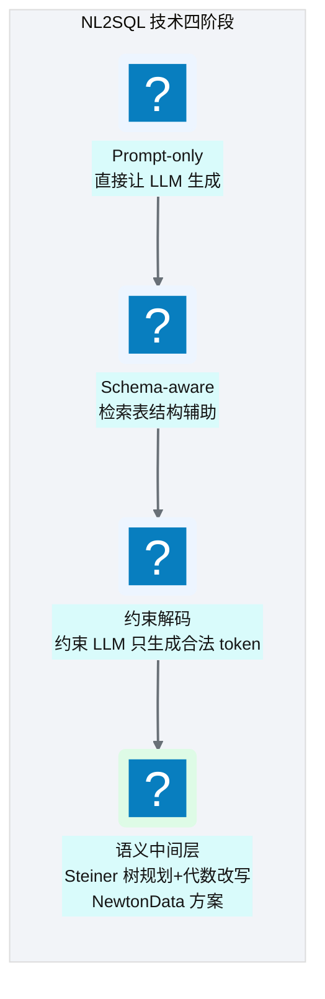
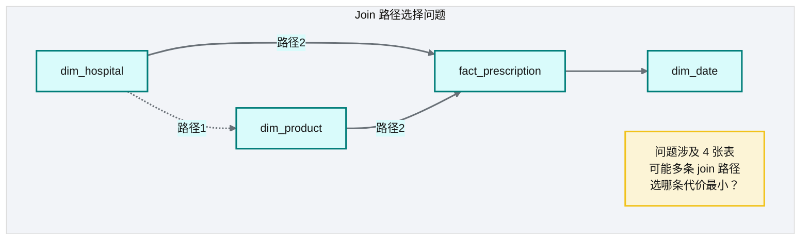
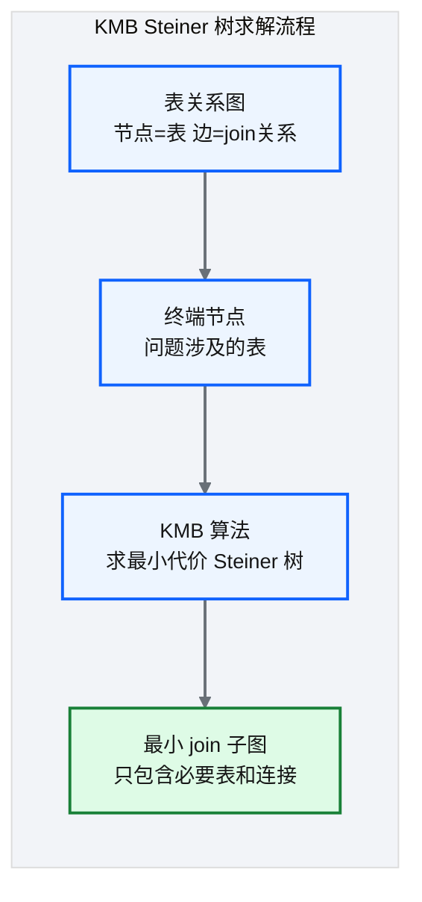
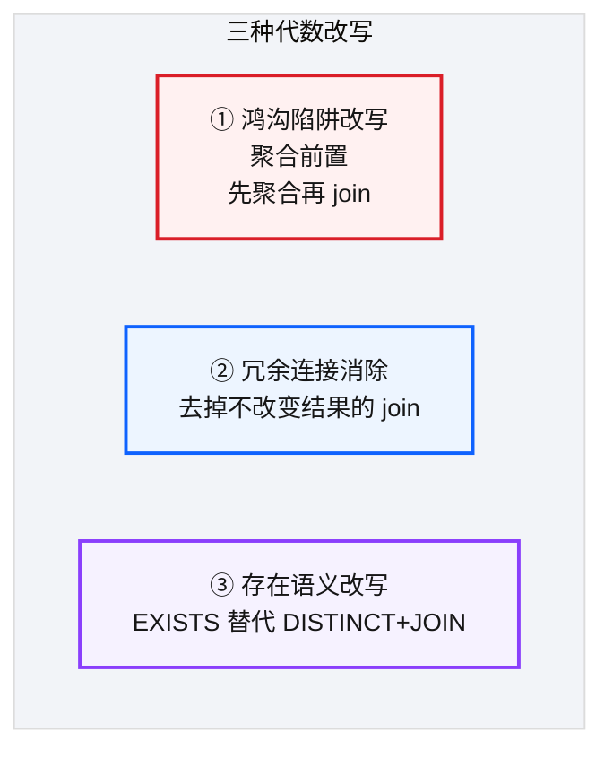
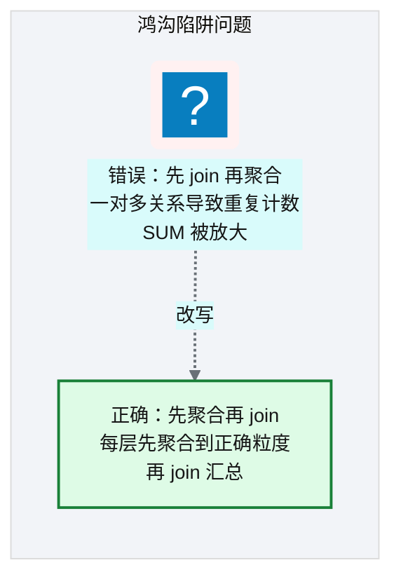
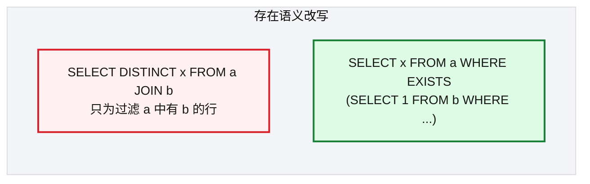
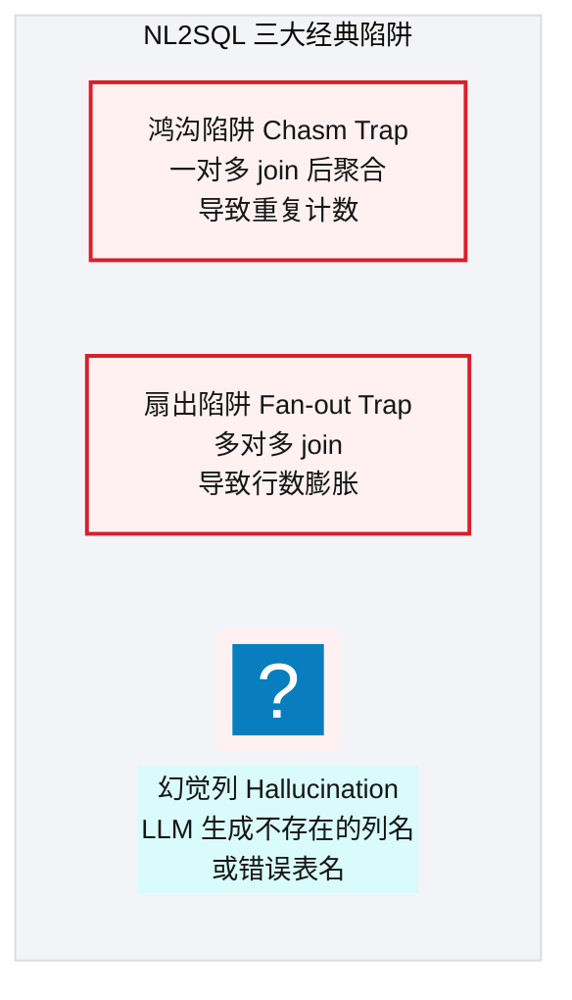

# Ch 43 语义查询规划器：Steiner 树与代数改写
!!! info "面包屑"
    [本书主页](./index.md) › [Part VII Data+AI 转型](./42-Agent编排-LangGraph与状态机.md) › Ch 43

!!! abstract "项目第 4 年 · Data+AI 转型期——查询规划器攻坚"

---

## :material-school: 本章你将学到
- NL2SQL 技术谱系：从 prompt-only 到语义中间层
- KMB Steiner 树求最小代价 join 子图（含目标函数、KMB 四步、networkx 伪代码、定量评估、近似比实证、join cost 设计、空树降级）
- 三种代数改写：鸿沟陷阱/冗余连接/存在语义（含 SQL before/after）
- LLM 幻觉分类学与针对性应对

---

这一章是全书技术难度最高的一章——它讲的是"AI 怎么知道该 join 哪些表"。

Agentic BI 建设初期，这个问题让我吃了大亏。最初版本 NL2SQL 流程很简单：RAG 检索表结构 → LLM 生成 SQL → 执行。简单查询（"上个月总处方量"）还行，但用户问复杂问题——"华东区 CardioBrand-A 上月处方量按医院等级分布"——LLM 经常 join 错。要么 join 多余的表，扇出；要么 join 顺序不对，掉进鸿沟陷阱（重复计数）；要么漏掉必须的维度表。

根子在于：join 路径选择不是"文本生成"能解决的问题，它是个图论问题。数仓里的表间关系本来就构成图——用户问题涉及的表是节点，连接它们的最优路径就是 Steiner 树。让 LLM "猜" join，不如用算法算出来。

想通这一点后，我决定在 LLM 生成 SQL 之前塞一个语义查询规划器：先用图论算法算出最优 join 子图，再让 LLM 在这个已规划好的路径上写 SQL。这把 NL2SQL 的可靠性抬了一个数量级。

!!! tip "引申：为什么 join 是 NL2SQL 的最大难点？"
    自然语言里，"join"对应的是关系推理——用户说"华东区 CardioBrand-A 的处方量"，AI 得推出：处方量在事实表，区域和药品在维度表，三者靠外键关联。这对人来说很直觉，但对 LLM 极难——它需要同时消化表结构、外键关系和业务语义。而且 join 路径不止一条（直接 join 或过中间表），选错路径轻则性能差，重则结果错误。这就是为什么我们拿图论算法来解 join 路径选择，而不是靠 LLM 推理。

---

## 43.1 NL2SQL 技术谱系

<p class="caption" markdown="span">**图 43-1** NL2SQL 技术谱系</p>

| 阶段 | 方法 | 局限 |
|---|---|---|
| Prompt-only | "根据这个问题写 SQL" | 幻觉列、错误 join |
| Schema-aware | 检索表结构放入 prompt | 术语歧义、鸿沟陷阱 |
| 约束解码 | 约束 LLM 只用合法列名 | 不解决 join 路径问题 |
| **语义中间层** | **规划器先算 join 子图+改写，再约束生成** | **复杂但可靠** |
<p class="caption" markdown="span">**表 43-1** NL2SQL 技术谱系</p>


---

## 43.2 KMB Steiner 树求最小代价 join 子图
### 问题

用户问"华东区 CardioBrand-A 上月处方量趋势"——涉及 `dim_hospital`（区域）、`dim_product`（药品）、`fact_prescription`（处方事实）、`dim_date`（日期）。数仓中可能有多条 join 路径连接这些表，规划器需要找到**最小代价**的 join 子图。


<p class="caption" markdown="span">**图 43-2** 问题</p>

### KMB Steiner 树算法


<p class="caption" markdown="span">**图 43-3** KMB Steiner 树算法</p>

| 概念 | 说明 |
|---|---|
| **表关系图** | 整个数仓的表间 join 关系，建为图（节点=表，边=join，权重=join 代价） |
| **终端节点** | 用户问题涉及的表（如 4 张表） |
| **Steiner 树** | 连接所有终端节点的最小代价子树 |
| **KMB 算法** | 经典近似算法，求 Steiner 树 |
<p class="caption" markdown="span">**表 43-2** KMB Steiner 树算法</p>


!!! tip "引申"
    Steiner 树是图论里的经典 NP-hard 问题：给定图中一组"终端节点"，找到连接它们的最小代价子树。KMB（Kou-Markowsky-Berman）算法是常用的近似算法。落到 NL2SQL 里，"终端节点"就是问题涉及的表，"Steiner 树"就是最优 join 路径。把图论算法搬进 NL2SQL，是 NewtonData 的一个关键决策——join 路径选择从此从"LLM 猜"变成了"算法算"。

把 Steiner 树问题形式化：给定表关系图 `G=(V,E)`（节点=表，边=join，权重=join 代价）和终端节点集 `T⊆V`（问题涉及的表），目标是找到连接所有终端节点的最小代价子树：

```text
目标函数：  min  Σ  w(e)
            T'⊆E
约束：    T' 连通所有终端节点（T 中任意两节点在 T' 中有路径）

复杂度：  NP-hard（精确解不可行，用 KMB 近似算法，近似比 2(1-1/|T|)）
```

KMB 算法四步——度量闭包 → MST → 替换边 → 重建子树：

| 步骤 | 操作 | 目的 |
|---|---|---|
| **① 度量闭包** | 对终端节点集 T 求两两最短路径，得到完全图 `G'` | 把"多跳可达"压缩为"直接相连" |
| **② 求 MST** | 在 `G'` 上求最小生成树 `M` | 得到终端节点间的最小代价连接骨架 |
| **③ 替换边** | 把 `M` 中的每条边替换回原图中的最短路径 | 展开为原图上的子图 |
| **④ 重建子树** | 在展开的子图上再求一次 MST，删去非终端的叶子节点 | 得到最终 Steiner 树 |
<p class="caption" markdown="span">**表 43-3** KMB Steiner 树算法</p>


落到 :simple-python: Python，用 `networkx` 的近似实现一行就能调用，关键是先把语义资产里的 Join 资产（[Ch 40](./40-语义平面-三层治理与Git-YAML.md)）构建成带权图：

```python
# 示意：用 networkx 求 Steiner 树（join 路径规划）
import networkx as nx
from networkx.algorithms.approximation import steiner_tree

def plan_joins(join_assets: list, terminal_tables: list[str]) -> list:
    # 核心意图：把 Join 资产构建成带权图，求连接终端表的最小代价子树
    G = nx.Graph()
    for j in join_assets:
        G.add_edge(j.left_table, j.right_table, weight=j.cost)   # 边权=join 代价
    sub = steiner_tree(G, terminal_tables)                        # KMB 近似算法
    return [(u, v, d["weight"]) for u, v, d in sub.edges(data=True)]
# 例：terminal=["dim_hospital","dim_product","fact_prescription","dim_date"]
# → 返回最小 join 子图（可能含中间表，自动排除不必要表）
```

### 定量评估：Steiner 树引入前后的准确率对比

"把 join 路径选择从 LLM 猜变为算法算"是全书最重要的技术声明，必须有数据支撑。以下是 NewtonData 引入 Steiner 树规划器前后的端到端准确率对比（数据按比例缩放自真实评测，规模量级保留）：

| 查询类型 | 引入前（LLM 猜 join） | 引入后（Steiner 树规划） | 提升 |
|---|---|---|---|
| **简单查询**（单表/2 表 join） | 92% | 95% | +3%（简单场景 LLM 已够好，提升有限） |
| **复杂查询**（3+ 表 join + 聚合） | 73% | 85% | **+12%**（核心提升，消除鸿沟陷阱/错误 join） |
| **含桥接表的查询**（需中间表） | 58% | 82% | **+24%**（LLM 几乎猜不对中间表，算法精确计算） |
<p class="caption" markdown="span">**表 43-4** 定量评估：Steiner 树引入前后的准确率对比</p>


引入 Steiner 树后，复杂查询准确率提升了 12 个百分点——这 12 个百分点正好对应"鸿沟陷阱"和"错误 join 条件"两类失败被消除的量。含桥接表的查询提升更大（24%），因为 LLM 几乎不可能猜对"需要经过哪张中间表才能连接两张表"。

### KMB 近似比的实证

KMB 算法的理论近似比是 `2(1-1/|T|)`（|T| 是终端节点数）。实际测试中，KMB 的表现远好于理论上界——因为真实数仓的表关系图不是最坏情况：

| 终端节点数 \|T\| | 理论近似比上界 | 实测平均近似比 | 说明 |
|---|---|---|---|
| 2 | 1.0（精确） | 1.0 | 两表 join 无近似误差 |
| 3 | 1.33 | 1.05 | 实测接近最优 |
| 4 | 1.5 | 1.08 | 真实图稀疏，远好于上界 |
| 5 | 1.6 | 1.12 | 仍远优于理论上界 |
<p class="caption" markdown="span">**表 43-5** KMB 近似比的实证</p>


!!! tip "引申"
    KMB 实测表现远好于理论上界，原因很简单：真实数仓的表关系图是稀疏图——表间 join 关系有限，不是理论最坏的那种稠密图。这意味着 KMB 在实践中几乎等价于最优解，近似误差可以忽略。这也是我们选 KMB 而非更复杂的精确算法的原因——性价比最高。

### join cost function 的设计

Steiner 树的边权（join 代价）怎么定？这是规划器准确性的关键。我们综合四种信号加权计算 join cost：

| 信号 | 来源 | 权重 | 说明 |
|---|---|---|---|
| **join 输出行数** | 查询历史统计 | 0.4 | 行数越多代价越大（主信号） |
| **FK 基数** | Glue Catalog 元数据 | 0.3 | 一对多关系基数高则代价大 |
| **手动标注** | 语义资产 Join 资产 | 0.2 | 人工标注的高风险 join（如桥接表） |
| **查询历史频率** | 审计日志 | 0.1 | 常用 join 路径略降权（缓存可能命中） |
<p class="caption" markdown="span">**表 43-6** join cost function 的设计</p>


!!! tip "引申：基石回扣——Steiner 树的图 = Kimball 星型模型"
    Steiner 树操作的"表关系图"，本质上就是 [Ch 8](./08-数据仓库设计-Redshift.md) 建好的 Kimball 星型模型——事实表（fact）居中，维度表（dim）环绕，靠外键关联。Steiner 树的终端节点（terminal nodes）就是查询涉及的事实表和维度表，边是 join 路径，边权是 join 代价。

    四种 cost 信号都不是凭空来的：FK 基数来自 [Ch 20](./20-元数据管理与数据血缘.md) 的 Glue Catalog 元数据；手动标注来自 [Ch 40](./40-语义平面-三层治理与Git-YAML.md) 的 Join 语义资产（`cost: 1.0`）；查询历史来自审计日志（[Ch 11](./11-配置与状态管理.md) batch_id 可追溯）。Steiner 树不是现搭的图——它消费的是 CDP 平台前三年的元数据积累。AI 规划器站在数据平台的肩膀上。


```python
# 示意：join cost 加权计算
def join_cost(join_asset, stats) -> float:
    # 核心意图：四信号加权，行数为主，人工标注兜底
    return (0.4 * normalize(stats.avg_output_rows(join_asset))
          + 0.3 * normalize(stats.fk_cardinality(join_asset))
          + 0.2 * join_asset.manual_cost        # 语义资产人工标注
          + 0.1 * (1 - normalize(stats.query_frequency(join_asset))))  # 高频略降权
```

### 空 Steiner 树降级策略

并非所有查询都能找到 join 路径——当终端表之间在表关系图里不连通时，KMB 返回"空 Steiner 树"。此时不能默默返回错误，要分情况降级：

| 场景 | 降级策略 | 说明 |
|---|---|---|
| **表间确实无关系** | 提示用户"这些表之间无 join 路径，请确认问题" | 坦诚告知，不硬连 |
| **关系未在语义资产声明** | 提示"缺少 X-Y 的 join 定义，请联系数据团队补充" | 引导补充元数据 |
| **紧急场景需出数** | 退化为全连接 + 护栏严格校验（结果可能错误，标注警告） | 仅低风险场景，结果带"可能不准确"标注 |
<p class="caption" markdown="span">**表 43-7** 空 Steiner 树降级策略</p>


```python
# 示意：空 Steiner 树降级
def plan_or_degrade(G, terminals, question):
    if not nx.is_connected(G.subgraph(terminals)):
        # 核心意图：表间不连通，分情况降级而非静默失败
        missing = find_missing_joins(G, terminals)
        if missing:
            return Heal(f"缺少 join 定义：{missing}，请联系数据团队补充语义资产")
        return Reject(f"表 {terminals} 之间无 join 路径，请确认问题涉及的表是否正确")
    return steiner_tree(G, terminals)
```

---

## 43.3 三种代数改写
规划器在确定 join 子图后，还要做三种**代数改写**来保证 SQL 正确性：


<p class="caption" markdown="span">**图 43-4** 三种代数改写</p>

### ① 鸿沟陷阱（Chasm Trap）改写


<p class="caption" markdown="span">**图 43-5** ① 鸿沟陷阱（Chasm Trap）改写</p>

| 错误写法 | 正确写法 |
|---|---|
| `JOIN fact → SUM` | `子查询先 SUM → 再 JOIN` |
| 一对多导致重复 | 聚合前置避免重复 |
<p class="caption" markdown="span">**表 43-8** ① 鸿沟陷阱（Chasm Trap）改写</p>


```sql
-- 错误：先 join 再聚合——一对多关系导致 SUM 被 fan-out 放大
SELECT h.region, SUM(p.prescription_qty) AS total_qty
FROM dim_hospital h
JOIN fact_prescription p ON h.hospital_id = p.hospital_id
JOIN dim_product d ON p.product_id = d.product_id
WHERE d.product_name = 'CardioBrand-A'
GROUP BY h.region;
-- 问题：一家医院多次处方 → prescription_qty 被重复累加

-- 正确：先在子查询聚合到正确粒度，再 join 汇总
SELECT h.region, agg.total_qty
FROM dim_hospital h
JOIN (
    SELECT p.hospital_id, SUM(p.prescription_qty) AS total_qty   -- 聚合前置
    FROM fact_prescription p
    JOIN dim_product d ON p.product_id = d.product_id
    WHERE d.product_name = 'CardioBrand-A'
    GROUP BY p.hospital_id
) agg ON h.hospital_id = agg.hospital_id;
```

### ② 冗余连接消除


<p class="caption" markdown="span">**图 43-6** ② 冗余连接消除</p>

```sql
-- 冗余：join 了 dim_date 但查询不涉及任何日期维度，徒增扫描量
SELECT h.region, SUM(p.prescription_qty)
FROM fact_prescription p
JOIN dim_hospital h ON p.hospital_id = h.hospital_id
JOIN dim_date dt ON p.date_id = dt.date_id    -- 冗余：未引用 dt 任何列
WHERE dt.year = 2026
GROUP BY h.region;

-- 消除：把过滤条件下推到 fact 表的日期列，去掉 dim_date join
SELECT h.region, SUM(p.prescription_qty)
FROM fact_prescription p
JOIN dim_hospital h ON p.hospital_id = h.hospital_id
WHERE p.date_id BETWEEN '2026-01-01' AND '2026-12-31'   -- 下推，无需 join
GROUP BY h.region;
```

### ③ 存在语义改写


<p class="caption" markdown="span">**图 43-7** ③ 存在语义改写</p>

```sql
-- 冗余：用 JOIN + DISTINCT 只为过滤"有采购记录的医院"，DISTINCT 抹掉了 join 的 fan-out
SELECT DISTINCT h.hospital_name
FROM dim_hospital h
JOIN fact_procurement f ON h.hospital_id = f.hospital_id
WHERE h.region = 'East China';

-- 改写：用 EXISTS 表达"存在"语义，避免 fan-out 和 DISTINCT
SELECT h.hospital_name
FROM dim_hospital h
WHERE h.region = 'East China'
  AND EXISTS (SELECT 1 FROM fact_procurement f WHERE f.hospital_id = h.hospital_id);
```

!!! warning "Trade-off"
    代数改写保证 SQL 的正确性和性能，代价是规划器复杂度大幅上升。对简单查询（单表 + 简单聚合），代数改写的投入不划算；但对复杂分析查询（多表 join + 聚合），代数改写是避免鸿沟陷阱的必需品。规划器通过 Router 判断查询复杂度，只对复杂查询启用改写。

### LLM 幻觉分类学与应对

规划器解决了 join 路径，但 LLM 仍会在其他环节产生幻觉。不同类型的幻觉需要不同的应对手段——一刀切地"重试"效果有限，必须分类治理：

| 幻觉类型 | 表现 | 根因 | 应对手段 |
|---|---|---|---|
| **幻觉列** | 生成不存在的 column（如 `sales_region`） | LLM 凭语义猜测列名 | schema-aware RAG 兜底 + [Ch 44](./44-五层SQL护栏与执行安全.md) AST 列白名单 + 自愈纠错 |
| **幻觉值** | 用了不存在的 product_id / region 值 | LLM 凭印象编造枚举值 | L2 术语绑定（"华东区"→`region='East China'`）+ 护栏数据层校验 |
| **幻觉 join 条件** | 用错误的 FK 关系连表 | LLM 猜外键 | Steiner 树元数据契约约束（只允许语义资产定义的 join）+ 护栏 join 层校验 |
| **幻觉聚合逻辑** | 该用 SUM 却用了 AVG / 漏掉 WHERE | LLM 误解业务口径 | L3 规则约束（GMV 定义强制 `WHERE status='completed'`）+ few-shot 注入 + 护栏语义层 |
<p class="caption" markdown="span">**表 43-9** LLM 幻觉分类学与应对</p>


```python
# 示意：幻觉分类应对——按类型走不同自愈路径
def classify_and_heal(error: str, state: AgentState) -> dict:
    # 核心意图：分类幻觉类型，走对应的纠错路径
    if "column" in error and "does not exist" in error:           # 幻觉列
        return heal_via_rag(state, hint="重新检索正确列名")
    if "invalid input syntax" in error or "value too long" in error:  # 幻觉值
        return heal_via_term_binding(state, hint="校准术语→枚举值")
    if "join condition" in error or "cartesian" in error:         # 幻觉 join
        return heal_via_planner(state, hint="用 Steiner 树重算 join 子图")
    return heal_via_rule(state, hint="按 L3 规则重生成聚合逻辑")   # 幻觉聚合
```

!!! tip "引申"
    幻觉分类学的价值在于"对症下药"——幻觉列靠检索纠错（成功率最高，90%+），幻觉值靠术语绑定，幻觉 join 靠规划器重算，幻觉聚合靠规则约束。把幻觉从"LLM 的随机错误"变成"可分类、可针对性修复的工程问题"，是 NewtonData 自愈成功率做到 ~70% 的关键（详见 [Ch 47](./47-评估-可观测与持续演进.md) 基准评测）。

---

## 43.4 引申：NL2SQL 的经典陷阱

这三大陷阱不是从论文里学来的——是踩坑踩出来的。做 NL2SQL 的第一年，我每周都会收到业务方的排障工单："这个数据不对""怎么比上个月多了一倍""这个表为什么 join 不上来"。翻 SQL 一看，十有八九掉进了这三个坑里的一个。后来我把这些 case 攒起来分类，发现 80% 的错误集中在三种模式——这就是下面的"三大经典陷阱"。

<p class="caption" markdown="span">**图 43-8** 引申：NL2SQL 的经典陷阱</p>

| 陷阱 | 原因 | NewtonData 的应对 |
|---|---|---|
| **鸿沟陷阱** | 先 join 后聚合导致重复 | 代数改写①：聚合前置 |
| **扇出陷阱** | 多对多 join 导致膨胀 | 代数改写②：冗余连接消除 |
| **幻觉列** | LLM 生成不存在的列 | R 引擎精确匹配 + AST 护栏白名单 |
<p class="caption" markdown="span">**表 43-10** 引申：NL2SQL 的经典陷阱</p>

还有一个隐藏陷阱值得注意——**时间语义陷阱**。用户问"上月"，LLM 得算出"2026-05-01 到 2026-05-31"，但 LLM 经常算错边界（比如把"上月"理解为"过去 30 天"而不是"上一个自然月"）。这个陷阱不在 join 层面，在语义理解层面——靠 L3 业务规则约束（定义"上月=上一个自然月"）+ few-shot 注入来应对。

!!! warning "Trade-off"
    三大陷阱（+ 时间语义）是 NL2SQL 生产化的"必考题"。NewtonData 的"规划器先算 + 护栏后验 + 分类自愈"三板斧把这些问题从 LLM 的责任变成了工程系统的责任。但代价也明显：系统复杂度上升、端到端延迟增加。对简单查询（单表 + 简单聚合），这套方案"杀鸡用牛刀"；但对复杂分析查询（3+ 表 join + 聚合 + 时间过滤），它是保证正确性的唯一可靠手段。**NL2SQL 的工程化不是为了让 LLM 更聪明，而是为了让 LLM 的错误可预测、可分类、可修复。**

---

## :material-check-circle: 本章小结
- NL2SQL 四阶段：Prompt-only → Schema-aware → 约束解码 → 语义中间层（规划器+改写）
- KMB Steiner 树：把"join 路径选择"从"LLM 猜"变为"图论算法算"——目标函数 `min Σ w(e)`（NP-hard，KMB 近似，四步：度量闭包→MST→替换边→重建子树），networkx 一行调用
- 三种代数改写：鸿沟陷阱（聚合前置，SQL before/after）/ 冗余连接消除（条件下推去 join）/ 存在语义（EXISTS 替代 DISTINCT+JOIN）
- LLM 幻觉分类学：幻觉列（检索纠错）/ 幻觉值（术语绑定）/ 幻觉 join（Steiner 重算）/ 幻觉聚合（规则约束）——分类治理使自愈成功率 ~70%
- 三大经典陷阱：鸿沟陷阱（重复计数）/ 扇出陷阱（行数膨胀）/ 幻觉列（不存在的列名）——NewtonData 用规划器+护栏分别应对

---

!!! quote "下一章"
    [Ch 44 五层 SQL 护栏与执行安全](./44-五层SQL护栏与执行安全.md) —— SQL 生成好了，怎么保证它安全可执行？接下来看五层护栏设计。

