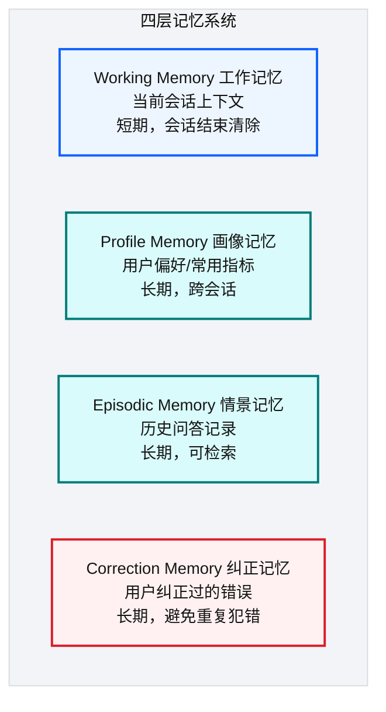
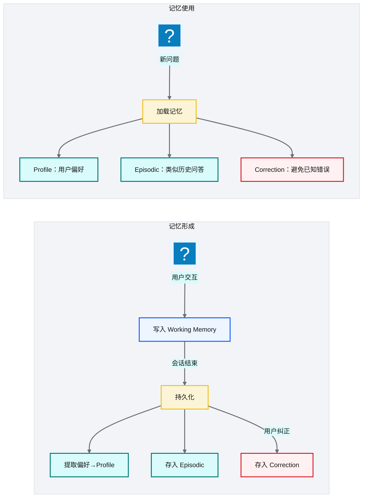
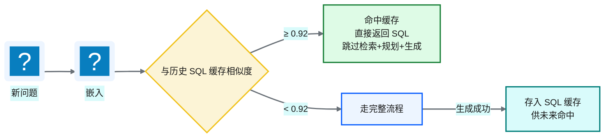
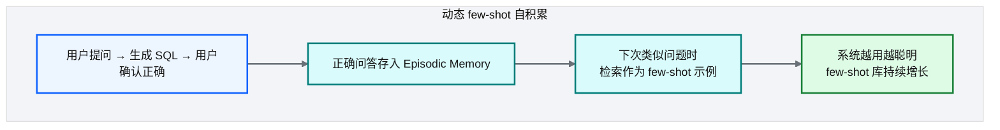
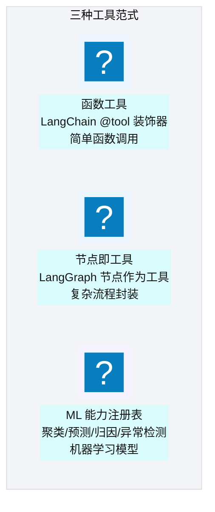
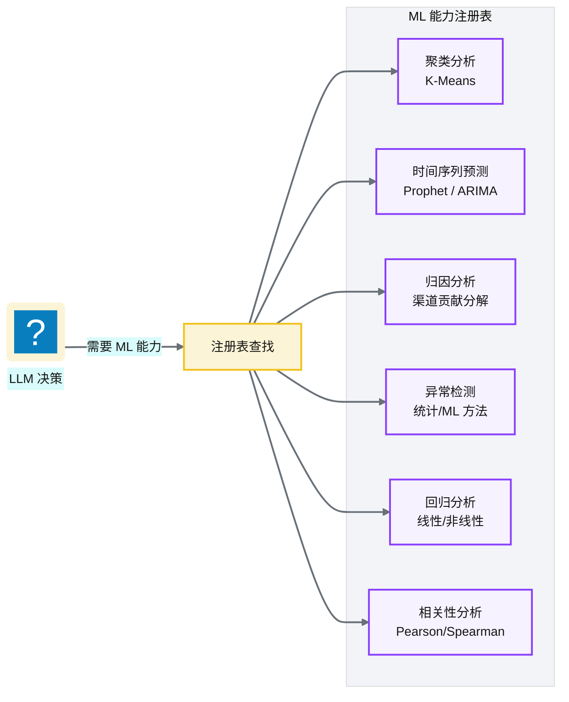
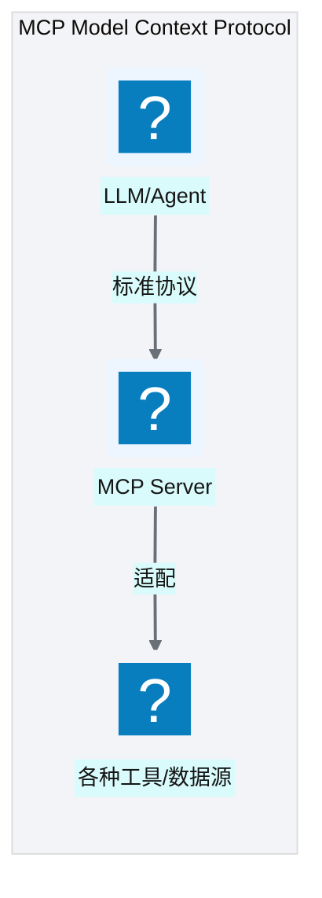

# Ch 45 记忆系统与工具使用
!!! info "面包屑"
    [本书主页](./index.md) › [Part VII Data+AI 转型](./44-五层SQL护栏与执行安全.md) › Ch 45

!!! abstract "项目第 4 年 · Data+AI转型期——记忆与工具"

---

## :material-school: 本章你将学到
- 四层记忆：Working/Profile/Episodic/Correction（认知科学映射）
- SQL 语义缓存与动态 few-shot 自积累
- 三种工具范式：函数工具（@tool）/ 节点即工具 / ML 能力注册表（含伪代码）
- MCP（Model Context Protocol）的引入（含 Server 端 @mcp.tool 与 Client 端配置伪代码）

---

## 45.1 四层记忆：Working/Profile/Episodic/Correction

<p class="caption" markdown="span">**图 45-1** 四层记忆：Working/Profile/Episodic/Co...</p>

| 记忆层 | 认知科学对应 | 内容 | 生命周期 |
|---|---|---|---|
| **Working** | 短期记忆 | 当前会话上下文 | 会话级 |
| **Profile** | 用户画像 | 偏好/常用指标/权限 | 跨会话持久 |
| **Episodic** | 情景记忆 | 历史问答→SQL 记录 | 跨会话可检索 |
| **Correction** | 纠错记忆 | 用户纠正的错误模式 | 跨会话持久 |
<p class="caption" markdown="span">**表 45-1** 四层记忆：Working/Profile/Episodic/Correction</p>


### 记忆的形成与使用


<p class="caption" markdown="span">**图 45-2** 记忆的形成与使用</p>

!!! tip "引申"
    四层记忆映射了认知科学的人类记忆模型——Working 对应"短期记忆"（当前思考），Profile 对应"长期记忆中的自我认知"（我是谁、我喜欢什么），Episodic 对应"情景记忆"（经历过的事），Correction 对应"错误学习"（吃过亏不再犯）。把认知科学模型引入 AI 记忆系统，让 Agent 的行为更接近"有经验的分析师"。

---

## 45.2 SQL 语义缓存与动态 few-shot 自积累
### SQL 语义缓存


<p class="caption" markdown="span">**图 45-3** SQL 语义缓存</p>

### 动态 few-shot 自积累


<p class="caption" markdown="span">**图 45-4** 动态 few-shot 自积累</p>

| 机制 | 作用 | 与 D 引擎的关系 |
|---|---|---|
| **SQL 语义缓存** | 相似问题直接返回缓存 SQL | 缓存命中跳过全流程 |
| **动态 few-shot** | 正确问答作为示例注入 prompt | D 引擎检索 few-shot |
<p class="caption" markdown="span">**表 45-2** 动态 few-shot 自积累</p>


!!! warning "Trade-off"
    动态 few-shot 让系统"越用越聪明"，但需要质量控制——如果错误 SQL 被存入 few-shot，会污染后续生成。因此只有"用户确认正确"的问答才存入 few-shot 库。

---

## 45.3 三种工具范式：函数工具 / 节点即工具 / ML 能力注册表

<p class="caption" markdown="span">**图 45-5** 三种工具范式：函数工具 / 节点即工具 / ML 能力注册表</p>

| 范式 | 机制 | 举例 |
|---|---|---|
| **函数工具** | `@tool` 装饰器，LLM 自主调用 | "查天气""发邮件" |
| **节点即工具** | LangGraph 节点封装为可调用工具 | "执行 SQL""生成图表" |
| **ML 能力注册表** | 注册的 ML 模型作为工具 | "聚类分析""时间序列预测""异常检测" |
<p class="caption" markdown="span">**表 45-3** 三种工具范式：函数工具 / 节点即工具 / ML 能力注册表</p>


三种工具范式落到代码，函数工具用 `@tool` 装饰器声明，节点即工具把 LangGraph 节点封装为可调用接口，ML 能力注册表统一注册：

```python
# 示意：三种工具范式的代码表达
from langchain_core.tools import tool

# ① 函数工具：@tool 装饰器，LLM 自主调用
@tool
def send_alert(message: str, channel: str = "slack") -> str:
    """向指定渠道发送告警。"""          # 核心意图：docstring 即工具描述，供 LLM 决策调用
    return notify_slack(channel, message)

# ② 节点即工具：把 LangGraph 节点封装为可调用工具
def execute_sql_tool(state: AgentState) -> dict:
    """执行已通过护栏的 SQL 并返回结果。"""
    return {"result": redshift.execute(state["sql"])}   # 复用 Ch 42 的 exec 节点

# ③ ML 能力注册表：统一注册，LLM 按需查找调用
ML_REGISTRY = {
    "anomaly_detect": lambda series: prophet_detect(series),     # 异常检测
    "time_series_forecast": lambda series, h: prophet_forecast(series, h),  # 时序预测
    "clustering": lambda df, k: kmeans(df, k),                   # 聚类
}
```

### ML 能力注册表


<p class="caption" markdown="span">**图 45-6** ML 能力注册表</p>

!!! tip "引申"
    ML 能力注册表让 Agentic BI 不只做"查数据"，还能做"分析数据"。用户问"这个月销量异常吗？"——AI 不仅查出销量数据，还调用异常检测模型判断是否异常。这是从"NL2SQL"到"NL2Analysis"的跨越。

---

## 45.4 MCP（Model Context Protocol）的引入
### 什么是 MCP


<p class="caption" markdown="span">**图 45-7** 什么是 MCP</p>

MCP 是 Anthropic 提出的"模型上下文协议"——一个让 LLM 与外部工具/数据源交互的**标准协议**。类似于"AI 的 USB 接口"——任何工具实现 MCP 协议后，任何支持 MCP 的 LLM 都能调用它。

| MCP 价值 | 说明 |
|---|---|
| **标准化** | 工具适配只需实现一次 MCP 协议 |
| **互操作性** | 不同 LLM 可调用同一 MCP Server |
| **解耦** | 工具与 LLM 解耦，各自演进 |
<p class="caption" markdown="span">**表 45-4** 什么是 MCP</p>


MCP 落到代码，Server 端用 `@mcp.tool` 注册工具（描述+参数+实现），Client 端用标准配置连接 Server 调用——工具实现一次，任何支持 MCP 的 LLM 都能用：

```python
# 示意：MCP Server 端——注册工具（FastMCP）
from mcp.server.fastmcp import FastMCP
mcp = FastMCP("aurora-cdp-tools")

@mcp.tool()
def query_prescription(product: str, region: str, month: str) -> str:
    """查询指定药品在区域和月份的处方量。"""      # 核心意图：描述即协议，LLM 据此决策
    sql = f"SELECT SUM(qty) FROM fact_prescription WHERE product='{product}' AND region='{region}' AND month='{month}'"
    return redshift.execute(sql)

@mcp.tool()
def detect_anomaly(metric: str, window: int = 30) -> str:
    """对指定指标做异常检测，返回异常点。"""
    return ML_REGISTRY["anomaly_detect"](load_series(metric, window))

if __name__ == "__main__":
    mcp.run()                                       # MCP Server 启动，等待 LLM 调用
```

```json
// 示意：MCP Client 端——标准配置连接 Server
{
  "mcpServers": {
    "aurora-cdp-tools": {
      "command": "python",
      "args": ["-m", "aurora_cdp_ai.mcp_server"],
      "env": {"REDSHIFT_ROLE_ARN": "arn:aws-cn:iam::123456789012:role/ap-aurora-cdp-ai-exec"}
    }
  }
}
```

!!! tip "引申"
    MCP 的愿景是"让 AI 工具生态像 USB 一样即插即用"。当前 LLM 工具调用大多是"厂商私有协议"（OpenAI Function Calling、Anthropic Tool Use），MCP 试图建立跨厂商标准。如果 MCP 成为主流，Agentic BI 的工具扩展将从"每个工具写适配"变为"每个工具实现 MCP 协议"——大幅降低集成成本。

---

## :material-check-circle: 本章小结
- 四层记忆：Working（会话上下文）/ Profile（用户偏好）/ Episodic（历史问答）/ Correction（错误纠正）——映射认知科学记忆模型
- SQL 语义缓存（相似度 ≥ 0.92 命中）+ 动态 few-shot 自积累（正确问答→示例→越用越聪明）
- 三种工具范式：函数工具（@tool 装饰器）/ 节点即工具（LangGraph 节点封装）/ ML 能力注册表（统一注册聚类/预测/归因/异常）
- MCP 引入：标准化的"AI USB 接口"——Server 端用 @mcp.tool 注册工具，Client 端用标准 JSON 配置连接，工具与 LLM 解耦，未来工具扩展的趋势

---

!!! quote "下一章"
    [Ch 46 数据平面与 CDP 整合](./46-数据平面与CDP整合.md) —— 接下来看 the-ttd 的数据平面如何与 CDP 平台整合，实现 AI-Ready 数据供应。

