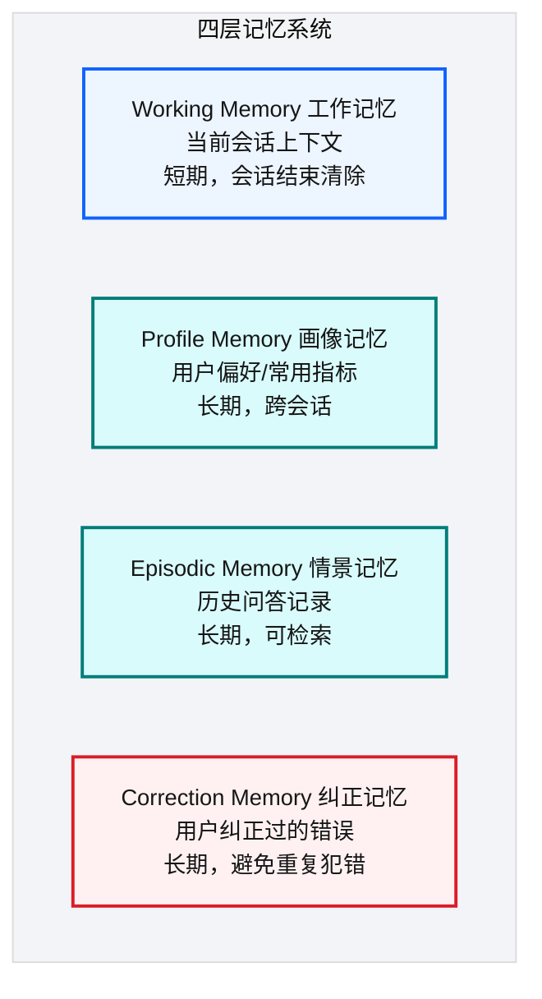
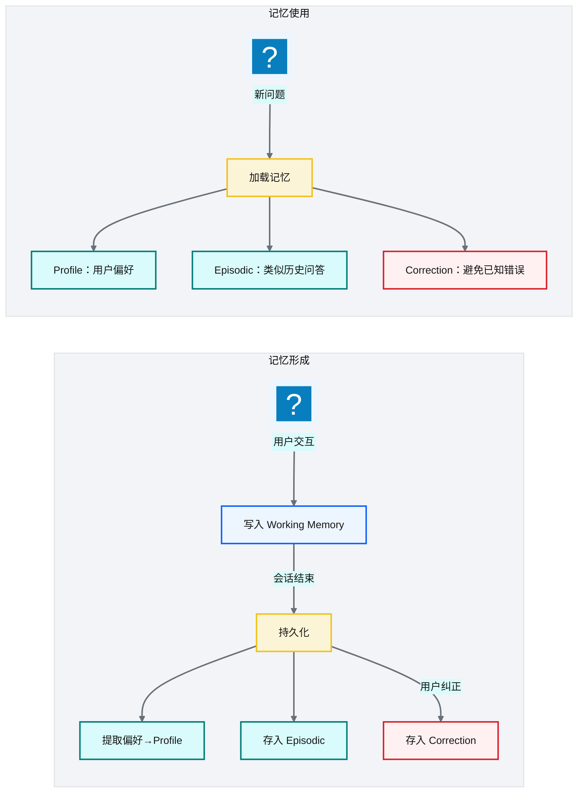
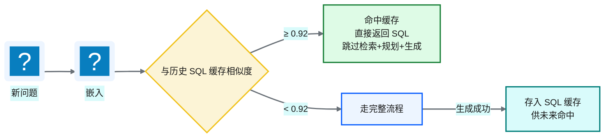
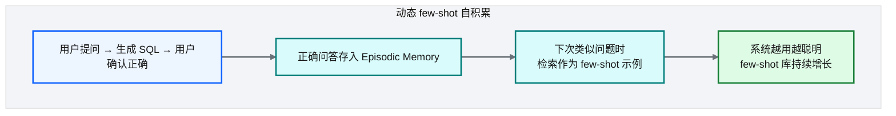
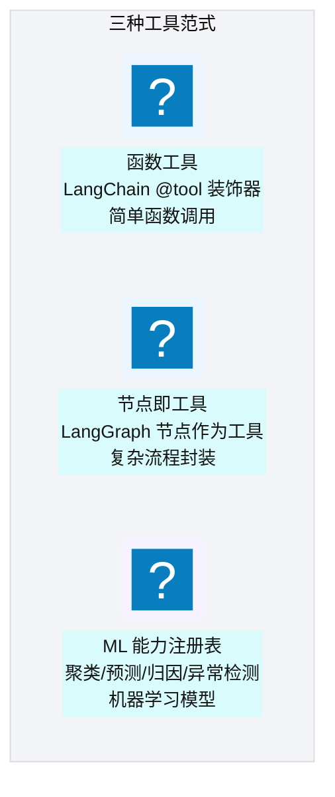
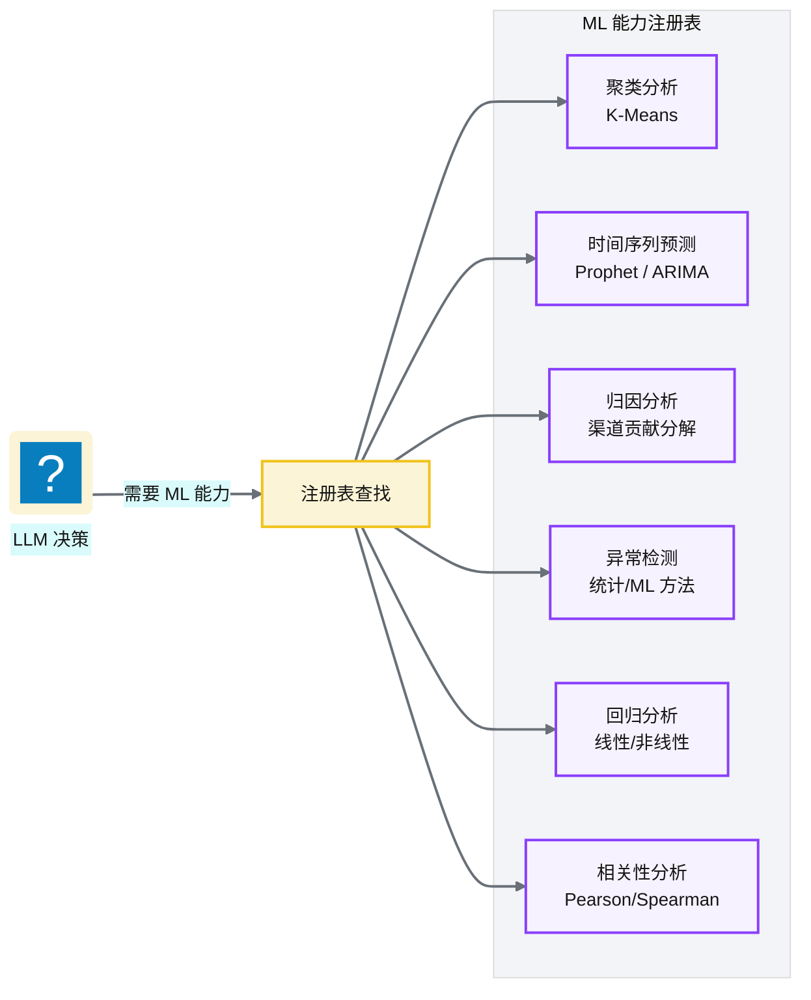
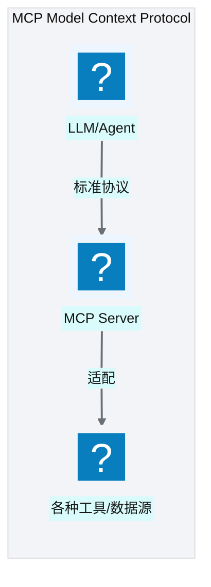

# Ch 45 记忆系统与工具使用
!!! info "面包屑"
    [本书主页](./index.md) › [Part VII Data+AI 转型](./44-五层SQL护栏与执行安全.md) › Ch 45

!!! abstract "项目第 4 年 · Data+AI POC——记忆与工具"

---

## :material-school: 本章你将学到
- 四层记忆：Working/Profile/Episodic/Correction（认知科学映射）
- SQL 语义缓存与动态 few-shot 自积累
- 三种工具范式：函数工具（@tool）/ 节点即工具 / ML 能力注册表（含伪代码）
- MCP（Model Context Protocol）的引入（含 Server 端 @mcp.tool 与 Client 端配置伪代码）

---

护栏把"危险 SQL"挡住了（[Ch 44](./44-五层SQL护栏与执行安全.md)），但内部试用还有另一件事：用户不愿每次从零解释口径，也不愿系统重复犯同一个错。这一章讲 POC 里的**记忆与工具**——让小域体验能越用越顺，同时把纠正沉淀成可审计资产，而不是把 LLM 养成不可控的"自治记忆体"。

## 45.1 四层记忆：Working/Profile/Episodic/Correction

<p class="caption" markdown="span">**图 45-1** 四层记忆：Working/Profile/Episodic/Co...</p>

| 记忆层 | 认知科学对应 | 内容 | 存储 | 生命周期/TTL |
|---|---|---|---|---|
| **Working** | 短期记忆 | 当前会话上下文（最近 N 轮） | LangGraph Checkpointer (PG) | 会话级，会话结束清除 |
| **Profile** | 语义记忆（自我认知） | 偏好/常用指标/权限 | `ttd_memory_records` (kind=profile) | 跨会话持久，365 天 TTL |
| **Episodic** | 情景记忆 | 历史问答→SQL 记录 | `ttd_memory_records` (kind=episodic) | 跨会话可检索，90 天 TTL + 衰减 0.02/天 |
| **Correction** | 程序记忆（错误学习） | 用户纠正的错误模式 | `ttd_memory_records` (kind=correction) | 跨会话持久，180 天 TTL |
<p class="caption" markdown="span">**表 45-1** 四层记忆：Working/Profile/Episodic/Correction</p>


### 记忆的形成与使用


<p class="caption" markdown="span">**图 45-2** 记忆的形成与使用</p>

!!! tip "引申"
    四层记忆映射了认知科学的人类记忆模型——Working 对应"短期记忆"（当前思考），Profile 对应"长期记忆中的自我认知"（我是谁、我喜欢什么），Episodic 对应"情景记忆"（经历过的事），Correction 对应"错误学习"（吃过亏不再犯）。把认知科学模型引入 AI 记忆系统，让 Agent 的行为更接近"有经验的分析师"。

### 路由感知预算

不同路由对各类记忆的需求不同——KPI 直查不需要太多历史，深度分析需要更多经验。MemoryFacade 按路由设置不同的记忆注入上限，避免记忆注入过多稀释当前查询的上下文：

| Route | Profile | Episodic | Correction | 理由 |
|---|---|---|---|---|
| `nl2sql_query` | 5 | 2 | 5 | 标准查询：适度偏好+少量历史 |
| `kpi_lookup` | 2 | 0 | 1 | KPI 直查：最轻量，快 |
| `business_knowledge_qa` | 3 | 1 | 1 | 知识问答：少量上下文 |
| `deep_analysis_workflow` | 8 | 8 | 4 | 深度分析：最重，需大量历史经验 |
<p class="caption" markdown="span">**表 45-2** 路由感知预算</p>

!!! tip "引申：自治记忆 vs 触发式记忆"
    MemGPT/Letta（[arxiv.org/abs/2310.08560](https://arxiv.org/abs/2310.08560)）采用**自治记忆**——LLM 通过 function call 自主决定何时读/写/遗忘记忆，类比操作系统的内存分级。优势是灵活，LLM 能根据当前需要动态管理记忆；劣势是不可控（LLM 可能遗忘重要信息或记住噪声）。

    NewtonData 采用**触发式记忆**——记忆形成由明确信号（成功交互、反馈、澄清）触发，而非 LLM 自主决定。优势是可审计、可预测（每条记忆的形成都有明确原因）；劣势是可能遗漏隐式信号（如用户连续三次选折线图但未点"赞"）。取舍：安全敏感的 NL2SQL 场景需要可审计性，自治记忆不可控。但可以向"受控自治"演进——LLM 在受限范围内提议记忆，经审批后写入。

---

## 45.2 SQL 语义缓存与动态 few-shot 自积累
### SQL 语义缓存


<p class="caption" markdown="span">**图 45-3** SQL 语义缓存</p>

### 动态 few-shot 自积累


<p class="caption" markdown="span">**图 45-4** 动态 few-shot 自积累</p>

| 机制 | 作用 | 与 D 引擎的关系 |
|---|---|---|
| **SQL 语义缓存** | 相似问题直接返回缓存 SQL | 缓存命中跳过全流程 |
| **动态 few-shot** | 正确问答作为示例注入 prompt | D 引擎检索 few-shot |
<p class="caption" markdown="span">**表 45-3** SQL 语义缓存与动态 few-shot</p>


!!! warning "Trade-off"
    动态 few-shot 让系统"越用越聪明"，但需要质量控制——如果错误 SQL 被存入 few-shot，会污染后续生成。因此只有"用户确认正确"的问答才存入 few-shot 库，且需经三步审批：

```python
# 示意：动态 few-shot 三步审批工作流（质量控制）
class DynamicFewShotCache:
    async def record_success(self, question, final_sql, *, confidence):
        """① 记录成功案例——新条目不参与 RAG，等待审核。"""
        await self.db.insert(question=question, sql=final_sql,
                             review_status="pending_review",     # 不参与 RAG
                             confidence=confidence)

    async def approve(self, entry_id, reviewer):
        """② Admin 审批——通过后才参与 RAG 检索。"""
        await self.db.update(entry_id, review_status="approved", reviewer=reviewer)

    async def search_similar(self, question_embedding, *, top_k=3):
        """③ 检索——仅返回 approved + sim ≥ 0.95 + confidence ≥ 0.9 + fail_count ≤ 3。"""
        return await self.db.search(
            embedding=question_embedding, top_k=top_k,
            filter="review_status='approved' AND similarity>=0.95 "
                   "AND confidence>=0.9 AND fail_count<=3")
```

### SQL-Only Cache vs 结果缓存 vs 通用语义缓存

!!! tip "引申：缓存策略对比"
    SQL 缓存有三种策略，NewtonData 选择 SQL-Only Cache 是数据敏感场景的正确取舍：

    - **SQL-Only Cache（NewtonData）**：只缓存 SQL 文本，每次仍执行。数据新鲜，但对"慢查询"加速有限（省的是生成时间，不是执行时间）。相似度 ≥ 0.92 命中，TTL 15 分钟。
    - **结果缓存**：缓存查询结果，命中即返回。加速最大，但有脏数据风险，不适合实时数据。
    - **通用语义缓存（如 GPTCache）**：缓存任意 LLM 响应（不只 SQL），用语义相似度匹配。通用但不可控。

    NewtonData 选 SQL-Only 是因为医药数据敏感——宁可命中缓存仍执行 SQL，也不要返回脏数据。对历史报表等低新鲜度场景，可演进为分级缓存（[Ch 49](./49-评估-可观测与持续演进.md) Roadmap）。

---

## 45.3 三种工具范式：函数工具 / 节点即工具 / ML 能力注册表

<p class="caption" markdown="span">**图 45-5** 三种工具范式：函数工具 / 节点即工具 / ML 能力注册表</p>

| 范式 | 机制 | 举例 |
|---|---|---|
| **函数工具** | `@tool` 装饰器，LLM 自主调用 | "查天气""发邮件" |
| **节点即工具** | LangGraph 节点封装为可调用工具 | "执行 SQL""生成图表" |
| **ML 能力注册表** | 注册的 ML 模型作为工具 | "聚类分析""时间序列预测""异常检测" |
<p class="caption" markdown="span">**表 45-4** 三种工具范式：函数工具 / 节点即工具 / ML 能力注册表</p>


落到代码上，三种范式的表达很直接——函数工具用 `@tool` 装饰器声明，节点即工具把 LangGraph 节点封装成可调用接口，ML 注册表统一登记所有模型：

```python
# 示意：三种工具范式的代码表达
from langchain_core.tools import tool

# ① 函数工具：@tool 装饰器，LLM 自主调用
@tool
def send_alert(message: str, channel: str = "slack") -> str:
    """向指定渠道发送告警。"""          # 核心意图：docstring 即工具描述，供 LLM 决策调用
    return notify_slack(channel, message)

# ② 节点即工具：把 LangGraph 节点封装为可调用工具
def execute_sql_tool(state: AgentState) -> dict:
    """执行已通过护栏的 SQL 并返回结果。"""
    return {"result": redshift.execute(state["sql"])}   # 复用 Ch 42 的 exec 节点

# ③ ML 能力注册表：统一注册，LLM 按需查找调用
ML_REGISTRY = {
    "anomaly_detect": lambda series: prophet_detect(series),     # 异常检测
    "time_series_forecast": lambda series, h: prophet_forecast(series, h),  # 时序预测
    "clustering": lambda df, k: kmeans(df, k),                   # 聚类
}
```

### ML 能力注册表


<p class="caption" markdown="span">**图 45-6** ML 能力注册表</p>

!!! tip "引申"
    ML 能力注册表让 Agentic BI 不只做"查数据"，还能做"分析数据"。用户问"这个月销量异常吗？"——AI 不仅查出销量数据，还调用异常检测模型判断是否异常。这是从"NL2SQL"到"NL2Analysis"的跨越。

### Tool Use 四代演进

!!! tip "引申：Tool Use 演进脉络"
    工具使用（Tool Use）是 Agent 从"对话"走向"行动"的关键能力，经历了四代演进：

    - **第一代：手写 Prompt 描述工具**——在 prompt 中描述工具用法，让 LLM 输出特定格式文本，用正则解析。脆弱，格式不稳定。
    - **第二代：原生 Function Calling**——OpenAI/Anthropic 在 API 层面支持，开发者用 JSON Schema 描述工具，LLM 输出结构化的 `tool_calls`。稳定、结构化。NewtonData 的 `@tool` 装饰器属于这一代。
    - **第三代：MCP（Model Context Protocol）**——Anthropic 提出的开放协议，标准化工具/资源的暴露方式，跨模型/跨应用复用（[modelcontextprotocol.io](https://modelcontextprotocol.io/)）。NewtonData 正在引入（见 45.4）。
    - **第四代：代码解释器（Code Interpreter）**——不预设具体工具，让 LLM 生成代码在沙箱执行，覆盖任意计算。最灵活但有安全风险。NewtonData 的 Analytical Agent 用这一代。

    NewtonData 混合使用了三种范式（@tool / 节点即工具 / ML 注册表），反映了"不同任务用不同工具形态"的工程取舍——确定性任务用节点（可审计），探索性任务用 @tool（灵活），自定义分析用代码解释器（通用）。详见 [Toolformer](https://arxiv.org/abs/2302.04761)。

### 数据形状感知分流

Analytical Agent 根据查询结果的数据形状分流——"用对工具"的关键就在这一步：

| 数据形状 | 分流 | 工具 | 理由 |
|---|---|---|---|
| 聚合数据（≤200 行，BI 典型输出） | LLM 生成 pandas/scipy 统计分析代码 | 代码解释器 | 聚合数据量小，代码解释器够用且灵活 |
| 原始/粒度数据（>200 行） | 派发到 ML 工具 | ML 工具注册表 | 原始数据量大，专用 ML 工具更可靠高效 |
<p class="caption" markdown="span">**表 45-5** 数据形状感知分流</p>

### 代码解释器沙箱隔离

LLM 生成的代码跑在沙箱里，安全隔离分几档：

| 级别 | 机制 | 隔离性 | 性能 | NewtonData 状态 |
|---|---|---|---|---|
| **L1** | Python exec + 模块白名单 | 低（可绕过） | 高 | ✅ 当前 |
| **L2** | 进程隔离（subprocess + 资源限制） | 中 | 中 | ❌ |
| **L3** | 容器隔离（Docker，独立文件系统/网络） | 高 | 低 | ❌ |
| **L4** | 托管沙箱（E2B/Modal，云隔离） | 高 | 中 | ❌ |
| **L5** | WASM 沙箱（浏览器级隔离） | 高 | 中 | ❌ |
<p class="caption" markdown="span">**表 45-6** 代码解释器沙箱隔离级别</p>

NewtonData 当前用的是 L1（Python exec + 白名单），这层隔离最弱——绕过白名单的手段不少（`__import__`、`__builtins__`、`__subclasses__` 都行）。生产环境至少该推到 L2（进程隔离）或 L3（容器隔离），或者直接用托管方案，比如 [E2B](https://e2b.dev/)。

---

## 45.4 可视化推荐引擎

Agent 拿到 SQL 执行结果后，还得推荐合适的可视化。NewtonData 的做法是"规则优先、LLM 兜底"——95%+ 的 case 根本不用 LLM，规则直接匹配就行：

```python
# 示意：可视化推荐引擎——规则优先，LLM 回退
def recommend_visualization(execution_result: dict) -> dict:
    # 主路径（95%+ 无需 LLM）：数据形状分析 → 规则匹配 → 模板渲染
    shape = DataShapeAnalyzer(execution_result)     # 时间序列/分类/分布/排名...
    candidates = ChartMatcher.recommend(shape, top_k=3)
    if candidates[0].confidence >= 0.3:
        return TemplateRenderer.render(candidates[0], adapter=EChartsAdapter)
    # 回退（边缘场景）：低置信度时用 LLM 生成 ECharts 配置
    return llm_generate_chart(execution_result, validate_whitelist=True)
```

| 组件 | 职责 |
|---|---|
| `DataShapeAnalyzer` | 分析数据形状（时间序列/分类/分布/排名...） |
| `ChartMatcher` | 规则匹配 top-k 候选图表 |
| `adapters/` | EChartsAdapter 渲染 |
| 模板库 | bar/line/pie/kpi/ranking/trend/combo/specialized，35+ 模板 |

最终产出 `chart_type + echarts_option + confidence + checkpoint_status`（取值 auto_pass / needs_review / blocked）。置信度偏低时，前端触发 HITL 候选确认——human-in-the-loop 在可视化层的落地就是这样。

!!! tip "引申：规则 vs LLM 可视化推荐"
    可视化推荐有两条路线：规则推荐（快、可控、无需 LLM，但覆盖面受规则数量限制）和 LLM 推荐（灵活、覆盖广，但慢、贵、不稳定）。NewtonData 用混合路线——规则为主（95%+），LLM 回退（边缘）。大部分 BI 可视化需求是标准化的（趋势用折线、占比用饼图、排名用条形），规则足够；少数复杂场景用 LLM 兜底。

---

## 45.5 MCP（Model Context Protocol）的引入
### 什么是 MCP


<p class="caption" markdown="span">**图 45-7** 什么是 MCP</p>

MCP（Model Context Protocol）是 Anthropic 提出的开放协议，目标是让 LLM 与外部工具、数据源的交互标准化。你可以把它理解成"AI 的 USB 接口"——工具端实现一次 MCP，任何支持 MCP 的 LLM 就都能调。

| MCP 价值 | 说明 |
|---|---|
| **标准化** | 工具适配只需实现一次 MCP 协议 |
| **互操作性** | 不同 LLM 可调用同一 MCP Server |
| **解耦** | 工具与 LLM 解耦，各自演进 |
<p class="caption" markdown="span">**表 45-7** 什么是 MCP</p>


落地的话，Server 端用 `@mcp.tool` 注册工具（描述+参数+实现），Client 端通过标准配置连上来调用——工具写一次，所有支持 MCP 的 LLM 都认：

```python
# 示意：MCP Server 端——注册工具（FastMCP）
from mcp.server.fastmcp import FastMCP
mcp = FastMCP("aurora-cdp-tools")

@mcp.tool()
def query_prescription(product: str, region: str, month: str) -> str:
    """查询指定药品在区域和月份的处方量。"""      # 核心意图：描述即协议，LLM 据此决策
    sql = f"SELECT SUM(qty) FROM fact_prescription WHERE product='{product}' AND region='{region}' AND month='{month}'"
    return redshift.execute(sql)

@mcp.tool()
def detect_anomaly(metric: str, window: int = 30) -> str:
    """对指定指标做异常检测，返回异常点。"""
    return ML_REGISTRY["anomaly_detect"](load_series(metric, window))

if __name__ == "__main__":
    mcp.run()                                       # MCP Server 启动，等待 LLM 调用
```

```json
// 示意：MCP Client 端——标准配置连接 Server
{
  "mcpServers": {
    "aurora-cdp-tools": {
      "command": "python",
      "args": ["-m", "aurora_cdp_ai.mcp_server"],
      "env": {"REDSHIFT_ROLE_ARN": "arn:aws-cn:iam::123456789012:role/ap-aurora-cdp-ai-exec"}
    }
  }
}
```

!!! tip "引申"
    MCP 的愿景是"让 AI 工具生态像 USB 一样即插即用"。当前 LLM 工具调用大多是"厂商私有协议"（OpenAI Function Calling、Anthropic Tool Use），MCP 试图建立跨厂商标准。如果 MCP 成为主流，Agentic BI 的工具扩展将从"每个工具写适配"变为"每个工具实现 MCP 协议"——大幅降低集成成本。

!!! tip "下一章级能力预告"
    MCP 不只挂数仓工具。Part VII 后半把**多模态业务知识库 LumenKB**也做成 MCP Server（`retrieve_text` / `retrieve_visual` / `query`），NewtonData 要说明书、价策、图表证据时可以直接调——见 [Ch 47](./47-多模态业务知识库-Knowhere与PixelRAG与LumenKB.md)/[Ch 48](./48-一线产品助手-FieldGenie与MCP增强.md)。

### 当前实现可改进之处

!!! warning "Trade-off：记忆与工具的架构局限"
    1. **工具范式缺乏统一抽象**：函数工具、节点即工具、ML 注册表三种范式并存，缺少统一的工具抽象层。架构改进方向：统一工具接口（参考 MCP），让所有工具可同时作为函数调用和图节点暴露。
    2. **沙箱隔离层级偏低**：代码执行沙箱为进程内隔离（L1），白名单绕过仍可能逃逸。架构改进方向：迁移到进程级或容器级隔离，或采用托管沙箱服务（E2B/Modal）。
    3. **记忆形成策略单一**：仅依赖明确信号（成功/反馈/澄清）触发记忆写入，遗漏隐式行为偏好。架构改进方向：引入行为信号挖掘与反思机制（参考 Generative Agents，[arxiv.org/abs/2304.03442](https://arxiv.org/abs/2304.03442)）。
    4. **缺少记忆冲突消解机制**：新旧记忆冲突时（如用户偏好变更）无自动消解。架构改进方向：写入时检测同类记忆，按时间/置信度做覆盖或合并。
    5. **缓存策略粒度粗**：语义缓存阈值全局固定，对不同业务域的语义粒度不敏感。架构改进方向：按域或表组动态调整缓存匹配阈值。

---

## :material-check-circle: 本章小结
- 四层记忆：Working（会话上下文，Checkpointer PG）/ Profile（偏好，365 天 TTL）/ Episodic（历史问答，90 天+衰减）/ Correction（错误纠正，180 天）——映射认知科学记忆模型；路由感知预算控制各类记忆注入量
- 记忆形成是触发式（非 MemGPT 自治，[arxiv.org/abs/2310.08560](https://arxiv.org/abs/2310.08560)）——安全敏感场景需可审计，但可向"受控自治"演进
- SQL 语义缓存（相似度 ≥ 0.92 命中，SQL-Only 不缓存结果——数据新鲜优先）+ 动态 few-shot 三步审批自积累（pending_review→approve→search_similar 条件：approved AND sim≥0.95 AND confidence≥0.9）
- 三种工具范式：函数工具（@tool）/ 节点即工具（LangGraph 节点）/ ML 能力注册表——Tool Use 四代演进（手写 prompt→Function Calling→MCP→Code Interpreter）
- 代码解释器沙箱 L1 隔离（当前最弱，需升级到 L2+）；数据形状感知分流（聚合数据≤200 行→代码解释器，原始数据>200 行→ML 工具）
- 可视化推荐引擎：规则优先（95%+ 无需 LLM）→ ChartMatcher → TemplateRenderer → EChartsAdapter，LLM 回退（得分<0.3）
- MCP 引入：标准化的"AI USB 接口"（[modelcontextprotocol.io](https://modelcontextprotocol.io/)）——Server 端 @mcp.tool 注册，Client 端 JSON 配置连接，工具与 LLM 解耦
- 已知不足：工具范式不统一、沙箱 L1 过弱、记忆形成单一（遗漏隐式信号）、缺记忆冲突消解、SQL Cache 阈值固定

---

!!! quote "下一章"
    [Ch 46 数据平面与 CDP 整合](./46-数据平面与CDP整合.md) —— 接下来看 NewtonData 的数据平面如何与 CDP 平台整合，实现 AI-Ready 数据供应。

