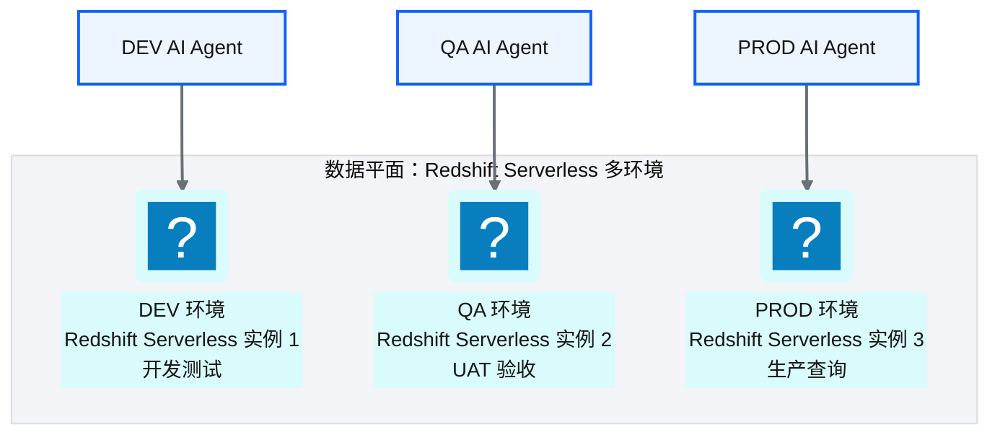
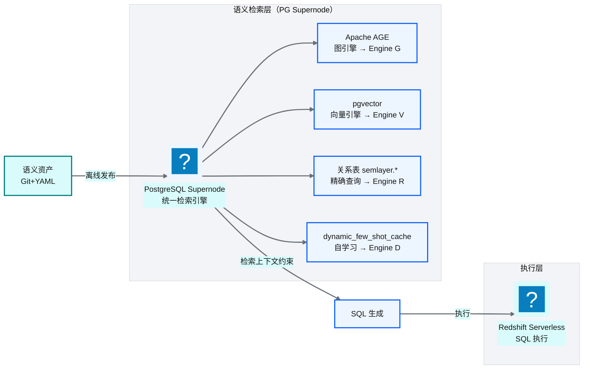
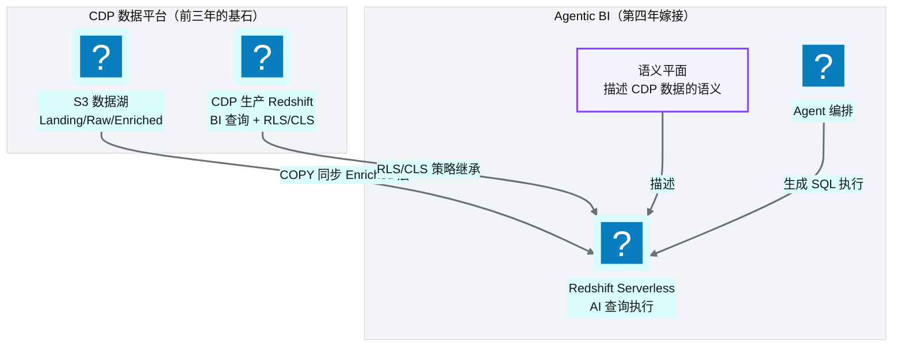
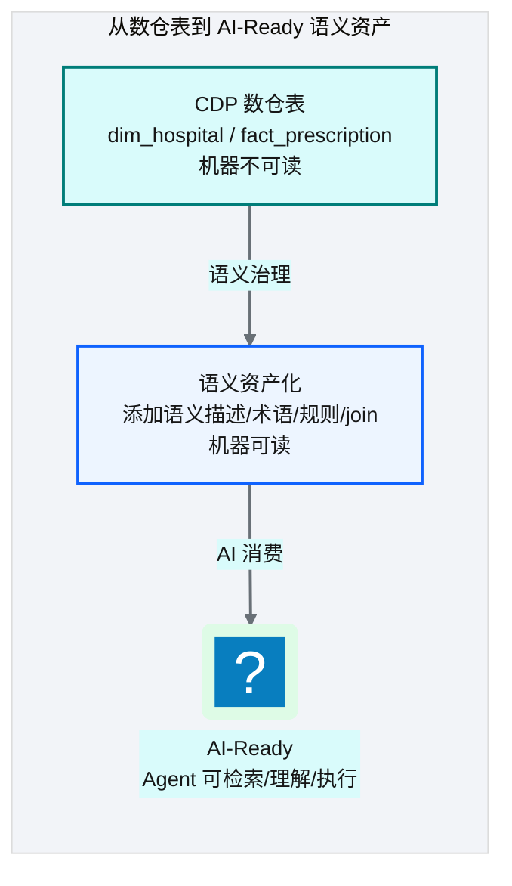
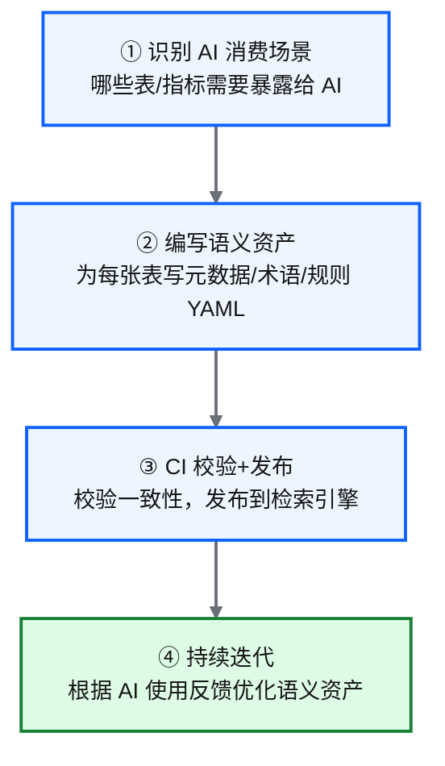
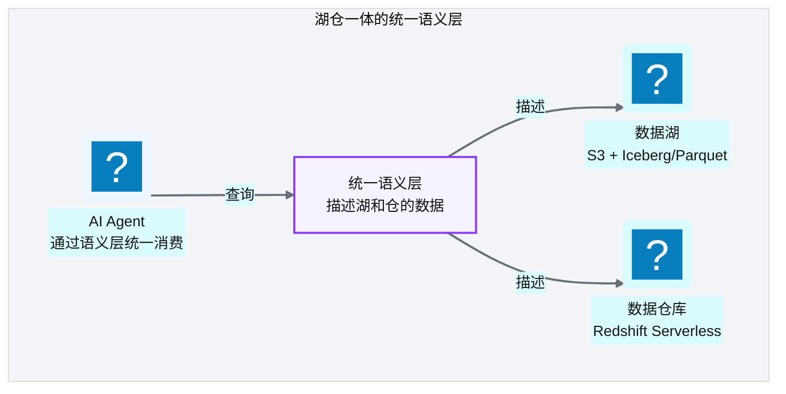

# Ch 46 数据平面与 CDP 整合
!!! info "面包屑"
    [本书主页](./index.md) › [Part VII Data+AI 转型](./45-记忆系统与工具使用.md) › Ch 46

!!! abstract "项目第 4 年 · Data+AI转型期——CDP整合"

---

## :material-school: 本章你将学到
- 数据平面：Redshift Serverless（dev/qa/prod 各环境独立实例 + 双数据面后端切换）
- 语义检索层：PG Supernode 一体化架构——一个 PG 实例承载 R/V/G/D 四引擎，与 Redshift 执行后端分离
- 把语义层接到 CDP：数据同步链路、RLS/CLS 继承策略、Agentic BI 执行后端定位
- AI-Ready 数据供应的落地：从数仓表到治理化语义资产的四个步骤与成本分析
- 湖仓一体的统一语义层：Iceberg/Delta 如何让数据湖拥有"表语义"

---

数据平面是 Agentic BI 的"执行域"——语义资产发布到这里供 Agent 检索（[Ch 40](./40-语义平面-三层治理与Git-YAML.md)），用户的问题也在这里变成 SQL 执行。但这一章更重要的主题是：**Agentic BI 的数据平面不是从零搭建的，而是根植于前三年的 CDP 数据平台生长出来的**。

CDP 平台是基石——数据湖的 Medallion 分层（[Ch 7](./07-数据湖分层设计.md)）、数仓的 Kimball 模型与 RLS/CLS 防护（[Ch 8](./08-数据仓库设计-Redshift.md)、[Ch 18](./18-数据脱敏与隐私治理.md)）、控制面与数据面的分离（[Ch 9](./09-计算与ETL设计-Glue与Lambda.md)）、元数据与血缘（[Ch 20](./20-元数据管理与数据血缘.md)）、DaaS 的多租户隔离（[Ch 37](./37-数据即服务-DaaS激活层设计.md)）——这些前三年的建设，为 Agentic BI 提供了现成的数据底座和安全骨架。Data+AI 转型不是"另起炉灶"，而是"在已有的数据平台上嫁接 AI 能力"。

---

## 46.1 数据平面：Redshift Serverless 多环境

Agentic BI 的执行后端选用 Redshift Serverless，而非复用 CDP 生产 Redshift。这个决策的核心是**执行隔离**——AI 生成的 SQL 不可预测性高，可能产生大量复杂查询，直接打在生产 Redshift 上会影响 BI 查询性能。


<p class="caption" markdown="span">**图 46-1** 数据平面：Redshift Serverless 多环境</p>

| 设计要点 | 说明 |
|---|---|
| **环境隔离** | dev/qa/prod 各有独立 Redshift Serverless 实例 |
| **Serverless** | 无需管理集群，按 RPU 用量计费，自动弹性扩缩容 |
| **执行隔离** | AI 查询在独立实例执行，不影响 CDP 生产 Redshift |
| **RLS/CLS 继承** | 每个 Serverless 实例配置与 CDP 一致的 RLS/CLS 策略 |
<p class="caption" markdown="span">**表 46-1** 数据平面：Redshift Serverless 多环境</p>


### 双数据面后端切换

生产用 Redshift Serverless，开发态可以切到轻量的 pg_mooncake（PG 列存扩展）作为本地替代——降低开发成本，不用每次查询都打云上 Redshift。切换通过环境变量控制，SQL 方言自动适配：

```python
# 示意：双数据面后端切换 + SQL 方言适配
import os

class DataPlaneExecutor:
    """统一的数据面执行器抽象——生产用 Redshift，开发用 pg_mooncake。"""
    _backend = os.getenv("TTD_DATA_PLANE_BACKEND", "redshift")  # redshift / pg_mooncake

    async def execute(self, sql: str, max_rows: int = 1000, timeout_ms: int = 30000):
        # 核心意图：同一套代码适配多个执行后端
        dialect_sql = self._adapt_dialect(sql)              # 方言适配（DISTKEY/SORTKEY 等 Redshift 专属语法）
        if self._backend == "redshift":
            return await self._redshift_exec(dialect_sql, max_rows, timeout_ms)
        else:
            return await self._pg_mooncake_exec(dialect_sql, max_rows, timeout_ms)

    async def explain(self, sql: str):
        """EXPLAIN 估算——供 Ch 44 成本护栏消费。"""
        return await self._backend_explain(sql)             # 返回 {plan, estimated_rows, estimated_cost}

    def _adapt_dialect(self, sql: str) -> str:
        # Redshift → PostgreSQL 方言转译（开发态 pg_mooncake 用 PG 方言）
        if self._backend == "pg_mooncake":
            return sqlglot.transpile(sql, read="redshift", write="postgres")[0]
        return sql
```

| 维度 | 生产（Redshift Serverless） | 开发（pg_mooncake） |
|---|---|---|
| **引擎** | AWS Redshift Serverless | pg_mooncake（PG + columnstore） |
| **连接** | redshift-connector | psycopg 标准协议 |
| **SQL 方言** | Redshift SQL（含 DISTKEY/SORTKEY） | PostgreSQL |
| **成本** | 按 RPU 用量计费 | 本地免费 |
| **规模** | PB 级 | 单机轻量 |
| **列存** | 原生列存 | pg_mooncake 列存镜像 |
<p class="caption" markdown="span">**表 46-2** 双数据面后端对比</p>


!!! warning "Trade-off"
    用独立 Redshift Serverless 实例而非复用 CDP 生产 Redshift，代价是额外的计算成本。但好处是**执行隔离**——AI 查询可能产生大量复杂 SQL，如果直接打在生产 Redshift 上可能影响 BI 查询性能。Serverless 按用量计费、空闲时不收费，成本可控。开发态可用轻量本地数据面降低成本，但需注意方言差异带来的"本地通过、生产失败"风险，架构上应做双方言 CI 校验保障一致性。

---

## 46.2 语义检索层：PG Supernode 一体化架构

语义检索层承载 R/V/G/D 四引擎的运行时检索。设计决策是用 **PG Supernode**——一个 PostgreSQL 实例统一承载 R/V/G 三类检索引擎（D 引擎也在同一 PG 的 `dynamic_few_shot_cache` 表）。这比"pgvector + Neo4j + Elastic"三套独立服务更简单——事务一致、运维简单、开发态一体化。


<p class="caption" markdown="span">**图 46-2** 语义检索层：PG Supernode 一体化架构</p>

### PG Supernode 的 Schema 映射

| Schema/表 | 承载引擎 | 内容 | 说明 |
|---|---|---|---|
| `semlayer.*`（17 张关系表） | R | 语义层关系表（table_asset/column_asset/metric_asset 等） | 结构化精确查询 |
| `*_embedding`（8 张向量表） | V | pgvector 向量表 | 语义相似度检索 |
| `ttd_governance`（AGE 属性图） | G | Apache AGE 图——Table/Column/Metric/Term 节点 + 13 种边类型 | 关系推理、join 路径发现 |
| `semlayer.dynamic_few_shot_cache` | D | 动态 few-shot 缓存 | 从修复成功自学习 |
| `semlayer.sql_cache` | — | SQL 语义缓存（pgvector） | 性能优化 |
<p class="caption" markdown="span">**表 46-3** PG Supernode Schema 映射</p>


### 为什么 PG Supernode 而非存算分离

| 维度 | PG Supernode 一体化（NewtonData） | 存算分离（pgvector + Neo4j + Elastic） |
|---|---|---|
| **运维** | 低（单实例） | 高（多服务各自运维） |
| **事务一致** | 强（共享 PG 事务） | 弱（跨服务无事务） |
| **性能** | 中（单引擎非专用） | 高（各引擎专用优化） |
| **规模** | 中（百万级 embedding） | 大（十亿级） |
| **开发态体验** | 一体化降低门槛 | 多服务联调复杂 |
<p class="caption" markdown="span">**表 46-4** PG Supernode 一体化 vs 存算分离</p>


!!! tip "引申：基石回扣——检索层与执行层分离 = 控制面与数据面分离"
    检索层（PG Supernode）和执行层（Redshift Serverless）分离的原因是**职责不同**——检索层是"知识查询"（查语义资产，低频小数据），执行层是"数据查询"（执行 SQL，高频大数据）。混合在一起会互相影响性能。分离让各自独立扩展、独立优化。

    这与 CDP 平台的"控制面（Lambda）与数据面（Glue）分离"（[Ch 9](./09-计算与ETL设计-Glue与Lambda.md)）是同一个设计思想——Lambda 做轻量协调（控制面），Glue 做重计算（数据面）；PG Supernode 做轻量检索（知识面），Redshift 做重查询（执行面）。**同一个分离原则，在不同层级反复应用**——这是平台架构设计的底层逻辑。

    NewtonData 选择 PG Supernode 一体化而非存算分离，是开发态的取舍——降低运维复杂度。生产态如果规模增长到千万级 embedding，可以演进到存算分离（抽象 VectorStore 接口，生产态切 Qdrant/Milvus）。

---

## 46.3 把语义层接到 CDP：Redshift 作为 Agentic BI 执行后端

这一节是"CDP 是基石"叙事的核心——Agentic BI 的执行后端不是独立的数据源，而是 CDP 数据平台的数据经过治理后同步过来的。


<p class="caption" markdown="span">**图 46-3** 把语义层接到 CDP：Redshift 作为 Agentic BI 执行后端</p>

### 数据同步链路

CDP 数据湖的 Enriched 层（Gold）数据通过 `COPY` 命令同步到 Redshift Serverless——这一步复用了 CDP 平台已有的数据管道（[Ch 7](./07-数据湖分层设计.md) 的 Medallion 分层、[Ch 9](./09-计算与ETL设计-Glue与Lambda.md) 的 ETL 设计），不需要为 AI 单独建数据管道：

```sql
-- 示意：CDP Enriched 层数据同步到 Redshift Serverless（AI 执行后端）
-- 复用 CDP 已有的 S3 → Redshift COPY 管道（Ch 7/Ch 9）
COPY fact_prescription
FROM 's3://ap-aurora-cdp-enriched/pharma/fact_prescription/'
IAM_ROLE 'arn:aws-cn:iam::123456789012:role/ap-aurora-cdp-ai-exec'
FORMAT AS PARQUET;

-- 同步 dim_hospital、dim_product 等维度表...
-- 同步后，AI Agent 生成的 SQL 在 Serverless 执行，不影响 CDP 生产 Redshift
```

### RLS/CLS 继承策略

AI 查询继承 CDP 的 RLS/CLS 策略——这是 [Ch 8](./08-数据仓库设计-Redshift.md) 和 [Ch 18](./18-数据脱敏与隐私治理.md) 建立的三层防护（行级安全 + 列级安全 + 脱敏 UDF）在 AI 场景的延伸。[Ch 37](./37-数据即服务-DaaS激活层设计.md) 的 DaaS 已经建立了 `db_user_{tenant}` 多租户隔离，Agentic BI 把这套机制延伸到 AI Agent 角色：

```sql
-- 示意：AI Agent 继承 CDP 的 RLS 策略（Ch 8/18/37 三层防护的延伸）
-- 原则：AI 权限 ≤ 用户的权限（Ch 44 核心安全原则）

-- 1. 行级安全：AI Agent 只能查用户有权限的区域数据
CREATE RLS POLICY region_isolation
AS ON SELECT TO ai_agent_role
USING (region = current_user_region());      -- 继承 CDP 的区域隔离策略

-- 2. 列级安全：PII 列对 AI Agent 不可见（Ch 18 脱敏策略）
ALTER TABLE dim_hospital ALTER COLUMN license_id
SET VISIBILITY 'hidden' TO ai_agent_role;    -- hidden = LLM 不可见

-- 3. 绑定 RLS 策略到 AI Agent 角色
GRANT RLS POLICY region_isolation TO ROLE ai_agent_as_user_a;
-- "ai_agent_as_user_a" 继承 user_a 的权限边界，AI 查询不会越权
```

| 整合点 | CDP 基石 | Agentic BI 延伸 |
|---|---|---|
| **数据同步** | [Ch 7](./07-数据湖分层设计.md) Medallion Enriched 层 | COPY 同步到 Redshift Serverless |
| **行级安全** | [Ch 8](./08-数据仓库设计-Redshift.md) RLS 策略 | AI Agent 继承用户区域隔离 |
| **列级安全** | [Ch 18](./18-数据脱敏与隐私治理.md) CLS + 脱敏 | PII 列对 LLM 不可见 |
| **多租户** | [Ch 37](./37-数据即服务-DaaS激活层设计.md) `db_user_{tenant}` | 延伸为 `ai_agent_as_user_{tenant}` 角色 |
| **执行隔离** | [Ch 9](./09-计算与ETL设计-Glue与Lambda.md) 控制面/数据面分离 | 检索层/执行层分离 |
<p class="caption" markdown="span">**表 46-5** CDP 基石与 Agentic BI 延伸的整合点</p>


!!! tip "引申：基石回扣——三层防护从数据层延伸到生成层"
    CDP 平台建立了 RLS/CLS/脱敏三层防护（[Ch 18](./18-数据脱敏与隐私治理.md)），[Ch 44](./44-五层SQL护栏与执行安全.md) 的五层护栏是这套防护在"生成层"的延伸。两者叠加形成完整安全链：CDP 防护是"数据层"的（数据本身有权限边界），Agentic BI 护栏是"生成层"+"输入层"的（LLM 生成的 SQL 要校验、用户输入要防注入）。数据层的 RLS/CLS 是最后一道硬防线——即使 LLM 生成了越权 SQL，数据库层也会拒绝执行。**AI 不是绕过安全，而是在已有安全骨架上增加新的防护层**。

---

## 46.4 AI-Ready 数据供应的落地：从数仓表到治理化语义资产

数据同步到 Serverless 只是第一步——机器可读的表结构不等于 AI 可消费的语义资产。需要把 CDP 数仓表"语义化"：添加业务描述、术语映射、计算规则、join 路径，让 Agent 能检索、理解、执行。


<p class="caption" markdown="span">**图 46-4** AI-Ready 数据供应的落地：从数仓表到治理化语义资产</p>

### 转化的四个步骤


<p class="caption" markdown="span">**图 46-5** 转化的四个步骤</p>

| 步骤 | 产出 | 谁负责 | 成本量级 |
|---|---|---|---|
| ① 识别场景 | AI 消费范围清单 | 业务+数据团队 | 低（1-2 天梳理） |
| ② 编写资产 | :simple-yaml: YAML 语义文件 | 数据团队 | **高（核心成本）** |
| ③ 校验发布 | 发布到检索引擎 | CI 自动 | 低（自动化） |
| ④ 持续迭代 | 优化的语义资产 | 数据团队+AI 反馈 | 中（持续投入） |
<p class="caption" markdown="span">**表 46-6** 转化的四个步骤与成本</p>


### LLM 辅助生成 YAML 草稿

步骤② 的 YAML 编写是最大成本——每张暴露给 AI 的表都需要详细的语义描述（[Ch 40](./40-语义平面-三层治理与Git-YAML.md) 的三层治理 YAML）。缓解策略是用 LLM 辅助生成初始草稿，人工校验后发布：

```python
# 示意：LLM 辅助生成语义资产 YAML 草稿
def generate_yaml_draft(table_name: str, schema: dict) -> str:
    """从 CDP 数仓 schema 自动生成语义资产 YAML 草稿，人工校验后发布。"""
    prompt = f"""根据以下 Redshift 表结构，生成语义资产 YAML 草稿（三层治理格式）：
    表名：{table_name}
    列结构：{schema['columns']}
    外键关系：{schema.get('foreign_keys', [])}

    要求：
    1. 生成 L1 Table 资产（含业务描述、列语义、PII 标注）
    2. 推断可能的 L2 术语（如 amount → "金额"）
    3. 推断可能的 L3 业务规则（如 status 枚举值的业务含义）
    输出 YAML 格式。"""
    draft = llm.generate(prompt)                    # LLM 生成草稿
    return draft                                    # 人工校验后提交 Git PR
```

!!! warning "Trade-off：语义资产化的编写成本"
    语义资产化的最大成本是人工编写 YAML——每张暴露给 AI 的表需要多个语义资产文件（Table + Column + Term + Metric 等），规模化后文件数量可观。这是 [Ch 40](./40-语义平面-三层治理与Git-YAML.md) 提到的架构性挑战。缓解方向：按查询频率分批优先（先核心高频表，再长尾）；引入 LLM 辅助生成草稿、人工校验发布的半自动化工作流，降低首次编写门槛。

---

## 46.5 引申：湖仓一体的语义层如何统一湖与仓的 AI 消费


<p class="caption" markdown="span">**图 46-6** 引申：湖仓一体的语义层如何统一湖与仓的 AI 消费</p>

当前架构中，数据湖（S3）和数据仓库（Redshift）是分离的——语义平面只描述 Redshift 中的表，数据湖的 Parquet 文件没有"表语义"。未来方向是"统一语义层"——一套语义资产同时描述数据湖和数据仓库的数据，AI 通过语义层统一消费，不需要关心数据在湖里还是仓里。

这需要表格式（:material-database-sync: Iceberg/Delta）的支持——让数据湖也拥有"表"的语义（schema、分区、事务），而非散落的文件。[Ch 7](./07-数据湖分层设计.md) 当初选择纯 Parquet 而非 Iceberg/Delta 是一个遗憾（[Ch 52](./52-架构师的复盘-取舍遗憾与主流对比.md) 复盘），湖仓一体的统一语义层正是弥补这个遗憾的演进方向。

!!! tip "引申：湖仓一体的终极愿景"
    湖仓一体（Lakehouse）的终极愿景是**湖和仓的边界消失，语义层统一一切**。Iceberg/Delta 表格式让数据湖拥有 ACID 事务、schema 演化、时间旅行——这些原本只有数据仓库才有的能力。当数据湖也变成了"表"，语义平面就能同时描述湖和仓的数据，AI Agent 不再需要知道"这张表在 S3 还是 Redshift"——统一语义层屏蔽了存储差异。这是数据平台演进的下一个台阶，也是 Agentic BI 数据供应的终极形态。

---

## :material-check-circle: 本章小结
- 数据平面：Redshift Serverless，dev/qa/prod 各环境独立实例——执行隔离，AI 查询不影响 CDP 生产；开发态可用 pg_mooncake 本地替代（双数据面后端切换 + SQL 方言适配）
- 语义检索层：PG Supernode 一体化架构——一个 PG 实例承载 R/V/G/D 四引擎（semlayer.*→R、*_embedding→V、ttd_governance→G、dynamic_few_shot_cache→D），与 Redshift 执行层分离（职责不同 = Ch 9 控制面/数据面分离的同一思想）
- CDP 整合：CDP Enriched 数据 COPY 同步到 Serverless（复用 Ch 7/9 管道）；RLS/CLS 继承 CDP 三层防护（Ch 8/18），延伸为 `ai_agent_as_user_{tenant}` 角色（Ch 37 多租户延伸）——**AI 不是绕过安全，而是在已有安全骨架上增加防护层**
- AI-Ready 落地四步：识别场景→编写 YAML→CI 发布→持续迭代——最大成本是 YAML 编写（~80-120 文件），LLM 辅助生成草稿缓解
- 未来方向：湖仓一体统一语义层——Iceberg/Delta 让数据湖拥有"表语义"，弥补 Ch 7 纯 Parquet 遗憾，一套语义描述湖和仓，AI 统一消费

---

!!! quote "下一章"
    [Ch 47 评估、可观测与持续演进](./47-评估-可观测与持续演进.md) —— Part VII 最后一章：Agentic BI 怎么评估质量、怎么做可观测、未来怎么演进。
