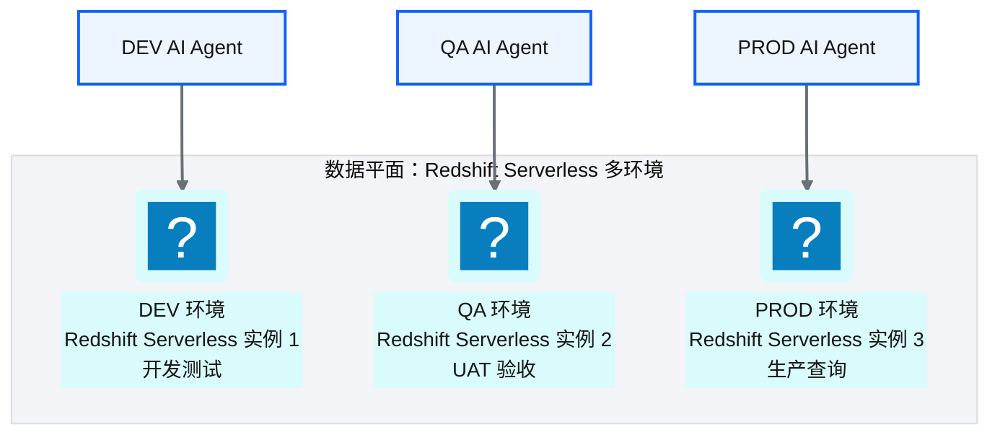
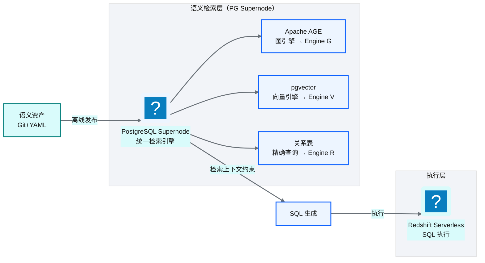
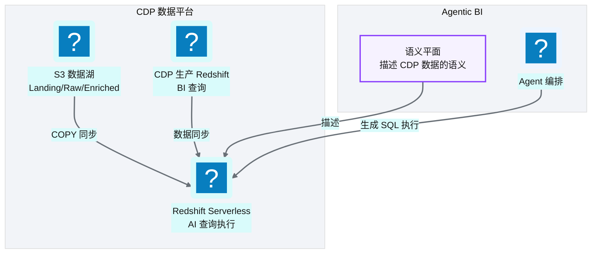
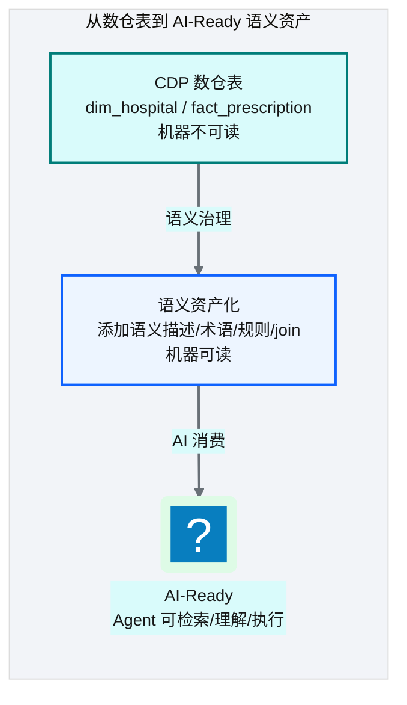
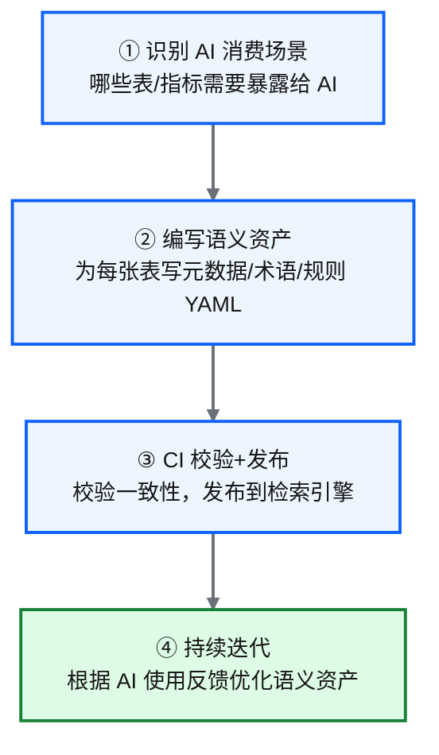
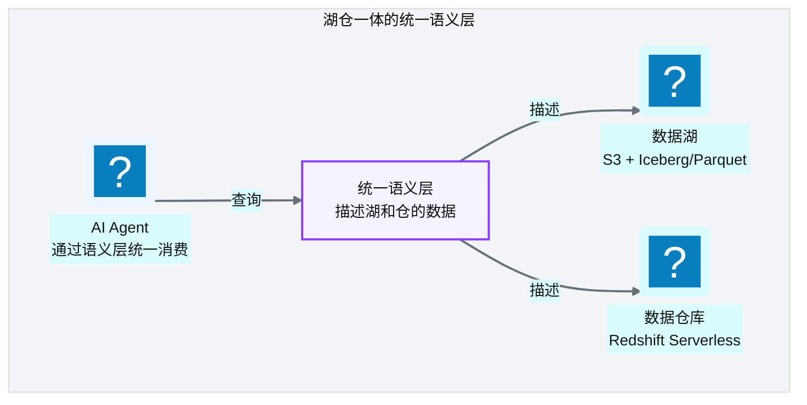

# Ch 46 数据平面与 CDP 整合
!!! info "面包屑"
    [本书主页](./index.md) › [Part VII Data+AI 转型](./45-记忆系统与工具使用.md) › Ch 46

!!! abstract "项目第 4 年 · Data+AI转型期——CDP整合"

---

## :material-school: 本章你将学到
- 数据平面：Redshift Serverless（dev/qa/prod 各环境独立实例）
- 语义检索层：图+向量检索引擎承载 R/V/G 引擎，与 Redshift 执行后端分离
- 把语义层接到 CDP：Redshift 作为 Agentic BI 执行后端
- AI-Ready 数据供应的落地：从数仓表到治理化语义资产

---

## 46.1 数据平面：Redshift Serverless 多环境

**图 46-1** 数据平面：Redshift Serverless 多环境

| 设计要点 | 说明 |
|---|---|
| **环境隔离** | dev/qa/prod 各有独立 Redshift Serverless 实例 |
| **Serverless** | 无需管理集群，按用量计费，自动弹性 |
| **执行隔离** | AI 查询在独立实例执行，不影响 CDP 生产 Redshift |
| **RLS/CLS** | 每个 Serverless 实例配置 RLS/CLS 策略 |

**表 46-1** 数据平面：Redshift Serverless 多环境

!!! warning "Trade-off"
    用独立 Redshift Serverless 实例而非复用 CDP 生产 Redshift，代价是额外的计算成本。但好处是**执行隔离**——AI 查询可能产生大量复杂 SQL，如果直接打在生产 Redshift 上可能影响 BI 查询性能。Serverless 按用量计费，空闲时不收费，成本可控。

---

## 46.2 语义检索层：图+向量检索引擎

**图 46-2** 语义检索层：图+向量检索引擎

| 组件 | 承载引擎 | 作用 |
|---|---|---|
| **:simple-postgresql: PostgreSQL Supernode** | 统一承载 | 一个 PG 实例承载三类检索 |
| **Apache AGE** | Engine G（图遍历） | 表间关系路径发现 |
| **pgvector** | Engine V（向量语义） | 模糊语义匹配 |
| **关系表** | Engine R（关系精确） | 精确匹配表/列/指标 |
| **Redshift Serverless** | SQL 执行 | 执行生成的 SQL |

**表 46-2** 语义检索层：图+向量检索引擎

### 为什么检索层与执行层分离

!!! tip "引申"
    检索层（PG Supernode）和执行层（Redshift Serverless）分离的原因是**职责不同**——检索层是"知识查询"（查语义资产，低频小数据），执行层是"数据查询"（执行 SQL，高频大数据）。混合在一起会互相影响性能。分离让各自独立扩展、独立优化。这与 CDP 平台的"控制面（Lambda）与数据面（Glue）分离"（[Ch 9](./09-计算与ETL设计-Glue与Lambda.md)）是同一个设计思想。

---

## 46.3 把语义层接到 CDP：Redshift 作为 Agentic BI 执行后端

**图 46-3** 把语义层接到 CDP：Redshift 作为 Agentic B...

### 整合架构

| 整合点 | 说明 |
|---|---|
| **数据同步** | CDP Enriched 层数据同步到 Redshift Serverless（AI 执行后端） |
| **语义描述** | 语义平面描述 CDP 数据的语义（表/列/指标/join） |
| **AI 执行** | Agent 生成 SQL 在 Serverless 执行，不影响生产 |
| **RLS/CLS 继承** | AI 查询继承 CDP 的 RLS/CLS 策略 |

**表 46-3** 整合架构

---

## 46.4 AI-Ready 数据供应的落地：从数仓表到治理化语义资产

**图 46-4** AI-Ready 数据供应的落地：从数仓表到治理化语义资产

### 转化的四个步骤

**图 46-5** 转化的四个步骤

| 步骤 | 产出 | 谁负责 |
|---|---|---|
| ① 识别场景 | AI 消费范围清单 | 业务+数据团队 |
| ② 编写资产 | :simple-yaml: YAML 语义文件 | 数据团队 |
| ③ 校验发布 | 发布到检索引擎 | CI 自动 |
| ④ 持续迭代 | 优化的语义资产 | 数据团队+AI 反馈 |

**表 46-4** 转化的四个步骤

!!! warning "Trade-off"
    语义资产化的最大成本是"YAML 编写"——每张暴露给 AI 的表都需要详细的语义描述。这是 the-ttd 在 [Ch 40](./40-语义平面-三层治理与Git-YAML.md) 中提到的"已知不足"。缓解策略：从最常被查询的 10-20 张核心表开始，逐步扩展；利用 LLM 辅助生成初始 YAML 草稿，人工校验后发布。

---

## 46.5 引申：湖仓一体的语义层如何统一湖与仓的 AI 消费

**图 46-6** 引申：湖仓一体的语义层如何统一湖与仓的 AI 消费

!!! tip "引申"
    未来方向是"统一语义层"——一套语义资产同时描述数据湖和数据仓库的数据，AI 通过语义层统一消费，不需要关心数据在湖里还是仓里。这需要表格式（:material-database-sync: Iceberg/Delta）的支持——让数据湖也拥有"表"的语义，而非散落的文件。这是湖仓一体（Lakehouse）的终极愿景：**湖和仓的边界消失，语义层统一一切**。

---

## :material-check-circle: 本章小结
- 数据平面：Redshift Serverless，dev/qa/prod 各环境独立实例——执行隔离，AI 查询不影响生产
- 语义检索层：PostgreSQL Supernode（AGE+pgvector+关系表）承载 R/V/G 引擎，与 Redshift 执行层分离
- CDP 整合：CDP Enriched 数据同步到 Serverless；语义平面描述 CDP 数据；AI 继承 RLS/CLS
- AI-Ready 落地四步：识别场景→编写 YAML→CI 发布→持续迭代——最大成本是 YAML 编写
- 未来方向：湖仓一体统一语义层——一套语义描述湖和仓，AI 统一消费

---

!!! quote "下一章"
    [Ch 47 评估、可观测与持续演进](./47-评估-可观测与持续演进.md) —— Part VII 最后一章：Agentic BI 怎么评估质量、怎么做可观测、未来怎么演进。

