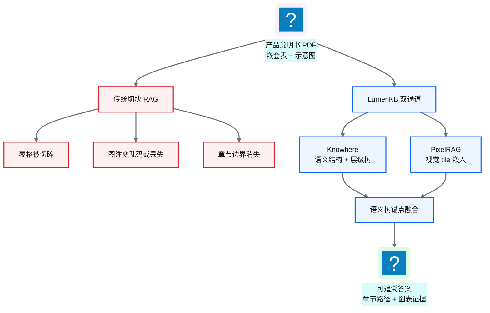
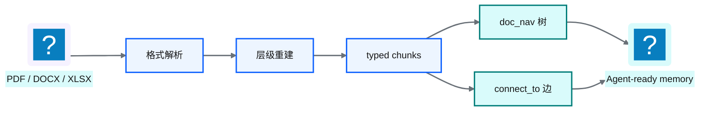
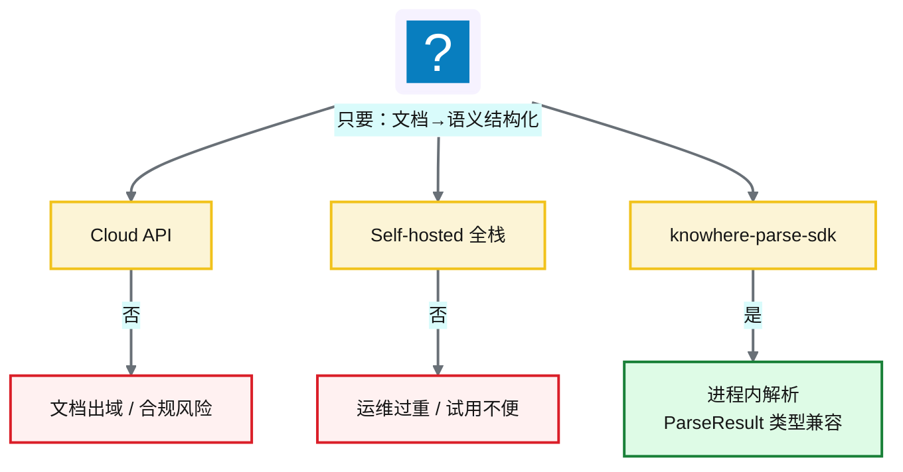
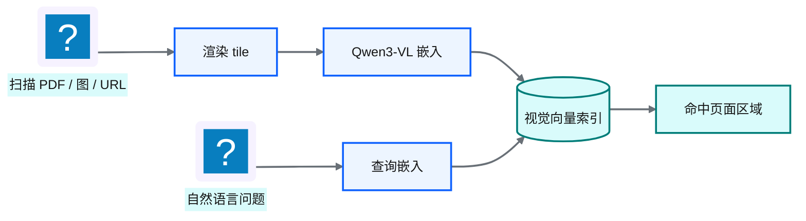
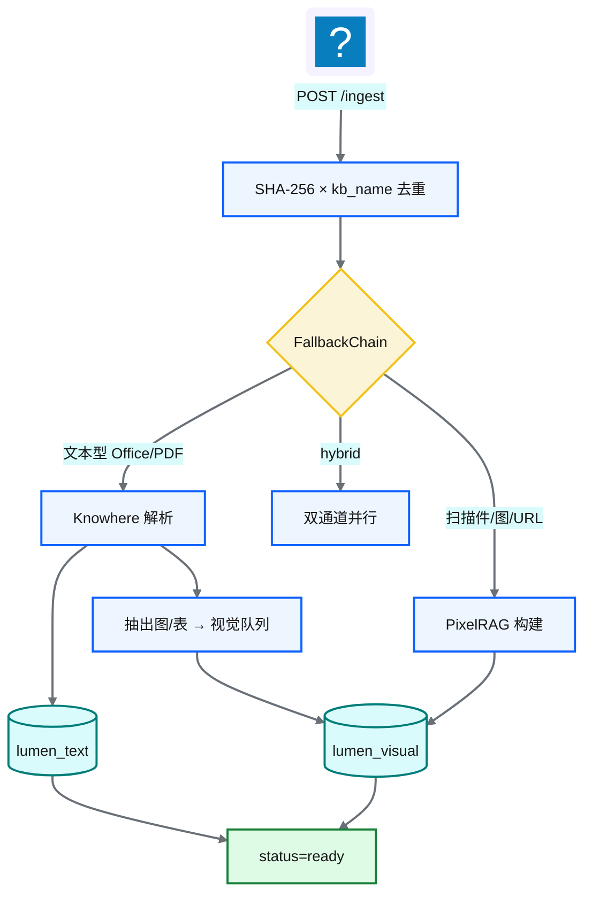
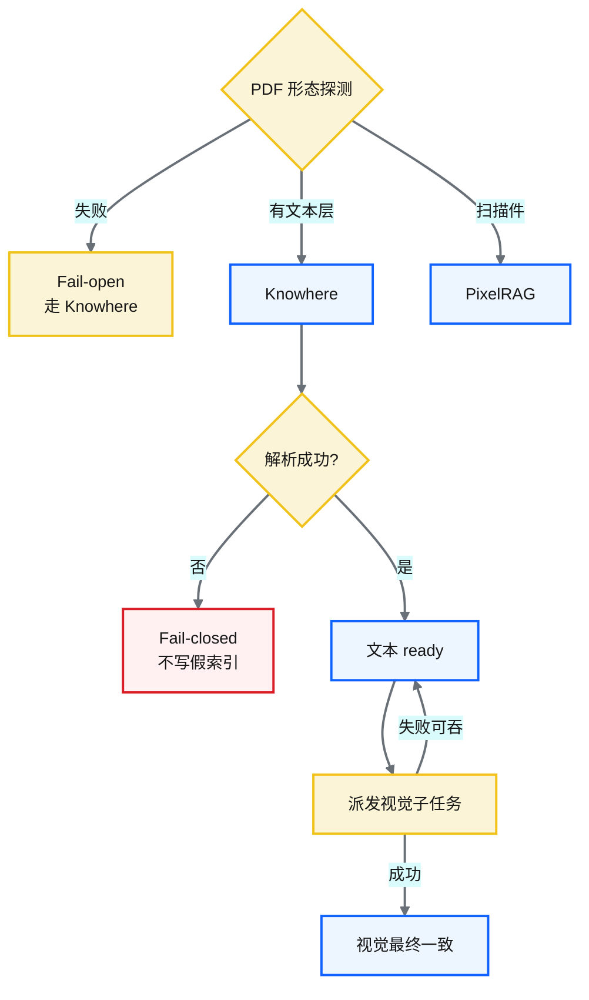
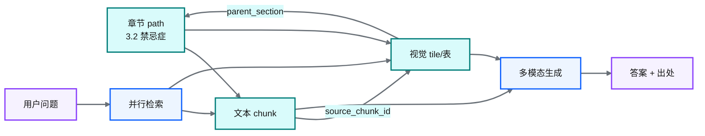
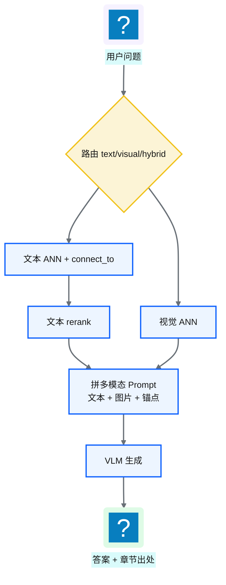

# Ch 47 多模态业务知识库：Knowhere × PixelRAG 与 LumenKB

!!! info "面包屑"
    [本书主页](./index.md) › [Part VII Data+AI 转型](./46-数据平面与CDP整合.md) › Ch 47

!!! abstract "项目第 4 年 · Data+AI POC——多模态业务知识库"

---

## :material-school: 本章你将学到
- 为什么传统文本切块 RAG 在医药业务文档上失败（表格碎裂、图注丢失、章节上下文断裂）
- Knowhere：解析 → 层级树（`doc_nav`）→ typed chunks（text/table/image）→ `connect_to` 图边
- 为何不能直接用 Knowhere Cloud / 全栈 self-hosted，以及 knowhere-parse-sdk 二开封装的决策逻辑
- PixelRAG：渲染 tile → Qwen3-VL 视觉嵌入 → 视觉进 Milvus（而非 FAISS）的取舍
- LumenKB：FallbackChain 摄入路由、fail-open/fail-closed、双通道索引、语义树锚点、prompt 级融合
- Celery 三队列与 `kb_name` 多租户过滤；`api` vs `parser` 双模式

---

NewtonData 把「不会写 SQL」这件事啃开了（[Ch 38](./38-时代命题-AI-Ready数据供应.md)–[Ch 46](./46-数据平面与CDP整合.md)）。第 4 年中途，销售培训和医学信息又来抱怨，语气很像取数，问题却不是数仓：

> 「产品说明书、价策 PDF、学术 PPT 都在共享盘里，搜得到文件名，读不懂里面的表格和示意图。」

有一次我陪销售培训抽检：同一份说明书里，「禁忌症」和「不良反应」字面接近，合规口径却完全不同。扁平切块把相邻节搅在一起，模型答得很自信，却答错了。问题不在 prompt，是文档结构被切没了。

他们要的是带版式的业务文档：禁忌症页里的嵌套表、规格对比图、渠道包装示意图。这些写不进 [Ch 40](./40-语义平面-三层治理与Git-YAML.md) 的 YAML，也轮不到 [Ch 41](./41-RVGD四引擎RAG检索.md) 四引擎去检索。

所以 Part VII 还有第二条 POC 线：多模态业务知识库 **LumenKB**。Knowhere 做语义结构化，PixelRAG 做视觉理解，检索侧再用章节锚点把两种证据挂回同一份文档。

!!! warning "POC 定位"
    LumenKB 和 NewtonData 一样，是第 4 年的方向探索加内部试用，不是全公司知识库投产。下文架构来自这次 POC；推到全量产品线文档库还要再验证。

---

## 47.1 问题框定：非结构化业务文档 vs 语义平面

先分清两种 RAG，后文才不会搅在一起：

| 维度 | NewtonData 四引擎 RAG（[Ch 41](./41-RVGD四引擎RAG检索.md)） | LumenKB 多模态文档 RAG（本章） |
|---|---|---|
| **知识形态** | 表/列/指标/Join/术语 YAML | Word、PDF、扫描件、网页截图 |
| **检索对象** | 结构化语义资产 | 文本 chunk + 视觉 tile |
| **失败模式** | 术语歧义、幻觉列、不安全 SQL | 表格碎裂、图注丢失、章节断上下文 |
| **用户问题** | 「上季度华东处方趋势？」 | 「说明书第 12 页禁忌症表怎么写的？」 |
| **输出** | SQL + 数表 | 带出处答案 + 图表证据 |

**表 47-1** 两类 RAG：语义资产 vs 业务文档

医药业务文档里，传统切块 RAG 常栽在这些地方。

剂量、规格、渠道价往往在表里，不在段落。按固定 token 一切，行被拦腰切断，表结构也没了。包装示意、学术海报一 OCR，色块图例和箭头方向就丢了。更糟的是章节：「不良反应」和「注意事项」字面接近，合规口径却不同；扁平 chunk 搅在一起，Agent 分不清该引哪一节。

我当时的判断很简单：语义平面管的是机器可读的业务口径；这里缺的是人写给人看的版式文档的记忆层。两者都叫 RAG，吃的料不一样。多一层不是重复建设，是关注点分开。

**图 47-1** 传统切块失败 vs LumenKB 双通道

!!! tip "和 Ch 41 的关系"
    Ch 41 的 R/V/G/D 检索的是机器可读业务口径；本章检索的是人写给人看的版式文档。[Ch 48](./48-一线产品助手-FieldGenie与MCP增强.md) 再说怎么用 MCP 让 NewtonData 在需要文档证据时调用 LumenKB。两边互补，谁也不替代谁。

---

## 47.2 Knowhere：把脏文档变成 Agent 可导航的记忆

[Knowhere](https://github.com/Ontos-AI/knowhere)（Ontos-AI）说自己是复杂脏文档和 AI Agent 之间的 memory 层：不只吐 Markdown，还做解析、层级重建、多模态归一、轻量图链接。

对我们有用的不是一大段纯文本，而是下面这套语义结构化产物：

| 产物 | 含义 | 为什么重要 |
|---|---|---|
| **typed chunks** | `text` / `table` / `image` | 表格保留 HTML，图片保留字节与 VLM 摘要；检索时可按类型过滤 |
| **`doc_nav`** | 章节导航树（title / path / level / summary / children） | Agent 可沿树下钻，不必只靠向量近邻 |
| **`connect_to`** | chunk 间图边（如正文 `embeds` 插图） | 正文、插图、表格可互指，水合时能把多模态资产挂回原文 |
| **section summary** | 节摘要节点 | 先召回摘要，再按 path-prefix 下钻，降低全量 chunk 扫描 |

**表 47-2** Knowhere 语义结构化核心产物

管线入口是 worker 里的 `checkerboard_parse_output`：先按扩展名与启发式做 Profiling / 路由（PDF→MinerU，Office/图片各走不同 parser），再重建层级。POC 里我们不重写解析器，只消费结果。四步大致是：

1. **Profiling / 路由**：格式进不同 parser；PDF 常经 MinerU 进 Markdown，再重建层级。
2. **层级检测**：TOC、编号正则、字体聚类，必要时 LLM 标 heading level。目标是树，不是扁平段落列表。
3. **Chunk 转换**：DataFrame → `ChunkPayload`（text/table/image），表格转 HTML，图片走 VLM 摘要；`metadata.connect_to` 记下跨 chunk 边。
4. **发布记忆**：写出 `chunks.json`、`doc_nav.json`、`manifest.json`，给下游索引用。

**图 47-2** Knowhere：文档 → Agent-ready memory

上游 Knowhere 还有一套「沿 section 树 BFS + 多通道 RRF」的 agentic retrieval：LLM 读节摘要，决定下钻哪个子节，再 hydrate 叶子 chunk。LumenKB POC 没整包搬那套检索编排。我当时只要解析和结构化，检索自己做双集合 ANN 加语义树锚点（见 47.5）。原因很土：还要并 PixelRAG 视觉通道，统一编排放在 LumenKB 更干净，别把两种检索栈焊死在解析器里。

!!! tip "命名陷阱"
    Ontos-AI 的 Knowhere ≠ Milvus 里那个叫 knowhere 的 HNSW 索引实现。下文凡写 Knowhere，都指文档 memory 层。

---

## 47.3 解析能力的企业化落地：knowhere-parse-sdk

选型会上有人说：「直接调 Knowhere Cloud 不就行了？」有人说：「把 self-hosted 全栈拉起来。」两条我都掂量过，最后都否了。这一节就是那个 trade-off，也是我决定二开 **knowhere-parse-sdk** 的原因。

### 三角困境

| 路径 | 优点 | 对企业（医药）的硬伤 |
|---|---|---|
| **Knowhere Cloud API** | 零运维、能力最新 | 说明书/价策/学术材料**出域**；GxP/PIPL 数据驻留过不了（M10） |
| **Self-hosted 全栈** | 数据可留内网 | API + worker + dashboard + 中间件过重；POC 阶段运维扛不住 |
| **从零自研解析器** | 完全可控 | 重复造 MinerU、层级重建、多模态归一；周期不可接受 |

**表 47-3** 解析能力交付形态的三角困境

我们真正要的只是 Knowhere 的核心能力：把非结构化文档解析成语义结构化数据。不要云账单，也不要整套产品壳。所以我做了二开抽取：把 upstream worker 解析管线封成进程内本地 SDK。

**图 47-3** Cloud / Self-hosted / SDK 三角取舍

### SDK 做了什么、没做什么

| 做了 | 没做 |
|---|---|
| 复用 Knowhere worker 解析管线（pin 上游版本） | 重写 MinerU / 层级算法 |
| Stub 掉 S3/DB；解析期用 scoped fakeredis | 提供 Cloud 同等的多租户控制台 |
| `ParseResult` 与官方 Python SDK **类型兼容** | 替你托管 LLM/VLM/MinerU 密钥 |
| 本地文件与 HTTP(S) URL 一键 `parse()` | 替代 PixelRAG 视觉 tile 通道 |

**表 47-4** knowhere-parse-sdk 能力边界

「薄壳」五步比口号清楚。`KnowhereParser.parse()` 实际走的是：

1. **scoped fakeredis**：只替换 upstream 的 Redis factory（MinerU 配额 Lua 等），不全局 monkeypatch
2. **`checkerboard_parse_output`**：真正的解析与层级重建
3. **ZipResultSchemaBuilder**：写出 chunks / doc_nav / manifest
4. **`enrich_doc_nav_summaries`**：自底向上 LLM 节摘要（失败仅 warning，不整单失败）
5. **`ZipPackageWriter` → `parseResultZip`**：内存里得到类型化 `ParseResult`

Stub 不是关掉 S3/DB 代码，而是给配置单例填占位 env，让 settings 能物化；解析路径假设从不碰真 I/O。Redis 则是 factory 级 fakeredis。

### Pin、类型契约与双模式

Worker 上游 `package=false`，不能 `pip install`。SDK 的做法是：shared 走 PEP 508 git 依赖，worker 运行时 `git clone --depth 1` 到 `~/.cache/knowhere-parse-sdk/`，再 `sys.path.insert`。我们 pin 同一 ref（POC 里为 `2026.06.18.1`）。升级要同步改两处，再回归解析金样例。

类型面 vendored 自官方 `knowhere-python-sdk`：`text_chunks` / `table_chunks` / `image_chunks` 字段对齐。但类型兼容不等于服务语义等价：进程内解析没有检索侧 `namespace` / `document_id`（恒为 `None`）。LumenKB 的身份写在自家 Postgres / Milvus 标量字段上，不指望 SDK 给租户 ID。

LumenKB ingest 适配层因此同时支持：

- `KNOWHERE_MODE=parser`：企业默认，文档解析在进程内完成，不经 Cloud
- `KNOWHERE_MODE=api`：联调、对照官方服务（实验室可用，生产文档库不走）

两种模式都吐 duck-typed `ParseResult`，下游 `chunks_to_text_nodes` / `extract_visual_chunks` 不用改。

!!! warning "Trade-off：进程内 ≠ 零外联"
    这是 build vs buy 的中间解：买开源管线能力，不买云 API 或重型自托管壳。合规买到的是「源文件可不出企业边界」，没买到「零外部 HTTP」。MinerU 与 LLM/VLM 仍要自备端点，内网同协议也行。代价还包括：上游 pin 升级要跟；worker 不是友好 pip 包；bootstrap 全局一次，进程内多配置切换别扭；nav enrichment 非致命时可能拿到无 summary 的树。这些债我们认了。合规和能不能落地，比依赖图干不干净优先。

---

## 47.4 PixelRAG：版式与图表必须走视觉通道

Knowhere 再强，对扫描件、纯图 PPT、网页长截图仍可能结构化不够。表格线、色块图例、示意图布局本身就是信息。OCR 先毁版式再检索，等于先把证据弄丢。

[PixelRAG](https://github.com/StarTrail-org/PixelRAG) 的想法很直：别先把页面毁掉成纯文本，先当图来检索。

典型流水线：

1. **Render**：PDF 页 / HTML → 分块 JPEG tile（pixelshot 等；页或长截图切成可嵌入条带）
2. **Chunk**：大 tile 再切成 strip（控高度，换吞吐与精度）
3. **Embed**：`Qwen3-VL-Embedding` 一类视觉语言模型出向量（POC 用 2048-d）
4. **Index / Search**：视觉 ANN；查询可以是文本（嵌入后搜图）或图

上游 PixelRAG 默认偏 FAISS。LumenKB 里我选了另一条路：视觉向量也进 Milvus，和文本共用一个集群。丢掉的是 PixelRAG-native 索引语义；换来的是运维面统一、可上 DiskANN、`kb_name` / `parent_section` 一类标量过滤同一套语法。文档量上去以后，这个账更划算。

**图 47-4** PixelRAG 视觉检索路径

LumenKB 里视觉通道有两条进线：

| 路径 | 触发 | 产物 |
|---|---|---|
| **A. Knowhere 抽出的图/表** | 文本型文档解析后发现 image/table chunk | 派到视觉队列再嵌入，并带上章节锚点 |
| **B. 纯视觉文档** | 扫描 PDF、图片、URL | 整页 tile 嵌入（`chunk_type=tile`） |

**表 47-5** LumenKB 视觉进线两条路径

路径 A 可以看成语义骨架上长视觉肉：Knowhere 按文档顺序走 chunk，遇到 text 就更新 `parent_section`，遇到 image/table 就吐视觉描述符。路径 B 没有可靠章节树，锚点会稀一些。这也是为什么 PDF 形态探测尽量别把扫描件误送进纯文本通道。

!!! tip "和 LlamaIndex MultiModal 的对照"
    常见做法是 `TextNode` + `ImageNode` 分 store（LlamaIndex MultiModalVectorStoreIndex 一类）。LumenKB 同构这个切分，视觉编码器换成 PixelRAG/Qwen3-VL，并把章节锚点写进视觉元数据。后面融合能挂回章节，靠的就是这几个字段：两个流形分开存，生成阶段再会合。

---

## 47.5 LumenKB 融合架构：双通道 + 语义树锚点

LumenKB（内部 multimodal RAG 平台的 POC 代号）把上面两块收成一条能跑的知识库服务：FastAPI + Celery + Milvus + PostgreSQL + MinIO；对 Agent 暴露 REST 和 MCP。

### 摄入路由：FallbackChain

路由不是一个 if-else，而是按优先级的选择器链。第一个给出明确答案的胜出：

| 优先级 | 选择器 | 决策 |
|---|---|---|
| 1 | 文件名前缀 | `knowhere:` / `pixelrag:` 强制 |
| 2 | 强制模式 | 配置 `ROUTER_MODE`→ text / visual / hybrid |
| 3 | HTTP(S) URI | URL → 视觉通道 |
| 4 | PDF 形态探测 | 有文本层 → Knowhere；扫描件 → PixelRAG |
| 5 | 扩展名 / MIME | Office/md/csv→Knowhere；图片/html→PixelRAG |
| 默认 | — | Knowhere |

`source_type` 一类标签是元数据，不驱动路由。别把治理属性和调度逻辑焊在一起。Hybrid 指 `router.mode=hybrid` 时双管线并行；默认 PDF 不会自动「既 Knowhere 又整页 PixelRAG」，而是 Knowhere 后再按需派发图/表到视觉队列。

**图 47-5** LumenKB 双通道摄入

### Fail 策略：哪一层开、哪一层关

我把失败策略拆成几层，避免一刀切重试：

| 层 | 策略 | 理由 |
|---|---|---|
| PDF 形态探测失败 | **Fail-open → Knowhere** | 可用性优先；坏扫描件可后补视觉或前缀覆盖 |
| Knowhere 解析 / 文本 upsert | **Fail-closed** | 不写假索引；任务 FAILED |
| 视觉派发（Knowhere 后） | **非阻塞 / fail-open** | 文本先 `ready`，混合文档短暂可只靠文本答 |
| 查询侧单通道失败 | **Fail-soft → 空列表** | 路由继续，另一侧仍可答 |

视觉子任务用独立 job id（`{parent}:visual`），避免父任务已 SUCCESS、视觉还在 RENDERING 时状态机打架。文本与视觉是最终一致，不是同一事务。

**图 47-6** 摄入失败策略：探测 fail-open、解析 fail-closed、视觉非阻塞

### 双集合索引

| Collection | 维度 | 内容 | 检索器 |
|---|---|---|---|
| **lumen_text** | 1536-d | 文本/表格 HTML/节摘要 | KnowhereGraphRetriever（ANN + `connect_to` 扩展；节摘要可 path-prefix 下钻） |
| **lumen_visual** | 2048-d | tile / image / table 视觉向量 | PixelRAGVisualRetriever（文本/图查询嵌入；可选按 `image_id` 合并命中） |

**表 47-6** 双 Milvus collection

文本用 COSINE；视觉侧 POC 对 L2 归一化向量走 IP（等价余弦，躲过部分 COSINE 实现坑）。HNSW 参数大致 `M=16`、`efConstruction=256`、搜索 `ef=64`，偏召回稳定性，不追求极限 QPS。

文本和视觉不在同一个流形上，硬揉一个向量空间会互相污染。融合放在生成阶段，不放在嵌入阶段。

### 语义树锚点

视觉命中如果只有一张裁切图，用户和 Agent 都很难说清这是说明书哪一节。LumenKB 在 `lumen_visual` 上写四个锚点字段：

| 字段 | 作用 |
|---|---|
| `chunk_type` | `tile` / `image` / `table` |
| `parent_section` | 最近前置文本 chunk 的 path（LIKE 过滤） |
| `content_summary` | Knowhere 侧摘要，供 VLM 上下文 |
| `source_chunk_id` | 回指文本 chunk（EQ） |

**表 47-7** 语义树锚点字段

**图 47-7** 语义树锚点：视觉命中挂回章节

查询时不必跨 collection JOIN：视觉命中自带章节坐标，生成侧可以把「表截图 + 节摘要 + 正文」拼成可引用证据。

### 查询融合：prompt 级，不做跨模态 RRF

查询路径大致是：

1. **路由决策**：启发式 +（可选）LLM，判 text / visual / hybrid；附件可强制带图
2. **并行检索**：两侧 fail-soft；文本侧可再跑 `qwen3-rerank`，视觉侧按分数排序
3. **拼 prompt**：【参考文本】+【参考图片】（带 `parent_section` / `content_summary`）→ 多模态生成模型

我刻意不做「把 1536-d 和 2048-d 分数做 RRF」。不同嵌入空间的距离不可比，硬揉只会制造虚假置信度。融合交给 VLM 读图加读文。贵一点，但证据形态诚实。

**图 47-8** 查询侧 prompt 级融合（非跨模态 RRF）

### 运行时：队列、多租户、去重

| 决策 | 理由 |
|---|---|
| 视觉派发非阻塞 | 文本先 `ready`，混合文档短暂可只靠文本答 |
| `pixelrag_queue` 并发=1 | GPU 编码器防 OOM |
| 解析 fail-closed | Knowhere 失败不写假索引 |
| 多租户靠 `kb_name` 过滤 | 共享 Milvus，不必每库一 collection |
| 去重键 `(sha256, kb_name)` | 同一文件可进多个知识域 |

**表 47-8** LumenKB 运行时取舍

Celery 三队列把轻重活拆开：

| 队列 | 典型任务 | 并发（POC） | 为什么 |
|---|---|---|---|
| `router_queue` | 摄入分发 | 4 | 轻量路由 |
| `knowhere_queue` | 解析与文本索引 | 8 | CPU/网络为主 |
| `pixelrag_queue` | 渲染 + 视觉嵌入 + Knowhere 抽图表 | **1** | GPU/编码器防 OOM |

**表 47-9** LumenKB Celery 队列与并发

多租户 POC 里直接用 `kb_name=pharma`，和零售、专利等域隔开。过滤长得像：`kb_name == 'pharma' and year in [2025,2026]`。共享 collection 加标量过滤，运维便宜；隔离靠过滤纪律，不是物理分库。POC 够用，全量合规审计时再评估是否上 partition key。我们还没走到那步。

---

## 47.6 诚实边界

边界写清楚，比包装成「企业级知识中台」有用。

SKU 主数据、库存、价格引擎不在 LumenKB 里；产品卡靠上层应用拼（见 [Ch 48](./48-一线产品助手-FieldGenie与MCP增强.md)）。视觉通道有冷启动：GPU、模型权重、首包延迟都真实；`pixelrag_queue=1` 是稳定性优先，吞吐是债。SDK 绑上游 pin，Knowhere 升级不是 `pip install -U` 就完事，要回归解析金样例；离线无 git 环境也脆。PDF 探测会误判，损坏扫描件可能进文本通道，要运营抽检或 `pixelrag:` 前缀覆盖。相对 NewtonData，LumenKB 只补非结构化证据，不负责 NL2SQL。MCP 韧性细节留到下一章：工具超时、熔断、结构化错误，免得文档服务一抖拖垮 Agentic BI。

!!! tip "下一章预告"
    知识库能检索了，代表还要一个点开就能问的工作台：流式答案、引用、产品卡、角色可见性。那是 FieldGenie，以及它怎么经 MCP 把证据交回 NewtonData。

---

## :material-check-circle: 本章小结
- 业务文档 RAG 和语义资产 RAG 不是一回事：表格、图、章节在医药文档里权重很高
- Knowhere 产出语义结构化 memory（typed chunks、`doc_nav`、`connect_to`）；上游 agentic BFS 我们只借解析、不整包搬检索
- knowhere-parse-sdk：合规驱动的中间解；进程内解析、类型兼容；进程内 ≠ 零外联
- PixelRAG 用视觉嵌入保住版式；视觉进 Milvus，弃独立 FAISS 运维面
- LumenKB：FallbackChain 路由 + 分层 fail 策略 + 双通道 + 语义树锚点 + prompt 级融合
- 边界：不做目录搜索、视觉有冷启动、跟上游 pin、补强 Agentic BI 而非替代

---

!!! quote "下一章"
    [Ch 48 一线产品助手：FieldGenie 与 MCP 增强 Agentic BI](./48-一线产品助手-FieldGenie与MCP增强.md) —— 把 LumenKB 送到医药代表与销售手边，并经 MCP 接到 NewtonData。
