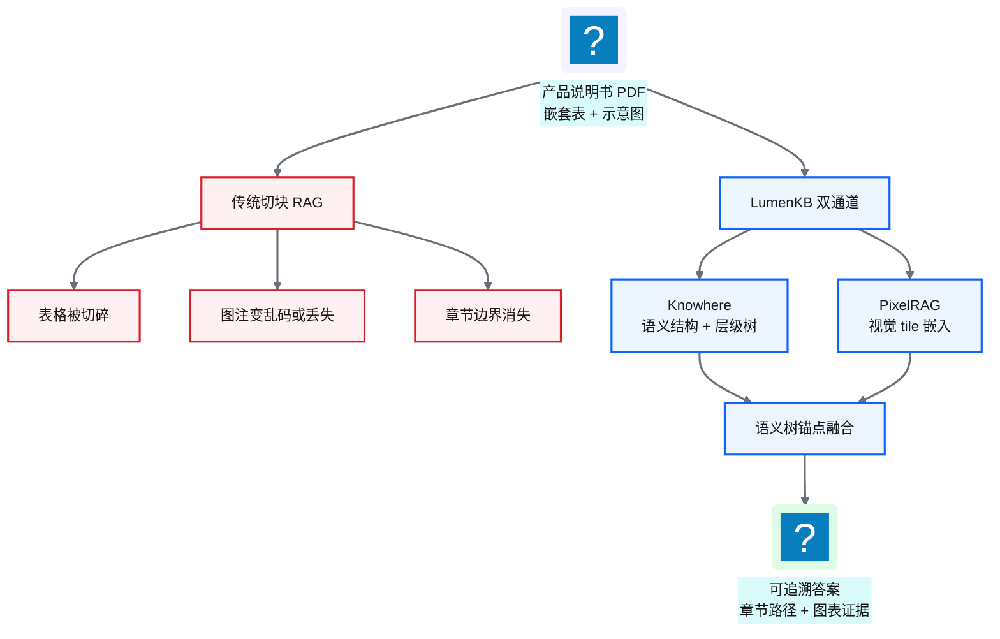
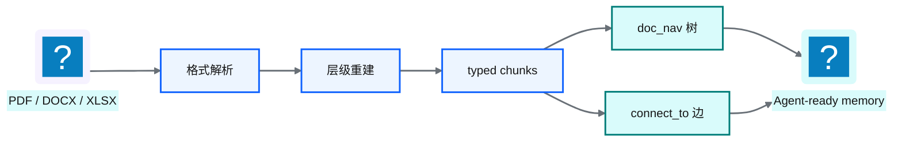
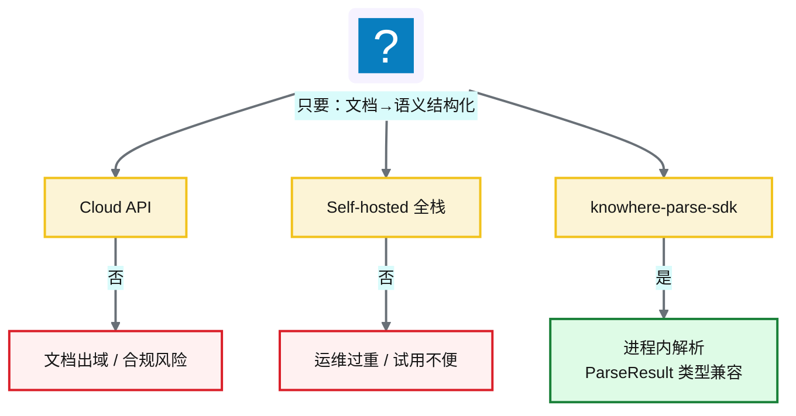
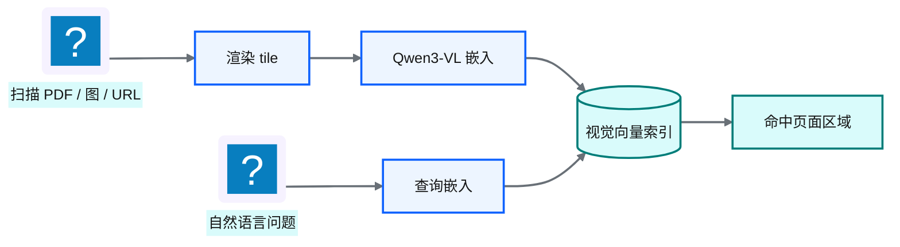
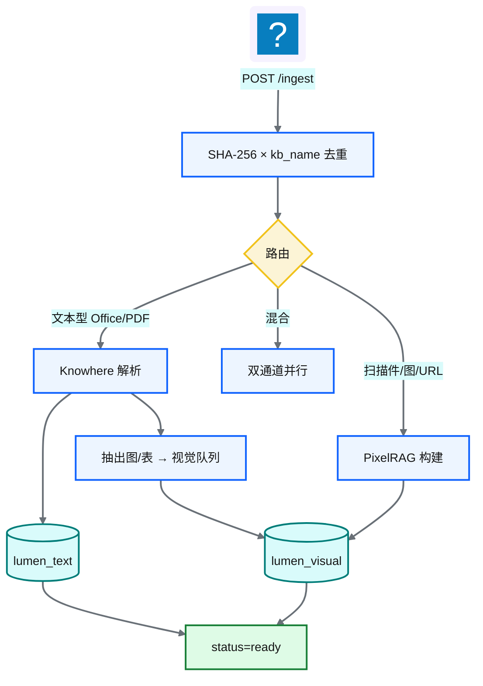
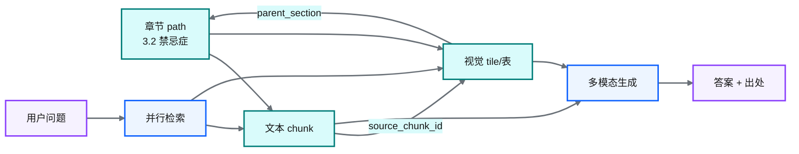

# Ch 47 多模态业务知识库：Knowhere × PixelRAG 与 LumenKB

!!! info "面包屑"
    [本书主页](./index.md) › [Part VII Data+AI 转型](./46-数据平面与CDP整合.md) › Ch 47

!!! abstract "项目第 4 年 · Data+AI POC——多模态业务知识库"

---

## :material-school: 本章你将学到
- 为什么传统文本切块 RAG 在医药业务文档上失败（表格碎裂、图注丢失、章节上下文断裂）
- Knowhere：解析 → 层级树（`doc_nav`）→ typed chunks（text/table/image）→ `connect_to` 图边
- 为何不能直接用 Knowhere Cloud / 全栈 self-hosted，以及 knowhere-parse-sdk 二开封装的决策逻辑
- PixelRAG：渲染 tile → Qwen3-VL 视觉嵌入 → 保留图表/版式的检索路径
- LumenKB 双通道 ingest/query、语义树锚点融合、多租户 `kb_name`
- LumenKB 对解析层的 `api` vs `parser` 双模式与失败封闭策略

---

NewtonData 把「不会写 SQL」这件事啃开了（[Ch 38](./38-时代命题-AI-Ready数据供应.md)–[Ch 46](./46-数据平面与CDP整合.md)）。第 4 年中途，销售培训和医学信息又来抱怨，语气很像取数，问题却不是数仓：

> 「产品说明书、价策 PDF、学术 PPT 都在共享盘里，搜得到文件名，读不懂里面的表格和示意图。」

他们要的是**带版式的业务文档**：禁忌症页里的嵌套表、规格对比图、渠道包装示意图。这些写不进 [Ch 40](./40-语义平面-三层治理与Git-YAML.md) 的 YAML，也轮不到 [Ch 41](./41-RVGD四引擎RAG检索.md) 四引擎去检索。

所以 Part VII 还有**第二条 POC 线**：多模态业务知识库 **LumenKB**。Knowhere 做语义结构化，PixelRAG 做视觉理解，检索侧再用「语义树锚点」把两种证据挂回同一份文档的章节路径。

!!! warning "POC 定位"
    LumenKB 和 NewtonData 一样，是第 4 年的**方向探索 + 内部试用**，不是全公司知识库投产。下文架构来自这次 POC；推到全量产品线文档库还要再验证。

---

## 47.1 问题框定：非结构化业务文档 vs 语义平面

先分清两种 RAG，后文才不会搅在一起：

| 维度 | NewtonData 四引擎 RAG（[Ch 41](./41-RVGD四引擎RAG检索.md)） | LumenKB 多模态文档 RAG（本章） |
|---|---|---|
| **知识形态** | 表/列/指标/Join/术语 YAML | Word、PDF、扫描件、网页截图 |
| **检索对象** | 结构化语义资产 | 文本 chunk + 视觉 tile |
| **失败模式** | 术语歧义、幻觉列、不安全 SQL | 表格碎裂、图注丢失、章节断上下文 |
| **用户问题** | 「上季度华东处方趋势？」 | 「说明书第 12 页禁忌症表怎么写的？」 |
| **输出** | SQL + 数表 | 带出处答案 + 图表证据 |

**表 47-1** 两类 RAG：语义资产 vs 业务文档

医药业务文档里，传统切块 RAG 常栽在这些地方：

1. **表格即知识**：剂量、规格、渠道价、报销码，答案往往在表里，不在段落。
2. **图即证据**：包装示意、流程、学术海报，OCR 成字以后信息大量丢。
3. **章节即上下文**：「不良反应」和「注意事项」字面接近，合规口径却不同；扁平 chunk 会把相邻节搅乱。

**图 47-1** 传统切块失败 vs LumenKB 双通道

!!! tip "和 Ch 41 的关系"
    Ch 41 的 R/V/G/D 检索的是「机器可读业务口径」；本章检索的是「人写给人看的版式文档」。都叫 RAG，吃的料不一样。[Ch 48](./48-一线产品助手-FieldGenie与MCP增强.md) 再说怎么用 MCP 让 NewtonData 在需要文档证据时调用 LumenKB。两边互补，谁也不替代谁。

---

## 47.2 Knowhere：把脏文档变成 Agent 可导航的记忆

[Knowhere](https://github.com/Ontos-AI/knowhere)（Ontos-AI）说自己是「复杂脏文档和 AI Agent 之间的 memory 层」：不只吐 Markdown，还做解析、层级重建、多模态归一、轻量图链接。

对我们有用的，不是「一大段纯文本」，而是这套**语义结构化产物**：

| 产物 | 含义 | 为什么重要 |
|---|---|---|
| **typed chunks** | `text` / `table` / `image` | 表格保留 HTML，图片保留字节与摘要 |
| **`doc_nav`** | 章节导航树 | Agent 可沿树下钻，不必只靠向量近邻 |
| **`connect_to`** | chunk 间图边 | 正文、插图、表格可互指 |
| **section summary** | 节摘要节点 | 先召回摘要，再按 path-prefix 下钻 |

**表 47-2** Knowhere 语义结构化核心产物

管线压缩成四步（POC 里我们不重写解析器，只消费结果）：

1. **Profiling / 路由**：PDF、DOCX、XLSX、PPTX、图片走不同 parser；PDF 可经 MinerU 进 Markdown，再重建层级。
2. **层级检测**：TOC、编号正则、字体聚类，必要时 LLM 标 heading level。目标是树，不是扁平段落列表。
3. **Chunk 转换**：DataFrame → `ChunkPayload`（text/table/image），表格转 HTML，图片走 VLM 摘要。
4. **发布记忆**：`chunks.json` + `doc_nav.json` + `manifest.json`，给下游索引和导航用。

**图 47-2** Knowhere：文档 → Agent-ready memory

!!! tip "Agentic Retrieval vs 扁平向量"
    Knowhere 上游还有「沿 section 树 BFS + 多通道 RRF」的 agentic retrieval。LumenKB POC **没整包搬**那套检索编排。我们只要**解析和结构化**，检索自己做双集合 ANN + 语义树锚点（见 47.5）。原因很土：还要并 PixelRAG 视觉通道，统一编排放在 LumenKB 更干净。

---

## 47.3 解析能力的企业化落地：knowhere-parse-sdk

选型会上有人说：「直接调 Knowhere Cloud 不就行了？」有人说：「把 self-hosted 全栈拉起来。」两条我都掂量过，最后都否了。这一节就是那个 trade-off。

### 三角困境

| 路径 | 优点 | 对企业（医药）的硬伤 |
|---|---|---|
| **Knowhere Cloud API** | 零运维、能力最新 | 说明书/价策/学术材料**出域**；合规与数据驻留过不了 |
| **Self-hosted 全栈** | 数据可留内网 | API + worker + dashboard + 中间件过重；POC 阶段运维扛不住 |
| **从零自研解析器** | 完全可控 | 重复造 MinerU、层级重建、多模态归一；周期不可接受 |

**表 47-3** 解析能力交付形态的三角困境

我们真正要的，只是 Knowhere 的**核心能力**：把非结构化文档解析成语义结构化数据。不要云账单，也不要整套产品壳。

所以我做了二开抽取：**knowhere-parse-sdk**，把 upstream worker 解析管线封成**进程内本地 SDK**。

**图 47-3** Cloud / Self-hosted / SDK 三角取舍

### SDK 做了什么、没做什么

| 做了 | 没做 |
|---|---|
| 复用 Knowhere worker 解析管线（pin 上游版本） | 重写 MinerU / 层级算法 |
| Stub 掉 S3/DB；解析期用 scoped fakeredis | 提供 Cloud 同等的多租户控制台 |
| `ParseResult` 与官方 Python SDK **类型兼容** | 替你托管 LLM/VLM/MinerU 密钥 |
| 本地文件与 HTTP(S) URL 一键 `parse()` | 替代 PixelRAG 视觉 tile 通道 |

**表 47-4** knowhere-parse-sdk 能力边界

技术上它是「薄壳」：`KnowhereParser.parse()` 启动时把 worker 放进 `sys.path`，跑 `checkerboard_parse_output` → chunks / doc_nav → ZIP → 类型化 `ParseResult`。LumenKB 的 ingest 适配层因此可以同时支持：

- `KNOWHERE_MODE=parser`：**企业默认**，文档不出边界，进程内解析
- `KNOWHERE_MODE=api`：联调、对照官方服务（实验室可用，生产文档库不走）

!!! warning "Trade-off"
    这是 **build vs buy 的中间解**：买开源管线能力，不买云 API 或重型自托管壳。代价也清楚：MinerU 和 LLM/VLM 要自备；上游 pin 升级要跟；worker 不是友好的 pip 包，SDK 靠缓存克隆换可运行。这些债我们认了。合规和能不能落地，比「依赖图干不干净」优先。

---

## 47.4 PixelRAG：版式与图表必须走视觉通道

Knowhere 再强，对**扫描件、纯图 PPT、网页长截图**仍可能结构化不够。表格线、色块图例、示意图布局本身就是信息。

[PixelRAG](https://github.com/StarTrail-org/PixelRAG) 的想法很直：**别先把页面毁掉成纯文本，先当图来检索。**

典型流水线：

1. **Render**：PDF 页 / HTML → 分块 JPEG tile（pixelshot 等）
2. **Chunk**：大 tile 再切成可嵌入条带（控高度，换吞吐）
3. **Embed**：`Qwen3-VL-Embedding` 一类视觉语言模型出向量
4. **Index / Search**：视觉 ANN；查询可以是文本（嵌入后搜图）或图

**图 47-4** PixelRAG 视觉检索路径

LumenKB 里视觉通道有两条进线：

| 路径 | 触发 | 产物 |
|---|---|---|
| **A. Knowhere 抽出的图/表** | 文本型文档解析后发现 image/table chunk | 把图/表派到视觉队列再嵌入，并带上章节锚点 |
| **B. 纯视觉文档** | 扫描 PDF、图片、URL | 整页 tile 嵌入（`chunk_type=tile`） |

**表 47-5** LumenKB 视觉进线两条路径

!!! tip "和 LlamaIndex MultiModal 的对照"
    常见做法是 `TextNode` + `ImageNode` 分 store（LlamaIndex MultiModalVectorStoreIndex 一类）。LumenKB 同构这个切分，视觉编码器换成 PixelRAG/Qwen3-VL，并把「章节锚点」写进视觉元数据。后面融合能挂回章节，靠的就是这几个字段。

---

## 47.5 LumenKB 融合架构：双通道 + 语义树锚点

LumenKB（内部 multimodal RAG 平台的 POC 代号）把上面两块收成一条能跑的知识库服务：FastAPI + Celery + Milvus + PostgreSQL + MinIO；对 Agent 暴露 REST 和 MCP。

### 摄入路由

**图 47-5** LumenKB 双通道摄入

路由启发式（可强制覆盖）：扩展名列表、PDF 文本/扫描探测、URL 走视觉、文件名前缀 `knowhere:` / `pixelrag:`。PDF 探测失败时 **fail-open 走 Knowhere**：宁可文本通道先可用，视觉后补。

### 双集合索引

| Collection | 维度 | 内容 | 检索器 |
|---|---|---|---|
| **lumen_text** | 1536-d | 文本/表格 HTML/节摘要 | KnowhereGraphRetriever（ANN + `connect_to` 扩展） |
| **lumen_visual** | 2048-d | tile / image / table 视觉向量 | PixelRAGVisualRetriever |

**表 47-6** 双 Milvus collection

文本和视觉不在同一个流形上，硬揉一个向量空间会互相污染。融合放在生成阶段，不放在嵌入阶段。

### 创新点：语义树锚点

视觉命中如果只有一张裁切图，用户和 Agent 都很难说清「这是说明书哪一节」。LumenKB 在 `lumen_visual` 上写四个锚点字段：

| 字段 | 作用 |
|---|---|
| `chunk_type` | `tile` / `image` / `table` |
| `parent_section` | 最近前置文本 chunk 的 path |
| `content_summary` | Knowhere 侧摘要，供 VLM 上下文 |
| `source_chunk_id` | 回指文本 chunk |

**表 47-7** 语义树锚点字段

**图 47-6** 语义树锚点：视觉命中挂回章节

查询时不必跨 collection JOIN：视觉命中自带章节坐标，生成侧可以把「表截图 + 节摘要 + 正文」拼成可引用证据。

### 运行时取舍

| 决策 | 理由 |
|---|---|
| 视觉派发非阻塞 | 文本先 `ready`，混合文档短暂可只靠文本答 |
| `pixelrag_queue` 并发=1 | GPU 编码器防 OOM |
| 解析 fail-closed | Knowhere 失败不写假索引 |
| 多租户靠 `kb_name` 过滤 | 共享 Milvus，不必每库一 collection |
| 去重键 `(sha256, kb_name)` | 同一文件可进多个知识域 |

**表 47-8** LumenKB 运行时取舍

多租户 POC 里直接用 `kb_name=pharma`，和零售、专利等域隔开。过滤长得像：`kb_name == 'pharma' and year in [2025,2026]`。

---

## 47.6 诚实边界

边界写清楚，比包装成「企业级知识中台」有用：

1. **不是电商目录搜索**：SKU 主数据、库存、价格引擎不在 LumenKB 里；产品卡靠上层应用拼（见 [Ch 48](./48-一线产品助手-FieldGenie与MCP增强.md)）。
2. **视觉通道有冷启动**：GPU、模型权重、首包延迟都真实；`pixelrag_queue=1` 是稳定性优先。
3. **SDK 绑上游 pin**：Knowhere 升级不是 `pip install -U` 就完事，要回归解析金样例。
4. **PDF 探测会误判**：损坏扫描件可能进文本通道，要运营抽检。
5. **相对 NewtonData 是增强**：LumenKB 补非结构化证据，不负责 NL2SQL。

!!! tip "下一章预告"
    知识库能检索了，代表还要一个「点开就能问」的工作台：流式答案、引用、产品卡、角色可见性。那是 FieldGenie，以及它怎么经 MCP 把证据交回 NewtonData。

---

## :material-check-circle: 本章小结
- 业务文档 RAG 和语义资产 RAG 不是一回事：表格、图、章节在医药文档里权重很高
- Knowhere 产出语义结构化 memory（typed chunks、`doc_nav`、`connect_to`）
- knowhere-parse-sdk：合规驱动的中间解，不要 Cloud 出域，也不扛全栈过重
- PixelRAG 用视觉嵌入保住版式和图表
- LumenKB 双通道 + 语义树锚点，让视觉命中能挂回章节
- 边界：不做目录搜索、视觉有冷启动、跟上游 pin、补强 Agentic BI 而非替代

---

!!! quote "下一章"
    [Ch 48 一线产品助手：FieldGenie 与 MCP 增强 Agentic BI](./48-一线产品助手-FieldGenie与MCP增强.md) —— 把 LumenKB 送到医药代表与销售手边，并经 MCP 接到 NewtonData。
