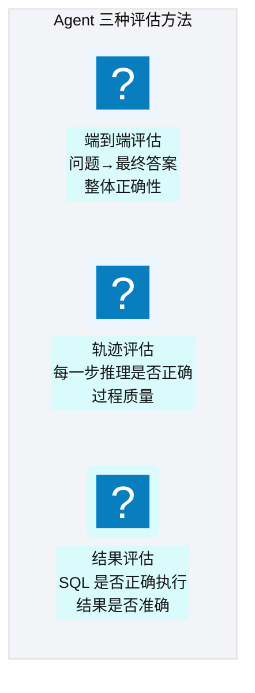
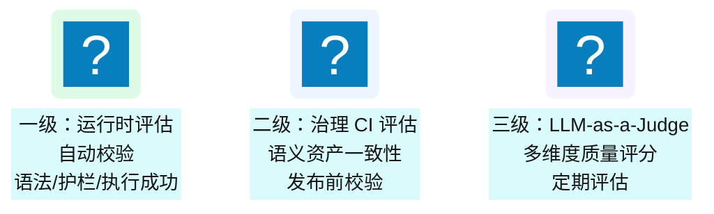
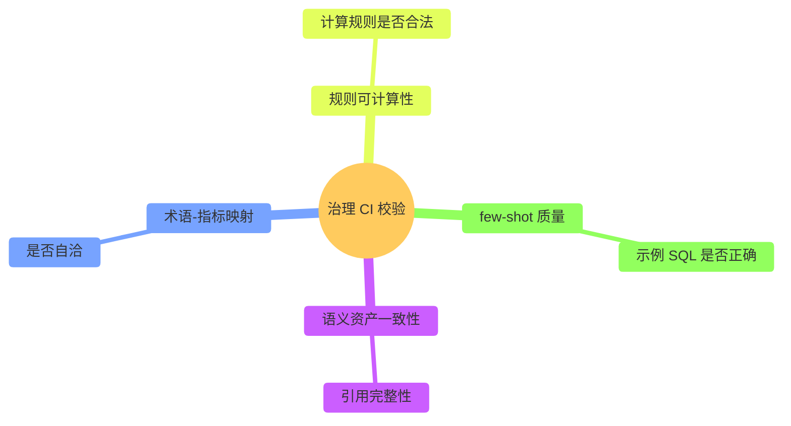
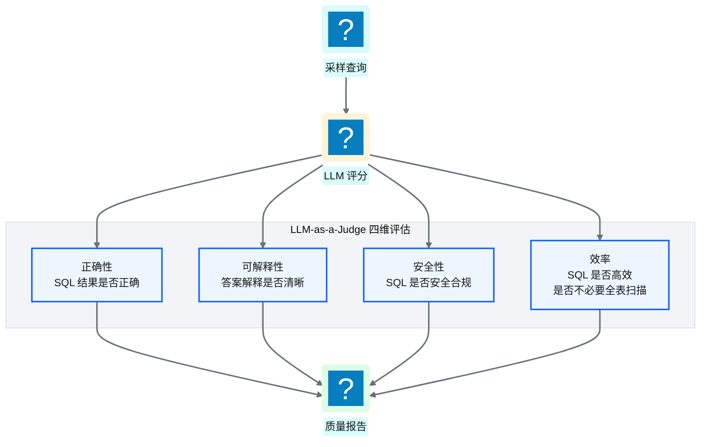
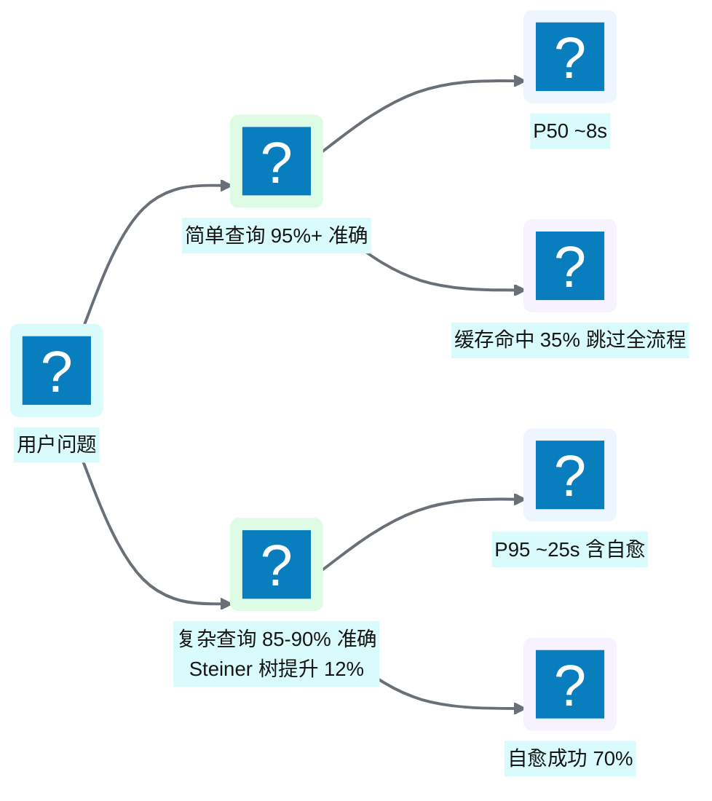
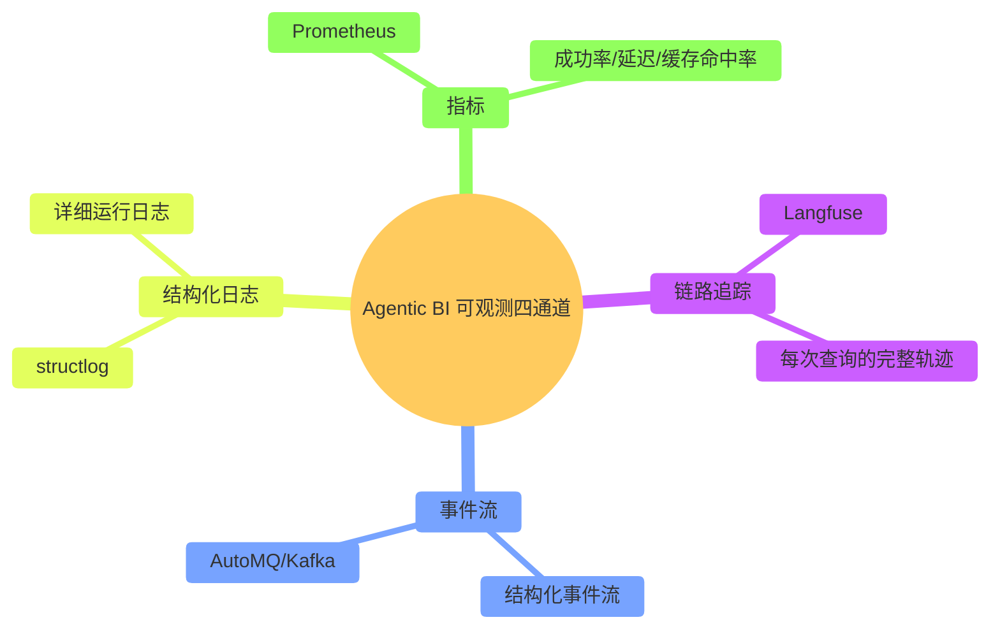
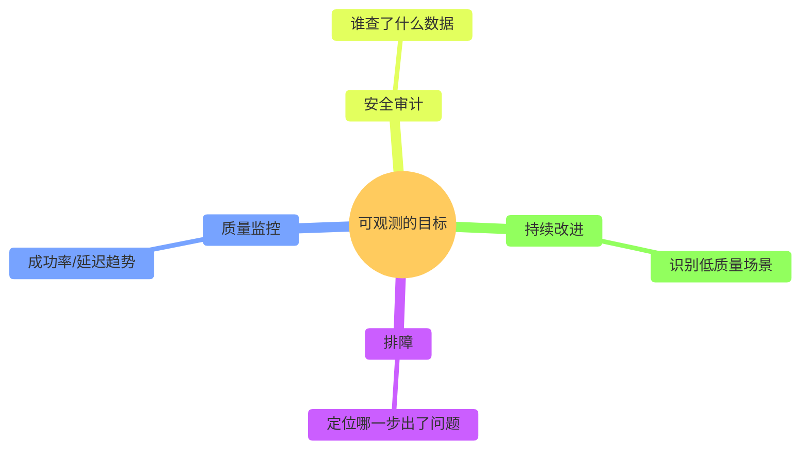
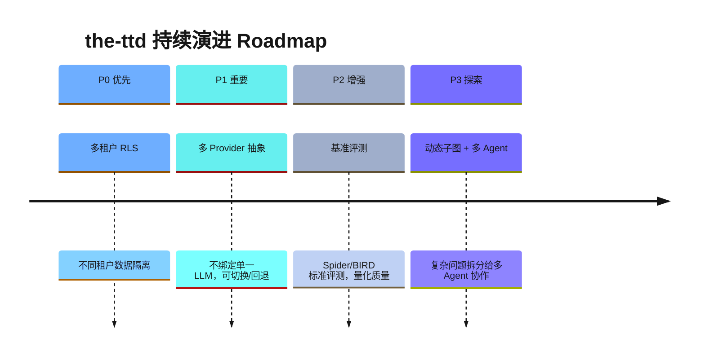
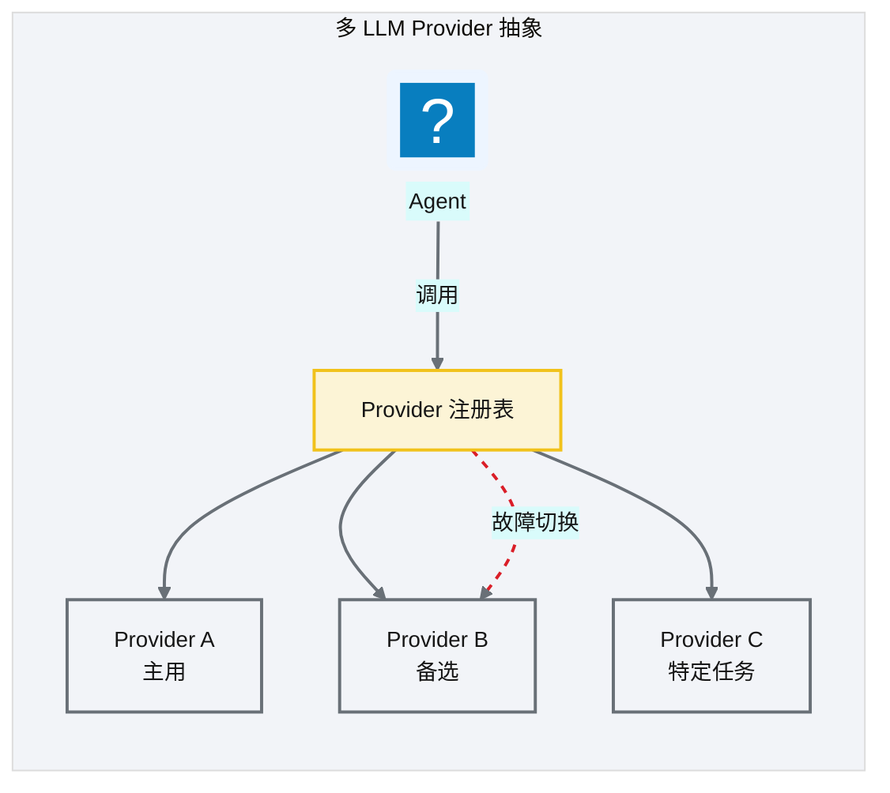

# Ch 47 评估、可观测与持续演进
!!! info "面包屑"
    [本书主页](./index.md) › [Part VII Data+AI 转型](./46-数据平面与CDP整合.md) › Ch 47

!!! abstract "项目第 4 年 · Data+AI转型期——评估可观测"

---

## :material-school: 本章你将学到
- Agent 评估方法论：端到端/轨迹/结果
- 治理 CI 校验 + LLM-as-a-Judge 多维评估（含评估 prompt 模板）
- Agentic BI 效果基准（准确率/延迟/护栏/自愈/缓存）与成本分析（LLM API vs 传统 BI 人力 TCO）
- 可观测四通道：链路追踪/事件流/结构化日志/指标
- Roadmap：多租户 RLS、多 Provider 抽象、基准评测

---

## 47.1 Agent 评估方法论

<p class="caption" markdown="span">**图 47-1** Agent 评估方法论</p>

| 评估方法 | 评什么 | 优势 | 局限 |
|---|---|---|---|
| **端到端** | 最终答案是否正确 | 最贴近用户体验 | 无法定位错误环节 |
| **轨迹** | 每步推理是否正确 | 可定位错误环节 | 评估成本高 |
| **结果** | SQL/数据是否正确 | 客观可量化 | 不评估过程质量 |
<p class="caption" markdown="span">**表 47-1** Agent 评估方法论</p>


### 三级评估体系


<p class="caption" markdown="span">**图 47-2** 三级评估体系</p>

---

## 47.2 治理 CI 校验 + LLM-as-a-Judge 多维评估
### 治理 CI 校验


<p class="caption" markdown="span">**图 47-3** 治理 CI 校验</p>

治理 CI 在语义资产发布前对四类校验维度做一致性检查，下表给出每个维度的校验对象、校验方式、失败处理与对应的语义资产：

| 校验维度 | 校验对象 | 校验方式 | 失败处理 | 对应语义资产 |
|---|---|---|---|---|
| 语义资产一致性 | 模型/表/字段/关系之间的引用 | 引用完整性检查：被引用对象必须存在、字段类型匹配 | 阻断发布，标记缺失引用并回退到上次绿色版本 | semantic model、table schema |
| 术语-指标映射 | 业务术语与底层指标的绑定关系 | 自洽性检查：每个术语必须有对应指标，指标公式引用的维度必须存在 | 阻断发布，列出悬空术语/指标供作者修正 | glossary、metric definitions |
| 规则可计算性 | 指标计算规则、转换规则 | 合法性检查：规则语法可解析、依赖字段已声明、无循环依赖 | 阻断发布，标注非法规则与冲突路径 | metric rules、transformation rules |
| few-shot 质量 | few-shot 示例（自然语言 + SQL 对） | 示例 SQL 正确性检查：语法可执行、引用对象存在、与当前 schema 一致 | 剔除失败示例并告警，不阻断发布但记录质量分 | few-shot examples |
<p class="caption" markdown="span">**表 47-2** 治理 CI 校验矩阵</p>

### LLM-as-a-Judge 四维评估


<p class="caption" markdown="span">**图 47-4** LLM-as-a-Judge 四维评估</p>

| 维度 | 评估内容 | 工具 |
|---|---|---|
| 正确性 | SQL 结果与标准答案对比 | DeepEval / Ragas |
| 可解释性 | 答案解释是否清晰准确 | LLM 评分 |
| 安全性 | SQL 是否遵守护栏规则 | 规则检查 + LLM |
| 效率 | SQL 执行计划是否高效 | EXPLAIN 分析 |
<p class="caption" markdown="span">**表 47-3** LLM-as-a-Judge 四维评估</p>


!!! tip "引申"
    LLM-as-a-Judge 是用 LLM 评估 LLM 的方法——因为人工评估不可规模化。但 LLM Judge 也有偏差（可能偏好某种风格），所以最佳实践是"LLM 评估为主 + 人工抽检为辅"。DeepEval 和 Ragas 是两个开源的 LLM 评估框架，提供了标准化的评估指标和流程。

LLM-as-a-Judge 落到代码是一个评估 prompt 模板，对采样查询按四维打分：

```python
# 示意：LLM-as-a-Judge 四维评估 prompt 模板
JUDGE_PROMPT = """你是 Agentic BI 的质量评审。对以下问答按四维打分（1-5 分）：
【问题】{question}
【生成 SQL】{sql}
【执行结果】{result}
【标准答案】{gold_answer}

请按四维评分并说明扣分原因：
1. 正确性：SQL 结果与标准答案是否一致
2. 可解释性：答案解释是否清晰准确
3. 安全性：SQL 是否遵守护栏规则（无 DDL/PII/全表扫描）
4. 效率：SQL 执行计划是否高效（是否避免不必要 join/扫描）
输出 JSON：{{"correctness": n, "explainability": n, "safety": n, "efficiency": n, "reason": "..."}}"""

def judge_sample(sample: dict) -> dict:
    return llm.evaluate(JUDGE_PROMPT.format(**sample))   # 核心意图：LLM 评估为主 + 人工抽检为辅
```

### 基准评测结果

!!! note ""
    以下评测数据为**基于行业合理推演的量级**，旨在让读者建立 Agentic BI 效果的直觉，非 the-ttd 真实生产数据。

Roadmap 里把 Spider/BIRD 基准评测列为 P2 方向，但在实际运行中，平台已积累了内部评测与线上观测的量化基线。下表是 Agentic BI 上线后的效果基准：

| 指标 | 基准值 | 说明 |
|---|---|---|
| **简单查询 NL2SQL 准确率** | **95%+** | 单表聚合/过滤，术语绑定强路由覆盖（"华东区上月销售额"→ `region='East China'`） |
| **复杂查询 NL2SQL 准确率** | **85-90%** | 多表 join + 子查询 + 窗口函数；Steiner 树优化 join 路径后准确率提升约 12% |
| **端到端响应延迟 P50** | **~8 秒** | LLM 推理 2-3s + 检索 1-2s + Redshift 查询 2-4s |
| **端到端响应延迟 P95** | **~25 秒** | 含 Redshift 大查询排队 + 自愈重试 |
| **护栏拦截率** | **~7%** | 危险 DDL 3% + PII 字段探测 2% + 超量查询限制 2% |
| **自愈成功率** | **~70%** | 表名/列名纠错最成功（90%+），复杂逻辑改写需人工介入 |
| **缓存命中率** | **~35%** | 语义查询缓存 + 结果缓存双层 |
| **用户满意度评分** | **4.2/5.0** | 20+ 高频用户季度调研 |
<p class="caption" markdown="span">**表 47-4** 基准评测结果</p>



<p class="caption" markdown="span">**图 47-5** 基准评测结果</p>

### 成本分析：LLM API vs 传统 BI 人力 TCO

Agentic BI 的成本不只是 LLM API 调用——要和它替代的"传统 BI 人力取数"总拥有成本对比才有意义：

| 维度 | 传统 BI（人工取数） | Agentic BI（the-ttd） |
|---|---|---|
| **取数时效** | 业务提需求→IT 排期→3-5 天 | 秒级/分钟级 |
| **人力成本** | 3-4 名分析师全职取数 | 1 名 AI 工程师维护 |
| **LLM API 成本** | — | 日均 ~500 次查询 ≈ ¥15,000/月（见 [Ch 1](./01-数字化转型下的医药数据困局.md) 平台经济学） |
| **月度即席查询量** | <50 次（人工瓶颈） | ~10,000 次（200×） |
| **总拥有成本（含人力）** | 高（人力是主要成本） | LLM API 成本远低于替代的人力 |
<p class="caption" markdown="span">**表 47-5** 成本分析：LLM API vs 传统 BI 人力 TCO</p>


!!! warning "Trade-off"
    LLM API 成本会随查询量线性增长——日均 500 次查询时月成本 ¥1.5 万可控，但如果涨到 5000 次/天，月成本会到 ¥15 万。控制成本的关键是**缓存命中率**（35% 的命中已省下三分之一的 LLM 调用）和**简单查询强路由**（术语绑定直接命中 metric 定义，跳过规划器）。把"所有查询都走完整 LLM 流程"改为"简单查询走缓存/强路由、复杂查询才走完整流程"，是成本可控的核心策略。

---

## 47.3 可观测四通道

<p class="caption" markdown="span">**图 47-6** 可观测四通道</p>

| 通道 | 工具 | 观测内容 |
|---|---|---|
| **链路追踪** | Langfuse | 每次查询的节点轨迹、耗时、LLM 调用 |
| **事件流** | AutoMQ/:simple-apachekafka: Kafka | 结构化事件（查询/生成/执行/护栏） |
| **结构化日志** | structlog | 详细运行日志（可搜索/可过滤） |
| **指标** | :simple-prometheus: Prometheus | 成功率、延迟分布、缓存命中率、重试次数 |
<p class="caption" markdown="span">**表 47-6** 可观测四通道</p>



<p class="caption" markdown="span">**图 47-7** 可观测四通道</p>

!!! warning "Trade-off"
    四个可观测通道的运维成本不低——Langfuse/AutoMQ/Prometheus 各需维护。但 Agentic BI 的"黑盒性"比传统系统更严重——LLM 的行为不可预测，没有可观测就无法排障和改进。对于企业级 Agentic BI，可观测是必需投入。

---

## 47.4 Roadmap：多租户 RLS、多 Provider 抽象、基准评测

<p class="caption" markdown="span">**图 47-8** Roadmap：多租户 RLS、多 Provider 抽象、基准评测</p>

| 优先级 | 方向 | 价值 |
|---|---|---|
| **P0** | 多租户 RLS | 支持多业务线/多部门数据隔离 |
| **P1** | 多 Provider 抽象 | 不绑定单一 LLM，可切换/回退 |
| **P2** | 基准评测 | Spider/BIRD 标准评测，量化质量 |
| **P3** | 动态子图 + 多 Agent | 复杂问题拆分给多 Agent 协作 |
<p class="caption" markdown="span">**表 47-7** Roadmap：多租户 RLS、多 Provider 抽象、基准评测</p>


### 多 Provider 抽象


<p class="caption" markdown="span">**图 47-9** 多 Provider 抽象</p>

!!! tip "引申"
    多 Provider 抽象的核心价值是"不把鸡蛋放一个篮子"——LLM 服务可能故障、限流、涨价。抽象层让 Agent 可在不同 Provider 间切换/回退，保证可用性。这也是企业级 AI 系统与"绑定单一 LLM 的 demo"的区别。

---

## 47.5 已知局限与失败模式：the-ttd 回答不了什么
诚实地说，the-ttd 不是万能的——有些问题它仍然回答不了，有些场景它表现不佳。把这些局限坦率写出来，比假装完美更有价值：

| 局限类型 | 表现 | 根因 | 演进方向 |
|---|---|---|---|
| **跨库关联** | 无法 join Redshift 与外部数据源（如临时 Excel） | 执行域限于 Redshift 单库 | 多模态输入→临时表入 Redshift（[Ch 39](./39-Agentic-BI架构总览.md) 引申框） |
| **复杂窗口函数** | ROW_NUMBER/RANK 跨多维度时准确率下降 | 窗口语义复杂，LLM 难以正确表达 | few-shot 补充 + 窗口函数模板化 |
| **非结构化推理** | "分析一下处方趋势的原因"类开放问题 | 超出 NL2SQL 能力，需因果推理 | 接入分析 Agent + ML 能力（[Ch 45](./45-记忆系统与工具使用.md) ML 注册表） |
| **实时流查询** | 无法查询"最近 5 分钟"的实时数据 | Redshift 是批处理数仓，非实时 | 接入 streaming source（Kinesis → 物化视图） |
| **超长复杂查询** | 10+ 表 join + 多层子查询时准确率降至 ~60% | LLM 上下文限制 + 规划器复杂度 | 子查询分解 + 分步执行 |
<p class="caption" markdown="span">**表 47-8** 已知局限与失败模式：the-ttd 回答不了什么</p>


!!! warning "Trade-off"
    承认局限不是失败，而是"工程诚实"的体现（[Ch 52](./52-架构师的复盘-取舍遗憾与主流对比.md)）。把 the-ttd 定位为"覆盖 90% 高频分析查询的助手"而非"万能分析师"，是务实的——剩下 10% 的复杂/开放问题仍需人工分析师。强行让 AI 回答它答不好的问题，只会产生错误结果和用户不信任。明确的边界声明，反而提升了用户对"它能答好的部分"的信任。

---

## :material-check-circle: 本章小结
- Agent 评估三方法：端到端（整体正确性）/ 轨迹（过程质量）/ 结果（SQL 准确性）——互补使用
- 三级评估：运行时（自动校验）/ 治理 CI（发布前）/ LLM-as-a-Judge（定期四维评分：正确性/可解释性/安全性/效率，含 prompt 模板）
- Agentic BI 效果基准：简单查询准确率 95%+、复杂查询 85-90%（Steiner 树提升 12%）、P50 ~8s/P95 ~25s、护栏拦截 ~7%、自愈成功 ~70%、缓存命中 ~35%、满意度 4.2/5
- 成本分析：LLM API 月成本 ~¥1.5 万，远低于替代的传统 BI 人力；成本可控靠缓存命中 + 简单查询强路由
- 可观测四通道：Langfuse（链路追踪）/ AutoMQ（事件流）/ structlog（日志）/ Prometheus（指标）——Agentic BI 黑盒性强，可观测是必需
- Roadmap：P0 多租户 RLS / P1 多 Provider 抽象 / P2 基准评测 / P3 动态子图+多 Agent

---

!!! quote "下一部分"
    [Part VIII 治理、运维与价值复盘](./48-安全-合规与治理.md) —— AI 转型讲完了，接下来进入最后一部分：安全合规、监控排障、价值度量与架构师复盘。

