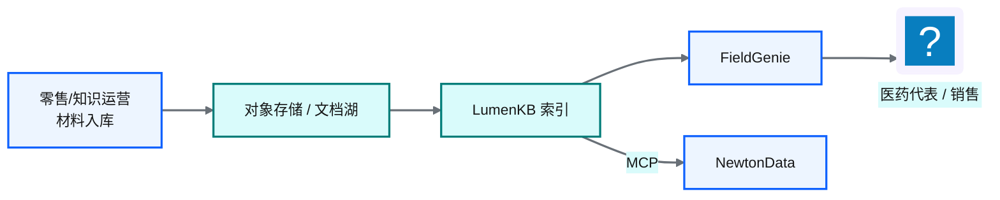
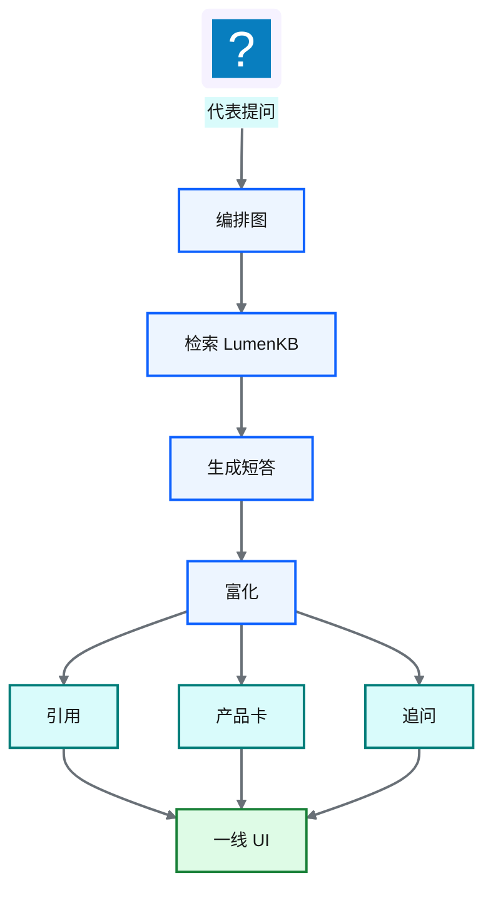
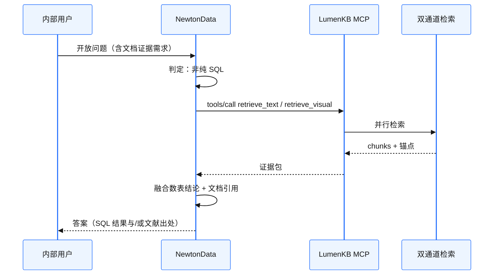

# Ch 48 一线产品助手：FieldGenie 与 MCP 增强 Agentic BI

!!! info "面包屑"
    [本书主页](./index.md) › [Part VII Data+AI 转型](./47-多模态业务知识库-Knowhere与PixelRAG与LumenKB.md) › Ch 48

!!! abstract "项目第 4 年 · Data+AI POC——一线产品助手"

---

## :material-school: 本章你将学到
- 知识索引与会话状态分平面（向量库 vs PostgreSQL）——避免「把聊天史塞进检索索引」的老坑
- 答案形态：流式回答 + 引用 + 产品卡分桶 + 追问 + Explore more
- 角色隔离：对内代表材料 vs 对外可见材料
- MCP 四工具（`ingest` / `query` / `retrieve_text` / `retrieve_visual`）如何挂到 NewtonData
- 双 POC 合流：Agentic BI 遇非结构化证据时调 LumenKB，而不是硬 NL2SQL

---

[LumenKB](./47-多模态业务知识库-Knowhere与PixelRAG与LumenKB.md) 能读说明书和价策了，但知识库控制台不是代表的工作界面。拜访间隙他们要的是：打开手机或平板，问一句「这个 SKU 在连锁渠道的包装差异是什么」，马上拿到**带出处的短答 + 相关产品卡**，而不是自己在文档树里翻。

这一章讲 **FieldGenie**：挂在 LumenKB 上的一线产品助手 POC，以及它怎么经 MCP 把文档证据交回 NewtonData，让 Part VII 两条线接上。

!!! warning "改编说明"
    FieldGenie 的交互和编排，改编自一次「产品知识问答 + 推荐卡」类 POC（仪器/耗材场景）。书里全部改写成 Aurora 医药代表与零售语境，不保留原厂商品牌叙事。

---

## 48.1 从知识库到产品助手：谁在用、问什么

### 用户与问题

| 角色 | 典型问题 | 材料可见性 |
|---|---|---|
| **医药代表** | 禁忌症表怎么写？拜访话术对应哪页说明书？ | 对内材料 + 已批准对外材料 |
| **零售/销售运营** | 某渠道包装规格、陈列指引、返利口径附件 | 零售包与价策（受权限标签约束） |
| **总部知识运营** | 批量入库、抽检解析质量、下线过期版本 | 全量；负责治理而非一线问答 |

**表 48-1** FieldGenie 角色与问题类型

用户和 NewtonData 有重叠，意图不同。同一位销售总监，上午用 NewtonData 问「华东上月处方」，下午用 FieldGenie 问「说明书里肾功能不全怎么写」。前者走语义平面 + SQL；后者走 LumenKB 文档证据。

### 与零售门户的供给关系

[Ch 36](./36-低代码与云混合-零售数据源门户.md) 的零售门户管的是源表管理和双向同步。FieldGenie 吃的是另一类东西：**已批准的产品与学术材料**（PDF/PPT/价策附件）。供给大概是这样：

**图 48-1** 材料供给：门户/文档湖 → LumenKB → 一线与 Agent

!!! tip "边界"
    CDP 数仓里的零售销量事实，替代不了说明书；说明书索引也替代不了数仓。FieldGenie **只读 LumenKB**，不写 Redshift。

### 场景映射（POC 模式 → Aurora）

| 通用产品助手模式 | Aurora 一线映射 |
|---|---|
| 仪器 / 方法 / 耗材问答 | 产品说明书 / 学术材料 / 零售包装指引 |
| 引用链接 + 手册页 | 文档章节 path + 页码/锚点 |
| 产品卡：Instrument / Consumable / Software | 产品卡：SKU / 学术材料 / 零售包 |
| Customer vs Employee | 对外可见 vs 对内代表材料 |
| Thumbs-up 缓存优选答 | 医学信息审核后的标准答沉淀 |

**表 48-2** 产品助手模式到医药一线的映射

---

## 48.2 FieldGenie 交互与编排

### 答案形态：一屏内能行动

代表不要论文，要一屏内能做决定：

1. **流式短答**（SSE）：先结论，再展开
2. **引用列表**：可点回 LumenKB 源文档/章节
3. **产品卡分桶**：相关 SKU / 材料 / 零售包
4. **追问建议**：从检索上下文生成
5. **Explore more**：同一问题翻更多证据，不重写整段答案

**图 48-2** FieldGenie 答案形态：检索 → 生成 → 富化

编排上 POC 用状态机（LangGraph 一类）固定成：`check_cache → retrieve → generate → enrich`。医药场景里我刻意保留 **closed-world** 提示：上下文不够就说「材料库未覆盖」，禁止编造禁忌症或价策。对合规来说，这句话比「永远有帮助」重要得多。

### 分平面：别把聊天史塞进知识索引

早年有个坑：会话消息和知识 chunk 塞进同一个检索引擎，清理、权限、TTL 全搅在一起。FieldGenie 分开：

| 平面 | 存什么 | 技术 |
|---|---|---|
| **知识平面** | 文档 chunk / 视觉 tile / 产品元数据 | LumenKB（Milvus 等） |
| **会话平面** | 用户、会话、消息、反馈 | PostgreSQL |
| **可选优选答缓存** | 审核通过的 Q+A 向量 | 独立索引，严格审批后写入 |

**表 48-3** 知识平面 vs 会话平面

!!! warning "Trade-off"
    thumbs-up → 优选答缓存能压重复问题延迟，但医药内容必须经医学信息/合规抽检，不能「用户点赞即真理」。POC 里缓存默认关，或仅内网工号可写。

### 角色隔离

| 策略 | 行为 |
|---|---|
| **对外** | 过滤内部-only 文档 URL / 标签 |
| **对内代表** | 可见内部培训与未对患者公开的材料 |
| **标签** | `source_type` / 密级 / 适应症标签进入检索过滤 |

**表 48-4** 角色与材料可见性

这和 [Ch 50](./50-安全-合规与治理.md) 的数据分类一个路数：可见性是治理属性，不是 UI 上事后加的开关。

---

## 48.3 MCP 增强 NewtonData：双 POC 合流

[Ch 45](./45-记忆系统与工具使用.md) 把 MCP 引进来，当「AI 的 USB」。LumenKB POC 把能力收成四个工具，经 streamable HTTP（`/mcp`）暴露：

| 工具 | 作用 | NewtonData 何时调用 |
|---|---|---|
| `ingest` | 入库文档 | 运营 Agent / 运维，不给普通分析用户 |
| `query` | 多模态问答 | 需要一段可读结论时 |
| `retrieve_text` | 只要文本证据 | NL2SQL 前后补「口径说明/说明书原文」 |
| `retrieve_visual` | 只要视觉命中 | 问题明显指向图表/扫描页 |

**表 48-5** LumenKB MCP 四工具

**图 48-3** NewtonData 经 MCP 调用 LumenKB

这正好对着 [Ch 49](./49-评估-可观测与持续演进.md) 里 NewtonData 的短板：「非结构化推理 / 说明书图表问答」别硬拧成 SQL。降级很简单：**数走 Redshift，证据走 LumenKB**。

!!! tip "MCP 工程细节"
    工具发现走标准 `tools/list`；传输用 streamable HTTP，方便挂内网网关。POC 给 MCP 加了超时、熔断、结构化 `{"error":...}`，免得文档服务一抖，整个 Agentic BI 会话跟着挂。这和 [Ch 45](./45-记忆系统与工具使用.md) 说的「工具要可治理」是一件事。

### 合流后的职责划分

| 系统 | 一句话职责 |
|---|---|
| **NewtonData** | 语义平面 + NL2SQL + SQL 护栏 |
| **LumenKB** | 文档多模态索引与检索 |
| **FieldGenie** | 一线 UX（产品卡、会话、反馈） |
| **MCP** | 两者之间的标准工具边界 |

**表 48-6** 双 POC 合流后的职责

---

## 48.4 与 CDP 的边界、以及还没做完的事

### 边界

1. FieldGenie / LumenKB **不**做主数据管理；SKU 主数据仍在 MDM/CDP。
2. 材料入湖可以复用对象存储和权限模型，但**索引构建是独立流水线**（Celery 队列、视觉 GPU）。
3. 审计：文档问答要带 `trace_id` / 文档版本 hash，跟 [Ch 49](./49-评估-可观测与持续演进.md) 的可观测要求对齐。POC 只做到「能串起来」，全量合规报表还没上。

### 诚实进度

| 宣称 | POC 实际 |
|---|---|
| FieldGenie 深接 LumenKB | 目标架构；早期助手 POC 有的仍用独立检索栈验证 UX |
| NewtonData 稳定调 MCP | 工具已暴露，Agent 路由策略还在打磨 |
| 全产品线知识库 | 只选了有限品牌/材料集试用 |

**表 48-7** 目标架构 vs POC 实际

!!! warning "Trade-off：自建 vs 买企业知识库"
    市面上「企业知识库 / 智能文档问答」产品不少。Aurora 仍走自建 LumenKB，理由和 NewtonData 差不多：合规驻留、跟 CDP 权限模型对齐、MCP 可被多个 Agent 复用。代价是视觉 GPU 和解析回归要自己扛。团队若没有多模态工程力，买托管知识库再私有化部署可能更快；我们选自建，是因为已经在养 Agentic BI 工程能力，边际成本还能摊。

---

## :material-check-circle: 本章小结
- FieldGenie：把 LumenKB 变成一线能点开的助手（流式短答、引用、产品卡、追问）
- 知识平面和会话平面分开；closed-world 提示优先于「永远有帮助」
- 角色可见性是治理属性；对内/对外材料要过滤
- MCP 四工具让 NewtonData 在需要文档证据时调用 LumenKB
- 边界：不写数仓、不做 MDM；POC 没宣称全量生产

---

!!! quote "下一章"
    [Ch 49 评估、可观测与持续演进](./49-评估-可观测与持续演进.md) —— Part VII 收束：两条 POC 怎么评、怎么观测、往哪扩。
