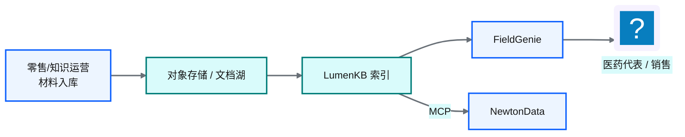
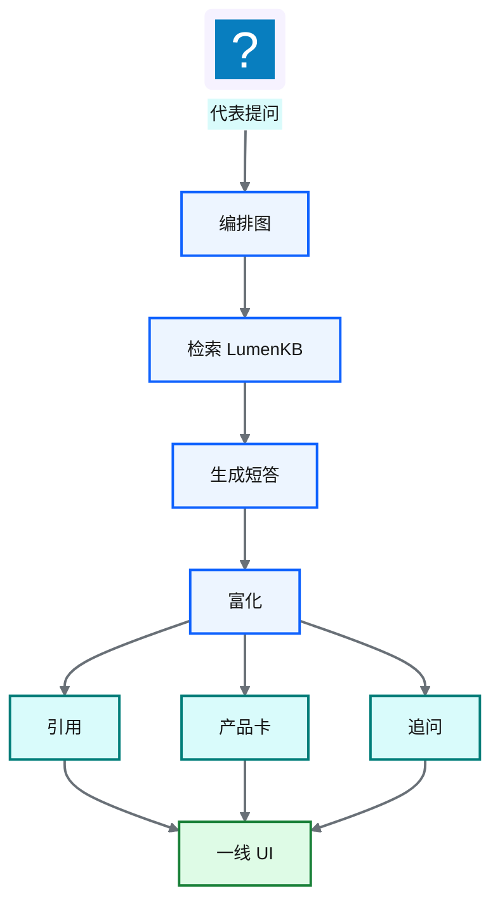
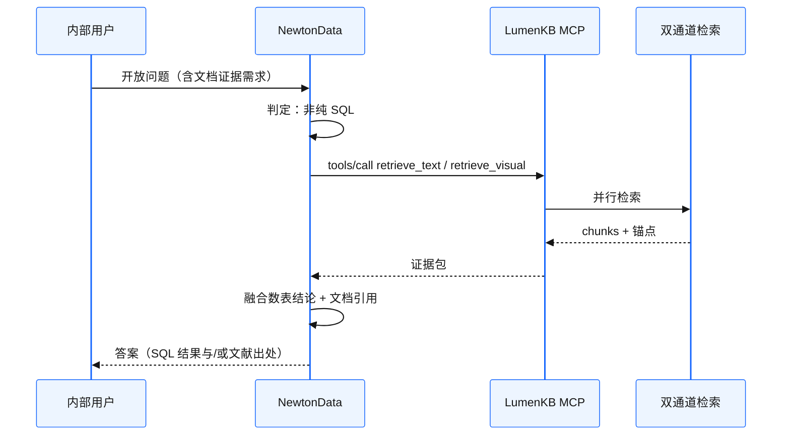

# Ch 48 一线产品助手：FieldGenie 与 MCP 增强 Agentic BI

!!! info "面包屑"
    [本书主页](./index.md) › [Part VII Data+AI 转型](./47-多模态业务知识库-Knowhere与PixelRAG与LumenKB.md) › Ch 48

!!! abstract "项目第 4 年 · Data+AI POC——一线产品助手"

---

## :material-school: 本章你将学到
- 知识索引与会话状态分平面（向量库 vs PostgreSQL）——避免「把聊天史塞进检索索引」的老坑
- LangGraph 编排：`check_cache → retrieve → generate → enrich`，以及 Explore 跳过 generate
- 答案形态：SSE 流式事件 + 引用 + 产品卡分桶 + 追问 + Explore more
- 角色隔离：对内代表材料 vs 对外可见材料（从 URL 黑名单到治理标签）
- MCP 四工具与韧性（timeout / circuit breaker / 结构化 error）如何挂到 NewtonData
- 双 POC 合流：Agentic BI 遇非结构化证据时调 LumenKB，而不是硬 NL2SQL

---

[LumenKB](./47-多模态业务知识库-Knowhere与PixelRAG与LumenKB.md) 能读说明书和价策了，但知识库控制台不是代表的工作界面。拜访间隙他们要的是：打开手机或平板，问一句「这个 SKU 在连锁渠道的包装差异是什么」，马上拿到带出处的短答和相关产品卡，而不是自己在文档树里翻。

我见过同一个人、同一天的两种提问。上午销售总监在 NewtonData 里问「华东上月处方」，那是语义平面加 SQL；下午他在助手里问「说明书里肾功能不全怎么写」，那是 LumenKB 文档证据。若硬把后者拧成 NL2SQL，只会得到空表或幻觉列。

这一章讲 **FieldGenie**：挂在 LumenKB 上的一线产品助手 POC，以及它怎么经 MCP 把文档证据交回 NewtonData，让 Part VII 两条线接上。

!!! warning "改编说明"
    FieldGenie 的交互和编排，改编自一次「产品知识问答 + 推荐卡」类 POC（仪器/耗材场景）。书里全部改写成 Aurora 医药代表与零售语境，不保留原厂商品牌叙事。

---

## 48.1 从知识库到产品助手：谁在用、问什么

### 用户与问题

| 角色 | 典型问题 | 材料可见性 |
|---|---|---|
| **医药代表** | 禁忌症表怎么写？拜访话术对应哪页说明书？ | 对内材料 + 已批准对外材料 |
| **零售/销售运营** | 某渠道包装规格、陈列指引、返利口径附件 | 零售包与价策（受权限标签约束） |
| **总部知识运营** | 批量入库、抽检解析质量、下线过期版本 | 全量；负责治理而非一线问答 |

**表 48-1** FieldGenie 角色与问题类型

用户和 NewtonData 有重叠，意图不同。平台若只做一个「万能对话框」，最后一定是检索栈互相污染。我刻意把一线助手做成只读 LumenKB 的工作台：短答、出处、产品卡。不写 Redshift，也不假装自己是 BI。

### 与零售门户的供给关系

[Ch 36](./36-低代码与云混合-零售数据源门户.md) 的零售门户管的是源表管理和双向同步。FieldGenie 吃的是另一类东西：已批准的产品与学术材料（PDF/PPT/价策附件）。供给大概是这样：

**图 48-1** 材料供给：门户/文档湖 → LumenKB → 一线与 Agent

!!! tip "边界"
    CDP 数仓里的零售销量事实，替代不了说明书；说明书索引也替代不了数仓。FieldGenie 只读 LumenKB，不写 Redshift。门户管源与同步，助手管批准材料的问答。别把 Ch 36 的管道当成知识库。

### 场景映射（POC 模式 → Aurora）

| 通用产品助手模式 | Aurora 一线映射 |
|---|---|
| 仪器 / 方法 / 耗材问答 | 产品说明书 / 学术材料 / 零售包装指引 |
| 引用链接 + 手册页 | 文档章节 path + 页码/锚点 |
| 产品卡：Instrument / Consumable / Software | 产品卡：SKU / 学术材料 / 零售包 |
| Customer vs Employee | 对外可见 vs 对内代表材料 |
| Thumbs-up 缓存优选答 | 医学信息审核后的标准答沉淀 |

**表 48-2** 产品助手模式到医药一线的映射

映射不只是改名词。卡片分桶决定 UI 右栏怎么摆；角色过滤决定检索 `must_not`；闭环答缓存决定能不能「用户点赞即真理」。医药场景里，后者默认否。

---

## 48.2 FieldGenie 交互与编排

### 答案形态：一屏内能行动

代表不要论文，要一屏内能做决定：流式短答（SSE）先结论再展开；引用可点回源文档/章节；产品卡按 SKU、学术材料、零售包分桶；首页再给几条追问；Explore more 则同一问题翻更多证据，不重写整段答案。

早期草图把一切塞进一个「最终 JSON」。后来我改成分阶段 SSE：UI 先亮「检索中」，再吐 token，再亮引用和卡片。延迟体感比一次性等 8 秒好得多，也更像真实拜访节奏。

**图 48-2** FieldGenie 答案形态：检索 → 生成 → 富化

### LangGraph：固定四段，Explore 另走一支

编排上 POC 用状态机（LangGraph）固定成：`check_cache → retrieve → generate → enrich`。节点里用 `get_stream_writer()` 推自定义事件（status / token / products…），API 层再映射成 SSE。这和 LangGraph 官方 custom stream 同一套路，只是我们的事件名字面向一线 UI。

医药场景里我刻意保留 closed-world 提示：上下文不够就先说「材料库未覆盖」，禁止编造禁忌症或价策。对合规来说，这句话比「永远有帮助」重要得多。

**图 48-3** FieldGenie 主路径：check_cache → retrieve → generate → enrich

Explore more（`page > 1`）走另一支：`retrieve → enrich`，跳过 generate。请求带上已有 `message_id` 与已见引用 URL，只追加新证据、合并产品卡，不重写整段答案。代表在拜访中「再翻两页出处」，不是重新聊一轮。

**图 48-4** Explore 分支：跳过 generate，只追加证据

### SSE 事件面

| 事件 | 载荷要点 | 何时 |
|---|---|---|
| `status` | `retrieving` / `generating` / `enriching` | 阶段提示 |
| `token` | 增量文本 | 生成中 |
| `cached` | 命中优选答缓存的 message 指针 | check_cache 命中 |
| `references` | 引用 URL / 章节列表 | enrich |
| `products` | 分桶产品卡对象 | enrich |
| `followups` | 追问列表（仅首页） | enrich |
| `done` | session/message id、retrieval 分页元数据 | 落库完成 |
| `error` | 可读错误信息 | 失败 |

**表 48-3** FieldGenie SSE 事件

助手消息在图跑完后由 API 一次性写入 PostgreSQL（含 `metadata_json`：引用、卡片、followups、retrieval）。图节点负责流式体验，不各自写库。边界清楚，Explore 合并也简单。

### 富化：引用与产品卡怎么来

enrich 节点先抽引用：从命中 metadata 取源 URL/章节并去重；产品详情页 URL 进卡片，不进引用列表，免得把买点页和证据页搅在一起。产品卡则从 PDF 实体/标签解析出 SKU、学术材料、零售包，映射到三桶；缺省 CTA 按桶给（零售包偏「查看指引」，SKU 偏「规格详情」），文案可换，分桶思想不变。追问由 LLM 生成固定条数；若材料能映射到品类维度，可偏置一问一类。

若答案触发 closed-world（含「材料库未覆盖」），引用、卡片、追问全部清空。宁可空，也不配假证据。

### 分平面：别把聊天史塞进知识索引

早年有个坑：会话消息和知识 chunk 塞进同一个检索引擎，清理、权限、TTL 全搅在一起。FieldGenie 分开：

| 平面 | 存什么 | 技术 |
|---|---|---|
| **知识平面** | 文档 chunk / 视觉 tile / 产品元数据 | LumenKB（Milvus 等） |
| **会话平面** | 用户、会话、消息、反馈 | PostgreSQL |
| **可选优选答缓存** | 审核通过的 Q+A 向量 | 独立索引，严格审批后写入 |

**表 48-4** 知识平面 vs 会话平面

### 优选答缓存：命中也不跳过检索

POC 里 thumbs-up 会把问题向量写入独立缓存。命中后仍走 retrieve + generate：优选答只作语气与结构引导，事实必须锚定当前检索上下文。延迟上不是「秒回缓存答案」；合规上却避开了「过期点赞答直接播报禁忌症」。

!!! warning "Trade-off"
    thumbs-up 写入优选答缓存，能压重复问题的组织成本，但医药内容必须经医学信息/合规抽检，不能「用户点赞即真理」。POC 里缓存默认关，或仅内网工号可写；TTL/scope（全局 vs 用户）也要显式配置，别默默全局 24h。

### 角色隔离

| 策略 | 行为 |
|---|---|
| **对外** | 过滤内部-only 文档 URL / 标签 |
| **对内代表** | 可见内部培训与未对患者公开的材料 |
| **标签** | `source_type` / 密级 / 适应症标签进入检索过滤 |

**表 48-5** 角色与材料可见性

诚实说：早期 POC 的过滤是 URL 黑名单（配置一串内部文档 URL，`customer` 角色 `must_not`）。这能跑通演示，扩到上千份材料就崩。生产应升为治理属性过滤，和 [Ch 50](./50-安全-合规与治理.md) 的数据分类一个路数：可见性是治理属性，不是 UI 上事后加的开关，也不是运维手维护的 URL 列表。

---

## 48.3 MCP 增强 NewtonData：双 POC 合流

[Ch 45](./45-记忆系统与工具使用.md) 把 MCP 引进来，当 AI 的 USB。LumenKB POC 把能力收成四个工具，经 streamable HTTP（`/mcp`）暴露：

| 工具 | 作用 | NewtonData 何时调用 |
|---|---|---|
| `ingest` | 入库文档 | 运营 Agent / 运维，不给普通分析用户 |
| `query` | 多模态问答 | 需要一段可读结论时 |
| `retrieve_text` | 只要文本证据 | NL2SQL 前后补「口径说明/说明书原文」 |
| `retrieve_visual` | 只要视觉命中 | 问题明显指向图表/扫描页 |

**表 48-6** LumenKB MCP 四工具

我刻意拆 `query` 与两个 `retrieve_*`：Agent 有时只要证据包自己写结论（省一次 VLM 生成，也更好审计）；有时要端到端短答。工具面窄而稳，比「一个超级 ask」好治理。

**图 48-5** NewtonData 经 MCP 调用 LumenKB

这正好对着 [Ch 49](./49-评估-可观测与持续演进.md) 里 NewtonData 的短板：非结构化推理、说明书图表问答，别硬拧成 SQL。降级很简单：数走 Redshift，证据走 LumenKB。

### MCP 韧性：工具要可治理

工程上我按「超时 → 熔断 → 重试」叠了几层（默认量级：外层约 30s；连续失败约 5 次开断路器，约 60s 后半开；tenacity 指数退避重试）。超时不计入熔断，避免慢查询把整个工具面打死。降级响应是结构化 `{"error":"timeout:…"}` / `{"error":"circuit_open:…"}`，NewtonData 可以改口「文档服务暂不可用，先给数表结论」，而不是整会话 500。

认证可关（内网 POC）、可 static token、可接 OAuth；传输默认 streamable HTTP `/mcp`，也留 stdio 给本地调试。工具发现走标准 `tools/list`。这和 [Ch 45](./45-记忆系统与工具使用.md) 说的「工具要可治理」是一件事。

!!! tip "已知债"
    超时用守护线程强切时，进程内可能残留 in-flight 工作，负载高时要盯。POC 接受这个风险；全量前应改成可取消的异步任务模型。

### 合流后的职责划分

| 系统 | 一句话职责 |
|---|---|
| **NewtonData** | 语义平面 + NL2SQL + SQL 护栏 |
| **LumenKB** | 文档多模态索引与检索 |
| **FieldGenie** | 一线 UX（产品卡、会话、反馈） |
| **MCP** | 两者之间的标准工具边界 |

**表 48-7** 双 POC 合流后的职责

---

## 48.4 与 CDP 的边界、以及还没做完的事

### 边界

FieldGenie / LumenKB 不做主数据管理；SKU 主数据仍在 MDM/CDP。材料入湖可以复用对象存储和权限模型，但索引构建是独立流水线（Celery 队列、视觉 GPU）。审计上，文档问答要带 `trace_id` / 文档版本 hash，跟 [Ch 49](./49-评估-可观测与持续演进.md) 的可观测要求对齐。POC 只做到能串起来，全量合规报表还没上。

### 诚实进度

| 宣称 | POC 实际 |
|---|---|
| FieldGenie 深接 LumenKB | 目标架构；早期助手 POC 有的仍用独立检索栈验证 UX |
| NewtonData 稳定调 MCP | 工具已暴露，Agent 路由策略还在打磨 |
| 全产品线知识库 | 只选了有限品牌/材料集试用 |

**表 48-8** 目标架构 vs POC 实际

!!! warning "Trade-off：自建 vs 买企业知识库"
    市面上企业知识库、智能文档问答产品不少。Aurora 仍走自建 LumenKB，理由和 NewtonData 差不多：合规驻留、跟 CDP 权限模型对齐、MCP 可被多个 Agent 复用。代价是视觉 GPU 和解析回归要自己扛。团队若没有多模态工程力，买托管知识库再私有化部署可能更快。我们选自建，是因为已经在养 Agentic BI 工程能力，边际成本还能摊；也因为第 4 年这条线的价值不只是多一个聊天框，而是把非结构化证据接进同一套工具治理。

---

## :material-check-circle: 本章小结
- FieldGenie：把 LumenKB 变成一线能点开的助手（SSE 短答、引用、产品卡、追问、Explore）
- LangGraph 主路径四段；Explore 跳过 generate；closed-world 优先于「永远有帮助」
- 知识平面和会话平面分开；优选答命中仍重检索，只借结构不借过期事实
- 角色可见性应从 URL 黑名单升级为治理标签
- MCP 四工具 + 超时/熔断/结构化错误，让 NewtonData 在需要文档证据时调用 LumenKB
- 边界：不写数仓、不做 MDM；POC 没宣称全量生产

---

!!! quote "下一章"
    [Ch 49 评估、可观测与持续演进](./49-评估-可观测与持续演进.md) —— Part VII 收束：两条 POC 怎么评、怎么观测、往哪扩。
