# Ch 48 安全、合规与治理
!!! info "面包屑"
    [本书主页](./index.md) › [Part VIII 治理与复盘](./47-评估-可观测与持续演进.md) › Ch 48

!!! abstract "项目第 3 年 · 成熟与治理期——安全合规"

---

## :material-school: 本章你将学到
- IAM 最小权限（含三类角色 policy JSON 示例）与 KMS 加密的体系化设计
- 数据分类框架（公开/内部/敏感/极敏感四级，驱动保护策略）
- GxP 数据完整性与中国数据驻留的合规要求
- Redshift RLS/CLS 策略在数据治理中的深度应用
- 安全事件响应（告警→定级→响应→复盘 runbook）与灾难恢复（RPO/RTO/跨区域复制/DR 演练）
- 治理最佳实践与平台护栏

---

## 48.1 IAM 最小权限与 KMS 加密
安全合规是数据平台的"免疫系统"——它不是某个章节能讲完的单点功能，而是贯穿全书的设计线索。从 [Ch 8](./08-数据仓库设计-Redshift.md) 的 RLS/CLS、到 [Ch 18](./18-数据脱敏与隐私治理.md) 的三层纵深防御、到 [Ch 29](./29-OIDC与凭证治理.md) 的 OIDC 无密钥、到 [Ch 44](./44-五层SQL护栏与执行安全.md) 的 AI 护栏——每一层都在为安全加码。这一章是安全治理的"集大成"——把前面散落各处的安全设计收拢成一个体系化框架。

我在企业征信项目里深刻体会过安全疏忽的代价——当时一个测试环境的数据库密码硬编码在脚本里，脚本被上传到内部 Git 后，密码泄露了。虽然没有造成实际损失，但那次事件让我们团队花了两周时间做全量密码轮转和代码审计。到了 Aurora，医药行业的安全要求更严——GxP 合规、PIPL 法规、患者隐私——任何一个疏忽都可能是合规事故。所以安全在 Aurora 不是"事后补丁"，而是"设计内嵌"。

### IAM 治理体系

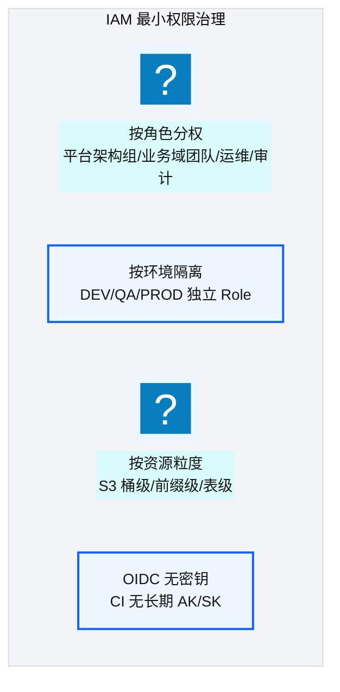
<p class="caption" markdown="span">**图 48-1** IAM 治理体系</p>

| 治理维度 | 策略 | 实践 |
|---|---|---|
| **角色分权** | 每个 Role 只授予完成职责所需最小权限 | 平台组管 core-infra；业务组管 domain 仓 |
| **环境隔离** | dev/qa/prod 各账号独立 Role | 开发者无 PROD 权限 |
| **资源粒度** | S3 按前缀授权；Redshift 按 Schema/Table | domain-a 只能访问 domain-a 的路径 |
| **CI 无密钥** | OIDC + AssumeRole | 见 [Ch 29](./29-OIDC与凭证治理.md) |
<p class="caption" markdown="span">**表 48-1** IAM 治理体系</p>


把上面的治理维度落到 IAM policy，关键是"最小权限"——每类角色只授予完成职责所需权限，绝不使用 `Resource: "*"` + `Action: "*"` 的万能策略。下面是三类核心角色的 policy 示例：

```json
// 示意：平台管理员 Role policy —— core-infra 全权管理共享资源
{
  "Version": "2012-10-17",
  "Statement": [
    {
      "Effect": "Allow",
      "Action": ["s3:*", "kms:*", "iam:*", "redshift:*"],
      "Resource": ["arn:aws-cn:s3:::ap-aurora-cdp-tfstate-*", "arn:aws-cn:kms:cn-north-1:123456789012:key/*"]
    },
    {
      "Effect": "Deny",                              // 核心意图：即使管理员也不能删 PROD state
      "Action": "s3:DeleteObject",
      "Resource": "arn:aws-cn:s3:::ap-aurora-cdp-tfstate-prod-*/*"
    }
  ]
}
```

```json
// 示意：领域开发者 Role policy —— 仅本域前缀 + Glue，无 core-infra 权限
{
  "Version": "2012-10-17",
  "Statement": [{
    "Effect": "Allow",
    "Action": ["glue:StartJobRun", "glue:GetJobRun", "s3:GetObject", "s3:PutObject"],
    "Resource": [
      "arn:aws-cn:glue:cn-north-1:123456789012:job/ma-*",            // 核心意图：仅本域 job 前缀
      "arn:aws-cn:s3:::ap-aurora-cdp-enriched-prod/ma/*"              // 仅本域数据前缀
    ]
  }]
}
```

```json
// 示意：审计员 Role policy —— 只读审计日志，无任何业务数据访问
{
  "Version": "2012-10-17",
  "Statement": [{
    "Effect": "Allow",
    "Action": ["cloudtrail:LookupEvents", "logs:StartQuery", "logs:GetQueryResults"],
    "Resource": "*"                                                   // 审计只读，但无 s3/redshift 数据权限
  }, {
    "Effect": "Deny",                                                 // 核心意图：审计员绝不触碰业务数据
    "Action": ["s3:GetObject", "redshift:ExecuteStatement", "redshift:QueryDatabase"],
    "Resource": "*"
  }]
}
```

!!! tip "引申"
    三类角色的 policy 体现"职责分离"原则——平台管理员管基础设施、领域开发者管本域 ETL、审计员只读审计且明示 Deny 业务数据。审计员的 Deny 条款是关键：审计员能看"谁访问了什么"，但自己不能访问业务数据——这避免了"既当裁判又当运动员"的合规风险。

### KMS 加密

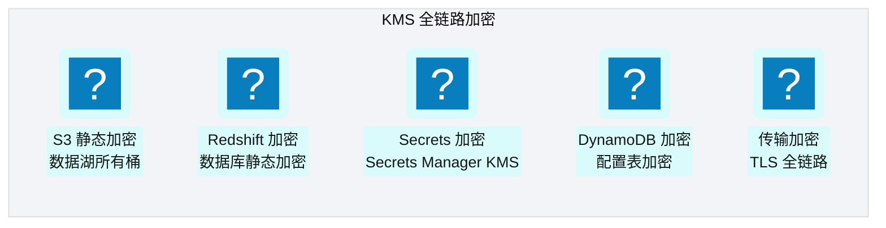
<p class="caption" markdown="span">**图 48-2** KMS 加密</p>

!!! tip "引申"
    KMS 加密的核心原则是"静态+传输全覆盖"——所有数据在存储时加密（S3/Redshift/DynamoDB/Secrets），在传输时加密（TLS）。KMS 密钥本身也受 IAM 保护——即使数据被复制走，没有密钥权限也无法解密。这是"纵深防御"在加密层的体现。

---

## 48.2 数据分类框架：分级保护的基础
IAM 和 KMS 解决了"谁能访问"和"数据是否加密"，但要决定"某字段该用什么策略保护"，需要一个前置步骤——**数据分类**。没有分类，脱敏决策表（[Ch 18](./18-数据脱敏与隐私治理.md)）的"敏感级别"列就无从填起。平台采用四级分类框架：

| 级别 | 定义 | 典型字段 | 处置要求 |
|---|---|---|---|
| **公开 Public** | 可对外公开的数据 | 医院名称、区域、药品通用名 | 无特殊保护，可自由查询 |
| **内部 Internal** | 仅企业内部可见 | 处方数量、金额、库存 | RLS 按角色过滤，CLS 按需授权 |
| **敏感 Sensitive** | 泄露会造成商业或个人损害 | 患者姓名、电话、医生执业证号 | 脱敏（partial_mask/md5）+ CLS 严格授权 + 审计 |
| **极敏感 Highly Sensitive** | 泄露会违反法规或造成严重损害 | 患者身份证号、定价、盲法编码 | aes_encrypt + KMS 信封加密 + 最小授权角色 + 全审计 |
<p class="caption" markdown="span">**表 48-2** 数据分类框架：分级保护的基础</p>


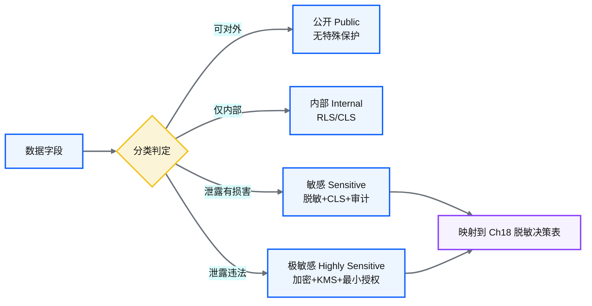
<p class="caption" markdown="span">**图 48-3** 数据分类框架：分级保护的基础</p>

数据分类不是一次性工作——新字段上线时必须标注分类（CI 校验未标注分类的字段阻断发布），分类变更走 PR 审查。分类标签作为元数据存储在 Glue Data Catalog 和语义资产（[Ch 40](./40-语义平面-三层治理与Git-YAML.md)）中，RLS/CLS/脱敏策略都基于分类标签自动生效。

!!! warning "Trade-off"
    四级分类的粒度是权衡——太粗（如只分"敏感/非敏感"）无法支撑差异化保护，太细（如十级）增加治理成本。四级（公开/内部/敏感/极敏感）是医药行业的常见实践，与 GxP 数据完整性要求和 PIPL 分类分级要求对齐。关键是"每个字段都有明确分类，且分类驱动保护策略"——未分类字段默认按"敏感"处理（宁严勿松）。

---

## 48.3 GxP 数据完整性与中国数据驻留
### GxP ALCOA+ 原则（回顾 [Ch 18](./18-数据脱敏与隐私治理.md)）

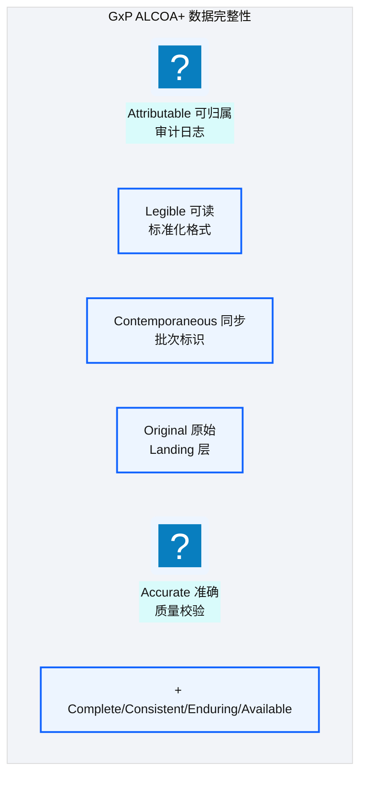
<p class="caption" markdown="span">**图 48-4** GxP ALCOA+ 原则（回顾 Ch 18）</p>

### 中国数据驻留

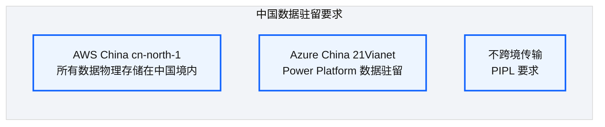
<p class="caption" markdown="span">**图 48-5** 中国数据驻留</p>

| 要求 | 实现 |
|---|---|
| 数据存储本地化 | 所有数据在 AWS China / Azure China |
| 不跨境传输 | 跨云同步（AWS↔Azure）也在中国境内 |
| PIPL 合规 | 最小必要/目的限制/安全保障/可审计 |
| 审计可追溯 | CloudTrail + 审计日志全链路记录 |
<p class="caption" markdown="span">**表 48-3** 中国数据驻留</p>


---

## 48.4 Redshift RLS/CLS 策略在数据治理中的深度应用
这是全书安全设计的集大成——RLS/CLS 贯穿 CDP 数据仓库和 Agentic BI 执行层：

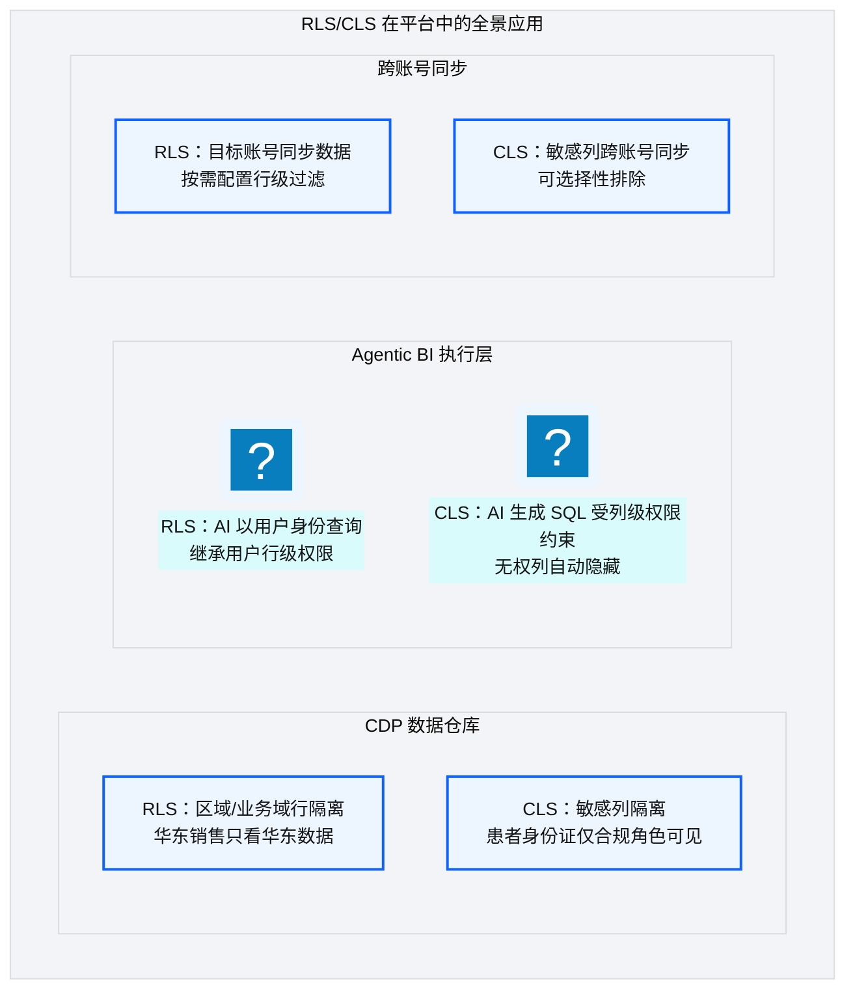
<p class="caption" markdown="span">**图 48-6** Redshift RLS/CLS 策略在数据治理中的深度应用</p>

### RLS 策略绑定与租户隔离

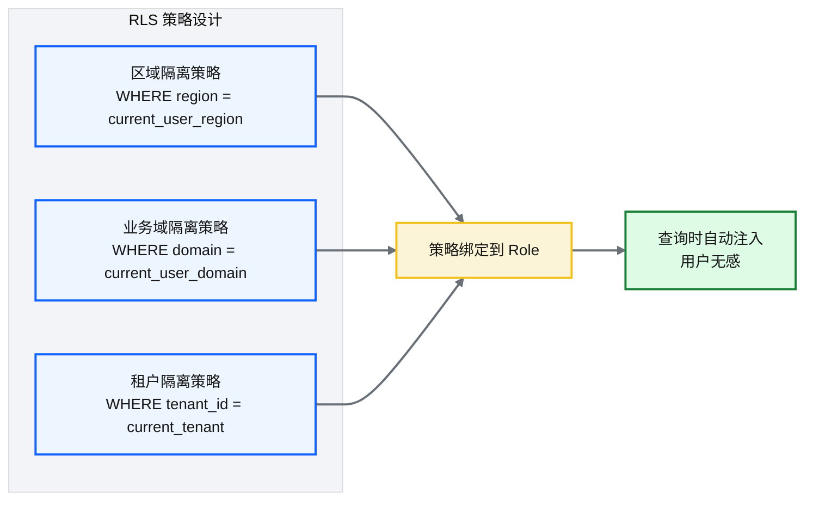
<p class="caption" markdown="span">**图 48-7** RLS 策略绑定与租户隔离</p>

### CLS 列级权限与敏感字段控制

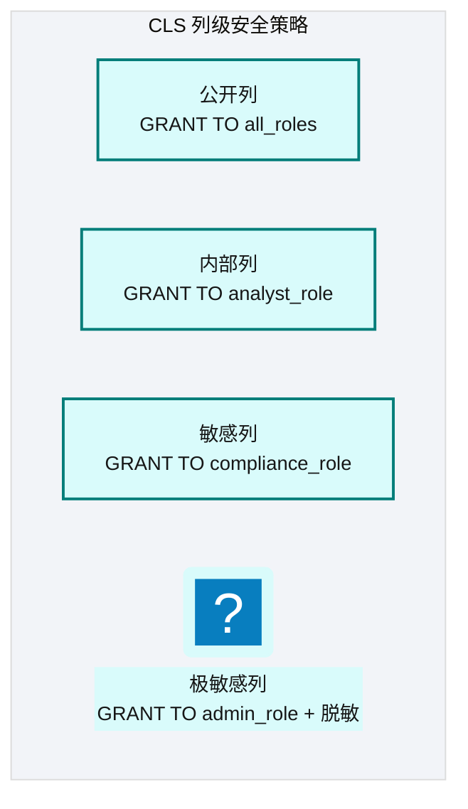
<p class="caption" markdown="span">**图 48-8** CLS 列级权限与敏感字段控制</p>

| 列级别 | 可见角色 | 示例 |
|---|---|---|
| 公开 | 所有角色 | 医院名称、区域 |
| 内部 | 分析师+ | 处方数量、金额 |
| 敏感 | 合规角色 | 患者姓名、电话 |
| 极敏感 | 管理员（脱敏后） | 患者身份证号 |
<p class="caption" markdown="span">**表 48-4** CLS 列级权限与敏感字段控制</p>


### RLS/CLS 与审计日志联动

```mermaid
%%{init: {'theme':'base','themeVariables':{'primaryColor':'#edf5ff','primaryTextColor':'#161616','primaryBorderColor':'#0f62fe','lineColor':'#697077','secondaryColor':'#d9fbfb','tertiaryColor':'#f2f4f8','fontSize':'14px'}}}%%
flowchart LR
 QUERY[用户/AI 查询] --> RLS[RLS 过滤行] --> CLS[CLS 过滤列] --> EXEC[执行]
 EXEC --> AUDIT[审计日志<br/>记录：谁/何时/查了什么/返回多少行]
 AUDIT --> COMPLIANCE[合规审计<br/>定期审查异常访问]
classDef bpProcess fill:#edf5ff,stroke:#0f62fe,stroke-width:2px,color:#161616
classDef bpData fill:#d9fbfb,stroke:#007d79,stroke-width:2px,color:#161616
classDef bpDecision fill:#fcf4d6,stroke:#f1c21b,stroke-width:2px,color:#161616
classDef bpSuccess fill:#defbe6,stroke:#198038,stroke-width:2px,color:#161616
classDef bpError fill:#fff1f1,stroke:#da1e28,stroke-width:2px,color:#161616
classDef bpExternal fill:#f2f4f8,stroke:#697077,stroke-width:2px,color:#161616
classDef bpUser fill:#f6f2ff,stroke:#8a3ffc,stroke-width:2px,color:#161616
classDef bpInfo fill:#f6f2ff,stroke:#8a3ffc,stroke-width:2px,color:#161616
classDef bpGroup fill:#ffffff,stroke:#0f62fe,stroke-width:2px,color:#161616
class QUERY,RLS,CLS bpProcess
class EXEC,COMPLIANCE bpSuccess
class AUDIT bpInfo
linkStyle default stroke:#697077,stroke-width:2px
```
<p class="caption" markdown="span">**图 48-9** RLS/CLS 与审计日志联动</p>

!!! tip "引申"
    RLS/CLS + 审计日志的联动实现了"可追溯的访问控制"——不仅控制"能不能访问"，还记录"访问了什么"。这是 GxP 合规的核心要求：每一次数据访问都可审计。在医药行业，监管机构可能要求"证明某人在某时没有访问某数据"——审计日志 + RLS/CLS 策略共同提供这个证明。

---

## 48.5 治理最佳实践与平台护栏
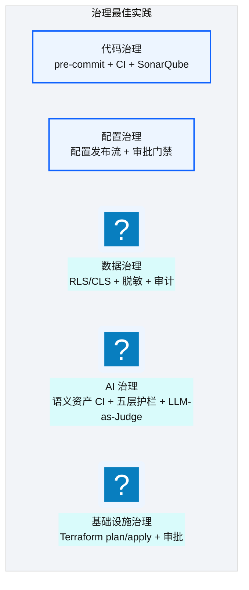
<p class="caption" markdown="span">**图 48-10** 治理最佳实践与平台护栏</p>

| 治理领域 | 护栏 | 详见 |
|---|---|---|
| 代码 | pre-commit + CI + :simple-sonar: SonarQube | [Ch 30](./30-工程师日常工作流与变更场景.md) |
| 配置 | 配置发布流 + 审批门禁 | [Ch 28](./28-四类发布流.md) |
| 数据 | RLS/CLS + 脱敏 + 审计 | 本章 + [Ch 18](./18-数据脱敏与隐私治理.md) |
| AI | 语义资产 CI + 五层护栏 + LLM-as-Judge | [Ch 40](./40-语义平面-三层治理与Git-YAML.md) + [Ch 44](./44-五层SQL护栏与执行安全.md) |
| 基础设施 | :simple-terraform: Terraform plan/apply + 审批 | [Ch 28](./28-四类发布流.md) |
<p class="caption" markdown="span">**表 48-5** 治理最佳实践与平台护栏</p>


!!! warning "Trade-off"
    治理护栏越多，开发效率越低。但医药行业的合规要求决定了"治理不是可选项"。关键是找到"治理粒度"——对高风险变更（PROD 部署/数据访问/AI 生成 SQL）强治理，对低风险变更（DEV 开发/代码格式）轻治理。过度治理会扼杀效率，治理不足会引发事故。

---

## 48.6 安全事件响应：从告警到复盘的全流程
治理体系建好后，还要有"出事时怎么办"的预案。安全事件响应是一套标准化流程——告警触发→定级→响应→复盘，每个环节都有明确动作和责任人。在医药行业，安全事件的响应速度和可追溯性本身是 GxP 审计项：

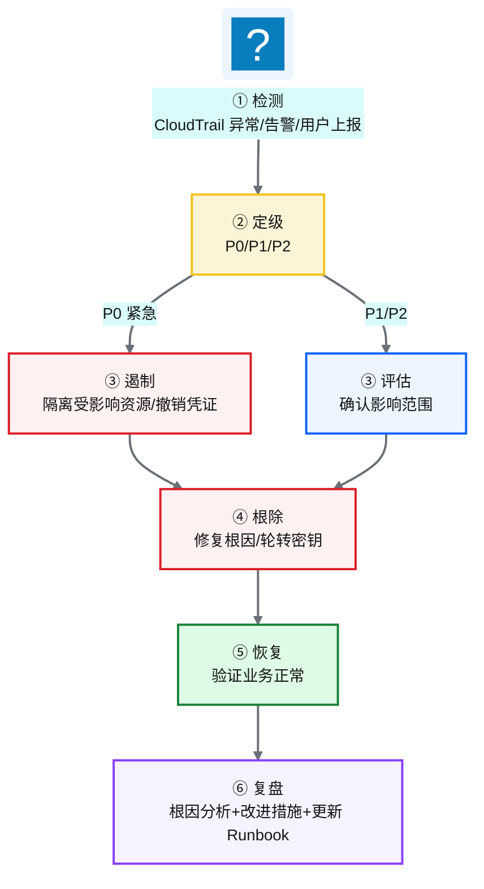
<p class="caption" markdown="span">**图 48-11** 安全事件响应：从告警到复盘的全流程</p>

每个安全事件都有一份 runbook 记录，模板如下：

```yaml
# 示意：安全事件 runbook 模板
incident_id: INC-2026-018
severity: P1                                   # P0紧急/P1高/P2中
detected_at: 2026-06-18T14:32:00+08:00
detected_by: CloudTrail 异常告警                # 检测来源
summary: "某 IAM Role 异常批量下载 S3 敏感数据"
affected_resources:
  - "arn:aws-cn:s3:::ap-aurora-cdp-enriched-prod/patient/*"
  - "arn:aws-cn:iam::123456789012:role/ma-developer"
containment_actions:                            # 核心意图：遏制动作必须有时间戳和操作者
  - { action: "撤销 Role 的 s3:GetObject 权限", at: "14:35", by: "platform-admin" }
  - { action: "轮转被泄露的 KMS 密钥", at: "15:10", by: "security-lead" }
root_cause: "开发者误将测试 policy 推到 PROD，Role 获得过宽 S3 权限"
lessons_learned: ["PROD policy 变更必须双人审批", "CI 增加 policy 过宽检测"]
postmortem_owner: "platform-admin"
```

| 严重级别 | 响应时间 | 沟通升级路径 |
|---|---|---|
| **P0 紧急**（数据泄露/平台不可用） | 15 分钟内响应 | 值班→平台负责人→CIO→合规官（涉及患者数据时） |
| **P1 高**（权限异常/敏感数据误访问） | 1 小时内响应 | 值班→平台负责人→安全负责人 |
| **P2 中**（配置错误未造成泄露） | 4 小时内响应 | 值班→领域负责人 |
<p class="caption" markdown="span">**表 48-6** 示意：安全事件 runbook 模板</p>


!!! tip "引申"
    安全事件响应的关键不是"不出事"，而是"出事后能快速遏制、可追溯"。runbook 的价值在于把"应急响应"从"靠个人经验"变为"按流程执行"。医药行业尤其看重复盘环节——监管机构可能要求你证明"事件发生后采取了什么措施、是否影响数据完整性"。完整的 runbook 记录就是这份证明。

---

## 48.7 灾难恢复与业务连续性
GxP 合规强制要求平台具备灾难恢复（DR）能力——不能因为单一故障导致数据丢失或业务长期中断。灾难恢复的核心是两个指标：**RPO**（恢复点目标，可容忍的数据丢失量）和 **RTO**（恢复时间目标，可容忍的业务中断时长）。

| 场景 | RPO 目标 | RTO 目标 | 恢复策略 |
|---|---|---|---|
| **S3 数据湖故障**（单对象损坏） | 0 | <1 小时 | S3 版本控制恢复（[Ch 18](./18-数据脱敏与隐私治理.md)） |
| **Redshift 集群故障** | <15 分钟 | <4 小时 | 快照恢复到新集群 |
| **整区域故障**（cn-north-1 不可用） | <24 小时 | <24 小时 | 跨区域复制 + DR 区域重建 |
| **配置/元数据丢失** | 0 | <1 小时 | Git 仓库 + DynamoDB 备份恢复 |
<p class="caption" markdown="span">**表 48-7** 灾难恢复与业务连续性</p>


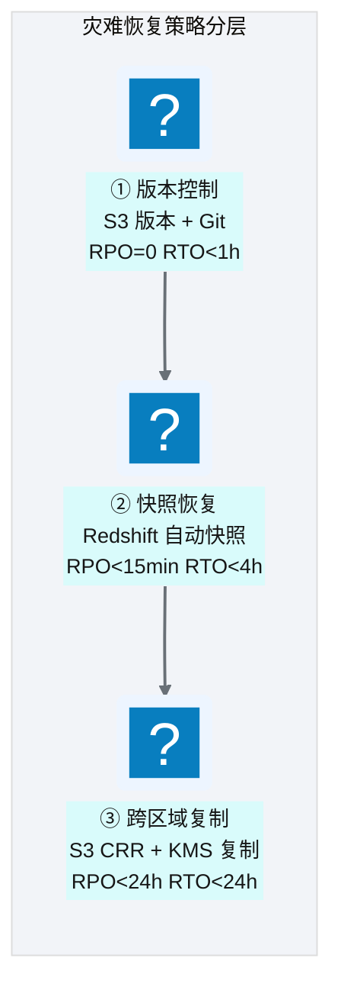
<p class="caption" markdown="span">**图 48-12** 灾难恢复与业务连续性</p>

| DR 要素 | 做法 | 验证频率 |
|---|---|---|
| **S3 版本控制** | 所有数据湖桶启用版本控制 | 每次 DELETE 可恢复 |
| **Redshift 快照** | 自动快照（每 8 小时）+ 手动快照（变更前） | 季度恢复演练 |
| **跨区域复制** | S3 CRR 复制到 DR 区域，KMS 密钥同步 | 半年 DR 演练 |
| **DR 演练** | 模拟区域故障，从 DR 区域恢复业务 | 半年一次 |
<p class="caption" markdown="span">**表 48-8** 灾难恢复与业务连续性</p>


!!! warning "Trade-off"
    跨区域复制（CRR）会把存储成本翻倍，且 China 区域的 DR 区域选择有限（仅 cn-north-1 / cn-northwest-1）。我们的策略是：仅对"极敏感 + 不可重建"的数据做 CRR（如 Landing 原始层、审计日志），可重建的数据（Enriched/Curated）不做 CRR——它们能从 Raw 重跑恢复。这是"DR 成本 vs 数据重要性"的权衡：不是所有数据都值得跨区域复制，关键是识别"不可重建的数据"并优先保护。

---

## :material-check-circle: 本章小结
- IAM 最小权限：按角色/环境/资源粒度分权 + OIDC 无密钥 CI；三类角色 policy（平台管理员/领域开发者/审计员，审计员明示 Deny 业务数据）；KMS 全链路加密
- 数据分类框架：公开/内部/敏感/极敏感四级，驱动脱敏/CLS/加密策略，未分类字段默认按敏感处理
- GxP ALCOA+ + 中国数据驻留：数据物理存境内、不跨境、PIPL 合规、全链路审计
- RLS/CLS 深度应用：贯穿 CDP 数仓 / Agentic BI / 跨账号同步——与审计日志联动实现可追溯访问控制
- 安全事件响应：检测→定级→遏制→根除→恢复→复盘六步流程 + runbook 模板 + 沟通升级路径
- 灾难恢复：RPO/RTO 分层目标（版本控制 RPO=0 / 快照 RPO<15min / 跨区域复制 RPO<24h）+ 半年 DR 演练；仅不可重建数据做 CRR
- 五大治理领域护栏：代码/配置/数据/AI/基础设施——高风险强治理、低风险轻治理

---

!!! quote "下一章"
    [Ch 49 日志、监控、审计与告警](./49-日志-监控-审计与告警.md) —— 安全治理讲完了，接下来看日常运维的监控审计体系。

