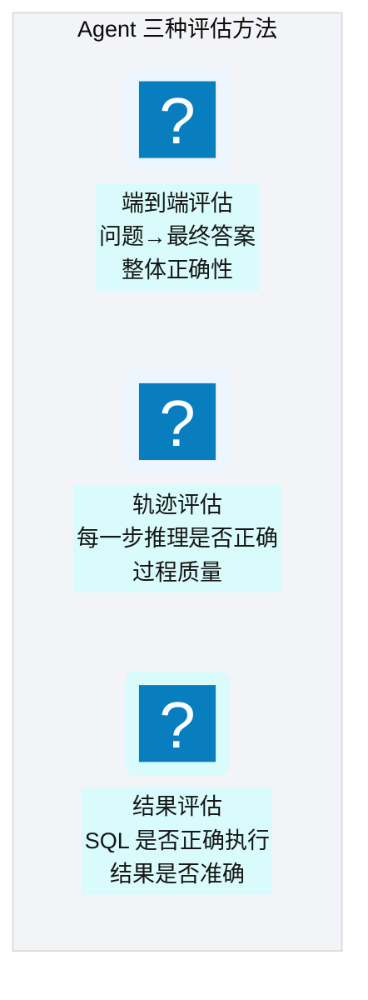
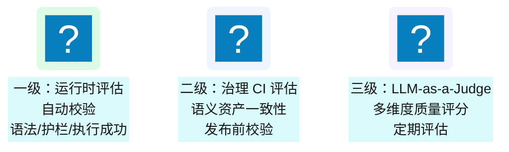
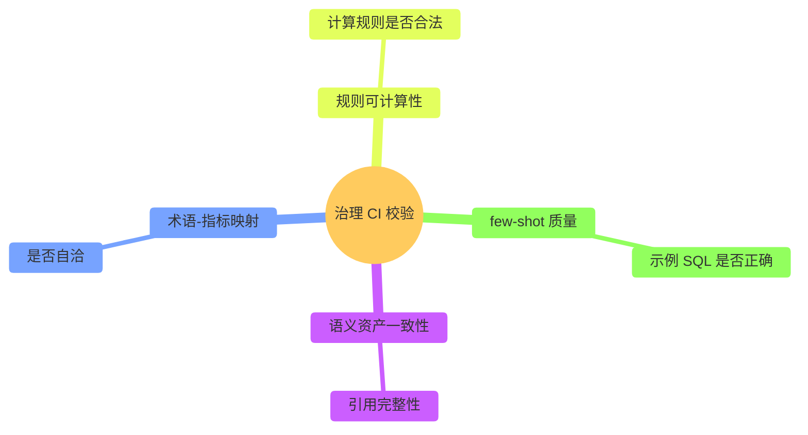
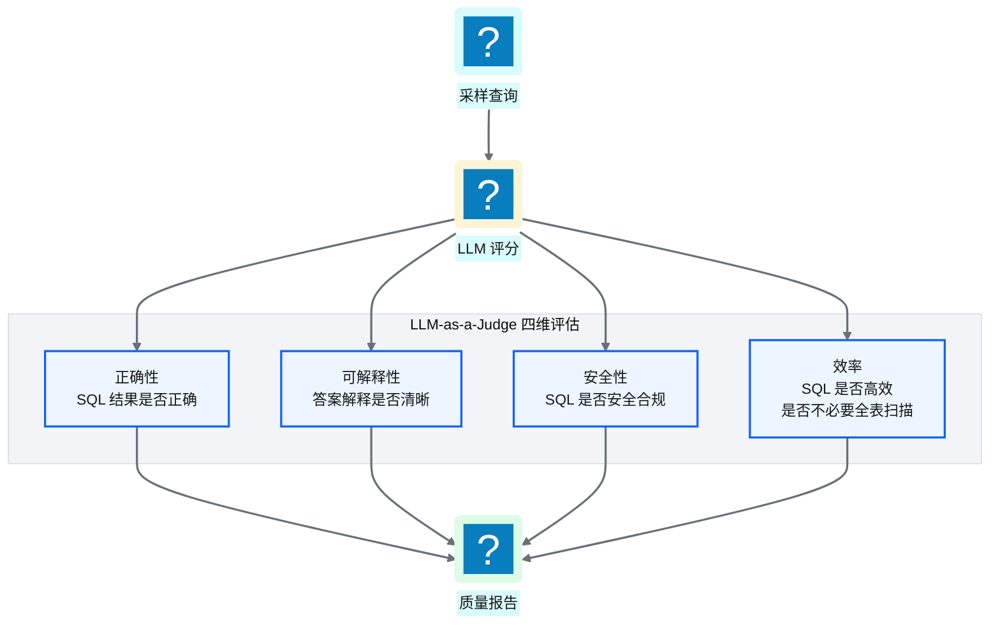
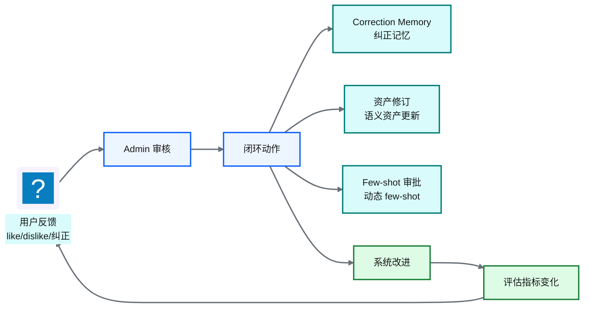
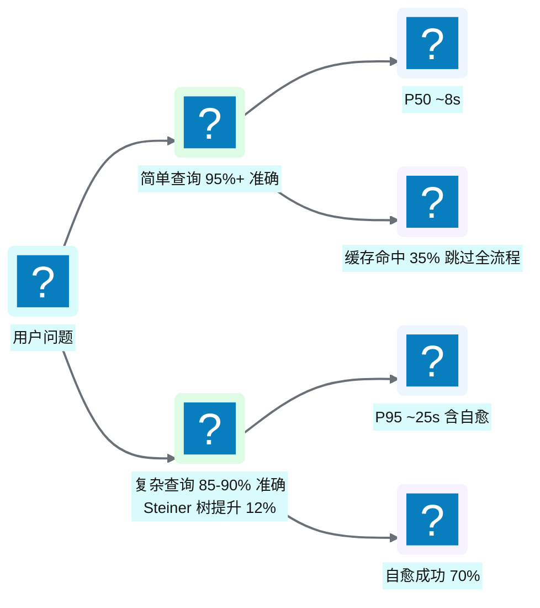
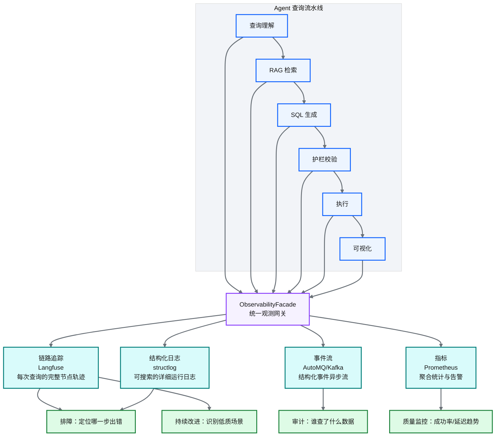
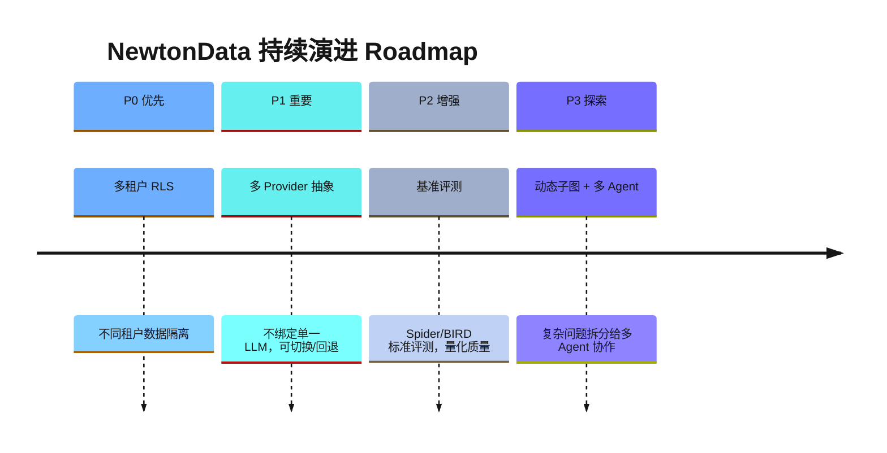
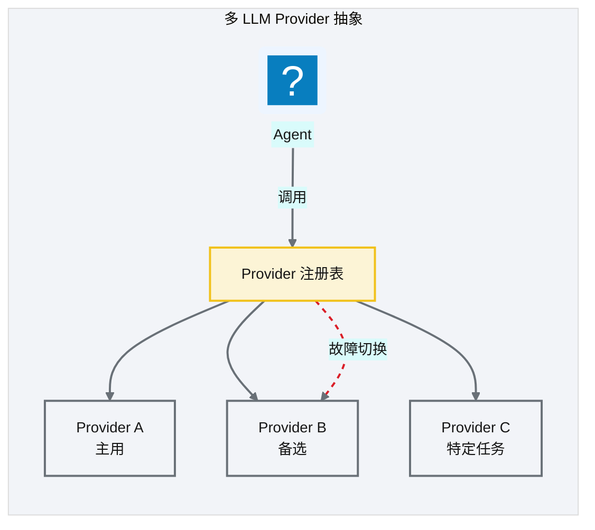

# Ch 49 评估、可观测与持续演进
!!! info "面包屑"
    [本书主页](./index.md) › [Part VII Data+AI 转型](./48-一线产品助手-FieldGenie与MCP增强.md) › Ch 49

!!! abstract "项目第 4 年 · Data+AI POC——评估与演进"

---

## :material-school: 本章你将学到
- Agent 评估方法论：端到端/轨迹/结果
- 治理 CI 校验 + LLM-as-a-Judge 多维评估（含评估 prompt 模板）
- Agentic BI 效果基准（准确率/延迟/护栏/自愈/缓存）与成本分析（LLM API vs 传统 BI 人力 TCO）
- 可观测四通道：链路追踪/事件流/结构化日志/指标
- Roadmap：多租户 RLS、多 Provider 抽象、基准评测

---

Part VII 写到这里，前面跑了两套 POC：NewtonData（Agentic BI）和 LumenKB / FieldGenie（多模态知识库与一线助手）。问题不一样，后来经 MCP 接上了（[Ch 47](./47-多模态业务知识库-Knowhere与PixelRAG与LumenKB.md)、[Ch 48](./48-一线产品助手-FieldGenie与MCP增强.md)）。这一章我关心的是：内部试用跑得怎样、下一步往哪扩。评测口径就是小业务域上的观测，别当成全平台生产实证。

## 49.1 Agent 评估方法论

<p class="caption" markdown="span">**图 49-1** Agent 评估方法论</p>

| 评估方法 | 评什么 | 优势 | 局限 | 代表 |
|---|---|---|---|---|
| **端到端** | 最终答案是否正确 | 最贴近用户体验 | 无法定位错误环节 | Spider/BIRD execution accuracy |
| **轨迹** | 每步推理是否正确 | 可定位错误环节 | 评估成本高 | [AgentBench](https://arxiv.org/abs/2308.03688)、[Trajectory Evaluation](https://arxiv.org/abs/2402.14444) |
| **结果** | SQL/数据是否正确 | 客观可量化 | 不评估过程质量 | [LLM-as-a-Judge](https://arxiv.org/abs/2306.05685)、DeepEval、Ragas |
<p class="caption" markdown="span">**表 49-1** Agent 评估方法论</p>


### 三级评估体系


<p class="caption" markdown="span">**图 49-2** 三级评估体系</p>

### 三级评估器设计

我把三级评估器做成了纯规则引擎（`def` 而非 `async def`），不依赖 LLM 也不做 IO，这样延迟很低。三个评估器分别管检索、SQL、答案三个环节，各自治一段。它们只在 `deep_analysis_workflow` 路由下启用——主路径 nl2sql_query 对延迟很敏感，不适合跑完整评估；deep_analysis 本身就是"质量优先于速度"的路由，多花几百毫秒做评估是划算的。评估分低了就触发重试（[Ch 42](./42-Agent编排-LangGraph与状态机.md) 的 Reflexion 自愈回路）。

| 评估器 | 评估对象 | 评估内容 | 触发条件 |
|---|---|---|---|
| **Retrieval Evaluator** | 检索结果 | 召回的覆盖度、相关性 | `deep_analysis_workflow` 路由 |
| **SQL Evaluator** | 生成 SQL | 正确性、性能、安全性 | 同上 |
| **Answer Evaluator** | 最终回答 | 完整性、准确性 | 同上 |
<p class="caption" markdown="span">**表 49-2** 三级评估器设计</p>

---

## 49.2 治理 CI 校验 + LLM-as-a-Judge 多维评估
### 治理 CI 校验


<p class="caption" markdown="span">**图 49-3** 治理 CI 校验</p>

治理 CI 在语义资产发布前跑四个校验项，缺一不可：

| 校验维度 | 校验对象 | 校验方式 | 失败处理 | 对应语义资产 |
|---|---|---|---|---|
| 语义资产一致性 | 模型/表/字段/关系之间的引用 | 引用完整性检查：被引用对象必须存在、字段类型匹配 | 阻断发布，标记缺失引用并回退到上次绿色版本 | semantic model、table schema |
| 术语-指标映射 | 业务术语与底层指标的绑定关系 | 自洽性检查：每个术语必须有对应指标，指标公式引用的维度必须存在 | 阻断发布，列出悬空术语/指标供作者修正 | glossary、metric definitions |
| 规则可计算性 | 指标计算规则、转换规则 | 合法性检查：规则语法可解析、依赖字段已声明、无循环依赖 | 阻断发布，标注非法规则与冲突路径 | metric rules、transformation rules |
| few-shot 质量 | few-shot 示例（自然语言 + SQL 对） | 示例 SQL 正确性检查：语法可执行、引用对象存在、与当前 schema 一致 | 剔除失败示例并告警，不阻断发布但记录质量分 | few-shot examples |
<p class="caption" markdown="span">**表 49-3** 治理 CI 校验矩阵</p>

### LLM-as-a-Judge 四维评估


<p class="caption" markdown="span">**图 49-4** LLM-as-a-Judge 四维评估</p>

| 维度 | 评估内容 | 工具 |
|---|---|---|
| 正确性 | SQL 结果与标准答案对比 | DeepEval / Ragas |
| 可解释性 | 答案解释是否清晰准确 | LLM 评分 |
| 安全性 | SQL 是否遵守护栏规则 | 规则检查 + LLM |
| 效率 | SQL 执行计划是否高效 | EXPLAIN 分析 |
<p class="caption" markdown="span">**表 49-4** LLM-as-a-Judge 四维评估</p>


!!! tip "引申"
    LLM-as-a-Judge 是用 LLM 评估 LLM 的方法——因为人工评估不可规模化。但 LLM Judge 也有偏差（可能偏好某种风格），所以最佳实践是"LLM 评估为主 + 人工抽检为辅"。DeepEval 和 Ragas 是两个开源的 LLM 评估框架，提供了标准化的评估指标和流程。

LLM-as-a-Judge 落到代码是一个评估 prompt 模板，对采样查询按四维打分：

```python
# 示意：LLM-as-a-Judge 四维评估 prompt 模板
JUDGE_PROMPT = """你是 Agentic BI 的质量评审。对以下问答按四维打分（1-5 分）：
【问题】{question}
【生成 SQL】{sql}
【执行结果】{result}
【标准答案】{gold_answer}

请按四维评分并说明扣分原因：
1. 正确性：SQL 结果与标准答案是否一致
2. 可解释性：答案解释是否清晰准确
3. 安全性：SQL 是否遵守护栏规则（无 DDL/PII/全表扫描）
4. 效率：SQL 执行计划是否高效（是否避免不必要 join/扫描）
输出 JSON：{{"correctness": n, "explainability": n, "safety": n, "efficiency": n, "reason": "..."}}"""

def judge_sample(sample: dict) -> dict:
    return llm.evaluate(JUDGE_PROMPT.format(**sample))   # 核心意图：LLM 评估为主 + 人工抽检为辅
```

### DeepEval + Ragas 集成

除了自建的 LLM-as-a-Judge，我们还接了两个开源评估框架来做 RAG 专项评估——有现成的标准化指标，没必要自己重造一遍：

| 工具 | 用途 | 关键指标 |
|---|---|---|
| **DeepEval** | LLM 评估框架，支持自定义指标与 pytest 集成 | answer_relevancy、faithfulness |
| **Ragas** | RAG 专项评估 | context_precision、context_recall、faithfulness、answer_relevancy |
<p class="caption" markdown="span">**表 49-10** DeepEval + Ragas 集成</p>

Ragas 四个核心指标的含义：

- **faithfulness**：生成的答案是否忠于检索到的上下文（不幻觉）——SQL 是否只用了检索到的表/列
- **answer_relevancy**：答案是否切题——SQL 是否回答了用户问题
- **context_precision**：检索的上下文是否相关——召回的表/列是否与问题相关
- **context_recall**：是否检索到了回答问题所需的全部上下文——有没有漏召回关键表

### 资产认证生命周期

资产不只有"存在"和"不存在"两种状态——它需要质量状态。`quality_score` + `lifecycle_status` 两个字段串起了认证流程，质量过关的资产进入 certified 状态，检索时会被优先选中（[Ch 40](./40-语义平面-三层治理与Git-YAML.md) SemVer 与认证生命周期）：

```
draft → reviewed → certified → deprecated
```

这个设计的出发点是"用质量信号影响检索优先级"——Reranker（[Ch 41](./41-RVGD四引擎RAG检索.md)）给 certified 资产加分，让高质量资产更容易被 LLM 看到。

### 反馈闭环

用户反馈是系统改进的燃料——负反馈经过 Admin 审核后，会触发一系列闭环动作：


<p class="caption" markdown="span">**图 49-10** 反馈闭环：用户反馈→系统改进</p>

三种反馈动作各有用处：负反馈→Correction Memory（[Ch 45](./45-记忆系统与工具使用.md) 纠正记忆，避免再犯同样的错误）；术语或指标出错→资产修订（[Ch 40](./40-语义平面-三层治理与Git-YAML.md) 语义资产更新）；成功案例→Few-shot 审批（[Ch 45](./45-记忆系统与工具使用.md) 动态 few-shot 三步审批）。

### 基准评测结果

!!! note ""
    以下数字来自 NewtonData POC 在小业务域的内部试用，量级直觉够用，但不是全平台生产实证，也别直接外推到单域上千表。Spider/BIRD 公开基准还在 Roadmap P2。

Spider/BIRD 还挂在 P2，但小业务域试用这几个月已经攒出一批量化基线：

| 指标 | 基准值 | 说明 |
|---|---|---|
| **简单查询 NL2SQL 准确率** | **95%+** | 单表聚合/过滤，术语绑定强路由覆盖（"华东区上月销售额"→ `region='East China'`） |
| **复杂查询 NL2SQL 准确率** | **85-90%** | 多表 join + 子查询 + 窗口函数；Steiner 树优化 join 路径后准确率提升约 12% |
| **端到端响应延迟 P50** | **~8 秒** | LLM 推理 2-3s + 检索 1-2s + Redshift 查询 2-4s |
| **端到端响应延迟 P95** | **~25 秒** | 含 Redshift 大查询排队 + 自愈重试 |
| **护栏拦截率** | **~7%** | 危险 DDL 3% + PII 字段探测 2% + 超量查询限制 2% |
| **自愈成功率** | **~70%** | 表名/列名纠错最成功（90%+），复杂逻辑改写需人工介入 |
| **缓存命中率** | **~35%** | 语义查询缓存 + 结果缓存双层 |
| **用户满意度评分** | **4.2/5.0** | 20+ 高频用户季度调研 |
<p class="caption" markdown="span">**表 49-5** 基准评测结果</p>



<p class="caption" markdown="span">**图 49-5** 基准评测结果</p>

### 成本分析：LLM API vs 传统 BI 人力 TCO

Agentic BI 的成本不能只看 LLM API 账单——要跟它替代的传统 BI 人力取数做 TCO 比较才有意义：

| 维度 | 传统 BI（人工取数） | Agentic BI（NewtonData） |
|---|---|---|
| **取数时效** | 业务提需求→IT 排期→3-5 天 | 秒级/分钟级 |
| **人力成本** | 3-4 名分析师全职取数 | 1 名 AI 工程师维护 |
| **LLM API 成本** | — | 日均 ~500 次查询 ≈ ¥15,000/月（见 [Ch 1](./01-数字化转型下的医药数据困局.md) 平台经济学） |
| **月度即席查询量** | <50 次（人工瓶颈） | ~10,000 次（200×） |
| **总拥有成本（含人力）** | 高（人力是主要成本） | LLM API 成本远低于替代的人力 |
<p class="caption" markdown="span">**表 49-6** 成本分析：LLM API vs 传统 BI 人力 TCO</p>


!!! warning "Trade-off"
    LLM API 成本会随查询量线性增长——日均 500 次查询时月成本 ¥1.5 万可控，但如果涨到 5000 次/天，月成本会到 ¥15 万。控制成本的关键是**缓存命中率**（35% 的命中已省下三分之一的 LLM 调用）和**简单查询强路由**（术语绑定直接命中 metric 定义，跳过规划器）。把"所有查询都走完整 LLM 流程"改为"简单查询走缓存/强路由、复杂查询才走完整流程"，是成本可控的核心策略。

---

## 49.3 可观测四通道

评估关心的是"质量好坏"，可观测关心的是"出了问题怎么定位"。传统系统做可观测主要盯日志和指标就够，Agentic BI 的可观测复杂了一个数量级。

原因很直接。传统 BI 的查询是确定性的——用户写 SQL，系统执行，成就是成，败就是败。Agentic BI 的查询是一条非确定性的多步流水线——一个问题要经过意图理解、检索、规划、SQL 生成、护栏校验、执行、可视化这七八个节点，哪个节点都可能掉链子。而且 LLM 的行为天然不可预测：同一个问题可能走不同的路由，生成不同的 SQL，拿到不同的结果。最终答案如果错了，你没法一眼看出是哪儿出的问题——是检索漏了关键表？是 SQL 幻觉了个不存在的列名？是护栏误拦了？还是执行超时？

没有全链路可观测，这些问题全答不上来。所以四通道可观测不是一个"锦上添花"的东西，是基础设施级的前提。

### 四通道各司其职

四个通道不是随便凑的，各自对着一种不同的观测需求——粒度、时间维度、用途都不一样，互补的，不是互相替代：


<p class="caption" markdown="span">**图 49-6** 可观测四通道：从流水线到观测目标</p>

**链路追踪**（Langfuse）是四个通道里最核心的——它记录每次查询从入口到出口的完整节点轨迹，形成一棵 trace 树。一个用户问题对应一条 trace，trace 下面每个节点（查询理解、检索、生成、护栏、执行、可视化）是一个 span，span 内部的 LLM 调用是 generation。trace → span → generation 这种层级让你排查问题时可以逐层下钻：先找到出错的 span，再钻进 span 看具体的 LLM 调用，最后落到 prompt 和 response。Langfuse 底层用的是 OpenTelemetry 的 trace/span 模型（[langfuse.com](https://langfuse.com)），算是 LLM 应用可观测的事实标准了。

**事件流**（AutoMQ/Kafka）走的是异步流——每次查询的关键节点（查询开始、检索完成、SQL 生成、护栏通过/拒绝、执行成功/失败、可视化完成）都会发出一个结构化事件。事件流的场景是审计和回放——安全审计要知道"谁在什么时候查了什么数据、拿到了什么结果"，事件流给了完整的操作记录。它和链路追踪的差异在于视角：链路追踪是排障视角（盯某次查询内部出了什么问题），事件流是审计视角（盯跨查询的操作记录）。

**结构化日志**（structlog）是粒度最细的一层——每个节点内部的运行细节（调试信息、中间状态、错误堆栈）都记下来。"结构化"是这里的关键——日志字段是机器可解析的 JSON，含 trace_id、session_id、节点名、级别，而不是一段自由文本。这样日志可以搜索、过滤、聚合，而不是只能靠人眼去翻。日志通过 trace_id 和链路追踪打通——在 Langfuse 看到某条 trace 后，拿 trace_id 就能在日志系统里把这条查询的所有日志搜出来。

**指标**（Prometheus）是粒度最粗的一层——它不做单次查询的细节，只看聚合。指标回答的是"系统整体怎么样"：成功率多少？P50/P95/P99 延迟各是多少？缓存命中率？重试次数？指标是告警的基础——成功率突然掉下去了、延迟飙升了，Prometheus 触发告警通知运维。仪表盘上画出趋势图，是做"健康度监控"的骨架。

| 通道 | 工具 | 粒度 | 时间维度 | 核心用途 |
|---|---|---|---|---|
| **链路追踪** | Langfuse | 单次查询的节点级 | 实时+历史查询 | 排障：定位哪一步出错 |
| **事件流** | AutoMQ/:simple-apachekafka: Kafka | 单次查询的关键事件 | 实时流+审计存储 | 审计：谁查了什么数据 |
| **结构化日志** | structlog | 节点内部的调试级 | 实时+滚动存储 | 排障：详细的运行细节 |
| **指标** | :simple-prometheus: Prometheus | 聚合统计 | 时间序列趋势 | 监控：成功率/延迟/告警 |
<p class="caption" markdown="span">**表 49-7** 可观测四通道的分工</p>


这四个通道从不同角度观测同一个系统，靠 `trace_id` 串在一起——链路追踪的 trace、事件流的事件、结构化日志的记录、指标的 label 都带同一个 `trace_id`，做到了"一次查询、四处留痕"。开发侧只需要调 `ObservabilityFacade` 这一个统一接口，Facade 内部自动把数据分发到四个通道，底层的工具差异被屏蔽掉了。

### 运行时稳定性：可观测的"反馈→自愈"闭环

可观测不光是"看"——它也驱动"自愈"。系统跑起来之后，一堆稳定性机制在持续工作，它们的效果又通过可观测通道反哺回来，形成"观测→发现→自愈→验证"的闭环：

- **SQL 语义缓存**：相似度 ≥ 0.92 的查询直接命中缓存，跳过完整流水线——35% 的命中率已省下三分之一的 LLM 调用，这是成本可控的关键（[Ch 45](./45-记忆系统与工具使用.md)）。
- **修复回路**：护栏失败后触发 corrective_retrieval，拉取正确资产重新生成——约 70% 的失败查询能自愈成功（[Ch 42](./42-Agent编排-LangGraph与状态机.md)）。
- **熔断器**：LLM 连续失败时自动暂停该模型调用，避免故障扩散到所有查询（[Ch 42](./42-Agent编排-LangGraph与状态机.md) 模型分配）。
- **会话清理与元数据缓存**：后台清理过期会话、缓存元数据减少重复查询，保持系统轻量。

这些机制不是可观测的替代品——恰恰相反，它们的效果必须通过可观测来验证。缓存命中率到底多少？修复成功率够不够？熔断器有没有误触发？这些问题只能靠指标和链路追踪来回答。可观测和稳定性机制，一个负责"感知"，一个负责"反应"——前者找到问题，后者解决问题。

!!! warning "Trade-off"
    四个可观测通道的运维成本不低——Langfuse、AutoMQ、Prometheus 各需独立维护。但 Agentic BI 的"黑盒性"比传统系统更严重——LLM 的行为不可预测，没有全链路可观测就无法排障和改进。对于企业级 Agentic BI，可观测是必需投入，而非可选附件。关键是用 ObservabilityFacade 统一网关降低开发侧成本——开发者只对接一个接口，而非四个。

!!! tip "引申：基石回扣——从 batch_id 到 trace_id"
    可观测四通道的"安全审计"（谁查了什么数据）是 [Ch 11](./11-配置与状态管理.md) batch_id 可追溯性的 AI 场景延伸。CDP 平台用 batch_id 贯穿数据管道实现血缘追溯——每个数据批次都有唯一标识，可追溯到来源、处理过程、下游消费。Agentic BI 用 trace_id 贯穿查询全链路实现审计追溯——每次 AI 查询都有完整轨迹（问题→路由→检索→SQL→执行→结果），可追溯到具体的 session_id 和 user_id。

    这个延续不是偶然的——医药行业 GxP 合规要求"可归属"（ALCOA+Attributable，[Ch 1](./01-数字化转型下的医药数据困局.md)）：任何数据变更都必须可追溯到操作人。CDP 的 batch_id 满足了"数据管道"的可追溯要求；Agentic BI 的 trace_id 把这个要求延伸到了"AI 查询"——即使 SQL 是 AI 生成的，也必须知道是哪个用户的哪个会话触发的，生成过程经历了哪些节点。**可观测不是技术附加，而是合规刚需的延续**。

---

## 49.4 Roadmap：多租户 RLS、多 Provider 抽象、基准评测

<p class="caption" markdown="span">**图 49-8** Roadmap：多租户 RLS、多 Provider 抽象、基准评测</p>

| 优先级 | 方向 | 价值 |
|---|---|---|
| **P0** | 多租户 RLS | 支持多业务线/多部门数据隔离 |
| **P1** | 多 Provider 抽象 | 不绑定单一 LLM，可切换/回退 |
| **P2** | 基准评测 | Spider/BIRD 标准评测，量化质量 |
| **P3** | 动态子图 + 多 Agent | 复杂问题拆分给多 Agent 协作 |
| **P3** | 知识库与 BI Agent 经 MCP 接上 | NewtonData 能稳定调 LumenKB；引用和审计对齐 |
<p class="caption" markdown="span">**表 49-8** Roadmap：多租户 RLS、多 Provider 抽象、基准评测</p>


### 多 Provider 抽象


<p class="caption" markdown="span">**图 49-9** 多 Provider 抽象</p>

!!! tip "引申"
    多 Provider 抽象的核心价值是"不把鸡蛋放一个篮子"——LLM 服务可能故障、限流、涨价。抽象层让 Agent 可在不同 Provider 间切换/回退，保证可用性。这也是企业级 AI 系统与"绑定单一 LLM 的 demo"的区别。

!!! tip "引申：基石回扣——P0 多租户 RLS 是 CDP 多租户的延伸"
    P0 多租户 RLS 不是从零开始的新需求——[Ch 37](./37-数据即服务-DaaS激活层设计.md) 的 DaaS 已建立了 `db_user_{tenant}` 多租户隔离，[Ch 46](./46-数据平面与CDP整合.md) 已把这套机制延伸为 `ai_agent_as_user_{tenant}` 角色。P0 的工作是把它从"单租户验证"推广到"多业务线/多部门正式隔离"——让不同业务线的 AI Agent 只能查自己业务线的数据。这是 CDP 安全骨架在 AI 场景的持续深化，而非全新建设。

---

## 49.5 已知局限与失败模式：NewtonData 回答不了什么
坦率讲，NewtonData 不是万能的——有一些问题它到现在也回答不好，有些场景它表现就是不行。把这些局限明摆出来，比假装完美更有意义：

| 局限类型 | 表现 | 根因 | 演进方向 |
|---|---|---|---|
| **跨库关联** | 无法 join Redshift 与外部数据源（如临时 Excel） | 执行域限于 Redshift 单库 | 多模态输入→临时表入 Redshift（[Ch 39](./39-Agentic-BI架构总览.md) 引申框） |
| **复杂窗口函数** | ROW_NUMBER/RANK 跨多维度时准确率下降 | 窗口语义复杂，LLM 难以正确表达 | few-shot 补充 + 窗口函数模板化 |
| **非结构化推理** | 「分析一下处方趋势的原因」；说明书/价策图表问答 | 超出 NL2SQL；文档证据不在语义平面 | 文档侧交给 LumenKB + FieldGenie（[Ch 47](./47-多模态业务知识库-Knowhere与PixelRAG与LumenKB.md)/[Ch 48](./48-一线产品助手-FieldGenie与MCP增强.md)）；NewtonData 需要证据时经 MCP 调 `retrieve_*` |
| **实时流查询** | 无法查询"最近 5 分钟"的实时数据 | Redshift 是批处理数仓，非实时 | 接入 streaming source（Kinesis → 物化视图） |
| **超长复杂查询** | 10+ 表 join + 多层子查询时准确率降至 ~60% | LLM 上下文限制 + 规划器复杂度 | 子查询分解 + 分步执行 |
<p class="caption" markdown="span">**表 49-9** 已知局限与失败模式：NewtonData 回答不了什么</p>


!!! warning "Trade-off"
    承认局限不是失败，而是"工程诚实"的体现（[Ch 54](./54-架构师的复盘-取舍遗憾与主流对比.md)）。把 NewtonData 定位为"覆盖 90% 高频分析查询的助手"而非"万能分析师"，是务实的——剩下 10% 的复杂/开放问题仍需人工分析师。强行让 AI 回答它答不好的问题，只会产生错误结果和用户不信任。明确的边界声明，反而提升了用户对"它能答好的部分"的信任。

---

## :material-check-circle: 本章小结
- Agent 评估三方法：端到端（整体正确性）/ 轨迹（过程质量）/ 结果（SQL 准确性）——互补使用（AgentBench/Trajectory Evaluation/LLM-as-a-Judge）
- 三级评估：运行时（三级评估器——纯规则引擎、低延迟、仅 deep_analysis 路由）/ 治理 CI（发布前四维校验）/ LLM-as-a-Judge（定期四维评分：正确性/可解释性/安全性/效率，含 prompt 模板）
- DeepEval + Ragas 集成（faithfulness/answer_relevancy/context_precision/context_recall）；资产认证生命周期（draft→reviewed→certified→deprecated + quality_score 驱动检索优先级）；反馈闭环（用户反馈→Admin 审核→Correction Memory/资产修订/Few-shot 审批）
- Agentic BI 效果基准：简单查询准确率 95%+、复杂查询 85-90%（Steiner 树提升 12%）、P50 ~8s/P95 ~25s、护栏拦截 ~7%、自愈成功 ~70%、缓存命中 ~35%、满意度 4.2/5
- 成本分析：LLM API 月成本 ~¥1.5 万，远低于替代的传统 BI 人力（[Ch 1](./01-数字化转型下的医药数据困局.md) 平台经济学）；成本可控靠缓存命中 + 简单查询强路由
- 可观测四通道：Langfuse（链路追踪）/ AutoMQ（事件流）/ structlog（日志）/ Prometheus（指标）——ObservabilityFacade 统一网关；Prometheus 指标（ttd_pipeline_duration_seconds 等）；运行时稳定性机制（SQL Cache/修复循环/Circuit Breaker/Session 清理/Metadata Cache）
- 审计可追溯：trace_id 贯穿查询全链路——CDP 的 batch_id 可追溯性（[Ch 11](./11-配置与状态管理.md)）在 AI 场景的延伸
- Roadmap：P0 多租户 RLS（[Ch 37](./37-数据即服务-DaaS激活层设计.md) DaaS 多租户的延伸）/ P1 多 Provider 抽象 / P2 基准评测 / P3 动态子图+多 Agent
- 已知局限：跨库关联/复杂窗口函数/非结构化推理/实时流/超长查询。非结构化侧由 LumenKB/FieldGenie 补了一截（[Ch 47](./47-多模态业务知识库-Knowhere与PixelRAG与LumenKB.md)/[Ch 48](./48-一线产品助手-FieldGenie与MCP增强.md)）；承认局限延续 [Ch 34](./34-设计边界与已知取舍的诚实复盘.md)/[Ch 54](./54-架构师的复盘-取舍遗憾与主流对比.md) 的做法
- Roadmap 增补：知识库与 BI Agent 经 MCP 接上，引用和审计对齐

---

!!! quote "下一部分"
    [Part VIII 治理、运维与价值复盘](./50-安全-合规与治理.md) —— 两条 POC 线告一段落。接下来进最后一部分：安全合规、监控排障、价值度量，以及架构师自己的复盘。

