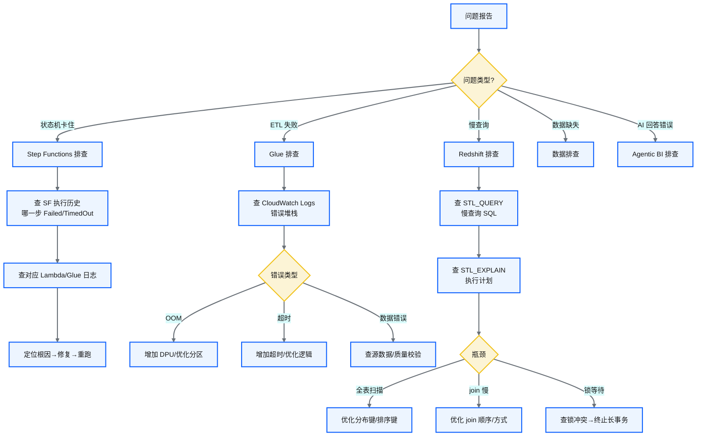
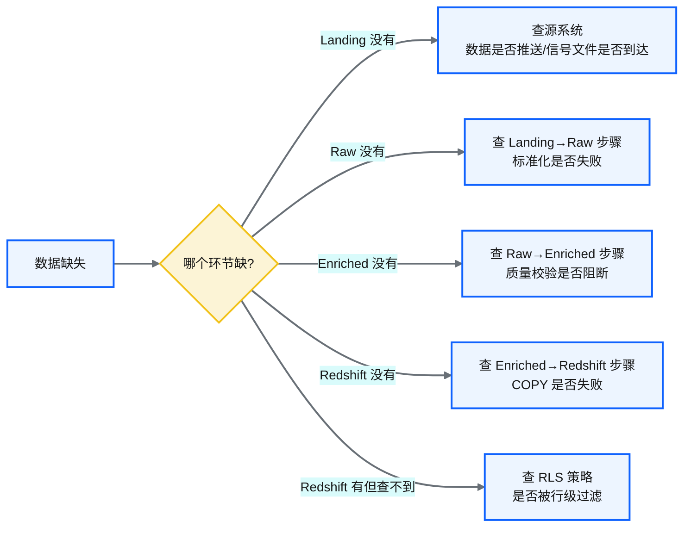
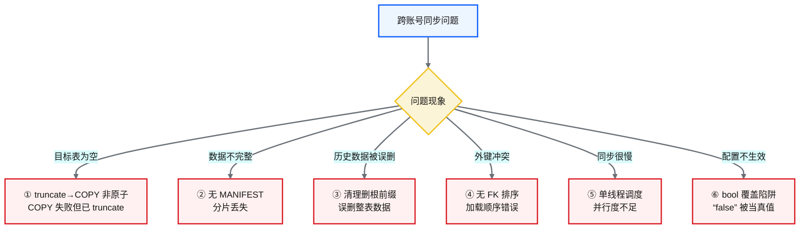
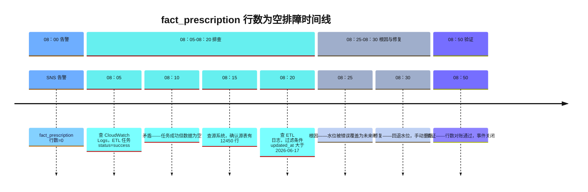
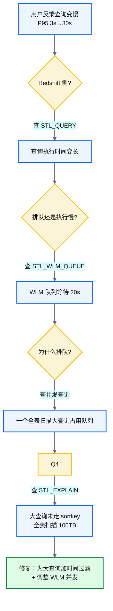

# Ch 50 排障与可观测性实战
!!! info "面包屑"
    [本书主页](./index.md) › [Part VIII 治理与复盘](./49-日志-监控-审计与告警.md) › Ch 50

!!! abstract "项目第 3 年 · 成熟与治理期——排障实战"

---

## :material-school: 本章你将学到
- 状态机卡住、ETL 失败、慢查询的排查路径
- 常见问题索引与排障决策树
- 跨账号同步的已知边界排障
- 真实排障 walkthrough（fact_prescription 数据为空，含 CloudWatch 日志摘录与时间线）
- 性能退化排障（查询延迟 P95 涨 10× 的排查：STL_QUERY/WLM/EXPLAIN/分布倾斜）
- 预防性排障（健康检查 + 容量预警 + 漂移检测，在事故前发现隐患）

---

## 50.1 状态机卡住、ETL 失败、慢查询的排查路径
### 排障决策树


<p class="caption" markdown="span">**图 50-1** 排障决策树</p>

---

## 50.2 常见问题索引与排障决策树
### 高频问题速查表

| 问题现象 | 首先检查 | 根因可能性 | 修复方向 |
|---|---|---|---|
| 状态机停在某步不走 | SF 执行历史 + Lambda 日志 | Lambda 超时/权限不足/配置缺失 | 增加超时/修复 IAM/补配置 |
| Glue Job OOM | CloudWatch 内存指标 | 数据量过大/分区不合理 | 增加 DPU/优化分区/减少 shuffle |
| Glue Job 超时 | 运行时长 vs 配置超时 | 数据量过大/死循环/源系统慢 | 增加超时/优化逻辑/检查源系统 |
| Redshift 查询慢 | STL_QUERY + STL_EXPLAIN | 全表扫描/join 顺序差/锁等待 | 优化分布键排序键/重写 SQL/终止锁 |
| 数据行数不对 | 行数对账日志 | 源数据变了/过滤条件错/脱敏删除 | 查源数据/检查配置/查脱敏规则 |
| AI 生成 SQL 错误 | Langfuse 链路追踪 | 术语歧义/检索不准/护栏遗漏 | 检查语义资产/优化检索/补充护栏 |
<p class="caption" markdown="span">**表 50-1** 高频问题速查表</p>


### 数据缺失的排查流程


<p class="caption" markdown="span">**图 50-2** 数据缺失的排查流程</p>

!!! tip "引申"
    数据缺失排查的关键是"按链路逐层定位"——从 Landing 到 Raw 到 Enriched 到 Redshift，逐层检查行数。批次标识让这个定位极其精确——查"批次 20260618-001500 的数据在哪一层丢了"。

---

## 50.3 跨账号同步的已知边界排障
回顾 [Ch 34](./34-设计边界与已知取舍的诚实复盘.md) 的六个已知边界，跨账号同步场景的排障：


<p class="caption" markdown="span">**图 50-3** 跨账号同步的已知边界排障</p>

| 已知边界 | 排障方式 | 临时缓解 |
|---|---|---|
| ① 表为空 | 查 COPY 日志是否失败 | 从 S3 重新 COPY |
| ② 数据不完整 | 对比源/目标行数 | 启用 MANIFEST 重跑 |
| ③ 历史误删 | 查 S3 版本恢复 | 从源重新同步 |
| ④ 外键冲突 | 查 FK 依赖顺序 | 手动指定加载顺序 |
| ⑤ 同步慢 | 查调度器日志 | 拆分大表为小批次 |
| ⑥ 配置不生效 | 检查配置值类型 | 强制类型转换 |
<p class="caption" markdown="span">**表 50-2** 跨账号同步的已知边界排障</p>


!!! warning "Trade-off"
    已知边界的排障策略是"先识别是否命中已知边界"——80% 的跨账号同步问题在这六个边界内。识别后按临时缓解措施处理，长期通过改进设计消除边界（见 [Ch 34](./34-设计边界与已知取舍的诚实复盘.md)）。

---

!!! tip "引申：双联章说明"
    本章与 [Ch 49 日志、监控、审计与告警](./49-日志-监控-审计与告警.md) 合构"监控排障双联章"——Ch 49 讲"怎么看见"，本章讲"怎么排查"。建议两章连读。

---

## 50.4 排障演练：fact_prescription 数据突然为空
理论讲多少都不如走一遍真实案例。这是数据平台里很有代表性的一个排障过程——某天早上，一条 P1 告警弹出来："ma 域 fact_prescription 行数较基线下降 100%"。下面是当时完整的时间线和排查路径。


<p class="caption" markdown="span">**图 50-4** 排障演练：fact_prescription 数据突然为空</p>

**第一步：确认告警**（08:00）。SNS 告警写的是 `fact_prescription 行数较 7 天基线下降 100%`。先确认是不是误报——打开 CloudWatch Logs Insights：

```
# CloudWatch Logs Insights 查询
filter entity="fact_prescription" and status="success"
| sort @timestamp desc
| limit 5
# 结果：最近一次任务 status=success，row_count=0
```

**第二步：发现矛盾**（08:10）。任务 status=success，但 row_count=0——这就是 [Ch 49](./49-日志-监控-审计与告警.md) 提到的"ETL 成功但数据为空"。任务没挂，是"跑了但没拉到数据"。

**第三步：查源系统**（08:15）。连源库跑 `SELECT COUNT(*) FROM prescription WHERE updated_at > '2026-06-17'`——返回 12450 行，源数据没毛病。问题出在 ETL 侧。

**第四步：定位根因**（08:20）。查 ETL 日志的水位读取记录（[Ch 14](./14-数据库与JDBC连接器.md) 水位机制）：

```python
# 从 DynamoDB 水位表查到的值
last_watermark = "2026-06-19T00:00:00"   # 核心意图：水位是未来时间！updated_at > 未来 = 0 行
```

水位被错写成了未来时间（6-19，实际当天是 6-18）。前一天有人手动重跑时误传了参数，把水位覆盖成了"明天"。于是 `WHERE updated_at > '2026-06-19'` 返回 0 行。

**第五步：修复**（08:30）。回退水位到正确值（`2026-06-17`），手动触发重跑。迟到数据回溯窗口（[Ch 14](./14-数据库与JDBC连接器.md)）确保不漏数据。

**第六步：复盘**（08:50）。行数对账通过，事件关闭。改进措施：水位更新环节加了"不允许写未来时间"的校验。这也是 [Ch 52](./52-架构师的复盘-取舍遗憾与主流对比.md) 里"工程诚实"的具体落脚：把排障中吃到的教训固化为防护栏杆，下次同样操作会被拦住。

!!! tip "引申"
    这个案例的价值在于展示了"数据平台排障 ≠ 应用排障"——应用排障看"是否报错"，数据平台排障要看"是否成功但结果异常"。如果只监控任务 status，这类"成功但为空"的问题要到业务方用数据时才被发现，滞后数天。行数对账 + 基线告警让它在 8 点就被发现——这是数据可观测性的价值。

---

## 50.5 性能退化排障：查询延迟从 3 秒涨到 30 秒
排障不只是"挂了"才算故障，"慢了"也是。这个案例很有代表性：用户反馈 Agentic BI 查询 P95 延迟从 3 秒涨到了 30 秒，但结果是对的。这种排查完全不走功能故障那条路：


<p class="caption" markdown="span">**图 50-5** 性能退化排障：查询延迟从 3 秒涨到 30 秒</p>

| 排查步骤 | 用的工具/表 | 发现 |
|---|---|---|
| 确认慢在哪 | Redshift STL_QUERY | 查询执行时间从 2s 涨到 25s |
| 区分排队 vs 执行 | STL_WLM_QUEUE | 队列等待 20s，执行 5s——是排队不是执行慢 |
| 找占用队列的查询 | STL_QUERY + svl_qlog | 一个未带时间过滤的 `SELECT * FROM fact_prescription` 全表扫描 |
| 确认未走索引 | STL_EXPLAIN | `Seq Scan` 而非 `Sort Scan`——未命中 sortkey |
| 检查分布倾斜 | SVL_QUERY_REPORT | 分布键倾斜导致单节点瓶颈 |
<p class="caption" markdown="span">**表 50-3** 性能退化排障：查询延迟从 3 秒涨到 30 秒</p>


根因：某个分析师（非 AI）直接连 Redshift 跑了一个无过滤的大查询，占满了 WLM 队列，导致 Agentic BI 的查询排队等待。修复：① 为大查询强制加时间过滤（DaaS 层 [Ch 37](./37-数据即服务-DaaS激活层设计.md) 的 LIMIT + 超时）；② 调整 WLM 队列优先级，AI 查询走独立高优先级队列。

!!! warning "Trade-off"
    性能退化排障的难点在于"没有明确错误"——任务没失败、数据没错，只是慢了。如果没有 P95 延迟基线监控，退化可能累积数周才被业务感知，届时已难以定位是哪次变更引入的。平台的做法是：P95 延迟与 7 天基线对比，偏差超 2× 即告警——在业务感知前就触发排查。

---

## 50.6 预防性排障：在事故前发现问题
最好的排障是不让故障发生。预防性排障靠"主动健康检查 + 容量预警 + 漂移检测"，在问题还没炸出来之前就看到隐患：

| 预防手段 | 做法 | 发现的典型隐患 |
|---|---|---|
| **数据新鲜度 SLA 监控** | 每个实体的最新批次时间与 SLA 对比，临近违约即告警 | 上游断流、调度器卡住 |
| **容量预警** | 监控 S3 存储增长、Redshift 磁盘使用、DynamoDB 容量 | 存储即将耗尽、需要扩容 |
| **Drift Detection** | 周级 `terraform plan -detailed-exitcode` 检测基础设施漂移 | 有人手动改了 AWS 资源配置 |
| **数据质量趋势** | 质检通过率趋势监控，下降即告警 | 上游数据质量退化 |
| **依赖健康检查** | 监控源系统可达性、API 可用性 | 源系统即将下线 |
<p class="caption" markdown="span">**表 50-4** 预防性排障：在事故前发现问题</p>


```python
# 示意：预防性健康检查脚本（定时运行）
def health_check():
    issues = []
    # ① 数据新鲜度：各域最新批次是否在 SLA 内
    for entity in all_entities:
        freshness = hours_since_last_batch(entity)
        if freshness > entity.sla_hours * 0.8:        # 核心意图：达 80% SLA 即预警，不等违约
            issues.append(f"{entity.name} 新鲜度 {freshness}h 接近 SLA {entity.sla_hours}h")
    # ② 容量：S3 存储增长趋势
    if s3_growth_rate() > threshold:
        issues.append(f"S3 存储月增 {s3_growth_rate()}TB，超阈值")
    # ③ 漂移：Terraform 检测
    if terraform_plan_has_diff():
        issues.append("检测到基础设施漂移，有资源被手动修改")
    notify(issues) if issues else log("all healthy")
```

!!! tip "引申"
    预防性排障的哲学是"把排障从被动变为主动"——与其等业务方反馈"数据不对/查询慢"，不如让平台自己先发现。这需要投入建设监控基线（7 天/30 天基线、SLA 定义、容量阈值），初期看似"多做事"，但每预防一次事故省下的排障时间远超建设成本。这是 [Ch 52](./52-架构师的复盘-取舍遗憾与主流对比.md) "可观测优先"原则的落地。

---

## :material-check-circle: 本章小结
- 排障决策树：按问题类型（状态机/ETL/慢查询/数据缺失/AI 错误） :octicons-git-branch-16: 分支排查
- 高频问题速查表：6 类高频问题的首先检查点、根因可能性、修复方向
- 数据缺失按链路逐层定位：Landing→Raw→Enriched→Redshift，用批次标识精确定位丢失环节
- 跨账号同步排障：先识别是否命中 6 个已知边界，命中则按临时缓解处理，长期通过设计改进消除
- 真实排障 walkthrough：fact_prescription 数据为空——任务成功但行数 0，根因是水位被错误覆盖为未来时间，修复+复盘固化为校验护栏
- 性能退化排障：P95 延迟 3s→30s，区分排队 vs 执行（STL_WLM_QUEUE），定位全表扫描大查询占满队列，修复靠时间过滤+WLM 优先级
- 预防性排障：健康检查脚本（新鲜度 SLA/容量/Drift Detection/质量趋势/依赖可达性）——把排障从被动变主动

---

!!! quote "下一章"
    [Ch 51 价值度量与案例复盘](./51-价值度量与案例复盘.md) —— 排障讲完了，接下来看平台创造了什么价值——量化度量与案例复盘。
