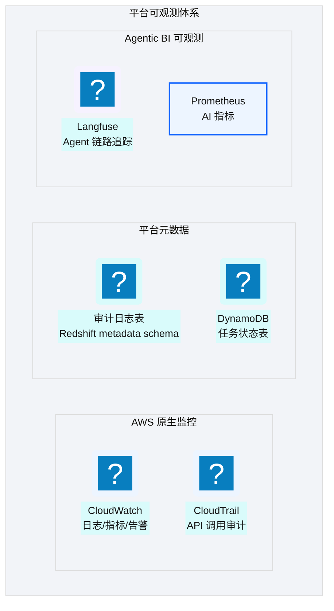
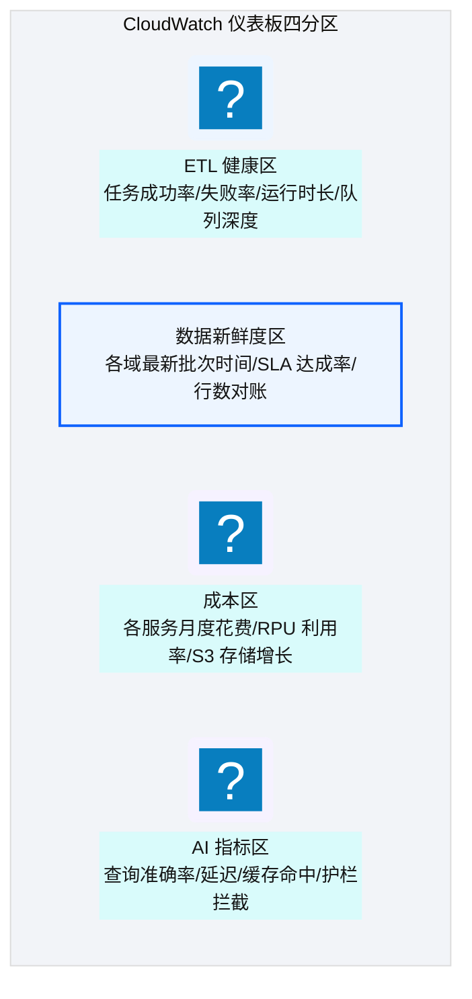
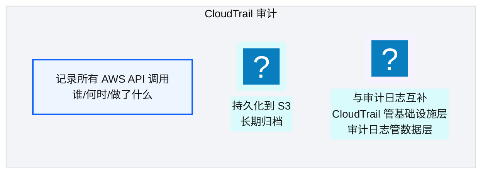
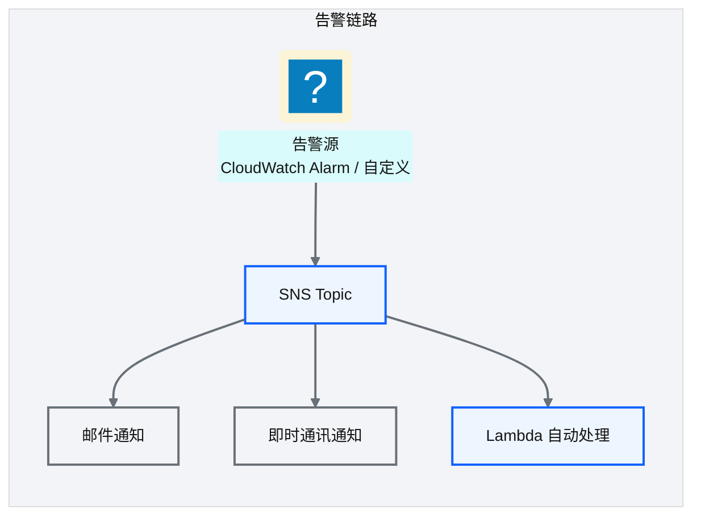
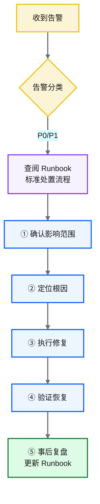
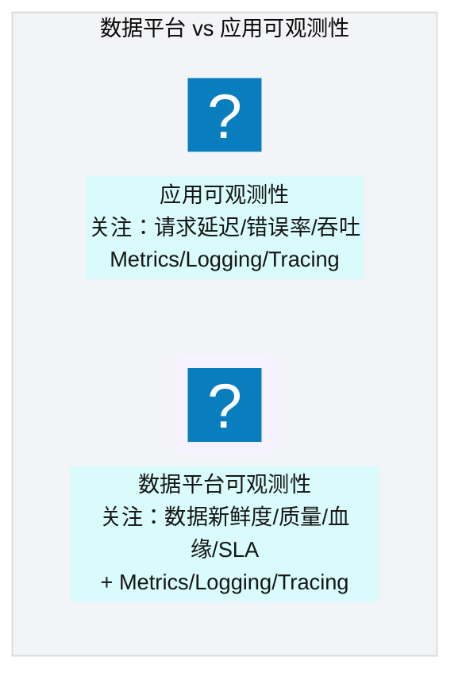

# Ch 51 日志、监控、审计与告警
!!! info "面包屑"
    [本书主页](./index.md) › [Part VIII 治理与复盘](./50-安全-合规与治理.md) › Ch 51

!!! abstract "项目第 3 年 · 成熟与治理期——监控审计"

---

## :material-school: 本章你将学到
- CloudWatch/CloudTrail 与审计日志持久化（含仪表板布局与结构化日志 schema）
- SNS 告警与运营 runbook（含告警疲劳治理）
- 数据平台可观测性 vs 应用可观测性的区别

!!! tip "引申：双联章说明"
    本章与 [Ch 52 排障与可观测性实战](./52-排障与可观测性实战.md) 合构"监控排障双联章"——本章讲"怎么看见"（监控/告警/审计），Ch 52 讲"怎么排查"（决策树/walkthrough/预防）。建议两章连读。

---

## 51.1 CloudWatch/CloudTrail 与审计日志持久化

<p class="caption" markdown="span">**图 51-1** CloudWatch/CloudTrail 与审计日志持久化</p>

### CloudWatch

| 功能 | 用途 |
|---|---|
| **Logs** | Glue/Lambda/Step Functions 日志 |
| **Metrics** | 资源指标（CPU/内存/吞吐）+ 自定义指标 |
| **Alarms** | 阈值告警（如 Glue 失败率 > 5%） |
| **Dashboards** | 可视化面板 |
<p class="caption" markdown="span">**表 51-1** CloudWatch</p>


### CloudWatch 仪表板布局设计

数据平台的仪表板不能照搬应用监控那套。应用监控盯着"请求延迟/错误率"，数据平台要盯的是"数据对不对、及时不及时、完整不完整"。平台仪表板切成四个区，每个区盯一类健康度：


<p class="caption" markdown="span">**图 51-2** CloudWatch 仪表板布局设计</p>

| 仪表板分区 | 核心指标 | 告警阈值 |
|---|---|---|
| **ETL 健康** | 任务成功率、失败率、运行时长 P95、就绪队列深度 | 失败率 >5% / P95 超基线 2× |
| **数据新鲜度** | 各域最新批次时间、SLA 达成率、行数对账偏差 | 新鲜度 >24h / 对账偏差 >0.1% |
| **成本** | 各服务月度花费、RPU 利用率、S3 存储增长 | 月花费超预算 10% |
| **AI 指标** | 查询准确率、P50/P95 延迟、缓存命中率、护栏拦截率 | 准确率 <85% / P95 >30s |
<p class="caption" markdown="span">**表 51-2** CloudWatch 仪表板布局设计</p>


### 结构化日志 schema 设计

数据平台的日志必须结构化。非结构化的纯文本日志排障时基本没法检索——你试过在大段文本里 grep 关键字段就知道多痛苦。平台所有组件（Glue/Lambda/Step Functions）统一用 structlog 输出 JSON 日志，字段约定如下：

```python
# 示意：structlog 结构化日志 schema（所有组件统一字段）
import structlog
logger = structlog.get_logger()

# 核心意图：统一字段让 CloudWatch Logs Insights 可跨组件检索
logger.info("etl_completed",
    batch_id="20260618-001500",          # 批次标识，贯穿全链路（[Ch 20](./20-元数据管理与数据血缘.md)）
    component="glue",                    # 组件：glue/lambda/sf/redshift
    domain="ma",                         # 业务域
    entity="doctor_master",              # 实体
    duration_sec=142,                    # 耗时
    row_count=12450,                     # 行数
    status="success",                    # success/failed/retry
    severity="INFO")                     # INFO/WARN/ERROR
```

| 字段 | 类型 | 说明 |
|---|---|---|
| `batch_id` | string | 批次标识，贯穿 Landing→Raw→Redshift 全链路 |
| `component` | string | 组件类型（glue/lambda/sf/redshift） |
| `domain` | string | 业务域（ma/sci/retail/...） |
| `entity` | string | 数据实体（doctor_master/fact_prescription/...） |
| `duration_sec` | int | 耗时（秒） |
| `row_count` | int | 处理行数 |
| `status` | string | success/failed/retry |
| `severity` | string | INFO/WARN/ERROR |
<p class="caption" markdown="span">**表 51-3** 核心意图：统一字段让 CloudWatch Logs Insights 可跨组件检索</p>


排障时用 CloudWatch Logs Insights 按字段检索——比如查"ma 域最近失败的批次"：`filter domain="ma" and status="failed" | sort @timestamp desc`。没有结构化字段，这种查询根本没戏。

### CloudTrail


<p class="caption" markdown="span">**图 51-3** CloudTrail</p>

!!! tip "引申"
    CloudTrail 和平台审计日志互补——CloudTrail 记录"谁调用了什么 AWS API"（如谁执行了 :octicons-terminal-16: `terraform apply`），审计日志记录"哪个 ETL 任务加载了什么数据"。前者是基础设施层审计，后者是数据层审计。两者结合提供全栈可审计性。

---

## 51.2 SNS 告警与运营 runbook
### 告警体系


<p class="caption" markdown="span">**图 51-4** 告警体系</p>

| 告警级别 | 触发条件 | 通知方式 | 响应时间 |
|---|---|---|---|
| **P0 紧急** | 生产数据丢失/平台不可用 | 电话+短信+邮件 | 15 分钟 |
| **P1 高** | 关键 ETL 失败/数据质量告警 | 即时通讯+邮件 | 1 小时 |
| **P2 中** | 非关键任务失败/性能告警 | 邮件 | 4 小时 |
| **P3 低** | 资源使用率告警 | 日报汇总 | 次日 |
<p class="caption" markdown="span">**表 51-4** 告警体系</p>


### 运营 Runbook


<p class="caption" markdown="span">**图 51-5** 运营 Runbook</p>

| Runbook 要素 | 说明 |
|---|---|
| **影响范围** | 告警影响哪些业务/数据 |
| **根因排查** | 按决策树定位问题 |
| **修复步骤** | 标准化的修复操作 |
| **验证方法** | 如何确认已恢复 |
| **事后复盘** | 记录原因+改进措施 |
<p class="caption" markdown="span">**表 51-5** 运营 Runbook</p>


!!! warning "Trade-off"
    告警太少会漏掉问题，太多会"告警疲劳"（忽略重要告警）。好的告警体系遵循"可行动性"原则——每个告警都应该有明确的处置动作。如果一个告警"看到了也不知道怎么办"，它不应该存在——要么改为日报，要么补充 Runbook。

### 告警疲劳治理

告警疲劳是运维圈的隐形杀手。你想想，每天收 200 条告警，谁还分得出哪条是真正要命的？P0 很快就淹在噪音里。平台用了三招对付告警疲劳：

| 治理手段 | 做法 | 效果 |
|---|---|---|
| **分级** | P0/P1/P2/P3 四级，P0 电话+短信，P3 仅日报汇总 | 高级别不被低级别淹没 |
| **去重** | 同一告警源 5 分钟内只通知一次 | 避免抖动产生告警风暴 |
| **聚合窗口** | 同类告警在 15 分钟窗口内聚合成一条 | "3 个 Glue Job 失败"而非 3 条独立告警 |
<p class="caption" markdown="span">**表 51-6** 告警疲劳治理</p>


```python
# 示意：告警去重与聚合
def should_notify(alert: dict, window=300) -> bool:
    # 核心意图：去重 + 聚合，避免告警风暴
    key = (alert["source"], alert["entity"])
    if key in recent_alerts and time.time() - recent_alerts[key] < window:
        return False                          # 5 分钟内同类告警不重复通知
    recent_alerts[key] = time.time()
    return True
```

### 数据平台特有的可观测场景

数据平台有一类可观测场景，做应用的人几乎遇不到：**ETL 成功但数据为空**。任务返回值是 success，但落地行数 0——可能是源系统当天没数据，也可能是过滤条件写错了，还可能是上游断流了。传统监控只看"任务失败了没"，这种"看似成功实则异常"的场景根本不会被抓到：

| 场景 | 传统监控 | 数据平台可观测 |
|---|---|---|
| ETL 任务失败 | ✅ 告警 | ✅ 告警 |
| ETL 任务成功但行数=0 | ❌ 不告警 | ✅ 告警（行数低于历史基线） |
| ETL 任务成功但行数骤降 50% | ❌ 不告警 | ✅ 告警（行数偏差超阈值） |
| 数据新鲜度 >24h | ❌ 不告警 | ✅ 告警（SLA 违约） |
<p class="caption" markdown="span">**表 51-7** 数据平台特有的可观测场景</p>


这就是 [Ch 53](./53-价值度量与案例复盘.md) 数据可观测性里提到的"数据新鲜度/质量"维度。行数对账（[Ch 17](./17-Landing到Raw到Redshift开发实战.md)）的告警不能只看"过没过"，还得看"行数是不是异常低"。平台的做法：每个实体的行数和 7 天滚动基线比，偏差超过 50% 就告警。

---

## 51.3 引申：数据平台可观测性 vs 应用可观测性

<p class="caption" markdown="span">**图 51-6** 引申：数据平台可观测性 vs 应用可观测性</p>

| 维度 | 应用可观测性 | 数据平台可观测性 |
|---|---|---|
| **核心指标** | 延迟/错误率/吞吐 | 数据新鲜度/质量通过率/SLA 达成率 |
| **关注点** | 请求是否成功 | 数据是否正确/及时/完整 |
| **血缘** | 通常无 | 必需（数据从哪来到哪去） |
| **质量** | 不涉及 | 核心维度（行数对账/约束校验） |
| **工具** | APM（如 Datadog） | 数据可观测平台（如 Monte Carlo） |
<p class="caption" markdown="span">**表 51-8** 引申：数据平台可观测性 vs 应用可观测性</p>


!!! tip "引申"
    数据平台可观测性是近年新概念——传统 APM 工具关注"系统是否正常"，但数据平台还需要"数据是否正常"。一个 ETL 可能"成功执行"但"数据为空"——传统监控不会告警，但数据可观测性工具会（行数异常下降）。如果今天重建，建议引入数据可观测平台（如 Monte Carlo/Bigeye）作为传统监控的补充。

---

## :material-check-circle: 本章小结
- 可观测体系：CloudWatch（日志/指标/告警）+ CloudTrail（API 审计）+ 平台审计日志（数据层）+ Langfuse/:simple-prometheus: Prometheus（AI 层）
- CloudWatch 仪表板四分区：ETL 健康 / 数据新鲜度 / 成本 / AI 指标——数据平台关注"数据是否正确/及时/完整"而非仅"请求延迟"
- 结构化日志 schema（structlog JSON，统一 batch_id/component/domain/entity 等字段）让 CloudWatch Logs Insights 可跨组件检索
- CloudTrail 管基础设施层审计，平台审计日志管数据层审计——互补提供全栈可审计性
- SNS 告警四级（P0-P3）+ 运营 Runbook（影响→根因→修复→验证→复盘）——可行动性原则；告警疲劳治理（分级+去重+聚合窗口）
- 数据平台特有可观测：ETL 成功但数据为空/行数骤降——行数与 7 天滚动基线对比告警
- 数据平台可观测性 ≠ 应用可观测性：还需关注数据新鲜度/质量/血缘/SLA——数据可观测平台是演进方向

---

!!! quote "下一章"
    [Ch 52 排障与可观测性实战](./52-排障与可观测性实战.md) —— 监控体系讲完了，接下来看实战中怎么排障。

