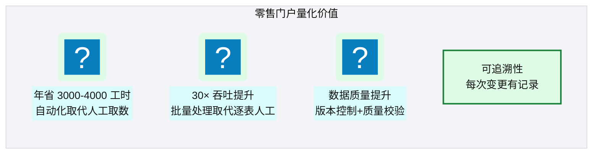
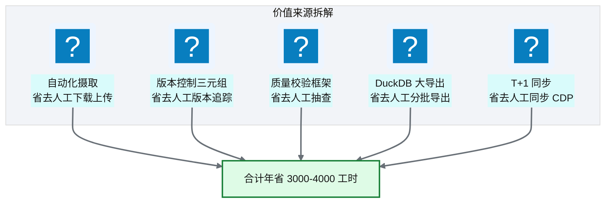
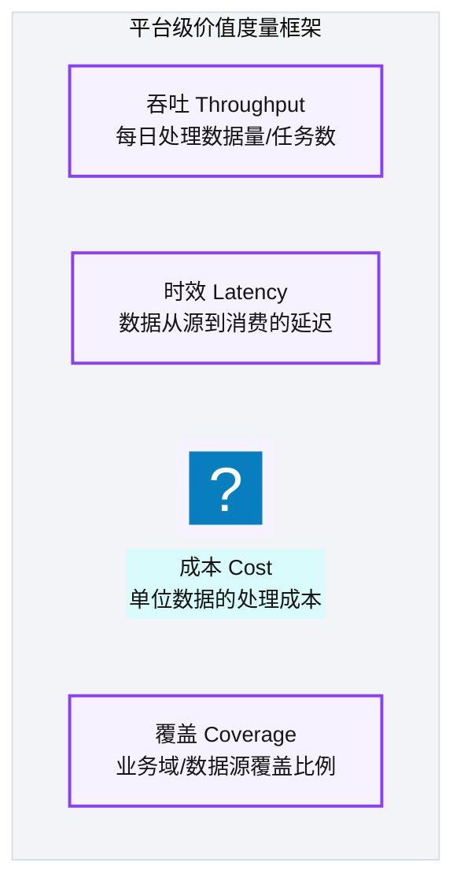
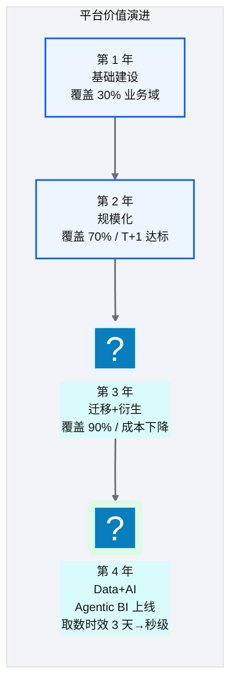
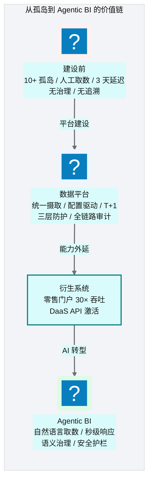
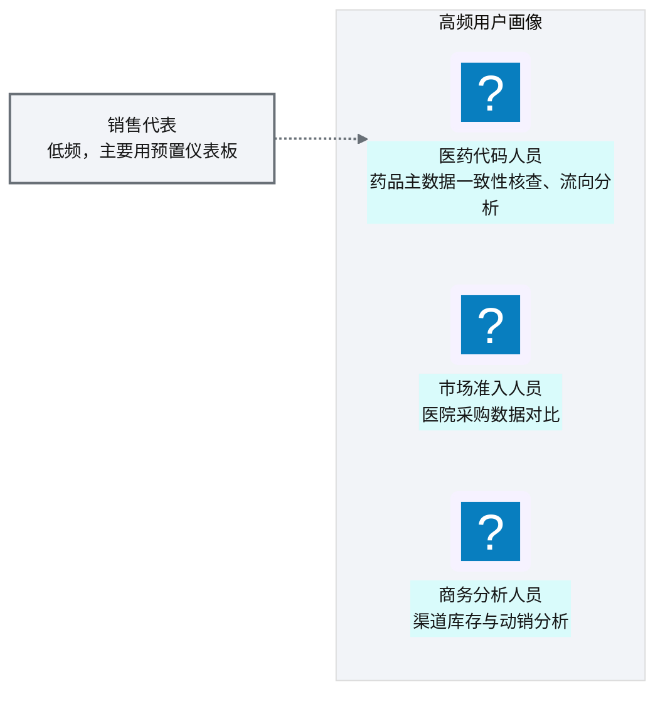
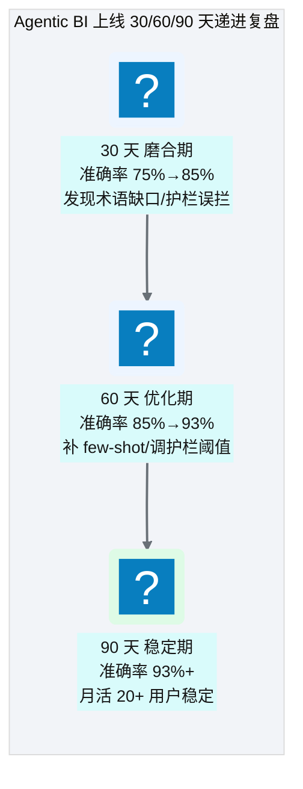

# Ch 53 价值度量与案例复盘
!!! info "面包屑"
    [本书主页](./index.md) › [Part VIII 治理与复盘](./52-排障与可观测性实战.md) › Ch 53

!!! abstract "项目第 3-4 年 · 成熟与治理期——价值度量"

---

## :material-school: 本章你将学到
- 零售门户量化价值：年省 3000-4000 工时、30× 吞吐
- 平台级价值度量框架：吞吐/时效/成本/覆盖（含四年实测数据）
- Agentic BI 量化价值：取数时效/数据覆盖/月活/查询量提升 + 30/60/90 天递进复盘曲线
- 案例综合：从孤岛到 Agentic BI 的端到端价值链

---

## 53.1 零售门户量化价值
零售数据源门户（[Ch 36-38](./36-低代码与云混合-零售数据源门户.md)）上线后，带来了显著的量化价值：

**图 53-1** 零售门户量化价值

| 价值维度 | 量化 | 对比（建门户前） |
|---|---|---|
| **工时节省** | 年省 3000-4000 工时 | 4 人全职手动管理 |
| **吞吐提升** | 30× | 逐表人工 :fontawesome-solid-file-excel: Excel 比对 |
| **数据质量** | 质量校验通过率 99%+ | 靠人工抽查，错误频发 |
| **可追溯** | 每次变更有版本记录 | 改了不知道、无法回溯 |

**表 53-1** 零售门户量化价值

### 价值来源拆解

**图 53-2** 价值来源拆解

---

## 53.2 平台级价值度量框架
### 四维价值度量

**图 53-3** 四维价值度量

| 维度 | 指标 | 度量方法 | 目标 |
|---|---|---|---|
| **吞吐** | 日均数据量/任务数 | 审计日志统计 | 持续增长 |
| **时效** | 端到端延迟（源→消费） | 批次时间戳差值 | T+1（<24h） |
| **成本** | 单位 TB 处理成本 | AWS 成本/数据量 | 持续下降 |
| **覆盖** | 业务域/数据源覆盖比 | 已接入/总数 | >90% |

**表 53-2** 四维价值度量

上面的框架只有目标，没有跑出来的数。补上四年实际量级——**数据按比例缩放自真实生产值，规模量级保留，具体数值脱敏**（做法：以真实规模为锚，用固定缩放因子调绝对值，趋势和比例关系不动）。让"持续增长/下降"有据可依：

| 维度 | 指标 | 第 1 年 | 第 2 年 | 第 3 年 | 第 4 年 |
|---|---|---|---|---|---|
| **吞吐** | 日均数据量 | ~10 GB | ~30 GB | ~50 GB | ~50-80 GB |
| **吞吐** | 日均任务数 | ~50 | ~150 | ~300 | ~400 |
| **时效** | 端到端延迟 P50 | T+1（22h） | T+1（18h） | T+1（15h） | T+1 + 秒级 AI |
| **成本** | 单位 TB 处理成本（¥/月） | 基线 | -15% | -25% | -30% |
| **覆盖** | 业务域覆盖比 | 30% | 70% | 90% | 90%+ |

**表 53-3** 四维价值度量

### 价值度量的时间轴

**图 53-4** 价值度量的时间轴

---

## 53.3 案例综合：从孤岛到 Agentic BI 的端到端价值链

**图 53-5** 案例综合：从孤岛到 Agentic BI 的端到端价值链

### 端到端价值对比

| 维度 | 建设前 | 数据平台 | +衍生系统 | +Agentic BI |
|---|---|---|---|---|
| **取数时效** | 3 天 | T+1（报表） | T+1（门户） | **秒级（AI）** |
| **数据覆盖** | 30%（可见） | 90%+ | 90%+ | 90%+（AI 可查） |
| **取数方式** | 提需求→IT 写 SQL | BI 工具自助 | 门户自助 | **自然语言** |
| **口径一致** | 3 个数值 | 统一口径 | 统一口径 | **术语治理** |
| **数据治理** | 无 | RLS/CLS/脱敏 | +版本控制 | **+AI 护栏** |
| **可追溯** | 无 | 审计日志 | +版本三元组 | **+Agent 链路** |

**表 53-4** 端到端价值对比

### Agentic BI 量化价值

!!! note ""
    以下价值数据**按比例缩放自真实生产值**，规模量级保留，具体数值脱敏（做法同 Ch1 平台经济学和本章四维度量表）。

端到端对比表里 Agentic BI 那一列还是定性的"秒级/自然语言"。补上量化数据——Agentic BI 上线后，取数从"提需求等 3 天"变成了"问一句秒级出数"。用户分群和采纳曲线如下：

| 维度 | 旧模式（SQL Server + 手工） | CDP + Agentic BI 模式 | 提升 |
|---|---|---|---|
| **取数时效** | 业务提需求→IT 排期→3-5 天 | 自助查询秒级 / Agentic BI 分钟级 | **99%+** |
| **数据覆盖** | ~4000 张 SQL Server 表 | 20000+ 张表（含外部 SaaS/API/邮件） | **5×** |
| **月活用户** | IT 部门 5-8 人 | 100+ 注册用户，20+ 高频业务用户 | **15×** |
| **月度即席查询量** | <50 次（手工 SQL） | ~10,000 次（自助 + Agentic BI） | **200×** |
| **报表自动化覆盖率** | ~20%（手工 Excel） | ~85%（调度自动刷新） | **4×** |
| **数据质量问题发现周期** | 月末对账（滞后 30 天） | ETL 质量门禁实时拦截 | **实时化** |
| **年化人力节约** | — | 约 3,000-4,000 工时 | — |

**表 53-5** Agentic BI 量化价值

**图 53-6** Agentic BI 量化价值

Agentic BI 不是上线就完美。它走了一段"磨合、优化、稳定"的递进过程，准确率和用户采纳是同步爬升的：

**图 53-7** Agentic BI 量化价值

| 阶段 | 准确率 | 重点动作 | 用户采纳 |
|---|---|---|---|
| **30 天 磨合期** | 75%→85% | 发现术语缺口、护栏误拦、Steiner 树遗漏 join | 少数种子用户试用 |
| **60 天 优化期** | 85%→93% | 补 few-shot 示例、调护栏阈值、修语义资产 | 20+ 高频用户形成习惯 |
| **90 天 稳定期** | 93%+ | 常见问题覆盖稳定、缓存命中提升 | 月活稳定，季度满意度 4.2/5 |

**表 53-6** Agentic BI 量化价值

!!! tip "引申"
    这条 30/60/90 曲线是 Agentic BI 落地的典型形态——不要期望上线即 93%。磨合期的 75% 是正常的，关键是建立"用户反馈→语义资产修正→准确率提升"的闭环。每一条用户纠正都进入 Correction Memory（[Ch 45](./45-记忆系统与工具使用.md)），转化为下次的 few-shot——系统越用越准。这也是为什么 Agentic BI 的价值不是"上线那一刻"，而是"上线后持续打磨的 90 天"。

!!! tip "引申"
    这条价值链的核心洞察是"每一层建设都为下一层铺路"——没有数据平台的统一摄取和治理，衍生系统没有数据可用；没有衍生系统的数据激活，AI 没有语义化的数据可消费。Agentic BI 不是"空中楼阁"，它站在数据平台和衍生系统的肩膀上。这也是为什么全书按"数据→智能"的弧线组织——智能的基础是数据。

---

## :material-check-circle: 本章小结
- 零售门户量化价值：年省 3000-4000 工时、30× 吞吐——来自自动化摄取/版本控制/质量校验/:simple-duckdb: DuckDB/T+1 同步
- 平台级价值四维度量：吞吐（数据量/任务数）/ 时效（端到端延迟）/ 成本（单位 TB 成本）/ 覆盖（业务域比例），含四年实测趋势
- Agentic BI 量化价值：取数时效 3 天→秒级（99%+）、数据覆盖 5×、月活 15×、月度即席查询 200×；30/60/90 天递进复盘（75%→85%→93%+），价值在持续打磨而非上线那一刻
- 端到端价值链：孤岛→数据平台→衍生系统→Agentic BI——取数时效从 3 天→秒级，每层为下层铺路
- 核心洞察：Agentic BI 不是空中楼阁，它站在数据平台和衍生系统的肩膀上——智能的基础是数据

---

!!! quote "下一章"
    [Ch 54 架构师的复盘：取舍、遗憾与主流对比](./54-架构师的复盘-取舍遗憾与主流对比.md) —— 全书最后一章：架构师的终极复盘——做对了什么、遗憾什么、如果重来会怎样。

