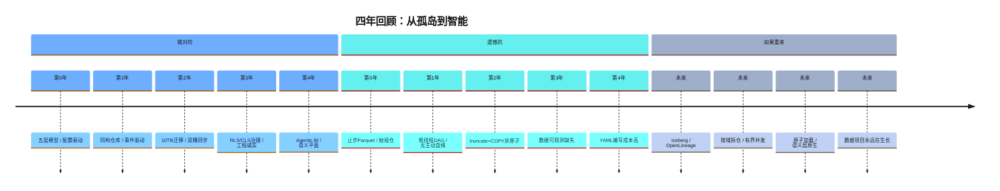
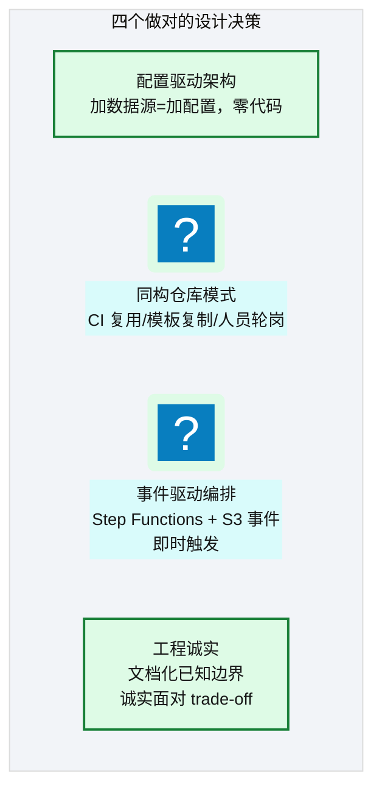
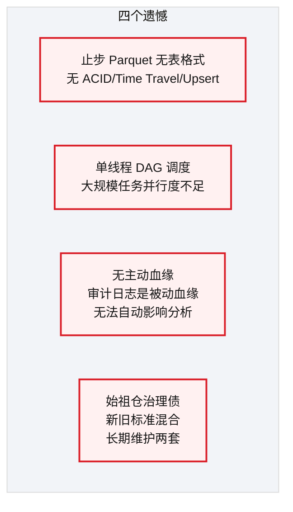
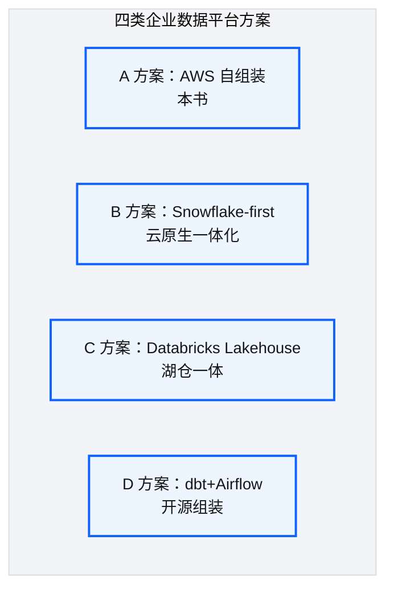
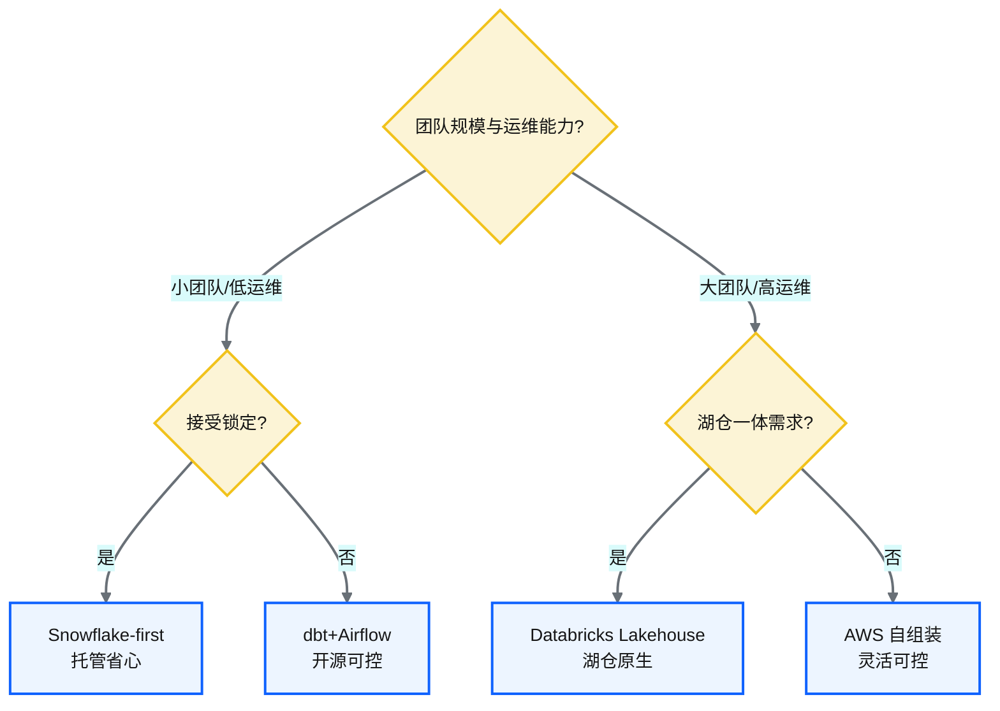
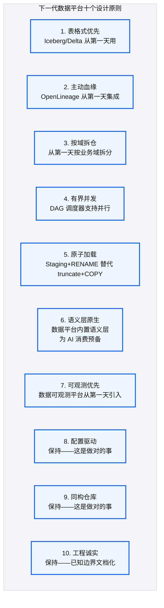
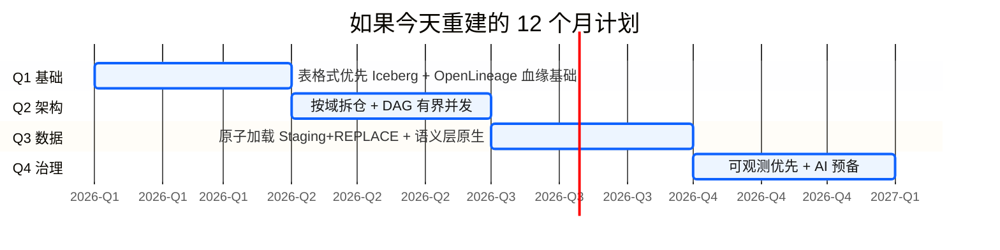

# Ch 54 架构师的复盘：取舍、遗憾与主流对比
!!! info "面包屑"
    [本书主页](./index.md) › [Part VIII 治理与复盘](./53-价值度量与案例复盘.md) › Ch 54

!!! abstract "项目第 4 年末 · 持续演进——回头看，向前走"

---

## :material-school: 本章你将学到
- 当时做对的事：配置驱动/同构仓/事件驱动/工程诚实
- 当时的遗憾：止步 :simple-apacheparquet: Parquet/单线程调度/无主动血缘/始祖仓治理债
- 与主流方案的系统性对比
- 如果重来：下一代数据平台的十个设计原则

---

这是全书的最后一章，也是我心里最拧巴的一章。

拧巴不是因为没话写——是因为"诚实"这两个字，真要下笔是需要勇气的。写"做对了什么"不难，谁不喜欢讲自己的高光时刻。但写"做错了什么""遗憾了什么"就完全是另一回事了，这等于承认：如果我当初想得更清楚、能力更强，有些坑就不会踩进去。

但我觉得，一本书要只讲成功不讲失败，它没有真正的价值。读者从成功里学到的东西，远不如从失败里学到的多。

所以这一章，我把四年里"做对了"和"遗憾的"都放上来，然后回答那一个绕不开的问题：**如果今天重来，我会怎么建这个平台？**

在回答这个问题之前，让我们先沿着项目时间线回顾一下这四年：

**图 54-1** :material-school: 本章你将学到

---

## 54.1 当时做对的事

**图 54-2** 当时做对的事

| 做对的事 | 价值 | 为什么对 |
|---|---|---|
| **配置驱动** | 新增数据源从"改代码"变为"加配置" | 开闭原则在数据工程的落地 |
| **同构仓库** | 一套 CI 服务所有业务域 | 规模化时的可维护性 |
| **事件驱动** | 数据到达即触发，无需轮询 | 时效性 + Serverless 的天然匹配 |
| **工程诚实** | 已知边界文档化，使用者知道避坑 | 信任建立 + 排障加速 |

**表 54-1** 当时做对的事

---

## 54.2 当时的遗憾

**图 54-3** 当时的遗憾

| 遗憾 | 当时约束 | 如果重来 |
|---|---|---|
| **止步 Parquet** | :material-database-sync: Iceberg/Delta 早期，China 支持有限 | 直接用 Iceberg，获得 ACID/Time Travel/Upsert |
| **单线程 DAG** | 最简单可靠 | 有界并发（max_workers），平衡速度与安全 |
| **无主动血缘** | 审计日志"够用" | 从第一天集成 OpenLineage，事后补血缘难十倍 |
| **始祖仓治理债** | 快速上线，全部放一个仓 | 从第一天按业务域拆仓，哪怕初期只有 2-3 个任务 |

**表 54-2** 当时的遗憾

这四个遗憾不光是"当时没做"——每个背后都有实打实的后续成本。把遗憾量化了，后来者才能掂量清楚"这些选择为什么值得在第一天就做对"：

| 遗憾 | 后续补救成本 | 说明 |
|---|---|---|
| **止步 Parquet** | ~6 人月 | 后期补 Upsert/Time Travel 需迁移到 Iceberg，改 ETL 逻辑 + 全量重写历史分区 |
| **单线程 DAG** | 大表迁移多耗 ~30% 时间 | 跨账号同步场景，单线程串行执行，有界并发可省近三分之一耗时 |
| **无主动血缘** | ~2 人周/季度 | DSR 响应、排障、影响分析都需人工拼血缘，事后补血缘比一开始收集难十倍 |
| **始祖仓治理债** | ~1 人月/季度 | 新旧两套标准并存，每次变更都要兼容旧仓，长期维护负担累积 |

**表 54-3** 当时的遗憾

!!! tip "引申"
    把这些遗憾搬到秤上一称，结论很清楚：四个"当时省的力气"，后续付出的成本远远超过了"第一天就做对"的成本。止步 Parquet 省下初期大概 1 人月的 Iceberg 适配工作量，后头换来 6 人月的迁移改造——典型的小账精算、大账糊涂。这也是"工程诚实"的价值所在：量化遗憾不是为了自虐，是让后来人看清哪些所谓"捷径"其实走不通。

!!! tip "引申"
    这些遗憾有一个共同的味道：短期省力，长期还债。技术债跟金融债其实一个道理——借的时候舒服（快速上线），还的时候肉疼（长期维护两套标准、事后补血缘、单线程瓶颈）。架构师该做的，是在"上市速度"和"技术债"之间做有意识的选择，而不是稀里糊涂地滚雪球。

---

## 54.3 与主流方案的系统性对比

**图 54-4** 与主流方案的系统性对比

| 维度 | A: AWS 自组装 | B: Snowflake-first | C: :simple-databricks: Databricks Lakehouse | D: dbt+Airflow |
|---|---|---|---|---|
| **数据仓库** | Redshift | :simple-snowflake: Snowflake | Databricks SQL | 任意（PG/BigQuery/Snowflake） |
| **数据湖** | S3+Parquet | 内置 | S3+Delta/Iceberg | S3+任意 |
| **ETL** | Glue | Snowpipe/Task | Databricks Spark | dbt + 任意执行器 |
| **编排** | Step Functions | Snowflake Task/Airflow | Databricks Workflows | Airflow |
| **IaC** | :simple-terraform: Terraform | Terraform | Terraform | Terraform |
| **运维负担** | 中 | 低 | 中低 | 高 |
| **锁定程度** | 中 | 高 | 中高 | 低 |
| **中国可用(现在)** | ✅ | ✅ | ✅ | ✅ |
| **适合场景** | AWS 深度用户 | 追求托管 | 湖仓一体需求 | 忌讳锁定 |

**表 54-4** 与主流方案的系统性对比

### 选型建议

**图 54-5** 选型建议

!!! warning "Trade-off"
    没有银弹。四年前选 A（AWS 自组装），是因为 Snowflake/Databricks 当时在大陆都没有可用商用节点。到 2026 年再看：Snowflake 已于 2024-09 在 AWS 宁夏区（cn-northwest-1）由神州数码 DCC 运营 GA——想要托管体验可以认真评估 B，但要吃下 DCC 开户、功能子集、跟全球区账户不互通这些约束。Databricks 在 AWS China 仍没有商用 region，只有阿里云。湖仓一体还可以看 C（Databricks on 阿里云），或者继续 A 再加 Iceberg。选什么都行，别稀里糊涂继承四年前的默认。

---

## 54.4 如果重来：下一代数据平台的十个设计原则

**图 54-6** 如果重来：下一代数据平台的十个设计原则

| 原则 | 来源 | 说明 |
|---|---|---|
| 1. 表格式优先 | 遗憾①修正 | Iceberg/Delta 获得 ACID/Time Travel |
| 2. 主动血缘 | 遗憾③修正 | OpenLineage 从第一天集成 |
| 3. 按域拆仓 | 遗憾④修正 | 不再有始祖仓治理债 |
| 4. 有界并发 | 遗憾②修正 | DAG 支持并行 |
| 5. 原子加载 | [Ch 34](./34-设计边界与已知取舍的诚实复盘.md) 边界①修正 | Staging+REPLACE |
| 6. 语义层原生 | AI 转型经验 | 数据平台为 AI 预备语义层 |
| 7. 可观测优先 | [Ch 51](./51-日志-监控-审计与告警.md) 引申 | 数据可观测从第一天引入 |
| 8. 配置驱动 | 做对的事 | 保持 |
| 9. 同构仓库 | 做对的事 | 保持 |
| 10. 工程诚实 | 做对的事 | 保持 |

**表 54-5** 如果重来：下一代数据平台的十个设计原则

!!! tip "引申"
    这十个原则中，7 个是"修正遗憾"，3 个是"保持做对的"。这反映了架构演进的规律——**好的设计需要保持，不好的设计需要修正，而分辨两者的能力，就是架构师的核心价值**。这本书的全部内容，归根结底就是在传递这种"分辨与取舍"的能力。

### 如果今天重建：12 个月落地计划

十个原则不是空谈——如果今天从零重建，下面是把这些原则落地的 12 个月计划，每季度聚焦一个主题，前后季度有依赖关系：

**图 54-7** 如果今天重建：12 个月落地计划

| 季度 | 主题 | 关键交付 | 对应原则 |
|---|---|---|---|
| **Q1 基础** | 表格式 + 血统 | Iceberg 表格式落地 + OpenLineage 集成（哪怕只记 INPUT/OUTPUT） | 原则 1（Iceberg）、2（主动血缘） |
| **Q2 架构** | 拆仓 + 并发 | 按业务域拆仓（3-5 个）+ DAG 有界并发（max_workers=4） | 原则 3（按域拆仓）、4（有界并发） |
| **Q3 数据** | 原子加载 + 语义层 | Staging+REPLACE 原子加载 + 语义资产 YAML 基础 | 原则 5（原子加载）、6（语义层原生） |
| **Q4 治理** | 可观测 + AI 预备 | 数据可观测（新鲜度/质量/基线告警）+ 语义层接入 AI | 原则 7（可观测优先） |

**表 54-6** 如果今天重建：12 个月落地计划

!!! warning "Trade-off"
    12 个月计划的前提是"有足够团队和预算从零重建"。现实中的迁移往往是"边跑边改"——旧平台不能停，新能力逐步注入。这种"共存迁移"比"推倒重建"慢但风险低。本书平台的实际演进更接近"共存迁移"——四年里逐步补了血缘、拆了仓、加了语义层，而非一次推倒重来。12 个月计划是"理想路径"，现实是"在约束下逼近理想"。

---

## :material-check-circle: 本章小结
- 做对的四件事：配置驱动 / 同构仓库 / 事件驱动 / 工程诚实——保持
- 遗憾的四件事：止步 Parquet / 单线程 DAG / 无主动血缘 / 始祖仓治理债——修正
- 四类主流方案对比：AWS 自组装 / Snowflake-first / Databricks Lakehouse / dbt+Airflow——无最佳只有最适合
- 十个设计原则：7 个修正遗憾 + 3 个保持做对——架构师的核心价值是"分辨与取舍"

---

!!! quote "附录"
    [附录 A 术语表与学习地图](./appendix-A-术语表与学习地图.md) —— 全书正文到此结束，附录提供术语表、索引、技术栈速查与参考文献。

