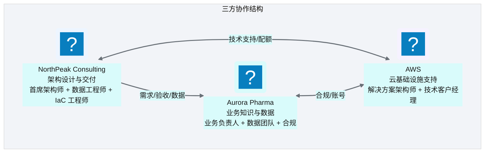
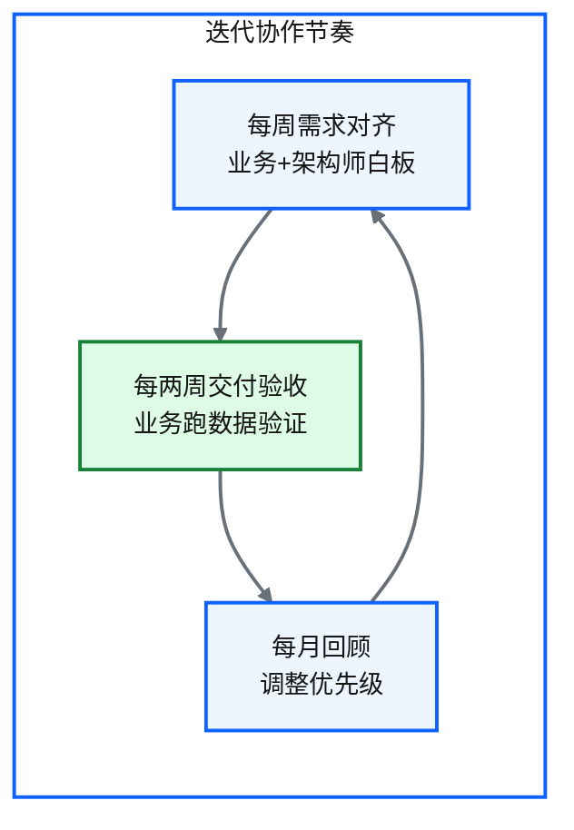

# Ch 55 致谢与团队
!!! info "面包屑"
    [本书主页](./index.md) › [Part VIII 治理与复盘](./50-安全-合规与治理.md) › Ch 55

!!! abstract "项目全程 · 四年沉淀——致敬每一位同行者"

---

## :material-school: 本章你将学到
- 这座平台背后是怎样一支团队
- 写这本书的初衷与感谢

---

一座企业级数据平台不可能靠一个人建起来，这本书也是。合上书之前，我想把光从架构身上移开，照到"人"身上——因为少了这些人的协作，再好的设计也只是图纸。

## 55.1 团队结构
Aurora CDP 项目是一支跨组织、跨职能的协作团队。NorthPeak Consulting 负责架构设计与交付，Aurora Pharma 提供业务知识、数据与需求，AWS 提供云基础设施支持。三方各司其职，缺一不可：

**图 55-1** 团队结构

| 角色 | 职责 | 关键贡献 |
|---|---|---|
| **首席解决方案架构师**（我） | 整体架构、技术选型、关键决策 | 五层模型、配置驱动、Agentic BI 引入 |
| **数据工程师** | 连接器、ETL、三层开发 | [Ch 13-20](./13-连接器框架总览.md) 的工程实现 |
| **IaC 工程师** | Terraform、CI/CD、模块库 | [Ch 21-30](./21-Terraform架构总览.md) 的基础设施治理 |
| **业务负责人**（Aurora） | 业务需求、口径定义、验收 | 把"业务语言"翻译成"技术需求" |
| **数据团队**（Aurora） | 数据权限、源系统协调、迁移配合 | SQL Server 迁移（[Ch 31](./31-遗留系统迁移-SQLServer到Redshift.md)）的关键协助 |
| **合规**（Aurora） | GxP/PIPL 合规约束 | 脱敏决策表（[Ch 18](./18-数据脱敏与隐私治理.md)）的业务依据 |

**表 55-1** 团队结构

## 55.2 协作模式
这个项目最值得讲的其实不是技术本身，是协作方式——**咨询式交付**（[Ch 2](./02-从需求到蓝图：一个数据平台的诞生.md)）。NorthPeak 不是那种"接了需求回去干"的外包，而是"驻场共建"的伙伴：我作为架构师常驻在 Aurora，跟业务团队在同一个白板上画、一起走数据、一起抠口径。这种模式让每一个架构决策都贴着业务的真实痛点在跑，不是关起门来画完再丢过去的。

**图 55-2** 协作模式

这种节奏带来的意外收获是"知识转移"。四年走下来，Aurora 的数据团队从"离了 NorthPeak 转不了"变成了"能自己上手维护和扩展平台"。这才是咨询交付真正该达到的终点：**把自己交付到不需要自己**。

## 55.3 感谢
我要感谢的人很多，无法一一列举，但有几类必须提名：

- **Aurora Pharma 的业务与技术团队**：你们提供的真实业务场景、严格合规要求和耐心验收，是这本书所有"诚实复盘"的来源。没有你们的"较真"，很多设计缺陷不会被暴露。
- **NorthPeak 的同事**：四年并肩作战的数据工程师和 IaC 工程师，你们把架构图纸变成了可运行的平台。书里的每一个"已实现"背后都有你们的代码。
- **AWS 团队**：在 China 区域服务子集有限、特性滞后的约束下，你们的技术支持和配额协调让很多设计得以落地。
- **我之前两段经历的同事**：专利数据的文本处理与图建模、企业征信的多源融合与实体解析——书里反复出现的"跨行业经验迁移"（[前言](./00-preface.md)）都源于你们给我的训练。
- **本书的读者**：你们愿意花时间读一本不教具体工具用法的"架构手记"，本身就是对"工程思想"价值的认可。你们的反馈会让这本书的下一版更好。

## 55.4 学习资源
如果你想继续深入，除了本书引用的 [附录 D 参考文献](./appendix-D-参考文献与延伸阅读.md)，我再推荐三类资源：

| 类别 | 推荐 | 为什么 |
|---|---|---|
| **数据工程基础** | 《Fundamentals of Data Engineering》《数据仓库工具箱》 | 补齐本书假设的前置知识 |
| **架构思想** | 《Building Evolutionary Architectures》《Team Topologies》 | 理解"可演进架构"与"组织与架构的镜像" |
| **Agentic BI 前沿** | ReAct / Plan-and-Execute / Reflexion 论文 + LangGraph 文档 | 本书 Part VII 的理论源头与工程框架 |

**表 55-2** 学习资源

---

## :material-check-circle: 本章小结
- 平台是跨组织协作的产物：NorthPeak 架构交付 + Aurora 业务知识与数据 + AWS 基础设施支持，三方缺一不可
- 协作模式是"咨询式驻场共建"——架构师常驻、和业务一起开白板走数据，终极目标是知识转移、把自己交付到不需要自己
- 感谢 Aurora/NorthPeak/AWS/前序经历同事/读者——这本书的所有"诚实复盘"都来自真实协作中的较真
- 继续深入推荐数据工程基础/架构思想/Agentic BI 前沿三类资源

---

!!! quote "结语"
    这本书写到这里就结束了。但数据平台的故事不会结束——它在持续生长。如果你正在建自己的数据平台，希望书里的"为什么这么设计"和"如果重来"能帮你少走一些弯路。期待在数据到智能的路上，与你同行。
