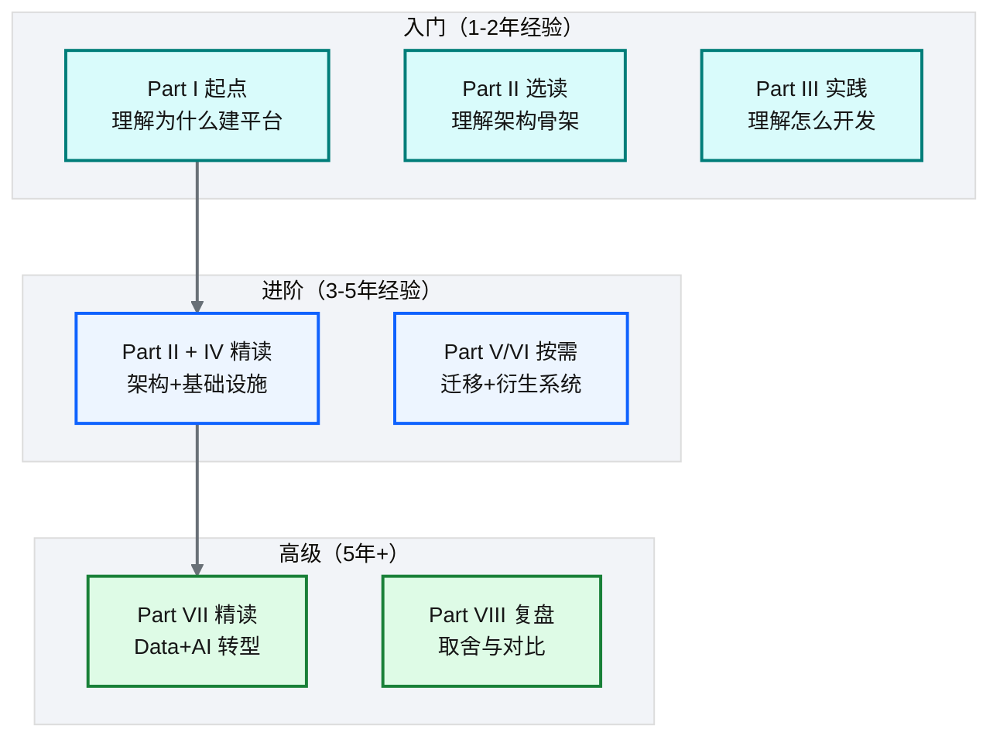

# 附录 A 术语表与学习地图

!!! info "面包屑"
    [本书主页](./index.md) › 附录 A

---

## 术语表

### 数据平台核心术语

| 术语 | 英文 | 定义 | 首次出现 |
|---|---|---|---|
| CDP | Customer/Corporate Data Platform | 企业数据平台，覆盖全业务域的数据摄取/加工/治理/激活 | Ch 1 |
| 数据湖 | Data Lake | 分层对象存储（Landing/Raw/Enriched），存储原始到加工数据 | Ch 7 |
| Medallion 架构 | Medallion Architecture | 铜(Landing)/银(Raw)/金(Enriched)三层数据湖分层 | Ch 7 |
| 数据仓库 | Data Warehouse (DWH) | 列式分析数据库（Redshift），结构化查询服务 | Ch 8 |
| 配置驱动 | Config-Driven | 任务行为由配置声明决定，代码为通用引擎 | Ch 11 |
| 批次标识 | Batch ID / Load ID | 每次数据加载的唯一标识，贯穿全链路用于追溯 | Ch 11 |
| 五层模型 | Five-Layer Model | Core Infra→Generic Modules→Business IaC→Custom Actions→Reusable Workflows | Ch 4 |
| 同构仓库 | Isomorphic Repos | 业务 IaC 仓刻意保持相同目录结构 | Ch 23 |

### AWS 服务术语

| 术语 | 定义 | 章节 |
|---|---|---|
| Glue | 托管 Spark ETL 引擎，数据面计算 | Ch 9 |
| Lambda | 无服务器函数，控制面计算 | Ch 9 |
| Step Functions | 状态机编排引擎 | Ch 10 |
| EventBridge | 事件总线 + 定时调度 | Ch 10 |
| Redshift | MPP 列式数据仓库 | Ch 8 |
| Redshift Serverless | 无服务器 Redshift，按用量计费 | Ch 38 |
| DynamoDB | 键值数据库，存任务配置与状态 | Ch 11 |
| S3 | 对象存储，数据湖物理载体 | Ch 7 |
| Athena | S3 上的 Serverless SQL 查询 | Ch 7 |
| Spectrum | Redshift 查询 S3 数据湖的外部表功能 | Ch 8 |
| Secrets Manager | 托管密钥管理 | Ch 29 |
| RLS | Row-Level Security，行级安全 | Ch 8 |
| CLS | Column-Level Security，列级安全 | Ch 8 |

### 数据工程术语

| 术语 | 定义 | 章节 |
|---|---|---|
| 连接器 | Connector，摄取特定类型数据源的模块 | Ch 13 |
| 信号文件 | Signal File，标识数据就绪的触发文件 | Ch 15 |
| 增量水位 | Incremental Watermark，记录上次加载位置 | Ch 14 |
| 代理键 | Surrogate Key，哈希生成的统一主键 | Ch 17 |
| 行数对账 | Row Count Reconciliation，层间行数比对 | Ch 17 |
| 反向 ETL | Reverse ETL，数仓数据导回业务系统 | Ch 39 |
| DaaS | Data as a Service，数据即服务 API | Ch 39 |

### AI / Agentic BI 术语

| 术语 | 定义 | 章节 |
|---|---|---|
| Agentic BI | 工程化治理的 NL2SQL Agent 系统 | Ch 38 |
| 语义平面 | Semantic Plane，治理资产层（Git+:simple-yaml: YAML） | Ch 40 |
| 数据平面 | Data Plane，执行层（Redshift Serverless） | Ch 46 |
| R/V/G/D 四引擎 | 关系/向量/图/few-shot 四引擎 RAG 检索 | Ch 41 |
| 术语绑定 | Term Binding，业务术语→技术资产全链路传播 | Ch 41 |
| Steiner 树 | 求连接终端节点的最小代价子树（join 路径规划） | Ch 43 |
| 鸿沟陷阱 | Chasm Trap，一对多 join 后聚合导致重复计数 | Ch 43 |
| 五层护栏 | 语法/策略/AST/术语/成本 五层 SQL 校验 | Ch 44 |
| 四层记忆 | Working/Profile/Episodic/Correction 记忆系统 | Ch 45 |
| MCP | Model Context Protocol，AI 工具标准协议 | Ch 45 |
| LLM-as-a-Judge | 用 LLM 评估 LLM 输出质量 | Ch 47 |

### 治理术语

| 术语 | 定义 | 章节 |
|---|---|---|
| GxP | 药品生产质量管理规范（GMP/GCP/GLP） | Ch 18 |
| ALCOA+ | 数据完整性九原则 | Ch 18 |
| PIPL | 中国《个人信息保护法》 | Ch 18 |
| OIDC | OpenID Connect，身份联合标准 | Ch 29 |
| 纵深防御 | Defense in Depth，多层独立设防 | Ch 18 |

---

## 学习地图

### 推荐阅读顺序

| 读者类型 | 推荐路径 |
|---|---|
| **数据工程师** | Part I → III → II → IV → V → VI |
| **平台架构师** | Part I → II → IV → V → VIII → VII |
| **AI 工程师** | Part VII → VIII → II（Ch 8/18 数据治理基础） |
| **技术管理者** | Part I → II 概览 → VIII（价值+复盘） |
