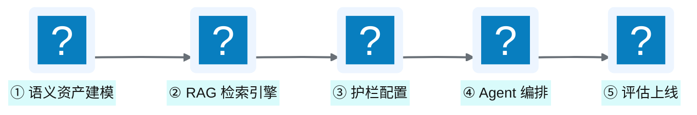

# 附录 F Agentic BI 快速启动指南

!!! info "面包屑"
    [本书主页](./index.md) › [附录](./appendix-A-术语表与学习地图.md) › 附录 F

---

这份附录是给"想动手搭一个 Agentic BI"的读者的。它把 Part VII（[Ch 38–49](./38-时代命题-AI-Ready数据供应.md)）里的架构思路压成五步可执行路线，每步标了要点、交叉引用和容易踩的坑。

## 五步路线总览

## ① 语义资产建模

**目标**：把人的业务知识转成机器读得懂的 YAML 资产，给 LLM 的搜索空间划好边界。

**Checklist**：

- [ ] 定义 L1 元数据契约：核心事实表/维度表的 Table + Column 资产（[Ch 40](./40-语义平面-三层治理与Git-YAML.md)）
- [ ] 定义 L2 术语治理：高频业务术语（如 GMV/华东区）→ metric/维度 的绑定映射
- [ ] 定义 L3 业务规则：指标计算规则（如 GMV = SUM(amount) WHERE status='completed'）
- [ ] 定义 Join 资产：表间关联路径 + 代价（供 Steiner 树消费，[Ch 43](./43-语义查询规划器-Steiner树与代数改写.md)）
- [ ] 用 Git+YAML 管理 + CI 校验引用完整性（[Ch 40](./40-语义平面-三层治理与Git-YAML.md) CI 校验伪代码）

!!! warning "常见坑"
    不要一上来就对全库建模。先挑 3-5 张高频查询表（一个事实表搭上关联维度）把通路跑顺，再慢慢往大扩。语义资产的质量比数量要紧得多——一个错的 metric 定义会污染所有相关查询。

## ② RAG 检索引擎搭建

**目标**：让 LLM 能精准命中"问题涉及的表/列/术语"，而不是瞎猜。

**Checklist**：

- [ ] 实现 R 引擎：向量检索表/列结构（embedding + 相似度）
- [ ] 实现 V 引擎：术语绑定强路由（"GMV" → metric_gmv，[Ch 41](./41-RVGD四引擎RAG检索.md)）
- [ ] 实现 G 引擎（可选）：图引擎做表间关系遍历（专利/征信经验迁移，[前言](./00-preface.md)）
- [ ] 实现 D 引擎：few-shot 检索注入（按复杂度分级，[Ch 40](./40-语义平面-三层治理与Git-YAML.md) System Prompt）
- [ ] 接入 Rerank：对检索结果重排 + 术语绑定强化

!!! warning "常见坑"
    RAG 不是"把全库 schema 一股脑塞进 prompt"——那样上下文窗口很快就爆了，而且塞进去的大半是噪声。关键在"精准检索"：先向量召回 top-K，再 Rerank 精选，最后只缝进去跟问题强相关的资产。

## ③ 护栏配置

**目标**：确保 LLM 吐出来的 SQL 安全可执行——不删库、不泄密、不拖垮集群。

**Checklist**：

- [ ] ① 语法校验：sqlglot 解析 SQL 是否合法
- [ ] ② 策略黑名单：拒绝 DROP/DELETE/TRUNCATE（[Ch 44](./44-五层SQL护栏与执行安全.md) 伪代码）
- [ ] ③ AST 列白名单：引用的列必须在语义资产白名单中
- [ ] ④ 术语语义：metric 计算是否符合 L3 规则
- [ ] ⑤ 成本估算：EXPLAIN 预估扫描量超限则阻断
- [ ] 执行安全：强制 LIMIT + statement_timeout + RLS/CLS 联动（AI 以用户身份执行，[Ch 44](./44-五层SQL护栏与执行安全.md)）
- [ ] 提示注入防御：输入层 pattern 检测 + 消息分离（[Ch 44](./44-五层SQL护栏与执行安全.md)）

!!! warning "常见坑"
    起步阶段用"咨询模式"——护栏通过后只展示 SQL，暂不自动执行，让业务先看再确认。等信任攒够了再切到自动执行。高风险操作（DDL/大批量）永远走 HITL 审批（[Ch 42](./42-Agent编排-LangGraph与状态机.md)）。

## ④ Agent 编排

**目标**：把检索、规划、生成、护栏、执行串成一条有状态、能自愈的流水线。

**Checklist**：

- [ ] 用 LangGraph StateGraph 定义 State（TypedDict）+ 节点 + 条件路由（[Ch 42](./42-Agent编排-LangGraph与状态机.md) 骨架伪代码）
- [ ] 装配核心节点：Supervisor→QU→Router→RAG→Plan→Gen→Guard→Exec→Viz（[Ch 42](./42-Agent编排-LangGraph与状态机.md) 9 节点装配）
- [ ] 实现查询规划器：Steiner 树求最小代价 join 子图（[Ch 43](./43-语义查询规划器-Steiner树与代数改写.md) networkx 伪代码）
- [ ] 实现自愈回路：护栏失败→纠错反馈→重新生成，最多 2 次（[Ch 44](./44-五层SQL护栏与执行安全.md)）
- [ ] 实现 SQL 缓存快路径：相似度 ≥0.92 直接返回缓存（[Ch 42](./42-Agent编排-LangGraph与状态机.md)）
- [ ] 接入记忆系统：Working/Profile/Episodic/Correction 四层（[Ch 45](./45-记忆系统与工具使用.md)）

!!! warning "常见坑"
    别一上来就上 Steiner 树。先用"Router 判断复杂度 + 简单查询走强路由"跑起来，简单查询准确率稳了再补规划器。规划器是复杂查询的提分项，不是 MVP 的必选项。

## ⑤ 评估上线

**目标**：量化质量、持续改进、逐步建立业务信任。

**Checklist**：

- [ ] 建立三级评估：运行时（自动校验）/ 治理 CI（发布前）/ LLM-as-a-Judge（定期四维，[Ch 49](./49-评估-可观测与持续演进.md) prompt 模板）
- [ ] 可观测四通道：Langfuse（链路追踪）/ 事件流 / structlog（日志）/ Prometheus（指标，[Ch 49](./49-评估-可观测与持续演进.md)）
- [ ] 上线 30/60/90 天递进复盘：磨合期（75%→85%）→优化期（85%→93%）→稳定期（93%+，[Ch 53](./53-价值度量与案例复盘.md)）
- [ ] 成本监控：缓存命中率 + LLM API 调用量 + 单查询成本（[Ch 49](./49-评估-可观测与持续演进.md) 成本分析）
- [ ] 用户反馈闭环：每条纠正进 Correction Memory → 转化为 few-shot（[Ch 45](./45-记忆系统与工具使用.md)）

!!! tip "引申"
    Agentic BI 的价值不是"上线那一刻"，而是"上线后持续打磨的 90 天"。初期 75% 准确率是正常的，关键是把"用户反馈→语义资产修正→准确率提升"的闭环跑通——系统会越用越准。这也是为什么 Part VII 用了十余章篇幅——Agentic BI 与多模态知识库的难点不在"搭起来"，而在"持续优化到可信"。

---

!!! quote "回到"
    [本书主页](./index.md) —— 指南到此结束。回到主页选择你感兴趣的章节深入阅读，或查看 [附录 D 参考文献](./appendix-D-参考文献与延伸阅读.md) 拓展学习。
