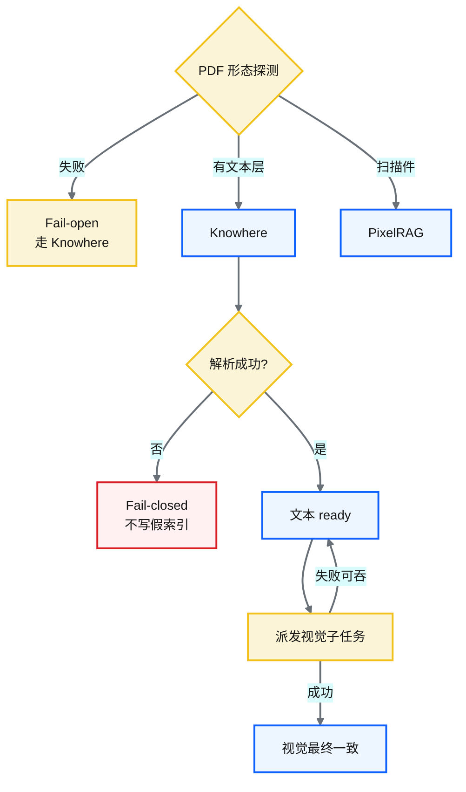

# 图 47-6 摄入失败策略

```mermaid
%%{init: {'theme':'base','themeVariables':{'primaryColor':'#edf5ff','primaryTextColor':'#161616','primaryBorderColor':'#0f62fe','lineColor':'#697077','secondaryColor':'#d9fbfb','tertiaryColor':'#f2f4f8','fontSize':'14px'}}}%%
flowchart TB
  PROBE{PDF 形态探测}
  PROBE -->|失败| FO[Fail-open<br/>走 Knowhere]
  PROBE -->|有文本层| KH[Knowhere]
  PROBE -->|扫描件| PX[PixelRAG]
  KH --> PARSE{解析成功?}
  PARSE -->|否| FC[Fail-closed<br/>不写假索引]
  PARSE -->|是| TEXT[文本 ready]
  TEXT --> DISP[派发视觉子任务]
  DISP -->|失败可吞| TEXT
  DISP -->|成功| VIS[视觉最终一致]

  classDef bpProcess fill:#edf5ff,stroke:#0f62fe,stroke-width:2px,color:#161616
  classDef bpDecision fill:#fcf4d6,stroke:#f1c21b,stroke-width:2px,color:#161616
  classDef bpError fill:#fff1f1,stroke:#da1e28,stroke-width:2px,color:#161616
  classDef bpWarning fill:#fcf4d6,stroke:#f1c21b,stroke-width:2px,color:#161616
  class PROBE,PARSE bpDecision
  class FO,DISP bpWarning
  class KH,PX,TEXT,VIS bpProcess
  class FC bpError
  linkStyle default stroke:#697077,stroke-width:2px
```
