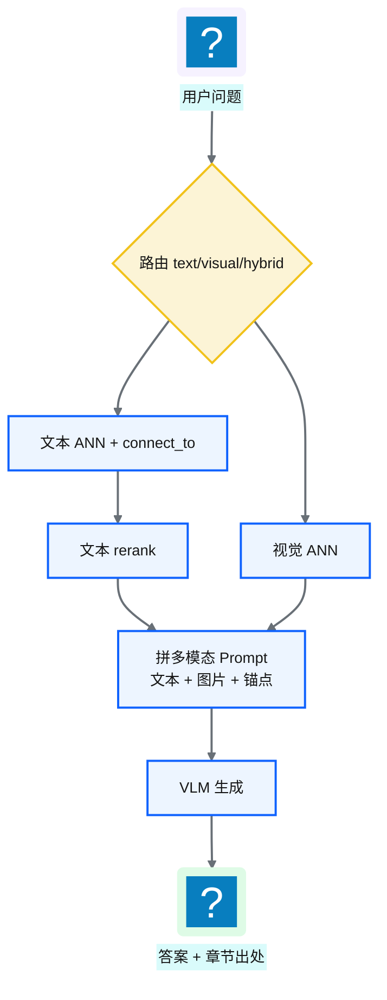

# 图 47-8 查询侧 prompt 级融合

```mermaid
%%{init: {'theme':'base','themeVariables':{'primaryColor':'#edf5ff','primaryTextColor':'#161616','primaryBorderColor':'#0f62fe','lineColor':'#697077','secondaryColor':'#d9fbfb','tertiaryColor':'#f2f4f8','fontSize':'14px'}}}%%
flowchart TB
  Q@{ icon: "codicon:comment", form: "rounded", label: "用户问题", pos: "b", h: 36 }
  Q --> RD{路由 text/visual/hybrid}
  RD --> TRET[文本 ANN + connect_to]
  RD --> VRET[视觉 ANN]
  TRET --> RR[文本 rerank]
  RR --> PROMPT[拼多模态 Prompt<br/>文本 + 图片 + 锚点]
  VRET --> PROMPT
  PROMPT --> VLM[VLM 生成]
  VLM --> OUT@{ icon: "codicon:output", form: "rounded", label: "答案 + 章节出处", pos: "b", h: 36 }

  classDef bpProcess fill:#edf5ff,stroke:#0f62fe,stroke-width:2px,color:#161616
  classDef bpDecision fill:#fcf4d6,stroke:#f1c21b,stroke-width:2px,color:#161616
  classDef bpSuccess fill:#defbe6,stroke:#198038,stroke-width:2px,color:#161616
  classDef bpInfo fill:#f6f2ff,stroke:#8a3ffc,stroke-width:2px,color:#161616
  class Q bpInfo
  class RD bpDecision
  class TRET,VRET,RR,PROMPT,VLM bpProcess
  class OUT bpSuccess
  linkStyle default stroke:#697077,stroke-width:2px
```
