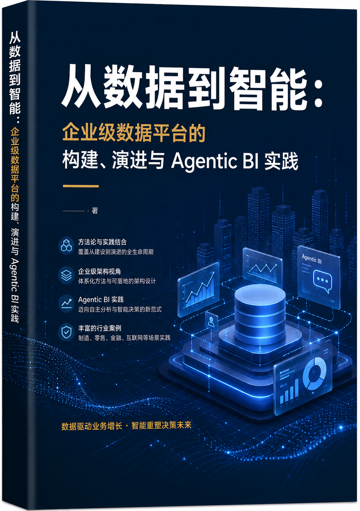

# 从数据到智能：企业级数据平台的构建、演进与 Agentic BI 实践

  

> 一个数据开发的八年数据工程手记：从 0 到 1 构建企业级医药数据平台，再到 Data + AI 转型下的 Agentic BI。

---

## 关于本书

这是一本面向**数据工程师、平台架构师与 AI 应用工程师**的实践型技术专著。作者以首席解决方案架构师的第一人称视角，完整记录了一座企业级医药数据平台从无到有、从数据到智能的演进全过程。

书中没有止步于"怎么做"，而是着重回答"**为什么这么做、当时有什么约束、对比主流方案怎么取舍**"。全书聚焦设计、思想与方案，不沉溺于代码实现细节——因为代码会过时，架构思想留得下来。

**叙事背景**：甲方 Aurora Pharma（奥罗拉制药，全球 top 医药外企，中国区业务）；乙方 NorthPeak Consulting（北峰咨询，top 外企咨询）；作者为 NorthPeak 驻场首席解决方案架构师。书中所有公司、人员、系统标识均为虚构。

---

## 全书结构

### 章节依赖总览

!!! info "阅读说明"
    箭头表示"阅读完本章后建议阅读的下一章"。颜色表示难度层级：🟢 基础必读 → 🔵 核心实践 → 🟠 进阶演进 → 🟣 AI 前沿 → 🔴 治理复盘。

```mermaid
%%{init: {'theme':'base','themeVariables':{'primaryColor':'#edf5ff','primaryTextColor':'#161616','primaryBorderColor':'#0f62fe','lineColor':'#697077','secondaryColor':'#d9fbfb','tertiaryColor':'#f2f4f8','fontSize':'14px'}}}%%
flowchart TB
    %% ===== Part I: 起点 =====
    subgraph P1["<b>Part I · 起点</b>"]
        direction LR
        ch1("1. 医药数据困局") --> ch2("2. 平台蓝图诞生") --> ch3("3. 技术栈全景")
    end

    %% ===== Part II: 架构设计 =====
    subgraph P2["<b>Part II · 架构设计</b>"]
        ch4("4. 五层模型") --> ch5("5. 数据流全景")
        ch4 --> ch8("8. Redshift 仓库")
        ch4 --> ch9("9. 计算与 ETL")
        ch4 --> ch10("10. 编排调度")
        ch4 --> ch11("11. 配置与状态")
        ch5 --> ch6("6. 环境隔离")
        ch5 --> ch7("7. 数据湖分层")
    end

    %% ===== Part III: 数据工程 =====
    subgraph P3["<b>Part III · 数据工程</b>"]
        ch12("12. 任务模型") --> ch13("13. 连接器框架")
        ch13 --> ch14("14. JDBC 连接器")
        ch13 --> ch15("15. 文件 S3 连接器")
        ch13 --> ch16("16. API 邮件连接器")
        ch14 & ch15 & ch16 --> ch17("17. 三层开发实战")
        ch17 --> ch18("18. 脱敏与隐私")
        ch12 --> ch19("19. 开发配方")
        ch12 --> ch20("20. 元数据血缘")
    end

    %% ===== Part IV: 基础设施 =====
    subgraph P4["<b>Part IV · 基础设施</b>"]
        ch21("21. Terraform 架构") --> ch22("22. 核心仓设计")
        ch22 --> ch23("23. 业务同构仓")
        ch21 --> ch24("24. 通用模块")
        ch22 --> ch25("25. tfvars 模型")
        ch10 -.-> ch26("26. SF 模板注入")
        ch22 --> ch27("27. CI/CD 平台")
        ch27 --> ch28("28. 四类发布流")
        ch27 --> ch29("29. OIDC 凭证")
        ch28 --> ch30("30. 工程师工作流")
    end

    %% ===== Part V: 平台演进 =====
    subgraph P5["<b>Part V · 平台演进</b>"]
        ch31("31. SQLServer 迁移") --> ch32("32. 跨账号同步")
        ch32 --> ch33("33. 自研 DAG")
        ch31 & ch32 & ch33 --> ch34("34. 设计边界复盘")
    end

    %% ===== Part VI: 衍生系统 =====
    subgraph P6["<b>Part VI · 衍生系统</b>"]
        ch35("35. 衍生总领") --> ch36("36. 零售门户")
        ch36 --> ch37("37. DaaS 激活层")
    end

    %% ===== Part VII: Data + AI =====
    subgraph P7["<b>Part VII · Data + AI</b>"]
        ch38("38. AI-Ready 供应") --> ch39("39. Agentic BI 架构")
        ch39 --> ch40("40. 语义平面")
        ch39 --> ch41("41. 四引擎 RAG")
        ch40 & ch41 --> ch42("42. Agent 编排")
        ch42 --> ch43("43. 查询规划器")
        ch42 --> ch44("44. SQL 护栏")
        ch42 --> ch45("45. 记忆与工具")
        ch39 --> ch46("46. CDP 整合")
        ch42 --> ch47("47. 评估可观测")
    end

    %% ===== Part VIII: 治理复盘 =====
    subgraph P8["<b>Part VIII · 治理复盘</b>"]
        direction LR
        ch48("48. 安全合规") --> ch49("49. 监控审计") --> ch50("50. 排障实战") --> ch51("51. 价值度量") --> ch52("52. 架构师复盘")
    end

    %% ===== 跨 Part 依赖 =====
    P1 --> P2
    P2 --> P3
    P2 --> P4
    P3 --> P5
    P4 --> P5
    P3 --> P6
    P4 --> P6
    P3 --> P7
    P4 --> P7
    P2 --> P7
    P5 & P6 & P7 --> P8

    %% ===== 样式定义（按难度层级：🟢 基础 → 🔵 核心 → 🟠 进阶 → 🟣 AI → 🔴 治理）=====
    classDef bpSuccess  fill:#defbe6,stroke:#198038,stroke-width:2px,color:#161616
    classDef bpProcess  fill:#edf5ff,stroke:#0f62fe,stroke-width:2px,color:#161616
    classDef bpDecision fill:#fcf4d6,stroke:#f1c21b,stroke-width:2px,color:#161616
    classDef bpInfo     fill:#f6f2ff,stroke:#8a3ffc,stroke-width:2px,color:#161616
    classDef bpError    fill:#fff1f1,stroke:#da1e28,stroke-width:2px,color:#161616
    classDef bpGroup    fill:#ffffff,stroke:#0f62fe,stroke-width:2px,color:#161616

    class ch1,ch2,ch3 bpSuccess
    class ch4,ch5,ch6,ch7,ch8,ch9,ch10,ch11 bpProcess
    class ch12,ch13,ch14,ch15,ch16,ch17,ch18,ch19,ch20 bpProcess
    class ch21,ch22,ch23,ch24,ch25,ch26,ch27,ch28,ch29,ch30 bpDecision
    class ch31,ch32,ch33,ch34 bpDecision
    class ch35,ch36,ch37 bpDecision
    class ch38,ch39,ch40,ch41,ch42,ch43,ch44,ch45,ch46,ch47 bpInfo
    class ch48,ch49,ch50,ch51,ch52 bpError

    class P1,P2,P3,P4,P5,P6,P7,P8 bpGroup
    linkStyle default stroke:#697077,stroke-width:2px
```

---

## 阅读路径

根据你的角色与目标，选择最适合的阅读路径：

### :material-layers: 架构师路径（理解"为什么这样设计"）

> 适合：技术负责人、解决方案架构师、平台设计者

1. [前言](./00-preface.md) → [Ch 1 医药数据困局](./01-数字化转型下的医药数据困局.md) → [Ch 2 平台蓝图](./02-从需求到蓝图：一个数据平台的诞生.md)
2. [Ch 4 五层模型](./04-平台五层模型与设计哲学.md) → [Ch 5 数据流全景](./05-端到端数据流全景.md) → [Ch 8 数据仓库设计](./08-数据仓库设计-Redshift.md) → [Ch 10 编排调度](./10-编排与调度设计-StepFunctions与EventBridge.md)
3. [Ch 21 :simple-terraform: Terraform 架构](./21-Terraform架构总览.md) → [Ch 27 CI/CD 平台](./27-CI-CD可复用工作流平台.md)
4. [Ch 38 AI-Ready 数据供应](./38-时代命题-AI-Ready数据供应.md) → [Ch 39 Agentic BI 架构](./39-Agentic-BI架构总览.md) → [Ch 52 架构师复盘](./52-架构师的复盘-取舍遗憾与主流对比.md)

### :material-wrench: 工程师路径（理解"怎么开发"）

> 适合：数据工程师、ETL 开发者、平台运维

1. [前言](./00-preface.md) → [Ch 3 技术栈全景](./03-技术栈全景与预备知识.md)
2. [Ch 11 配置与状态管理](./11-配置与状态管理.md) → [Ch 12 任务模型](./12-配置驱动的任务模型.md) → [Ch 13 连接器框架](./13-连接器框架总览.md)
3. [Ch 14-16 三类连接器](./14-数据库与JDBC连接器.md) → [Ch 17 三层开发](./17-Landing到Raw到Enriched开发实战.md) → [Ch 19 开发配方](./19-任务开发配方与实战案例.md)
4. [Ch 28 四类发布流](./28-四类发布流.md) → [Ch 30 工程师工作流](./30-工程师日常工作流与变更场景.md) → [Ch 50 排障实战](./50-排障与可观测性实战.md)

### :material-truck-fast: 迁移负责人路径（理解"如何迁移与协同"）

> 适合：负责系统迁移、跨账号数据同步的工程师与项目经理

1. [Ch 31 SQL Server → Redshift 迁移](./31-遗留系统迁移-SQLServer到Redshift.md) → [Ch 32 跨账号同步](./32-跨账号批量同步-双桶桥接架构.md) → [Ch 33 自研 DAG](./33-自研DAG调度器与任务编排.md) → [Ch 34 设计边界复盘](./34-设计边界与已知取舍的诚实复盘.md)
2. [Ch 36 零售数据源门户（T+1 双向同步模块）](./36-低代码与云混合-零售数据源门户.md)

### :material-robot-outline: AI 工程师路径（理解"Data+AI 转型"）

> 适合：AI 应用工程师、Agentic BI 建设者、LLM 应用架构师

1. [Ch 38 AI-Ready 数据供应](./38-时代命题-AI-Ready数据供应.md) → [Ch 39 Agentic BI 架构](./39-Agentic-BI架构总览.md)
2. [Ch 40 语义平面](./40-语义平面-三层治理与Git-YAML.md) → [Ch 41 四引擎 RAG](./41-RVGD四引擎RAG检索.md) → [Ch 42 Agent 编排](./42-Agent编排-LangGraph与状态机.md)
3. [Ch 43 查询规划器](./43-语义查询规划器-Steiner树与代数改写.md) → [Ch 44 SQL 护栏](./44-五层SQL护栏与执行安全.md) → [Ch 45 记忆与工具](./45-记忆系统与工具使用.md)
4. [Ch 46 CDP 整合](./46-数据平面与CDP整合.md) → [Ch 47 评估可观测](./47-评估-可观测与持续演进.md)

---

## 目录

### 前言

- [前言](./00-preface.md)

### Part I 起点：为什么需要一座数据平台

- [Ch 1 数字化转型下的医药数据困局](./01-数字化转型下的医药数据困局.md)
- [Ch 2 从需求到蓝图：一个数据平台的诞生](./02-从需求到蓝图：一个数据平台的诞生.md)
- [Ch 3 技术栈全景与预备知识](./03-技术栈全景与预备知识.md)

### Part II 架构设计：从 0 到 1 构建平台骨架

- [Ch 4 平台五层模型与设计哲学](./04-平台五层模型与设计哲学.md)
- [Ch 5 端到端数据流全景](./05-端到端数据流全景.md)
- [Ch 6 环境与多账号隔离设计](./06-环境与多账号隔离设计.md)
- [Ch 7 数据湖分层设计](./07-数据湖分层设计.md)
- [Ch 8 数据仓库设计（Redshift）](./08-数据仓库设计-Redshift.md)
- [Ch 9 计算与 ETL 设计（Glue + Lambda）](./09-计算与ETL设计-Glue与Lambda.md)
- [Ch 10 编排与调度设计（Step Functions + EventBridge）](./10-编排与调度设计-StepFunctions与EventBridge.md)
- [Ch 11 配置与状态管理](./11-配置与状态管理.md)

### Part III 数据工程实践：连接器与流水线

- [Ch 12 配置驱动的任务模型](./12-配置驱动的任务模型.md)
- [Ch 13 连接器框架总览](./13-连接器框架总览.md)
- [Ch 14 数据库与 JDBC 连接器](./14-数据库与JDBC连接器.md)
- [Ch 15 文件与 S3 连接器](./15-文件与S3连接器.md)
- [Ch 16 API、SaaS 与邮件连接器](./16-API-SaaS与邮件连接器.md)
- [Ch 17 Landing→Raw→Enriched 开发实战](./17-Landing到Raw到Enriched开发实战.md)
- [Ch 18 数据脱敏与隐私治理](./18-数据脱敏与隐私治理.md)
- [Ch 19 任务开发配方与实战案例](./19-任务开发配方与实战案例.md)
- [Ch 20 元数据管理与数据血缘](./20-元数据管理与数据血缘.md)

### Part IV 基础设施与工程效能

- [Ch 21 Terraform 架构总览](./21-Terraform架构总览.md)
- [Ch 22 核心基础设施仓库设计](./22-核心基础设施仓库设计.md)
- [Ch 23 业务仓库设计与同构模式](./23-业务仓库设计与同构模式.md)
- [Ch 24 通用 Terraform 模块设计](./24-通用Terraform模块设计.md)
- [Ch 25 环境参数与 tfvars 模型](./25-环境参数与tfvars模型.md)
- [Ch 26 Step Functions 模板注入](./26-StepFunctions模板注入.md)
- [Ch 27 CI/CD：可复用工作流平台](./27-CI-CD可复用工作流平台.md)
- [Ch 28 四类发布流](./28-四类发布流.md)
- [Ch 29 OIDC 与凭证治理](./29-OIDC与凭证治理.md)
- [Ch 30 工程师日常工作流与变更场景](./30-工程师日常工作流与变更场景.md)

### Part V 平台演进：数据迁移与跨系统协同

- [Ch 31 遗留系统迁移：SQL Server → Redshift（10TB）](./31-遗留系统迁移-SQLServer到Redshift.md)
- [Ch 32 跨账号批量同步：双桶桥接架构](./32-跨账号批量同步-双桶桥接架构.md)
- [Ch 33 自研 DAG 调度器与任务编排](./33-自研DAG调度器与任务编排.md)
- [Ch 34 设计边界与已知取舍的诚实复盘](./34-设计边界与已知取舍的诚实复盘.md)

### Part VI 衍生业务系统：平台的能力外延

- [Ch 35 衍生业务系统总领：平台的能力外延](./35-衍生业务系统总领.md)
- [Ch 36 低代码 + 云混合：零售数据源门户](./36-低代码与云混合-零售数据源门户.md)
- [Ch 37 数据即服务（DaaS）：激活层设计](./37-数据即服务-DaaS激活层设计.md)

### Part VII Data + AI 转型：从数据平台到 Agentic BI

- [Ch 38 时代命题：AI-Ready 数据供应](./38-时代命题-AI-Ready数据供应.md)
- [Ch 39 Agentic BI 架构总览](./39-Agentic-BI架构总览.md)
- [Ch 40 语义平面：三层治理与 Git+:simple-yaml: YAML](./40-语义平面-三层治理与Git-YAML.md)
- [Ch 41 R/V/G/D 四引擎 RAG 检索](./41-RVGD四引擎RAG检索.md)
- [Ch 42 Agent 编排：LangGraph 与状态机](./42-Agent编排-LangGraph与状态机.md)
- [Ch 43 语义查询规划器：Steiner 树与代数改写](./43-语义查询规划器-Steiner树与代数改写.md)
- [Ch 44 五层 SQL 护栏与执行安全](./44-五层SQL护栏与执行安全.md)
- [Ch 45 记忆系统与工具使用](./45-记忆系统与工具使用.md)
- [Ch 46 数据平面与 CDP 整合](./46-数据平面与CDP整合.md)
- [Ch 47 评估、可观测与持续演进](./47-评估-可观测与持续演进.md)

### Part VIII 治理、运维与价值复盘

- [Ch 48 安全、合规与治理](./48-安全-合规与治理.md)
- [Ch 49 日志、监控、审计与告警](./49-日志-监控-审计与告警.md)
- [Ch 50 排障与可观测性实战](./50-排障与可观测性实战.md)
- [Ch 51 价值度量与案例复盘](./51-价值度量与案例复盘.md)
- [Ch 52 架构师的复盘：取舍、遗憾与主流对比](./52-架构师的复盘-取舍遗憾与主流对比.md)
- [Ch 53 致谢与团队](./53-致谢与团队.md)

### 附录

- [附录 A 术语表与学习地图](./appendix-A-术语表与学习地图.md)
- [附录 B 索引与导航](./appendix-B-索引导航.md)
- [附录 C 技术栈速查表](./appendix-C-技术栈速查表.md)
- [附录 D 参考文献与延伸阅读](./appendix-D-参考文献与延伸阅读.md)
- [附录 E 常见问题（FAQ）](./appendix-E-FAQ.md)
- [附录 F Agentic BI 快速启动指南](./appendix-F-Agentic-BI快速启动.md)
- [附录 G 成本治理与 FinOps](./appendix-G-FinOps成本治理.md)

---

## 本书约定

| 标记框 | 图标 | 含义 |
|---|---|---|
| !!! tip "引申" | :material-lightbulb: | 超出当前实践的延伸知识，供读者深入思考 |
| !!! warning "Trade-off" | :material-alert: | 当前设计在特定约束下的取舍，并给出主流方案对比 |
| !!! info "面包屑" | :material-map-marker: | 章节在全书中的定位导航 |
| !!! info "项目时间线" | :material-clock-outline: | 本章内容发生在项目的哪个阶段 |
| !!! quote "下一章" | :material-book-open: | 演进承接——下一阶段的挑战 |
| **Mermaid 图** | :material-chart-bell-curve: | 架构图、流程图、时序图、状态图，图文并茂说明设计 |
| **对比表** | :material-table-large: | 方案选型的多维度对比 |
| **代码示例** | :material-code-tags: | 自包含的示意片段，非真实生产代码 |

---

*最后更新：2026-06-18 · 作者：首席解决方案架构师（Aurora Pharma × NorthPeak Consulting）*
